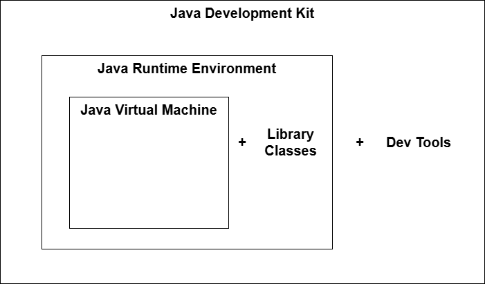
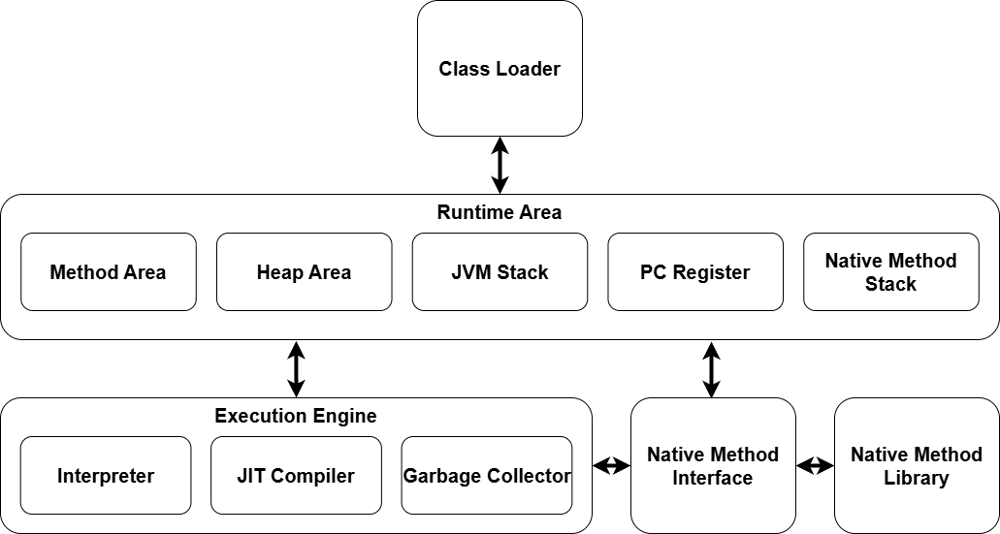
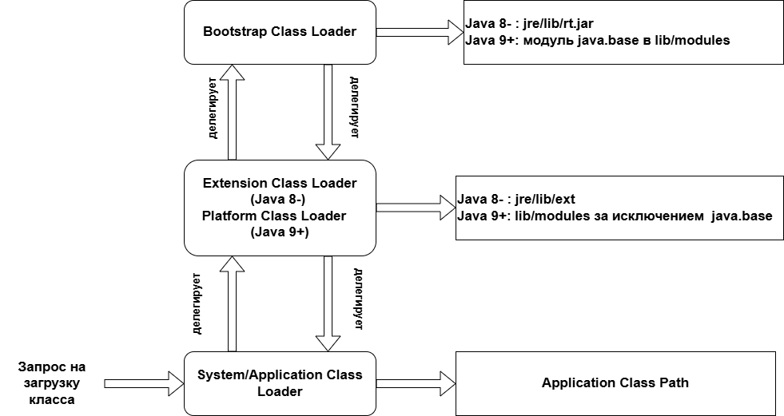

# Лекция 1: Введение в Java

## Введение

Добро пожаловать на первую лекцию курса "Современные технологии программирования". Сегодня мы познакомимся с языком программирования Java — одним из самых популярных языков в мире, который используется для создания мобильных приложений (Android), веб-сервисов, корпоративных систем и многого другого.

---

## Часть 1: Что такое Java и почему она особенная?

### Java — объектно-ориентированный язык

Что это значит на простом языке? Представьте, что вы строите дом из кубиков LEGO. Каждый кубик — это отдельный **объект** со своими свойствами (цвет, размер, форма). В Java весь код организован вокруг таких "кубиков" — объектов и классов.

В отличие от некоторых других языков (например, C++), где можно писать код "просто так", в Java **каждый кусочек кода должен быть внутри класса**. Даже самая простая программа "Hello World" требует создания класса. Это может показаться избыточным для маленьких программ, но для больших проектов такая организация помогает поддерживать порядок и структуру.

### Java — платформенно-независимый язык

Это одна из главных особенностей Java. Давайте разберём, что это значит.

Когда вы пишете программу на языке C или C++, компилятор превращает ваш код в машинный код — набор инструкций, которые понимает конкретный процессор. Проблема в том, что процессоры Intel, AMD и ARM понимают разные инструкции. Программа, скомпилированная для Windows, не запустится на Mac или Linux без перекомпиляции.

Java работает по-другому. Компилятор Java превращает ваш код не в машинный код, а в **байт-код** — специальный промежуточный формат. Этот байт-код выполняется не процессором напрямую, а специальной программой — **Java Virtual Machine (JVM)**.

JVM существует для всех популярных операционных систем: Windows, Linux, macOS. И вот ключевой момент: **один и тот же байт-код работает на любой JVM**. Вы написали программу один раз, скомпилировали её в байт-код, и она работает везде, где есть JVM.

Отсюда знаменитый девиз Java: **"Write once — run anywhere"** (Напиши один раз — запускай везде).

> **Интересный факт:** Название "Java" происходит от сорта кофе с острова Ява (Индонезия) — именно поэтому логотип Java это чашка кофе. Язык был создан Джеймсом Гослингом в компании Sun Microsystems в 1995 году, изначально для программирования интерактивного телевидения!

### Как работает процесс от кода до запуска?

Давайте пройдём по шагам:

**Шаг 1: Написание кода**
Вы создаёте файл с расширением `.java` и пишете в нём код на языке Java. Например, файл `Main.java`.

**Шаг 2: Компиляция**
Вы запускаете компилятор `javac` (Java Compiler). Он проверяет ваш код на ошибки и, если всё в порядке, создаёт файл с расширением `.class`. Этот файл содержит байт-код. Например, из `Main.java` получается `Main.class`.

**Шаг 3: Запуск**
Вы запускаете команду `java Main`. JVM читает файл `Main.class`, интерпретирует байт-код и выполняет вашу программу.

**Сравнение с C/C++:**

| | C/C++ | Java |
|---|-------|------|
| **Компиляция** | Исходный код → машинный код (`.exe`, `.out`) | Исходный код → байт-код (`.class`) |
| **Результат** | Инструкции для конкретного процессора (x86, ARM) | Универсальные инструкции для JVM |
| **Переносимость** | Нужна перекомпиляция под каждую платформу | Один `.class` файл работает везде |
| **Запуск** | Напрямую операционной системой | Через JVM (должна быть установлена) |

---

## Часть 2: Первая программа — Hello World

Традиционно изучение любого языка программирования начинается с программы, которая выводит на экран "Hello World". Давайте напишем её на Java и разберём каждую строчку.

**Ссылка на GitHub:** [Hello World](https://github.com/AliEbraheem-fun/Modern-Programming-Technologies-Code-Examples/tree/main/lecture1/src/main/java/lecture/one/hello)

```java
// Указываем, что этот класс находится в пакете lecture.one.hello
// Пакеты (package) используются для организации классов по логическим группам
package lecture.one.hello;

// Объявляем публичный класс с именем Main
// Имя файла должно совпадать с именем публичного класса: Main.java
public class Main {

    // Метод main — это точка входа в программу
    // Он должен быть обязательно public (общедоступным), static (вызывается без создания объекта),
    // void (ничего не возвращает) и с параметром String[] args (массив аргументов командной строки)
    public static void main(String[] args) {

        // Выводит текст на консоль
        // System — это встроенный класс в пакете java.lang
        // out — это стандартный поток вывода
        // println — метод, который выводит строку с переходом на новую строку
        System.out.println("Hello world!");
    }
}
```

### Разбор каждой части программы

#### Что такое `package`?

```java
package lecture.one.hello;
```

Пакет — это как папка для ваших классов. Представьте, что у вас в шкафу есть много вещей. Чтобы не было беспорядка, вы раскладываете их по полкам: носки в одном месте, рубашки в другом. Пакеты работают так же — они группируют связанные классы вместе.

Имя пакета обычно записывается маленькими буквами и отражает структуру папок. Пакет `lecture.one.hello` означает, что файл находится в папке `lecture/one/hello/`.

#### Что такое `public class Main`?

```java
public class Main {
```

- **`public`** — модификатор доступа. Означает, что этот класс доступен отовсюду. Другие классы могут его использовать.
- **`class`** — ключевое слово, которое говорит: "я объявляю класс".
- **`Main`** — имя класса. Вы можете назвать его как угодно, но есть важное правило: **имя файла должно совпадать с именем публичного класса**. Если класс называется `Main`, файл должен называться `Main.java`.

#### Что такое метод `main`?

```java
public static void main(String[] args) {
```

Это **точка входа** в программу — место, с которого JVM начинает выполнение. Когда вы запускаете `java Main`, JVM ищет метод с именно такой сигнатурой.

Разберём каждое слово:
- **`public`** — метод доступен извне (JVM должна иметь к нему доступ)
- **`static`** — метод принадлежит классу, а не объекту. JVM может вызвать его без создания экземпляра класса
- **`void`** — метод ничего не возвращает
- **`main`** — имя метода (именно такое, не `Main` и не `MAIN`)
- **`String[] args`** — массив строк, в который передаются аргументы командной строки

#### Что делает `System.out.println()`?

```java
System.out.println("Hello world!");
```

- **`System`** — встроенный класс Java, который предоставляет доступ к системным ресурсам
- **`out`** — объект, представляющий стандартный поток вывода (обычно консоль)
- **`println`** — метод, который выводит текст и переходит на новую строку

Существует также метод `print()` (без "ln"), который выводит текст без перехода на новую строку.

### Попробуй в jshell!

**Что такое jshell?** Это интерактивная консоль Java (входит в JDK с версии 9), где можно писать код и сразу видеть результат — без создания файлов и классов. Подробнее о jshell мы расскажем в Части 4.

Откройте терминал и введите `jshell`, затем попробуйте:
```
jshell> System.out.println("Привет, мир!")
jshell> String name = "Студент"
jshell> System.out.println("Привет, " + name + "!")
```

---

## Часть 3: Архитектура Java — JDK, JRE, JVM

Сейчас мы разберём три важнейших аббревиатуры, которые вы будете встречать постоянно: **JDK**, **JRE** и **JVM**. Многие новички путают эти понятия, но на самом деле всё просто — это три "матрёшки", вложенные друг в друга.



### JVM — Java Virtual Machine (Виртуальная машина Java)

JVM — это самая маленькая "матрёшка". Это программа, которая выполняет байт-код. Представьте её как переводчика, который читает байт-код и объясняет процессору, что нужно делать.

**Что делает JVM:**
- Читает и выполняет байт-код (файлы `.class`)
- Управляет памятью программы
- Автоматически удаляет ненужные объекты (сборка мусора)
- Обеспечивает безопасность выполнения кода

**Важный момент:** JVM ничего не знает о языке Java! Она знает только байт-код. Теоретически, любой язык можно скомпилировать в байт-код, и JVM его выполнит. Так работают языки Kotlin, Scala, Groovy — они все компилируются в байт-код JVM.

### JRE — Java Runtime Environment (Среда выполнения Java)

JRE — это средняя "матрёшка". Она включает JVM плюс стандартные библиотеки классов (String, ArrayList, File и тысячи других).

**Кому нужен JRE?** Обычным пользователям, которые хотят **запускать** Java-программы, но не писать их. Например, если вы скачали игру Minecraft (она написана на Java), вам нужен JRE для её запуска.

### JDK — Java Development Kit (Набор инструментов разработчика)

JDK — это самая большая "матрёшка". Она включает JRE плюс инструменты для разработки:

- **`javac`** — компилятор (превращает `.java` в `.class`)
- **`java`** — запускает программы
- **`javadoc`** — генерирует документацию из комментариев в коде
- **`jar`** — упаковывает классы в архивы JAR
- **`jdb`** — отладчик
- **`jshell`** — интерактивная консоль для экспериментов с кодом (с Java 9)

**Кому нужен JDK?** Программистам, которые **разрабатывают** Java-программы.

### Простое правило

- Хотите **запускать** Java-программы → установите JRE
- Хотите **писать** Java-программы → установите JDK

На практике большинство людей устанавливают JDK, потому что он включает JRE.

---

## Часть 4: Инструменты разработчика (Dev Tools)

Когда вы устанавливаете JDK, вы получаете набор полезных инструментов. Давайте познакомимся с основными из них.

| Инструмент | Что делает | Пример использования |
|------------|------------|---------------------|
| `javac` | Компилирует Java-код в байт-код | `javac Main.java` → создаёт `Main.class` |
| `java` | Запускает скомпилированную программу | `java Main` → выполняет программу |
| `javadoc` | Создаёт HTML-документацию из комментариев | `javadoc *.java` → создаёт веб-страницы с документацией |
| `jar` | Упаковывает классы в архив | `jar cf app.jar *.class` → создаёт файл `app.jar` |
| `jdb` | Отладчик для пошагового выполнения программы | `jdb Main` → запускает отладку |
| `javap` | Показывает содержимое class-файла (дизассемблер) | `javap -c Main` → показывает байт-код |
| `jconsole` | Графический мониторинг JVM | Показывает использование памяти, потоки |
| `jshell` | Интерактивная консоль (REPL) | Можно писать код и сразу видеть результат |

### Что такое JAR-файл?

JAR (Java ARchive) — это ZIP-архив, содержащий скомпилированные классы и ресурсы. Вместо того чтобы передавать кому-то сотни файлов `.class`, вы упаковываете их в один JAR-файл.

### Что такое jshell?

`jshell` (появился в Java 9) — это интерактивная консоль (REPL — Read-Eval-Print Loop), где можно писать Java-код и сразу видеть результат **без создания файлов, классов и метода main**.

**Как запустить:** откройте терминал и введите `jshell`

```
C:\> jshell
|  Welcome to JShell -- Version 17.0.1
|  For an introduction type: /help intro

jshell> int x = 5
x ==> 5

jshell> x * 2
$2 ==> 10

jshell> System.out.println("Привет!")
Привет!
```

**Почему это удобно для обучения:**
- Не нужно писать `public class` и `public static void main`
- Мгновенный результат — написал строку, сразу увидел ответ
- Можно экспериментировать и проверять гипотезы
- Безопасно — ничего не сломаете

**Полезные команды jshell:**

| Команда | Описание |
|---------|----------|
| `/help` | Показать справку |
| `/list` | Показать введённый код |
| `/vars` | Показать все переменные |
| `/exit` | Выйти из jshell |

> **Важно:** jshell — это инструмент для экспериментов и обучения. Для реальных программ по-прежнему нужны классы, файлы `.java` и компиляция.

### Среды разработки (IDE)

Писать Java-код можно в любом текстовом редакторе, но профессиональные разработчики используют **IDE** (Integrated Development Environment) — интегрированные среды разработки. IDE значительно упрощают работу:

- Подсветка синтаксиса и автодополнение кода
- Автоматическая компиляция и запуск
- Отладка (пошаговое выполнение, точки останова)
- Рефакторинг (переименование, извлечение методов)
- Интеграция с системами контроля версий (Git)

**Популярные IDE для Java:**

| IDE | Описание | Лицензия |
|-----|----------|----------|
| **IntelliJ IDEA** | Самая популярная IDE для Java. Умное автодополнение, мощный рефакторинг | Базовые функции бесплатны, расширенные — по подписке |
| **Eclipse** | Классическая открытая IDE, большое сообщество плагинов | Бесплатная |
| **NetBeans** | Официальная IDE от Apache, простая в освоении | Бесплатная |
| **VS Code** | Лёгкий редактор с расширениями для Java | Бесплатный |

**На этом курсе мы будем использовать IntelliJ IDEA** — базовые функции для работы с Java и Kotlin бесплатны и содержат всё необходимое для обучения. Расширенные инструменты (Spring, базы данных и др.) доступны по подписке Ultimate, но для нашего курса они не потребуются.

**Скачать:** [jetbrains.com/idea/download](https://www.jetbrains.com/idea/download/)

---

## Часть 5: Архитектура JVM — как это работает внутри

Теперь давайте заглянем внутрь JVM и посмотрим, из каких частей она состоит.



JVM состоит из трёх основных подсистем:

1. **Class Loader Subsystem** — загружает классы в память
2. **Runtime Data Areas** — области памяти для хранения данных
3. **Execution Engine** — выполняет байт-код

### 5.1 Class Loader — Загрузчик классов

Когда вы запускаете программу, JVM не загружает все классы сразу. Она загружает их **по мере необходимости**. Этим занимается Class Loader.

#### Как происходит загрузка класса?

Процесс загрузки класса состоит из трёх этапов:

**Этап 1: Loading (Загрузка)**

Class Loader находит файл `.class` на диске, читает его содержимое и создаёт объект `Class` в памяти. Этот объект содержит информацию о классе: какие у него поля, методы, от какого класса он наследуется.

**Этап 2: Linking (Связывание)**

Этот этап состоит из трёх подэтапов:

- **Verification (Проверка)** — JVM проверяет, что байт-код корректен и безопасен. Например, что нет попыток обратиться к несуществующей памяти или вызвать приватный метод другого класса.

- **Preparation (Подготовка)** — JVM выделяет память для статических переменных класса и присваивает им значения по умолчанию (0, null, false).

- **Resolution (Разрешение)** — символические ссылки (имена классов, методов) заменяются на прямые ссылки в памяти.

**Этап 3: Initialization (Инициализация)**

Выполняются статические блоки и присваиваются начальные значения статическим переменным.

#### Иерархия загрузчиков классов

В Java есть несколько загрузчиков классов, организованных в иерархию. Каждый загрузчик отвечает за свою "зону ответственности".



**Bootstrap Class Loader (Корневой загрузчик)**

Это самый главный загрузчик. Он загружает базовые классы Java: `String`, `Object`, `System`, `Integer` и другие классы из пакетов `java.lang`, `java.util`, `java.io`.

Интересный факт: Bootstrap Class Loader написан не на Java, а на C/C++, и является частью самой JVM. Поэтому если вы попробуете получить его через код, получите `null`:

```java
String.class.getClassLoader()  // вернёт null
```

**Platform Class Loader (Платформенный загрузчик)**

Загружает классы платформы Java, которые не входят в базовый модуль. Например, классы для работы с XML, SQL и другие.

До Java 9 назывался Extension Class Loader.

**Application Class Loader (Загрузчик приложения)**

Загружает классы вашего приложения — те, что вы написали сами. Это основной загрузчик для пользовательского кода.

**Пользовательские загрузчики**

Вы можете создать собственный загрузчик классов. Зачем? Например:
- Загружать классы из зашифрованных файлов
- Загружать классы из сети
- Создать плагин-систему, где каждый плагин изолирован

#### Модель делегирования (Delegation Model)

Загрузчики классов работают по принципу **делегирования "снизу вверх"** (parent-first delegation). Когда Application ClassLoader получает запрос на загрузку класса, он не пытается загрузить его сам, а сначала делегирует запрос родителю.

**Алгоритм загрузки класса:**

1. Application ClassLoader получает запрос: "загрузи класс `java.lang.String`"
2. Вместо того чтобы искать сам, он передаёт запрос родителю — Platform ClassLoader
3. Platform ClassLoader тоже не ищет сам, а передаёт запрос выше — Bootstrap ClassLoader
4. Bootstrap ClassLoader ищет класс в своей области (`java.base` модуль)
5. Если находит — загружает и возвращает. Если нет — возвращает управление Platform ClassLoader
6. Platform ClassLoader ищет в своей области. Если находит — загружает. Если нет — возвращает Application ClassLoader
7. Application ClassLoader ищет в classpath приложения

```
Запрос: загрузить класс "MyClass"

Application ClassLoader
        ↓ делегирует
Platform ClassLoader
        ↓ делегирует
Bootstrap ClassLoader
        ↓ не нашёл, возвращает
Platform ClassLoader
        ↓ не нашёл, возвращает
Application ClassLoader
        ↓ нашёл в classpath!
        → загружает MyClass
```

**Почему это важно?**

1. **Безопасность:** Вы не можете подменить системные классы. Даже если вы создадите свой `java.lang.String`, Bootstrap ClassLoader всегда загрузит настоящий `String` первым.

2. **Уникальность:** Каждый класс загружается только одним загрузчиком. Это предотвращает конфликты версий.

3. **Видимость:** Классы, загруженные родительским загрузчиком, видны дочерним. Но классы дочернего загрузчика не видны родительскому.

### Пример работы с Class Loader

**Ссылка на GitHub:** [ClassLoader Examples](https://github.com/AliEbraheem-fun/Modern-Programming-Technologies-Code-Examples/tree/main/lecture1/src/main/java/lecture/one/classloader)

**Main.java — демонстрация работы разных загрузчиков:**

```java
package lecture.one.classloader;

import java.nio.file.Paths;

public class Main {
    public static void main(String[] args) throws Exception {

        String basePath = Paths.get("").toAbsolutePath().toString();

        // 1. Загружаем Hello вручную
        MyCustomClassLoader loader = new MyCustomClassLoader(basePath + "/target/classes/compiled");
        Class<?> helloClass = loader.loadClass("Hello");
        Object helloInstance = helloClass.getDeclaredConstructor().newInstance();
        helloClass.getMethod("sayHello").invoke(helloInstance);
        System.out.println("Загрузчик Hello: " + helloClass.getClassLoader());

        // 2. Загружаем Hello2 через AppClassLoader
        MyCustomClassLoader loader2 = new MyCustomClassLoader(basePath);
        Class<?> hello2Class = loader2.loadClass("lecture.one.classloader.Hello2");
        Object hello2Instance = hello2Class.getDeclaredConstructor().newInstance();
        hello2Class.getMethod("sayHello").invoke(hello2Instance);
        System.out.println("Загрузчик Hello2: " + hello2Class.getClassLoader());

        // 3. Загрузим класс через Platform ClassLoader
        ClassLoader platformLoader = ClassLoader.getPlatformClassLoader();
        System.out.println("Platform ClassLoader: " + platformLoader);

        // Пробуем загрузить класс, который действительно доступен через платформу (например, java.sql.DriverManager)
        Class<?> driverManagerClass = platformLoader.loadClass("java.sql.DriverManager");
        ClassLoader classLoader = driverManagerClass.getClassLoader();
        System.out.println("Загрузчик DriverManager: " + classLoader);
        System.out.println("classLoader==platformLoader:"+(classLoader==platformLoader));

        // 4. Bootstrap ClassLoader (null)
        Class<?> stringClass = String.class;
        System.out.println("Загрузчик String (Bootstrap): " + stringClass.getClassLoader());
    }
}
```

**MyCustomClassLoader.java — наш собственный загрузчик:**

```java
package lecture.one.classloader;

import java.io.IOException;
import java.nio.file.Files;
import java.nio.file.Paths;

// Наш пользовательский ClassLoader
public class MyCustomClassLoader extends ClassLoader {

    private final String classesDir;

    // Конструктор принимает путь к папке с .class-файлами
    public MyCustomClassLoader(String classesDir) {
        this.classesDir = classesDir;
    }

    @Override
    protected Class<?> findClass(String name) throws ClassNotFoundException {
        try {
            // Получаем путь к файлу на диске
            String path = classesDir + "/" + name.replace('.', '/') + ".class";

            // Читаем содержимое файла в массив байт
            byte[] classBytes = Files.readAllBytes(Paths.get(path));

            // Создаём объект Class из байт-кода
            return defineClass(name, classBytes, 0, classBytes.length);
        } catch (IOException e) {
            throw new ClassNotFoundException("Не удалось загрузить класс: " + name, e);
        }
    }
}
```

**Hello2.java — простой класс для демонстрации:**

```java
package lecture.one.classloader;

public class Hello2 {
    public void sayHello() {
        System.out.println("Привет из класса Hello2, загруженного Application Class Loader после делегирования!");
    }
}
```

**Что показывает этот пример?**

1. Мы создали собственный загрузчик `MyCustomClassLoader`, который умеет загружать классы из указанной папки
2. Класс `String` загружен Bootstrap ClassLoader (поэтому `getClassLoader()` возвращает `null`)
3. Класс `DriverManager` из пакета `java.sql` загружен Platform ClassLoader
4. Наши классы загружены Application ClassLoader или нашим пользовательским загрузчиком

### 5.2 Runtime Data Areas — Области памяти

JVM использует несколько областей памяти для хранения данных во время выполнения программы.

**Heap (Куча)**

Это общая область памяти, где живут все объекты. Когда вы пишете `new ArrayList()`, новый объект создаётся в куче. Куча доступна всем потокам программы.

Пример: все строки, массивы, объекты ваших классов хранятся в куче.

**Stack (Стек)**

У каждого потока есть свой собственный стек. В нём хранятся:
- Локальные переменные методов
- Параметры методов
- Адреса возврата (куда вернуться после завершения метода)

Когда вы вызываете метод, создаётся новый "фрейм" в стеке. Когда метод завершается, фрейм удаляется.

**PC Register (Счётчик команд)**

Каждый поток имеет свой счётчик, который указывает на текущую выполняемую инструкцию байт-кода.

**Method Area / Metaspace**

Хранит информацию о классах: их структуру, методы, поля, константы.

До Java 8 эта область называлась PermGen (Permanent Generation) и имела фиксированный размер. Это часто вызывало ошибку `OutOfMemoryError: PermGen space`.

С Java 8 PermGen заменили на Metaspace, который находится в обычной памяти компьютера (не в куче JVM) и может расти по мере необходимости.

> **Важно:** Metaspace не ограничен параметром `-Xmx` (максимальный размер кучи). Он использует нативную память операционной системы. Для его ограничения используется отдельный параметр `-XX:MaxMetaspaceSize`.

**Native Method Stack**

Стек для выполнения нативного кода (написанного на C/C++).

### 5.3 Execution Engine — Исполняющий движок

Execution Engine — это "сердце" JVM, которое выполняет байт-код. Он состоит из нескольких компонентов.

**Interpreter (Интерпретатор)**

Интерпретатор читает байт-код инструкция за инструкцией и выполняет каждую. Это просто, но медленно — если один и тот же код выполняется много раз, каждый раз приходится интерпретировать его заново.

**JIT Compiler (Just-In-Time компилятор)**

JIT-компилятор — это умная оптимизация. Он наблюдает за программой и находит "горячие точки" (hot spots) — участки кода, которые выполняются очень часто. Такой код JIT компилирует в настоящий машинный код процессора.

После компиляции этот машинный код сохраняется в кэше. При следующем вызове JVM использует уже скомпилированный код, который выполняется напрямую процессором — намного быстрее, чем интерпретация.

Отсюда название HotSpot JVM — она находит "горячие точки" и оптимизирует их.

**Garbage Collector (Сборщик мусора)**

Одна из главных особенностей Java — автоматическое управление памятью. Вам не нужно вручную освобождать память, как в C/C++.

Garbage Collector периодически проверяет кучу и находит объекты, на которые никто не ссылается. Такие объекты считаются "мусором" и удаляются, освобождая память.

Преимущества:
- Нет утечек памяти из-за забытого `delete`
- Нет ошибок обращения к уже удалённой памяти
- Программист может сосредоточиться на логике, а не на управлении памятью

---

## Часть 6: Java Native Interface (JNI)

Иногда нужно использовать код, написанный на других языках — например, на C или C++. Для этого существует JNI — Java Native Interface.

### Зачем нужен JNI?

- Доступ к системным функциям операционной системы
- Использование существующих библиотек на C/C++
- Критичная к производительности часть кода (хотя современная Java и так очень быстрая)
- Работа с оборудованием

### Как это работает?

JNI выступает "мостом" между миром Java и миром нативного кода. Вы объявляете метод в Java с ключевым словом `native`, а реализацию пишете на C/C++.

### Пример работы с JNI

Создадим простую программу, которая вызывает C-функцию из Java.

**Ссылка на GitHub:** [JNI Examples](https://github.com/AliEbraheem-fun/Modern-Programming-Technologies-Code-Examples/tree/main/lecture1/src/main/java/lecture/one/jninative)

### Пошаговый процесс создания JNI

#### Шаг 1: Написать Java-класс с native-методом

Создайте файл `HelloJNI.java`:

```java
package lecture.one.jninative;

public class HelloJNI {

    // Статический блок загружает нативную библиотеку при загрузке класса
    static {
        // Вариант 1: загрузка по полному пути
        System.load("C:/path/to/HelloJNI.dll");

        // Вариант 2: загрузка по имени (ищет в java.library.path)
        // System.loadLibrary("HelloJNI");
    }

    // Объявление native-метода — реализация будет на C
    public native void sayHello();

    public static void main(String[] args) {
        new HelloJNI().sayHello();
    }
}
```

**Что здесь происходит:**
- Ключевое слово `native` говорит JVM: "реализация этого метода — не Java-код"
- Статический блок `static { }` выполняется один раз при загрузке класса
- `System.load()` загружает скомпилированную библиотеку (.dll/.so/.dylib)

#### Шаг 2: Сгенерировать заголовочный файл

Компилятор `javac` с опцией `-h` создаёт C-заголовок:

```bash
# Перейти в директорию с исходниками
cd src/main/java

# Скомпилировать Java и сгенерировать .h файл
javac -h . lecture/one/jninative/HelloJNI.java
```

Будет создан файл `lecture_one_jninative_HelloJNI.h`:

```c
/* DO NOT EDIT THIS FILE - it is machine generated */
#include <jni.h>

#ifndef _Included_lecture_one_jninative_HelloJNI
#define _Included_lecture_one_jninative_HelloJNI
#ifdef __cplusplus
extern "C" {
#endif

/*
 * Class:     lecture_one_jninative_HelloJNI
 * Method:    sayHello
 * Signature: ()V
 */
JNIEXPORT void JNICALL Java_lecture_one_jninative_HelloJNI_sayHello
  (JNIEnv *, jobject);

#ifdef __cplusplus
}
#endif
#endif
```

**Обратите внимание на имя функции:** `Java_lecture_one_jninative_HelloJNI_sayHello`
- `Java_` — обязательный префикс
- `lecture_one_jninative` — имя пакета (точки заменены на `_`)
- `HelloJNI` — имя класса
- `sayHello` — имя метода

#### Шаг 3: Написать реализацию на C

Создайте файл `lecture_one_jninative_HelloJNI.c`:

```c
#include <jni.h>
#include <stdio.h>
#include "lecture_one_jninative_HelloJNI.h"

// Реализация native-метода
JNIEXPORT void JNICALL Java_lecture_one_jninative_HelloJNI_sayHello
  (JNIEnv *env, jobject obj) {
    printf("Привет из нативной библиотеки C!\n");
}
```

**Параметры функции:**
- `JNIEnv *env` — указатель на среду JNI, через него можно вызывать Java-методы из C
- `jobject obj` — ссылка на объект, на котором вызван метод (`this` в Java)

#### Шаг 4: Скомпилировать C-код в библиотеку

**На Windows (Visual Studio):**

Откройте "x64 Native Tools Command Prompt for VS" и выполните:

```cmd
cl /I"%JAVA_HOME%\include" /I"%JAVA_HOME%\include\win32" ^
   /LD lecture_one_jninative_HelloJNI.c /Fe:HelloJNI.dll
```

**Объяснение флагов:**
- `/I` — путь к заголовочным файлам JNI (`jni.h`)
- `/LD` — создать DLL (динамическую библиотеку)
- `/Fe:` — имя выходного файла

**На Linux (GCC):**

```bash
gcc -shared -fPIC \
    -I"$JAVA_HOME/include" -I"$JAVA_HOME/include/linux" \
    -o libHelloJNI.so lecture_one_jninative_HelloJNI.c
```

**На macOS:**

```bash
gcc -shared -fPIC \
    -I"$JAVA_HOME/include" -I"$JAVA_HOME/include/darwin" \
    -o libHelloJNI.dylib lecture_one_jninative_HelloJNI.c
```

#### Шаг 5: Запустить Java-программу

```bash
java -Djava.library.path=. lecture.one.jninative.HelloJNI
```

Вывод:
```
Привет из нативной библиотеки C!
```

### Ключевые элементы JNI

| Элемент | Описание |
|---------|----------|
| `native` | Ключевое слово — метод реализован не на Java |
| `System.load(path)` | Загружает библиотеку по полному пути |
| `System.loadLibrary(name)` | Загружает библиотеку по имени (ищет в `java.library.path`) |
| `javac -h` | Генерирует заголовочный `.h` файл |
| `JNIEnv*` | Указатель на среду JNI — через него вызываются функции JNI |
| `jobject` | Ссылка на Java-объект (`this`), на котором вызван метод |

### Когда НЕ использовать JNI

- Если можно решить задачу на чистой Java — используйте Java
- JNI сложен в отладке и подвержен ошибкам (утечки памяти, краши JVM)
- Нативный код не переносим между платформами — нужна отдельная компиляция для каждой ОС

> **Альтернативы JNI:** В современной Java есть Foreign Function & Memory API (Project Panama, JEP 454), который упрощает работу с нативным кодом без написания C-обёрток.

---

## Часть 7: Типы данных в Java

В Java все данные имеют тип. Типы делятся на две большие группы: **примитивные** и **ссылочные**.

### Примитивные vs Ссылочные типы

Это одна из важнейших концепций в Java. Давайте разберёмся в чём разница.

**Примитивные типы** хранят само значение. Когда вы пишете `int x = 5`, переменная `x` содержит число 5 напрямую.

**Ссылочные типы** хранят адрес (ссылку) на объект в памяти. Когда вы пишете `String s = "Hello"`, переменная `s` содержит не саму строку, а адрес в памяти, где эта строка находится.

| Критерий | Примитивные | Ссылочные |
|----------|-------------|-----------|
| **Что хранят** | Само значение | Адрес объекта в памяти |
| **Где хранятся** | В стеке | Объект в куче, ссылка в стеке |
| **Значение по умолчанию** | `0`, `false`, `\u0000` | `null` |
| **Сравнение `==`** | Сравнивает значения | Сравнивает адреса! |
| **Могут быть `null`** | Нет | Да |

**Важная ошибка новичков:**

```java
String s1 = new String("Hello");
String s2 = new String("Hello");

System.out.println(s1 == s2);      // false — это разные объекты в памяти
System.out.println(s1.equals(s2)); // true — содержимое одинаковое
```

Для сравнения содержимого объектов используйте метод `.equals()`, а не `==`.

**Но есть нюанс — String Pool:**

```java
// Строковые литералы хранятся в специальном пуле (String Pool)
String s3 = "Hello";
String s4 = "Hello";
System.out.println(s3 == s4);  // true — оба указывают на один объект в String Pool

// А вот new создаёт новый объект в куче
String s5 = new String("Hello");
String s6 = new String("Hello");
System.out.println(s5 == s6);  // false — это разные объекты
```

Java автоматически переиспользует одинаковые строковые литералы для экономии памяти. Поэтому `"Hello" == "Hello"` вернёт `true`. Но это работает только для литералов — строки, созданные через `new`, всегда создают новые объекты.

### Примитивные типы данных

Java имеет 8 примитивных типов:

| Тип | Размер | Диапазон | По умолчанию | Описание |
|-----|--------|----------|--------------|----------|
| `byte` | 8 бит | от -128 до 127 | `0` | Маленькое целое число |
| `short` | 16 бит | от -32,768 до 32,767 | `0` | Целое число среднего размера |
| `int` | 32 бита | от -2.1 млрд до 2.1 млрд | `0` | Стандартное целое число |
| `long` | 64 бита | очень большое | `0L` | Большое целое число |
| `float` | 32 бита | ~6-7 значащих цифр | `0.0f` | Дробное число (одинарная точность) |
| `double` | 64 бита | ~15 значащих цифр | `0.0` | Дробное число (двойная точность) |

> **⚠️ Точность дробных чисел:** Числа `float` и `double` хранятся в двоичном формате IEEE 754, что приводит к неожиданным результатам:
> ```java
> System.out.println(0.1 + 0.2);  // 0.30000000000000004, а не 0.3!
> System.out.println(0.1 + 0.2 == 0.3);  // false!
> ```
> Для финансовых расчётов используйте класс `BigDecimal`.
| `char` | 16 бит | Unicode символы | `\u0000` | Один символ |
| `boolean` | - | `true` или `false` | `false` | Логическое значение |

> **⚠️ Переполнение (Overflow):** Примитивные типы имеют ограниченный диапазон. При выходе за границы происходит "переполнение":
> ```java
> byte b = 127;    // максимальное значение byte
> b++;             // b станет -128, а не 128!
>
> int max = Integer.MAX_VALUE;  // 2147483647
> max + 1;         // станет -2147483648 (Integer.MIN_VALUE)
> ```
> Java не выбрасывает исключение при переполнении — программа просто продолжит работу с неправильным значением!

### Примеры работы с примитивными типами

**Ссылка на GitHub:** [Primitives Examples](https://github.com/AliEbraheem-fun/Modern-Programming-Technologies-Code-Examples/blob/main/lecture1/src/main/java/lecture/one/primitives/Main.java)

```java
package lecture.one.primitives;

public class Main {
    public static void main(String[] args) {
        // ---------- byte (8 бит) ----------
        byte b1 = 100;                  // десятичный литерал
        byte b2 = 0x64;                 // шестнадцатеричный (0x64 = 100)
        byte b3 = 0144;                 // восьмеричный (0144 = 100)
        byte b4 = 0b01100100;           // двоичный (0b01100100 = 100)
        byte b5 = 0b0110_0100;          // двоичный с разделителями

        // ---------- short (16 бит) ----------
        short s1 = 30_000;              // десятичный с подчёркиванием
        short s2 = 0x7530;              // шестнадцатеричный (0x7530 = 30000)
        short s3 = 072360;              // восьмеричный
        short s4 = 0b0111_0100_0010_0000; // двоичный

        // ---------- int (32 бита) ----------
        int i1 = 1_000_000;             // десятичный с подчёркиванием
        int i2 = 0xF4240;               // шестнадцатеричный
        int i3 = 03641100;              // восьмеричный
        int i4 = 0b0001_1110_1000_0100_1000_0000; // двоичный

        // ---------- long (64 бита) ----------
        long l1 = 9_223_372_036_854_775_807L;      // максимальное значение long
        long l2 = 0x7FFF_FFFF_FFFF_FFFFL;          // шестнадцатеричный
        long l3 = 0777_7777_7777_7777_777L;         // восьмеричный
        long l4 = 0b0111_1111_1111_1111_1111_1111_1111_1111_1111_1111_1111_1111_1111_1111_1111_1111L;

        // ---------- float (32 бита) ----------
        float f1 = 3.14f;               // десятичная форма
        float f2 = 314e-2f;             // экспоненциальная форма (3.14)
        float f3 = 0x1.91eb86p1f;       // шестнадцатеричная экспоненциальная форма (пример: π ≈ 3.14)

        // ---------- double (64 бита) ----------
        double d1 = 2.718281828459045;   // десятичная форма (e)
        double d2 = 2.718281828459045d;
        double d3 = 2.71e0;              // экспоненциальная (2.71 * 10^0)
        double d4 = 0x1.5bf0a8b145769p1; // шестнадцатеричная экспоненциальная (пример: ≈ 2.71)

        // ---------- char (16 бит, Unicode) ----------
        char c1 = 'A';                  // символьный литерал
        char c2 = 65;                   // целое значение (ASCII/Unicode)
        char c3 = '\u0041';             // Unicode
        char c4 = '\n';                 // escape-последовательность (новая строка)

        // ---------- boolean ----------
        boolean bool1 = true;
        boolean bool2 = false;

        // --- Пример вывода ---
        System.out.println("byte: " + b1);
        System.out.println("short: " + s1);
        System.out.println("int: " + i1);
        System.out.println("long: " + l1);
        System.out.println("float: " + f1);
        System.out.println("double: " + d1);
        System.out.println("char: " + c1);
        System.out.println("boolean: " + bool1);
    }
}
```

### Интересные особенности записи чисел

**Подчёркивания для читаемости (с Java 7):**
```java
int million = 1_000_000;  // легче читать, чем 1000000
long creditCard = 1234_5678_9012_3456L;
```

**Разные системы счисления:**
```java
int decimal = 100;       // десятичная
int hex = 0x64;          // шестнадцатеричная (начинается с 0x)
int octal = 0144;        // восьмеричная (начинается с 0)
int binary = 0b01100100; // двоичная (начинается с 0b)
```

**Суффиксы для типов:**
```java
long bigNumber = 123456789L;  // L обязателен для long
float pi = 3.14f;             // f обязателен для float
double e = 2.71828;           // d необязателен для double
```

### Ссылочные типы

К ссылочным типам относятся:
- **Классы** — `String`, `ArrayList`, `Scanner`, ваши собственные классы
- **Интерфейсы** — `List`, `Comparable`, `Runnable`
- **Массивы** — `int[]`, `String[]`, `Object[]`
- **Перечисления (enum)** — `DayOfWeek`, `Month`
- **Аннотации** — `@Override`, `@Deprecated`

### Попробуй в jshell!

Исследуйте переполнение и точность чисел:
```
jshell> int max = Integer.MAX_VALUE
jshell> max + 1                        // Что получится?
jshell> byte b = 127; b++; b           // А здесь?
jshell> 0.1 + 0.2                      // Сюрприз!
jshell> 0.1 + 0.2 == 0.3               // Почему false?
```

---

## Часть 8: Операторы в Java

Операторы — это специальные символы, которые выполняют действия над данными. Java поддерживает множество операторов.

### Арифметические операторы

Эти операторы выполняют математические действия:

| Оператор | Название | Пример | Результат |
|----------|----------|--------|-----------|
| `+` | Сложение | `10 + 3` | `13` |
| `-` | Вычитание | `10 - 3` | `7` |
| `*` | Умножение | `10 * 3` | `30` |
| `/` | Деление | `10 / 3` | `3` (целочисленное!) |
| `%` | Остаток от деления | `10 % 3` | `1` |

**Важно про деление:** При делении двух целых чисел результат тоже целое число. Дробная часть отбрасывается:
```java
10 / 3   // = 3, а не 3.333...
10.0 / 3 // = 3.333... (хотя бы один операнд должен быть дробным)
```

> **⚠️ Частая ошибка:** Многие ожидают, что `10 / 4` даст `2.5`, но результат будет `2`! Дробная часть не округляется, а отбрасывается. Если нужен дробный результат, используйте `10.0 / 4` или `(double) 10 / 4`.

### Операторы сравнения

Эти операторы сравнивают значения и возвращают `true` или `false`:

| Оператор | Название | Пример | Результат |
|----------|----------|--------|-----------|
| `==` | Равно | `10 == 3` | `false` |
| `!=` | Не равно | `10 != 3` | `true` |
| `>` | Больше | `10 > 3` | `true` |
| `<` | Меньше | `10 < 3` | `false` |
| `>=` | Больше или равно | `10 >= 10` | `true` |
| `<=` | Меньше или равно | `10 <= 3` | `false` |

### Логические операторы

Работают с булевыми значениями (`true`/`false`):

| Оператор | Название | Описание | Пример |
|----------|----------|----------|--------|
| `&&` | И (AND) | Истина, если ОБА true | `true && false` → `false` |
| `\|\|` | ИЛИ (OR) | Истина, если ХОТЯ БЫ ОДИН true | `true \|\| false` → `true` |
| `!` | НЕ (NOT) | Инвертирует значение | `!true` → `false` |

**Короткое замыкание:** Операторы `&&` и `||` "ленивые". Если результат уже понятен по первому операнду, второй не вычисляется:
```java
false && someMethod()  // someMethod() не вызовется
true || someMethod()   // someMethod() не вызовется
```

### Побитовые операторы

Работают с битами (нулями и единицами) числа:

| Оператор | Название | Описание |
|----------|----------|----------|
| `&` | Побитовое И | 1, только если оба бита = 1 |
| `\|` | Побитовое ИЛИ | 1, если хотя бы один бит = 1 |
| `^` | XOR | 1, если биты разные |
| `~` | НЕ (инверсия) | Меняет 0 на 1 и наоборот |
| `<<` | Сдвиг влево | Умножение на 2^n |
| `>>` | Сдвиг вправо | Деление на 2^n (сохраняет знак) |
| `>>>` | Беззнаковый сдвиг | Сдвиг без сохранения знака |

Пример:
```java
int a = 5;      // в двоичном: 0101
int b = 3;      // в двоичном: 0011
a & b  // = 1   // 0101 & 0011 = 0001
a | b  // = 7   // 0101 | 0011 = 0111
a ^ b  // = 6   // 0101 ^ 0011 = 0110
a << 1 // = 10  // 0101 сдвиг влево = 1010 (умножение на 2)
```

### Операторы присваивания

| Оператор | Эквивалент | Пример |
|----------|------------|--------|
| `=` | — | `x = 5` |
| `+=` | `x = x + y` | `x += 3` |
| `-=` | `x = x - y` | `x -= 2` |
| `*=` | `x = x * y` | `x *= 4` |
| `/=` | `x = x / y` | `x /= 2` |
| `%=` | `x = x % y` | `x %= 3` |

### Унарные операторы

Работают с одним операндом:

| Оператор | Описание | Пример |
|----------|----------|--------|
| `+x` | Унарный плюс (ничего не делает) | `+5` → `5` |
| `-x` | Унарный минус (меняет знак) | `-5` → `-5` |
| `++x` | Префиксный инкремент | Сначала +1, потом использование |
| `x++` | Постфиксный инкремент | Сначала использование, потом +1 |
| `--x` | Префиксный декремент | Сначала -1, потом использование |
| `x--` | Постфиксный декремент | Сначала использование, потом -1 |
| `!x` | Логическое НЕ | `!true` → `false` |

**Разница между `++x` и `x++`:**
```java
int x = 5;
System.out.println(++x);  // Выведет 6, x станет 6
System.out.println(x++);  // Выведет 6, x станет 7
System.out.println(x);    // Выведет 7
```

### Полный пример работы с операторами

**Ссылка на GitHub:** [Operators Examples](https://github.com/AliEbraheem-fun/Modern-Programming-Technologies-Code-Examples/tree/main/lecture1/src/main/java/lecture/one/operators)

```java
package lecture.one.operators;

public class Main {
    public static void main(String[] args) {

        // Арифметические операторы
        int a = 10;
        int b = 3;

        int sum = a + b;      // сложение
        int diff = a - b;     // вычитание
        int prod = a * b;     // умножение
        int quot = a / b;     // деление (результат будет целым числом)
        int mod = a % b;      // остаток от деления

        System.out.println("Арифметические операторы:");
        System.out.println("Сложение: " + sum);
        System.out.println("Вычитание: " + diff);
        System.out.println("Умножение: " + prod);
        System.out.println("Деление: " + quot);
        System.out.println("Остаток: " + mod);
        System.out.println();

        // Операторы сравнения
        System.out.println("Операторы сравнения:");
        System.out.println("a == b: " + (a == b));   // равно
        System.out.println("a != b: " + (a != b));   // не равно
        System.out.println("a > b: " + (a > b));     // больше
        System.out.println("a < b: " + (a < b));     // меньше
        System.out.println("a >= b: " + (a >= b));   // больше или равно
        System.out.println("a <= b: " + (a <= b));   // меньше или равно
        System.out.println();

        // Логические операторы
        boolean x = true;
        boolean y = false;

        System.out.println("Логические операторы:");
        System.out.println("x && y: " + (x && y));   // логическое И
        System.out.println("x || y: " + (x || y));   // логическое ИЛИ
        System.out.println("!x: " + (!x));           // логическое НЕ
        System.out.println();

        // Побитовые операторы
        int m = 5;   // 0101
        int n = 3;   // 0011

        System.out.println("Побитовые операторы:");
        System.out.println("m & n: " + (m & n));       // побитовое И
        System.out.println("m | n: " + (m | n));       // побитовое ИЛИ
        System.out.println("m ^ n: " + (m ^ n));       // побитовое исключающее ИЛИ
        System.out.println("~m: " + (~m));             // побитовое НЕ (инверсия)
        System.out.println("m << 1: " + (m << 1));     // сдвиг влево (умножение на 2)
        System.out.println("m >> 1: " + (m >> 1));     // арифметический сдвиг вправо (деление на 2)
        System.out.println("m >>> 1: " + (m >>> 1));   // беззнаковый сдвиг вправо
        System.out.println();

        // Операторы присваивания
        int val = 8;

        System.out.println("Операторы присваивания:");
        val += 2;  // val = val + 2
        System.out.println("+= : " + val);
        val -= 1;
        System.out.println("-= : " + val);
        val *= 2;
        System.out.println("*= : " + val);
        val /= 3;
        System.out.println("/= : " + val);
        val %= 3;
        System.out.println("%= : " + val);
        System.out.println();

        // Унарные операторы
        int z = 5;

        System.out.println("Унарные операторы:");
        System.out.println("++z: " + (++z));   // префиксный инкремент
        System.out.println("z++: " + (z++));   // постфиксный инкремент
        System.out.println("Текущее z: " + z);
        System.out.println("--z: " + (--z));   // префиксный декремент
        System.out.println("z--: " + (z--));   // постфиксный декремент
        System.out.println("Текущее z: " + z);
        System.out.println("-z: " + (-z));     // унарный минус
        System.out.println("+z: " + (+z));     // унарный плюс (не меняет значение)
    }
}
```

### Попробуй в jshell!

Поэкспериментируйте с операторами:
```
jshell> int x = 5
jshell> System.out.println(x++)     // Что выведет? Чему равен x после?
jshell> System.out.println(++x)     // А теперь?
jshell> 10 / 3                      // Целочисленное деление
jshell> 10 % 3                      // Остаток
jshell> 5 << 2                      // Сдвиг влево (умножение на 4)
```

---

## Проверь себя!

**Вопрос 1:** Что выведет этот код?
```java
int a = 5;
int b = 2;
System.out.println(a / b);
```
<details>
<summary>Ответ</summary>
<b>2</b> — При делении целых чисел результат тоже целое число, дробная часть отбрасывается.
</details>

**Вопрос 2:** Что будет в переменной `x` после выполнения?
```java
int x = 127;
byte b = (byte) x;
b++;
x = b;
```
<details>
<summary>Ответ</summary>
<b>-128</b> — Максимальное значение byte = 127. При инкременте происходит переполнение: 127 + 1 = -128.
</details>

**Вопрос 3:** Какой загрузчик классов загружает класс `String`?
<details>
<summary>Ответ</summary>
<b>Bootstrap ClassLoader</b> — Он загружает базовые классы Java из пакета java.lang. При вызове String.class.getClassLoader() вернётся null.
</details>

**Вопрос 4:** Чем отличается `++x` от `x++`?
<details>
<summary>Ответ</summary>
<b>++x</b> (префиксный) — сначала увеличивает, потом возвращает значение.<br>
<b>x++</b> (постфиксный) — сначала возвращает значение, потом увеличивает.
</details>

**Вопрос 5:** Почему `0.1 + 0.2 == 0.3` возвращает `false`?
<details>
<summary>Ответ</summary>
Числа с плавающей точкой хранятся в двоичном формате IEEE 754. Число 0.1 невозможно точно представить в двоичной системе, поэтому возникает погрешность: 0.1 + 0.2 = 0.30000000000000004.
</details>

---

## Заключение

На этой лекции мы изучили основы языка Java:

1. **Особенности Java:**
   - Объектно-ориентированный язык — весь код в классах
   - Платформенная независимость — "напиши один раз, запускай везде"
   - Автоматическое управление памятью — не нужно удалять объекты вручную

2. **Архитектура Java:**
   - JVM — виртуальная машина, выполняет байт-код
   - JRE — JVM + библиотеки (для запуска программ)
   - JDK — JRE + инструменты разработки (для написания программ)

3. **Внутреннее устройство JVM:**
   - Class Loader — загружает классы
   - Runtime Data Areas — области памяти (куча, стек)
   - Execution Engine — выполняет код (интерпретатор, JIT, GC)

4. **Типы данных:**
   - Примитивные — хранят значение напрямую (int, boolean, char...)
   - Ссылочные — хранят адрес объекта (String, массивы, классы...)

5. **Операторы:**
   - Арифметические (+, -, *, /, %)
   - Сравнения (==, !=, <, >, <=, >=)
   - Логические (&&, ||, !)
   - Присваивания (=, +=, -=...)
   - Унарные (++, --, !, -)

---

## Ссылки на код

Все примеры кода доступны на а GitHub:
- [Hello World](https://github.com/AliEbraheem-fun/Modern-Programming-Technologies-Code-Examples/tree/main/lecture1/src/main/java/lecture/one/hello)
- [Class Loader](https://github.com/AliEbraheem-fun/Modern-Programming-Technologies-Code-Examples/tree/main/lecture1/src/main/java/lecture/one/classloader)
- [JNI Native](https://github.com/AliEbraheem-fun/Modern-Programming-Technologies-Code-Examples/tree/main/lecture1/src/main/java/lecture/one/jninative)
- [Primitives](https://github.com/AliEbraheem-fun/Modern-Programming-Technologies-Code-Examples/blob/main/lecture1/src/main/java/lecture/one/primitives/Main.java)
- [Operators](https://github.com/AliEbraheem-fun/Modern-Programming-Technologies-Code-Examples/tree/main/lecture1/src/main/java/lecture/one/operators)
