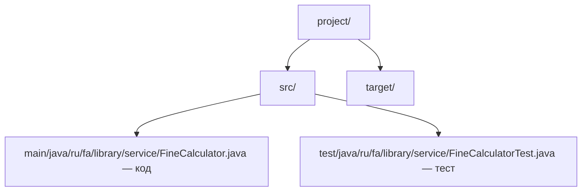
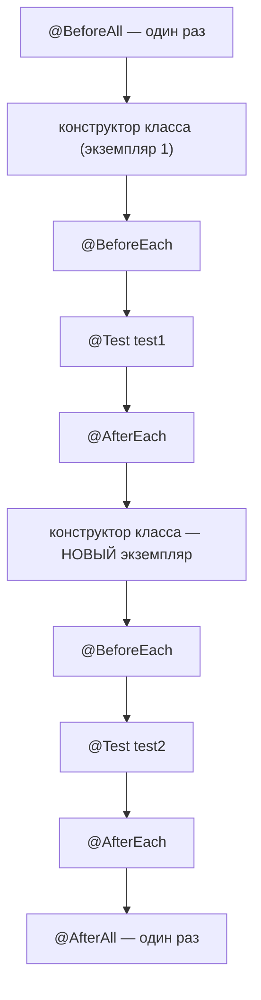

# Лекция 10: Документирование и тестирование

## Введение

Добро пожаловать на 10-ю лекцию курса «Современные технологии программирования». К этому моменту вы умеете многое: писать классы и интерфейсы (Лекции 2–4), работать с коллекциями и потоками (Лекция 5), собирать проект через Maven и хранить данные в базе (Лекция 6), поднимать веб-приложение на Spring Boot (Лекция 7). Код есть, и он даже работает — по крайней мере, когда вы запускаете его сами и вводите те данные, которые сами же придумали.

Проблемы начинаются дальше. Через месяц вы открываете собственный класс `StudentService` и не помните, почему метод `findById()` возвращает `null` для несуществующего студента, а не бросает исключение. Через два месяца к проекту подключается однокурсник и задаёт двадцать вопросов, на которые вы отвечаете по три раза. А потом вы правите одну строчку в сервисе — и ломается совсем другой экран, о котором вы даже не думали.

Представьте, что вы купили сложную кофемашину. К ней прилагаются две вещи: инструкция, где написано, что делает каждая кнопка, и заводской протокол испытаний, подтверждающий, что машина действительно варит кофе, а не заливает кухню кипятком. Без инструкции вы будете тыкать кнопки наугад. Без испытаний вы узнаете о браке в тот момент, когда кипяток окажется на полу. В программировании эти две вещи называются **документирование** и **тестирование**, и сегодня мы займёмся обеими.

Мы разберём Javadoc — стандартный способ описывать Java-код так, чтобы из комментариев автоматически получалась HTML-документация. Затем перейдём к JUnit 5: научимся писать тесты, проверять исключения, запускать один тест на десятке наборов данных. Дальше подключим Mockito, чтобы тестировать классы в изоляции от базы и сети. И закончим тестами для Spring-приложения из Лекции 7.

---

## Часть 1: Комментарии в Java

### 1.1 Три вида комментариев

В Java есть ровно три синтаксические формы комментария, и путать их не стоит — они решают разные задачи.

```java
public class CommentDemo {

    // Однострочный комментарий: от двух слэшей до конца строки.
    // Годится для короткого пояснения «здесь и сейчас».

    /* Многострочный (блочный) комментарий. Открывается слэшем со звёздочкой,
       закрывается звёздочкой со слэшем. Подходит для длинного пояснения внутри
       метода или для временного отключения куска кода. Вкладывать один блочный
       комментарий в другой Java не разрешает. */

    /**
     * Документирующий комментарий (Javadoc). Открывается слэшем и ДВУМЯ
     * звёздочками — именно это отличает его от блочного. Обрабатывается
     * утилитой javadoc для генерации HTML-документации.
     *
     * @param value входное значение
     * @return удвоенное значение
     */
    public int doubled(int value) {
        return value * 2;
    }
}
```

Компилятор игнорирует все три вида: в байт-код `.class` они не попадают. Но третий вид умеет читать **отдельная утилита** — `javadoc`, входящая в состав JDK с самой первой версии. Именно поэтому документирующий комментарий занимает особое место.

| Вид | Синтаксис | Кто читает | Типичное применение |
|-----|-----------|------------|---------------------|
| Однострочный | `// текст` | человек | короткое пояснение к строке или блоку |
| Многострочный | `/* текст */` | человек | длинное пояснение, временное отключение кода |
| Документирующий | `/** текст */` | человек **и** утилита `javadoc` | описание публичного API: классов, методов, полей |

Есть ещё полуофициальная форма — **комментарий-маркер** для IDE: `// TODO: заменить линейный поиск на HashMap` и `// FIXME: падает на пустой коллекции`. IntelliJ IDEA собирает такие маркеры в отдельное окно (`View → Tool Windows → TODO`). Удобно, только не превращайте проект в кладбище незакрытых `TODO`.

### 1.2 Чем документирующий комментарий принципиально отличается

Разница не только в лишней звёздочке. У документирующего комментария строгие правила:

1. **Место.** Он ставится непосредственно перед объявлением класса, интерфейса, перечисления, записи, метода, конструктора или поля. Комментарий внутри тела метода документацией не станет — `javadoc` его не увидит.
2. **Структура.** Он делится на описание и блок тегов (дескрипторов), и порядок здесь важен.
3. **Формат.** Внутри разрешена HTML-разметка (`<p>`, `<ul>`, `<b>`, `<pre>`), потому что на выходе получается HTML-страница.
4. **Наследование.** Документация переопределённого метода может наследоваться от метода родителя.

Бытовое сравнение: однострочный комментарий — записка на холодильнике «молоко в дверце», она для того, кто уже стоит на этой кухне. Javadoc — инструкция к самому холодильнику: напечатана типографски, лежит в отдельной папке, и читает её человек, который к вашей кухне вообще не подходил. В записке можно писать что угодно, в инструкции — только полное и точное описание.

### 1.3 Когда комментарий вреден

Начинающие часто пишут комментарии, дублирующие код: `i = i + 1; // увеличиваем i на единицу` или «Геттер для поля name» над `getName()`. Такой комментарий не просто бесполезен — он опасен. Код меняется, комментарий остаётся, через полгода они противоречат друг другу, а человек верит комментарию.

Хороший комментарий отвечает не на вопрос «что делает код» (это видно из кода), а на вопросы **«почему именно так»** и **«что нужно знать снаружи»**:

```java
// Сортируем в обратном порядке, потому что БД отдаёт записи
// по возрастанию id, а пользователю нужны свежие сверху.
Collections.reverse(records);

/**
 * Возвращает студента по идентификатору.
 *
 * @param id идентификатор студента
 * @return найденный студент или {@code null}, если студента с таким id нет
 */
public Student findById(Long id) {
    return studentRepository.findById(id).orElse(null);
}
```

Второй пример — случай из Лекции 7. По сигнатуре `Student findById(Long id)` невозможно догадаться, что при отсутствии студента вернётся `null`, а не полетит исключение. Это и есть тот контракт, ради которого пишут Javadoc.

---

## Часть 2: Javadoc — структура документирующего комментария

### 2.1 Что такое Javadoc

**Javadoc** — стандартный генератор документации из исходного кода Java, входящий в состав JDK. Он читает файлы `.java`, извлекает документирующие комментарии `/** ... */` вместе с сигнатурами классов и методов и формирует набор связанных HTML-страниц.

Именно так сделана официальная документация по стандартной библиотеке Java: страницы `docs.oracle.com/en/java/javase/21/docs/api/` сгенерированы утилитой `javadoc` из исходников JDK. То есть результатом её работы вы пользовались уже сотни раз.

Аналогия: Javadoc — это типография. Вы пишете рукопись прямо на полях кода, а типография собирает из этих полей аккуратную книжку с оглавлением, указателем и перекрёстными ссылками. Ваша задача — писать рукопись по правилам, чтобы наборщик не запутался.

### 2.2 Три части комментария

```java
/**
 * Краткое описание — одно предложение до первой точки.
 *
 * <p>Подробное описание. Может занимать сколько угодно абзацев, содержать
 * списки, ссылки и примеры кода. Абзацы разделяются тегом {@code <p>}.
 *
 * @param  daysOverdue блок тегов (дескрипторов) — всегда идёт последним
 * @return сумма штрафа
 */
```

**1. Краткое описание (summary)** — всё до первой точки с пробелом после неё. Именно этот текст попадает в сводные таблицы «Method Summary». Отсюда правило: не ставьте точку в середине первого предложения, иначе краткое описание оборвётся. Если точка неизбежна (сокращение «т. д.»), задайте границу явно инлайн-тегом `{@summary ...}` (Java 10+).

**2. Подробное описание** — всё после первого предложения и до первого блочного тега. Здесь допустима HTML-разметка: `<p>`, `<ul><li>`, `<b>`, `<pre>`.

**3. Блок тегов (дескрипторов)** — строки, начинающиеся с `@`. Как только начался блок тегов, обычный текст закончился: всё дальнейшее относится к тегам.

Комментарий принято оформлять «лесенкой» звёздочек — каждая строка начинается с ` * `. Синтаксически они не обязательны (`javadoc` их отбрасывает), но так принято, и IDE ставит их сама.

### 2.3 Пример полностью документированного класса

```java
package ru.fa.library.service;

/**
 * Калькулятор штрафов за несвоевременный возврат книг.
 *
 * <p>Штраф начисляется за каждый день просрочки по фиксированной ставке
 * {@link #DAILY_RATE} и ограничен сверху значением {@link #MAX_FINE}.
 * Класс не хранит состояния и потокобезопасен.
 *
 * <p>Пример использования:
 * <pre>{@code
 * FineCalculator calculator = new FineCalculator();
 * double fine = calculator.calculate(10);   // 50.0
 * }</pre>
 *
 * @author А. Эбрахим
 * @version 1.2
 * @since 1.0
 */
public class FineCalculator {

    /** Штраф за один день просрочки, в рублях. */
    public static final double DAILY_RATE = 5.0;

    /** Максимальный штраф за одну книгу, в рублях. */
    public static final double MAX_FINE = 500.0;

    /**
     * Вычисляет штраф за указанное количество дней просрочки.
     *
     * <p>Результат равен произведению дней на ставку, но не превышает
     * {@link #MAX_FINE}. Для нуля дней возвращается {@code 0.0}.
     *
     * @param daysOverdue количество дней просрочки, неотрицательное число
     * @return сумма штрафа в рублях, от {@code 0.0} до {@link #MAX_FINE}
     * @throws IllegalArgumentException если {@code daysOverdue} отрицательное
     */
    public double calculate(int daysOverdue) {
        if (daysOverdue < 0) {
            throw new IllegalArgumentException(
                    "Количество дней не может быть отрицательным: " + daysOverdue);
        }
        return Math.min(daysOverdue * DAILY_RATE, MAX_FINE);
    }
}
```

Три момента. Поля тоже документируются — короткий однострочный `/** ... */` для константы вполне уместен. Пример кода обёрнут в `<pre>{@code ... }</pre>`, чтобы угловые скобки не сломали HTML. И `@throws` описывает не любое возможное исключение, а то, которое является частью контракта метода.

### 2.4 Правила хорошего описания

- **Метод описывайте глаголом в третьем лице:** «Вычисляет штраф», «Возвращает список студентов», а не «Вычислить» и не «Этот метод вычисляет».
- **Класс описывайте существительным:** «Калькулятор штрафов», «Репозиторий студентов».
- **Первое предложение самодостаточно** — его читают в таблице методов, вне контекста.
- **Документируйте контракт, а не реализацию:** диапазон результата, поведение на границах, что будет при `null`, бросается ли исключение.
- **Документируйте всё публичное.** `public` и `protected` члены — это ваш API. Приватные методы документировать не обязательно.
- **Не смешивайте языки.** В учебных проектах Финансового университета допустим русский, в открытых проектах принят английский.

---

## Часть 3: Дескрипторы Javadoc

### 3.1 Что такое дескриптор

**Дескриптор (тег) Javadoc** — специальная метка, начинающаяся с символа `@`, которая помечает фрагмент документации как имеющий определённый смысл: параметр, возвращаемое значение, исключение, автор, версия.

Аналогия — почтовая накладная. На коробке можно написать что угодно, но адрес, отправитель и вес должны стоять в строго отведённых графах, иначе автоматика на сортировочном узле их не прочитает. Дескрипторы — это графы, а `javadoc` — сортировочный узел, раскладывающий их по разделам HTML-страницы.

Дескрипторы бывают двух видов: **блочные** (с новой строки в блоке тегов) и **строчные, или инлайновые** (в фигурных скобках прямо внутри текста).

### 3.2 Блочные дескрипторы

| Дескриптор | Где применяется | Назначение |
|------------|-----------------|------------|
| `@param имя описание` | метод, конструктор, обобщённый тип, запись | описывает параметр метода, параметр типа или компонент записи |
| `@return описание` | метод | описывает возвращаемое значение |
| `@throws Класс описание` | метод, конструктор | описывает исключение и условие его выброса |
| `@exception Класс описание` | метод, конструктор | полный синоним `@throws` (устаревшая форма) |
| `@author имя` | класс, интерфейс | автор кода |
| `@version версия` | класс, интерфейс | версия класса |
| `@since версия` | любой элемент | с какой версии элемент существует |
| `@see ссылка` | любой элемент | раздел «См. также» |
| `@deprecated причина` | любой элемент | элемент устарел; чем его заменить |
| `@serial`, `@serialField`, `@serialData` | сериализуемые классы | описание формата сериализации |
| `@hidden` | любой элемент | скрыть элемент из сгенерированной документации |

**`@param`** — по одному тегу на каждый параметр, в порядке сигнатуры. Для обобщённых типов параметр типа пишется в угловых скобках, а у записи (`record`) те же теги описывают её компоненты:

```java
/**
 * Контейнер для пары значений.
 *
 * @param <K>   тип ключа
 * @param <V>   тип значения
 * @param key   ключ, не может быть {@code null}
 * @param value значение, допускается {@code null}
 */
public record Pair<K, V>(K key, V value) { }
```

**`@return`** — ровно один на метод; для `void`-методов не пишется.

**`@throws` и `@exception`** — это одно и то же. Исторически первым появился `@exception`, затем его переименовали в `@throws`, а старое имя оставили для совместимости. Сегодня пишут `@throws`, но помните, что `@exception` — его полный синоним.

**`@see`** — ссылка в раздел «См. также», возможны четыре формы:

```java
/**
 * @see FineCalculator
 * @see FineCalculator#calculate(int)
 * @see <a href="https://example.org">Правила библиотеки</a>
 * @see "ГОСТ 7.32-2017"
 */
```

Сверху вниз: ссылка на класс; ссылка на конкретный метод класса; внешняя ссылка, оформленная HTML-тегом `<a href="...">`; печатный источник — просто текст в кавычках, ссылка при этом не строится. Обратите внимание: после тега `@see` идёт только сама ссылка. Дописать пояснение в ту же строку нельзя — у первых двух форм оно молча станет подписью ссылки, а у двух последних `javadoc` сообщит об ошибке и генерация упадёт.

**`@deprecated`** работает в паре с аннотацией `@Deprecated`: аннотация нужна компилятору (он выдаст предупреждение при использовании), тег — человеку (он объясняет, чем заменить).

```java
/**
 * Возвращает имя и фамилию одной строкой.
 *
 * @return полное имя
 * @deprecated начиная с версии 2.0 используйте {@link #getFullName(Locale)},
 *             который учитывает порядок имени и фамилии в разных локалях.
 */
@Deprecated(since = "2.0", forRemoval = true)
public String getName() {
    return name + " " + surname;
}
```

Канонический порядок тегов, рекомендованный Oracle: `@author`, `@version`, `@param`, `@return`, `@throws`, `@see`, `@since`, `@serial`, `@deprecated`.

### 3.3 Строчные (инлайновые) дескрипторы

| Дескриптор | Назначение |
|------------|------------|
| `{@link Класс#метод}` | ссылка на элемент кода, моноширинным шрифтом |
| `{@linkplain Класс#метод текст}` | то же, но обычным шрифтом |
| `{@code текст}` | фрагмент кода: моноширинный шрифт, HTML внутри не интерпретируется |
| `{@literal текст}` | текст как есть, без интерпретации HTML, обычным шрифтом |
| `{@value #КОНСТАНТА}` | подставляет фактическое значение константы |
| `{@inheritDoc}` | вставляет документацию переопределяемого метода |
| `{@docRoot}` | путь к корню сгенерированной документации |
| `{@summary текст}` | явно задаёт краткое описание (Java 10+) |
| `{@index термин}` | добавляет термин в алфавитный указатель (Java 9+) |
| `{@snippet ...}` | вставка фрагмента кода с подсветкой (Java 18+) |

**`{@code}` против `{@literal}`.** Оба защищают текст от интерпретации как HTML, разница только в шрифте. Без них строка `List<String>` превратится в `List` — браузер съест `<String>` как неизвестный тег. А `{@value}` подставляет реальное значение константы, так что документация не разъезжается с кодом:

```java
/**
 * Возвращает список названий книг.
 *
 * <p>Тип результата — {@code List<String>}, никогда не {@code null}.
 * Условие применимости: {@literal 0 < размер полки < 1000}.
 * Максимальный штраф равен {@value FineCalculator#MAX_FINE} рублей.
 */
```

**`{@inheritDoc}`** избавляет от копирования документации при переопределении:

```java
public interface StudentService {
    /**
     * Возвращает всех студентов из хранилища.
     *
     * @return список студентов, возможно пустой, но не {@code null}
     */
    List<Student> findAll();
}

@Service
public class StudentServiceImpl implements StudentService {
    /**
     * {@inheritDoc}
     *
     * <p>Реализация обращается к базе через Spring Data JPA и не кэширует результат.
     */
    @Override
    public List<Student> findAll() {
        return studentRepository.findAll();
    }
}
```

Если Javadoc у переопределяющего метода отсутствует вообще, документация наследуется автоматически. `{@inheritDoc}` нужен, когда вы хотите взять описание родителя **и добавить своё**.

---

## Часть 4: Генерация документации

### 4.1 Команда javadoc

Утилита `javadoc` лежит в каталоге `bin` вашего JDK рядом с `java` и `javac`.

```bash
# Простейший вызов — для одного файла
javadoc -d docs src/main/java/ru/fa/library/service/FineCalculator.java

# Для реального проекта — по пакетам (в PowerShell пишите всё в одну строку)
javadoc -d docs -sourcepath src/main/java -subpackages ru.fa.library \
        -encoding UTF-8 -charset UTF-8 -docencoding UTF-8 \
        -author -version -windowtitle "Онлайн-библиотека"
```

| Опция | Что делает |
|-------|------------|
| `-d каталог` | куда положить сгенерированный HTML |
| `-sourcepath путь` | где искать исходники |
| `-subpackages пакет` | обработать пакет и все вложенные |
| `-encoding` | кодировка исходных файлов |
| `-charset` / `-docencoding` | кодировка сгенерированного HTML |
| `-author`, `-version` | включить теги `@author` и `@version` (по умолчанию они **не** выводятся) |
| `-private` | документировать все члены, включая `private` |
| `-protected` | значение по умолчанию: `public` и `protected` |
| `-link URL` | связать с внешней документацией (например, с API JDK) |
| `-Xdoclint:none` | отключить строгую проверку документации |

Про `-author` и `-version`: по умолчанию `javadoc` эти теги игнорирует. Студенты часто пишут `@author`, не видят его в HTML и решают, что тег не работает. Нужно просто добавить флаг.

Про **doclint**: начиная с Java 8 `javadoc` проверяет документацию строго, но замечания делит на две категории, и разница между ними принципиальна. Отсутствующий `@param` или `@return` — это **предупреждение**: в консоли появится `warning: no @param for bookCount`, документация всё равно сгенерируется, код возврата останется нулевым. А вот битая ссылка в `{@link}` или `@see`, невалидный HTML и синтаксическая ошибка в самом комментарии — это **ошибки**: `javadoc` печатает `error: reference not found`, подводит итог «1 error» и завершается с ненулевым кодом, HTML при этом не создаётся. Отключается всё флагом `-Xdoclint:none`, точечно — `-Xdoclint:all,-missing` (проверять всё, кроме отсутствующих тегов).

На выходе в каталоге `docs` появляются `index.html` (точка входа), `overview-tree.html` (дерево иерархии классов), `index-all.html` (алфавитный указатель), `search.js` (поиск) и по странице на каждый класс и пакет: `ru/fa/library/service/FineCalculator.html`, `package-summary.html`. Открываете `docs/index.html` в браузере — и видите ту же структуру, что и на сайте документации Oracle.

### 4.2 Генерация через Maven

Руками команду `javadoc` в реальном проекте почти никто не вызывает — это делает система сборки (Лекция 6). Разница примерно как между стиркой в тазу и стиральной машиной: результат тот же, но во втором случае вы не стоите над ним и не забываете половину белья.

```xml
<plugin>
    <groupId>org.apache.maven.plugins</groupId>
    <artifactId>maven-javadoc-plugin</artifactId>
    <version>3.11.2</version>
    <configuration>
        <encoding>UTF-8</encoding>
        <charset>UTF-8</charset>
        <docencoding>UTF-8</docencoding>
        <author>true</author>
        <version>true</version>
        <doclint>none</doclint>
        <windowtitle>Онлайн-библиотека</windowtitle>
    </configuration>
    <executions>
        <execution>
            <id>attach-javadocs</id>
            <goals>
                <goal>jar</goal>   <!-- собирать javadoc-архив на фазе package -->
            </goals>
        </execution>
    </executions>
</plugin>
```

```bash
mvn javadoc:javadoc     # сгенерировать HTML (каталог плагин печатает в консоли)
mvn javadoc:jar         # упаковать документацию в проект-javadoc.jar
mvn package             # соберёт и обычный jar, и javadoc-jar
```

Результат попадает в `target/site/apidocs`, а в свежих версиях плагина — в `target/reports/apidocs`; точный путь плагин печатает в консоли, на него и ориентируйтесь. Отдельный `*-javadoc.jar` нужен при публикации библиотеки в репозиторий: IDE скачивает его и показывает вашу документацию во всплывающих подсказках.

### 4.3 Документация пакета и работа в IDE

Отдельный класс документируется своим Javadoc, а весь пакет — файлом `package-info.java`, о котором мы говорили в Лекции 2:

```java
/**
 * Сервисный слой онлайн-библиотеки.
 *
 * <p>Пакет содержит бизнес-логику выдачи и возврата книг, расчёта штрафов
 * и уведомления читателей. Классы пакета не зависят от веб-слоя.
 *
 * @since 1.0
 */
package ru.fa.library.service;
```

Файл не содержит ничего, кроме комментария и объявления пакета; его текст попадает на страницу `package-summary.html`.

В IntelliJ IDEA заготовка Javadoc создаётся автоматически: поставьте курсор перед объявлением метода, наберите `/**` и нажмите Enter — IDE подставит `@param` для каждого параметра, `@return` и `@throws`. Сгенерировать HTML можно через `Tools → Generate JavaDoc`. И обратная связь: всплывающая подсказка при наведении на чужой метод — это тоже Javadoc, прочитанный IDE из исходников или из `*-javadoc.jar`. То есть написанная вами документация будет видна коллегам прямо в редакторе.

---

## Часть 5: Зачем нужны автоматические тесты

### 5.1 Ручное и автоматизированное тестирование

Пока проект маленький, вы тестируете его руками: запустили, нажали пару кнопок, посмотрели в консоль. Это **ручное тестирование**, и работает оно ровно до того момента, когда экранов становится больше пяти. Простая арифметика: если полная ручная проверка занимает 20 минут, а вы правите код 10 раз в день, на проверку уйдёт больше трёх часов. Вы, конечно, не станете этого делать — проверите только то, что правили. И сломается именно другое место.

**Автоматизированное тестирование** — это программы, которые проверяют вашу программу. Написали один раз, запускаете тысячу раз, каждая проверка занимает миллисекунды.

Подходов к проверке два, и различаются они тем, что известно тестировщику. При подходе **чёрного ящика (black box)** известен только внешний контракт: какие входы, какие ожидаемые выходы; внутрь не смотрим — так проверяют REST API и пользовательский интерфейс. При подходе **белого ящика (white box)** известна внутренняя структура, и тесты пишутся так, чтобы пройти по всем ветвлениям и граничным условиям. Модульные тесты, которыми мы займёмся, обычно ближе к белому ящику: вы знаете, что внутри `calculate()` есть ограничение сверху, и специально проверяете значения вокруг границы.

### 5.2 Виды тестов и пирамида тестирования

- **Модульные (unit)** — проверяют один класс или метод в изоляции от всего остального. Быстрые, их много.
- **Интеграционные (integration)** — проверяют, что несколько компонентов работают вместе: сервис плюс база, контроллер плюс сервис. Медленнее, их меньше.
- **Сквозные (end-to-end, E2E)** — прогоняют полный сценарий через всё приложение, как живой пользователь: HTTP-запрос → контроллер → сервис → база → ответ. Самые медленные и хрупкие, их совсем немного.

Три уровня принято рисовать в виде **пирамиды тестирования**:

```
              /\
             /  \        Сквозные (E2E): единицы, минуты на прогон
            /----\
           /      \      Интеграционные: десятки, секунды на прогон
          /--------\
         /          \    Модульные (unit): сотни, миллисекунды на прогон
        /____________\
```

Логика простая: чем ниже уровень, тем дешевле тест и тем точнее он указывает на место поломки. Упавший модульный тест говорит: «метод `calculate` вернул 505 вместо 500». Упавший E2E-тест говорит: «страница не открылась» — и дальше ищите сами.

Аналогия из автосервиса: прежде чем собрать двигатель, каждую деталь проверяют на стенде — это модульные тесты; потом проверяют собранный узел — интеграционные; и только затем выгоняют машину на тест-драйв — E2E. Собирать машину и гнать её на трассу, чтобы «проверить поршень», — плохая идея. Обратный антипаттерн называют **мороженым (ice cream cone)**: почти всё проверяется вручную и сквозными тестами, модульных почти нет. Такая система тестируется часами и ломается постоянно.

### 5.3 Каким должен быть хороший модульный тест

1. **Быстрый.** Миллисекунды. Тест, который лезет в реальную базу или в сеть, — уже не модульный.
2. **Независимый.** Не зависит ни от других тестов, ни от порядка запуска. JUnit сознательно не гарантирует порядок методов, чтобы вы на него не полагались.
3. **Повторяемый.** Даёт один и тот же результат при каждом запуске: на вашей машине, на машине преподавателя и на сервере сборки. Тест, зависящий от текущей даты или содержимого вашего каталога «Загрузки», сломается.

К этим трём часто добавляют ещё два, получая аббревиатуру **FIRST**: *Fast, Independent, Repeatable, Self-validating* (тест сам решает, прошёл он или нет, без ручного просмотра логов), *Timely* (пишется вместе с кодом, а не «когда-нибудь потом»). И правило, которое нарушают чаще всего: **один тест проверяет одну вещь**. Если тест упал, причина должна быть понятна по его имени, без открытия кода.

### 5.4 Схема AAA: Arrange — Act — Assert

Практически любой тест состоит из трёх шагов: **Arrange** (подготовка объектов и данных), **Act** (вызов ровно одного тестируемого метода), **Assert** (сверка результата с ожидаемым).

```java
@Test
void calculate_returnsRateTimesDays() {
    FineCalculator calculator = new FineCalculator();   // Arrange — подготовка

    double fine = calculator.calculate(10);             // Act — действие

    assertEquals(50.0, fine, 0.001);                    // Assert — проверка
}
```

В литературе встречается второе название той же схемы — **Given — When — Then** (дано — когда — тогда), пришедшее из BDD; смысл идентичный. Разделяйте три части хотя бы пустой строкой: тест, где подготовка перемешана с проверками, читать невозможно.

---

## Часть 6: Структура фреймворка JUnit 5

### 6.1 Три составные части

**JUnit** — самый распространённый фреймворк модульного тестирования для Java. Версия, на которой построен курс, — **JUnit 5**, её первый релиз вышел в 2017 году. Это не просто обновление JUnit 4: фреймворк переписан и разделён на три независимых подпроекта. Нумерация JUnit с тех пор ушла дальше, но модель программирования Jupiter, которую мы разбираем, в новых ветках та же.

```
JUnit 5 = JUnit Platform + JUnit Jupiter + JUnit Vintage
```

**1. JUnit Platform** — фундамент. Отвечает за запуск тестов и связь с внешним миром: с IDE, с Maven, с Gradle, с командной строкой. Сама платформа тесты не выполняет — она определяет интерфейс `TestEngine` (SPI, Service Provider Interface), через который к ней подключаются «движки». Дополнительно предоставляет `Launcher API` для инструментов и консольный запускатель `ConsoleLauncher`.

**2. JUnit Jupiter** — новая модель программирования и расширений. Здесь живут аннотации `@Test`, `@BeforeEach`, `@DisplayName`, класс `Assertions` и механизм расширений `@ExtendWith`. Состоит из API (`junit-jupiter-api` — то, что подключают для написания тестов), движка (`junit-jupiter-engine` — выполняет тесты) и модуля параметризованных тестов (`junit-jupiter-params`).

**3. JUnit Vintage** — движок обратной совместимости: позволяет на той же платформе запускать старые тесты, написанные для JUnit 3 и JUnit 4. Нужен только при миграции легаси-проекта.

Аналогия: JUnit Platform — розетка в стене. Jupiter и Vintage — вилки разных стандартов, которые в неё вставляются. Ваши тесты — приборы. Розетка не знает, что именно к ней подключили; ей достаточно, чтобы вилка соответствовала стандарту `TestEngine`. Благодаря такому разделению на платформе JUnit работают и совсем сторонние фреймворки — например, Spock или Cucumber.

| Артефакт | Подпроект | Назначение |
|----------|-----------|------------|
| `junit-platform-commons`, `junit-platform-engine`, `junit-platform-launcher` | Platform | ядро, SPI движков, API запуска |
| `junit-jupiter-api` | Jupiter | аннотации и утверждения — то, что видит автор теста |
| `junit-jupiter-engine` | Jupiter | выполнение тестов Jupiter (нужен в runtime) |
| `junit-jupiter-params` | Jupiter | параметризованные тесты |
| `junit-vintage-engine` | Vintage | выполнение тестов JUnit 3/4 |
| `junit-jupiter` | Jupiter | «зонтичный» артефакт: api + params + engine сразу |

### 6.2 Подключение к Maven-проекту

В обычном проекте достаточно одной зависимости-агрегата и плагина Surefire:

```xml
<dependencies>
    <dependency>
        <groupId>org.junit.jupiter</groupId>
        <artifactId>junit-jupiter</artifactId>   <!-- api + engine + params -->
        <version>5.11.4</version>
        <scope>test</scope>
    </dependency>
</dependencies>

<build>
    <plugins>
        <plugin>
            <groupId>org.apache.maven.plugins</groupId>
            <artifactId>maven-surefire-plugin</artifactId>  <!-- запускает тесты -->
            <version>3.5.2</version>
        </plugin>
    </plugins>
</build>
```

Обратите внимание на `<scope>test</scope>`: библиотека нужна только при компиляции и запуске тестов, в итоговый JAR она не попадёт.

Напомним и про `<properties>` из Лекции 6: `maven.compiler.release` — единственный параметр `javac`, доступный начиная с Java 9, которым сразу задаются версия языка, версия байт-кода и набор API стандартной библиотеки, поэтому компилятор не даст случайно вызвать метод из более новой версии Java. Старая пара `source`/`target`, где эти опции указывались по отдельности, отвечала только за язык и байт-код и ничего не знала про API.

В Spring Boot всё проще: стартер `spring-boot-starter-test` со `scope` `test` приносит JUnit 5, Mockito, AssertJ, Hamcrest, JSONassert, JsonPath и модуль Spring Test одной строкой. Spring Initializr добавляет его в проект по умолчанию.

### 6.3 Где живут тесты



Правила, которые Maven и Surefire считают само собой разумеющимися:

- Тесты лежат в `src/test/java`, **в том же пакете**, что и тестируемый класс. Тогда тест видит его package-private члены.
- Имя тестового класса заканчивается на `Test` или `Tests` (либо начинается с `Test`) — Surefire ищет именно такие классы. Классы с суффиксом `IT` считаются интеграционными и запускаются другим плагином, Failsafe.

```bash
mvn test                                   # все тесты
mvn test -Dtest=FineCalculatorTest         # один класс
mvn test -Dtest=FineCalculatorTest#calculate_returnsRateTimesDays   # один метод
```

---

## Часть 7: Тестовые классы и методы, аннотации JUnit

### 7.1 Требования к тестовому классу и методу

**Тестовый класс** — обычный Java-класс, содержащий хотя бы один тестовый метод. Он не должен быть `abstract`, должен иметь единственный конструктор (обычно по умолчанию) и не должен быть вложенным нестатическим классом, если только не помечен `@Nested`.

**Тестовый метод** — метод, помеченный `@Test` (или `@ParameterizedTest`, `@RepeatedTest`, `@TestFactory`). Он не может быть `static` или `private`, возвращает `void` (кроме `@TestFactory`) и не принимает параметров — кроме тех, что внедряет сам JUnit (`TestInfo`, `RepetitionInfo`) или подаёт источник параметризованного теста.

Важное отличие от JUnit 4: **тестовые классы и методы не обязаны быть `public`**. Достаточно package-private видимости, и так теперь принято писать.

```java
package ru.fa.library.service;

import org.junit.jupiter.api.Test;
import static org.junit.jupiter.api.Assertions.assertEquals;

class FineCalculatorTest {          // package-private — это нормально

    @Test
    void calculate_returnsRateTimesDays() {
        FineCalculator calculator = new FineCalculator();

        double fine = calculator.calculate(10);

        assertEquals(50.0, fine, 0.001);
    }
}
```

Имя теста должно читаться как утверждение о поведении. Распространённые схемы: `метод_ожидаемоеПоведение` (`calculate_returnsZeroForZeroDays`) или `should_поведение_when_условие` (`shouldThrow_whenDaysAreNegative`). Выберите одну и держитесь её во всём проекте.

### 7.2 @DisplayName — человекочитаемое имя

Имя метода ограничено синтаксисом Java: ни пробелов, ни знаков препинания. Аннотация `@DisplayName` задаёт имя, которое увидит человек в отчёте IDE и в консоли:

```java
@DisplayName("Калькулятор штрафов")
class FineCalculatorDisplayTest {

    @Test
    @DisplayName("За 10 дней просрочки начисляется 50 рублей")
    void calculate_returnsRateTimesDays() {
        assertEquals(50.0, new FineCalculator().calculate(10), 0.001);
    }

    @Test
    @DisplayName("Штраф не превышает максимума в 500 рублей")
    void calculate_isCappedAtMaxFine() {
        assertEquals(500.0, new FineCalculator().calculate(1000), 0.001);
    }
}
```

В отчёте IDE это выглядит как «Калькулятор штрафов» с двумя вложенными строками — «За 10 дней просрочки начисляется 50 рублей» и «Штраф не превышает максимума в 500 рублей».

`@DisplayName` применяется и к классу, и к методу; в нём допустимы пробелы, кириллица и знаки препинания. Практический смысл: отчёт о тестах становится живым описанием поведения системы, понятным и не-программисту.

### 7.3 @BeforeEach и @AfterEach

Часто в каждом тесте нужен один и тот же подготовительный код. Выносить его в приватный метод и вызывать вручную — путь к забытому вызову. JUnit предлагает аннотации жизненного цикла: **`@BeforeEach`** выполняется **перед каждым** тестовым методом класса (создать тестируемый объект, заполнить данные, открыть ресурсы), а **`@AfterEach`** — **после каждого**, даже если тест упал (закрыть ресурсы, удалить временные файлы).

Возьмём класс с изменяемым состоянием:

```java
package ru.fa.library.service;

import java.util.ArrayList;
import java.util.List;

/** Полка с книгами: хранит названия и позволяет их добавлять и убирать. */
public class BookShelf {

    private final List<String> titles = new ArrayList<>();

    /**
     * Добавляет книгу на полку.
     *
     * @param title название книги, не пустое
     * @throws IllegalArgumentException если название {@code null} или пустое
     */
    public void add(String title) {
        if (title == null || title.isBlank()) {
            throw new IllegalArgumentException("Название книги не задано");
        }
        titles.add(title);
    }

    public boolean remove(String title) { return titles.remove(title); }
    public int size() { return titles.size(); }
    public List<String> titles() { return List.copyOf(titles); }
}
```

Тест к нему:

```java
@DisplayName("Книжная полка")
class BookShelfTest {

    private BookShelf shelf;

    @BeforeEach
    void setUp() {
        // Выполняется перед КАЖДЫМ тестом — полка всегда новая
        shelf = new BookShelf();
        shelf.add("Война и мир");
    }

    @AfterEach
    void tearDown() {
        // Выполняется после КАЖДОГО теста, даже если тест упал
        shelf = null;
    }

    @Test
    @DisplayName("После добавления книги размер увеличивается")
    void add_increasesSize() {
        shelf.add("Мастер и Маргарита");

        assertEquals(2, shelf.size());
    }

    @Test
    @DisplayName("Удаление существующей книги возвращает true")
    void remove_returnsTrueForExistingBook() {
        boolean removed = shelf.remove("Война и мир");

        assertTrue(removed);
        assertEquals(0, shelf.size());
    }
}
```

Ключевой момент, который часто упускают: **JUnit создаёт новый экземпляр тестового класса для каждого тестового метода**. Поле `shelf` в первом тесте и во втором — два разных объекта. Именно так фреймворк обеспечивает независимость: что бы вы ни натворили в одном тесте, следующий начнёт с чистого листа.

Бытовая аналогия: `@BeforeEach` — разложить доску, нож и продукты перед каждым блюдом, `@AfterEach` — вымыть их после. Не «один раз в начале смены», а перед каждым блюдом, чтобы вкус предыдущего не попал в следующее.

### 7.4 @BeforeAll и @AfterAll

Иногда подготовка слишком дорога, чтобы повторять её перед каждым тестом: поднять базу, прочитать большой файл, установить соединение. **`@BeforeAll`** выполняется **один раз** перед всеми тестами класса, **`@AfterAll`** — **один раз** после всех. Экземпляра класса на этот момент ещё нет, поэтому по умолчанию такие методы обязаны быть **статическими**:

```java
class DatabaseConnectionTest {

    private static Connection connection;

    @BeforeAll
    static void openConnection() throws SQLException {
        connection = DriverManager.getConnection("jdbc:h2:mem:testdb");  // дорого, один раз
    }

    @AfterAll
    static void closeConnection() throws SQLException {
        connection.close();
    }

    @BeforeEach
    void clearTables() throws SQLException {
        try (Statement statement = connection.createStatement()) {
            statement.execute("TRUNCATE TABLE students");   // а это — перед каждым тестом
        }
    }
}
```

Правило простое: в `@BeforeAll` — то, что не меняется от теста к тесту. Всё изменяемое состояние — в `@BeforeEach`, иначе тесты начнут влиять друг на друга.

### 7.5 Жизненный цикл и @TestInstance

Порядок выполнения для класса с двумя тестами:



Такое поведение задаётся режимом `@TestInstance(Lifecycle.PER_METHOD)` — он включён по умолчанию. Альтернатива — `@TestInstance(TestInstance.Lifecycle.PER_CLASS)`: создаётся один экземпляр класса на все тесты, и `@BeforeAll` разрешено делать нестатическим. Плата — общее состояние между тестами, то есть риск нарушить их независимость.

### 7.6 @Disabled, @Tag, @Nested

**`@Disabled`** временно отключает тест или весь класс. Обязательно указывайте причину, иначе через месяц никто не вспомнит, почему тест выключен. **`@Tag`** помечает тесты категориями для выборочного запуска.

```java
@Test
@Disabled("Ждём исправления бага LIB-142 в модуле уведомлений")
void send_retriesOnTimeout() { }

@Test
@Tag("slow")
@Tag("integration")
void fullImportFromCsv() { }
```

```bash
mvn test -Dgroups=fast              # только помеченные "fast"
mvn test -DexcludedGroups=slow      # пропустить медленные
```

**`@Nested`** группирует связанные тесты во вложенных классах — отчёт становится структурированным:

```java
@DisplayName("Калькулятор штрафов")
class FineCalculatorNestedTest {

    private final FineCalculator calculator = new FineCalculator();

    @Nested
    @DisplayName("когда просрочки нет")
    class NoOverdue {
        @Test
        @DisplayName("штраф равен нулю")
        void returnsZero() { assertEquals(0.0, calculator.calculate(0), 0.001); }
    }

    @Nested
    @DisplayName("когда просрочка очень большая")
    class HugeOverdue {
        @Test
        @DisplayName("штраф ограничен максимумом")
        void isCapped() { assertEquals(500.0, calculator.calculate(10_000), 0.001); }
    }
}
```

Вложенный класс обязан быть **нестатическим** внутренним классом (Лекция 4) — только тогда он видит поля внешнего тестового класса.

### 7.7 Сводная таблица аннотаций

| Аннотация | Что делает |
|-----------|------------|
| `@Test` | помечает метод как тестовый |
| `@DisplayName` | человекочитаемое имя класса или теста в отчёте |
| `@BeforeEach` | выполнить перед каждым тестом |
| `@AfterEach` | выполнить после каждого теста |
| `@BeforeAll` | выполнить один раз перед всеми тестами класса (`static` по умолчанию) |
| `@AfterAll` | выполнить один раз после всех тестов класса (`static` по умолчанию) |
| `@Disabled` | отключить тест или класс |
| `@Tag` | пометить тест категорией для выборочного запуска |
| `@Nested` | вложенная группа тестов |
| `@TestInstance` | режим создания экземпляра: `PER_METHOD` (по умолчанию) или `PER_CLASS` |
| `@ParameterizedTest` | тест, выполняемый на нескольких наборах данных |
| `@RepeatedTest` | повторить тест N раз |
| `@TestFactory` | фабрика динамических тестов |
| `@Timeout` | ограничить время выполнения теста |
| `@ExtendWith` | подключить расширение (Mockito, Spring) |
| `@TestMethodOrder` | задать порядок тестов (по умолчанию он не гарантируется) |

Аннотации JUnit 4, чтобы узнавать их в старом коде: `@Before`/`@After` (это `@BeforeEach`/`@AfterEach`), `@BeforeClass`/`@AfterClass` (`@BeforeAll`/`@AfterAll`), `@Ignore` (`@Disabled`), `@RunWith` (`@ExtendWith`). Смешивать JUnit 4 и JUnit 5 в одном тестовом классе нельзя.

---

## Часть 8: Утверждения JUnit

### 8.1 Класс Assertions, а не Assert

Здесь нужно расставить точки над «i», потому что этот вопрос путает всех. В **JUnit 4** класс утверждений назывался `org.junit.Assert`. В **JUnit 5 (Jupiter)** он называется **`org.junit.jupiter.api.Assertions`**. Это не переименование ради переименования: изменился и набор методов, и порядок аргументов.

| | JUnit 4 (`Assert`) | JUnit 5 (`Assertions`) |
|---|---|---|
| Пакет | `org.junit` | `org.junit.jupiter.api` |
| Сообщение об ошибке | **первый** аргумент: `assertEquals("текст", 5, actual)` | **последний** аргумент: `assertEquals(5, actual, "текст")` |
| Проверка исключений | `@Test(expected = ...)` | `assertThrows(...)` |
| Групповые проверки | нет | `assertAll(...)` |
| Ленивое сообщение | нет | `Supplier<String>` |

Если в коде импортируется `org.junit.Assert` — вы пишете тест на JUnit 4, даже если думаете иначе. Проверяйте импорты: в JUnit 5 они всегда начинаются с `org.junit.jupiter.api`. Обычно методы импортируют статически: `import static org.junit.jupiter.api.Assertions.*;`

**Утверждение (assertion)** — проверка условия внутри теста. Если условие выполнено, тест продолжается. Если нет — метод бросает `AssertionFailedError`, тест немедленно прерывается и помечается как провалившийся. Аналогия: утверждение — это калибр у контролёра ОТК. Деталь либо проходит в шаблон, либо нет; оценки «почти подошла» не бывает.

### 8.2 Основные методы Assertions

```java
@Test
void demonstrateAssertions() {
    assertEquals(4, 2 + 2);          // сначала ОЖИДАЕМОЕ, потом ФАКТИЧЕСКОЕ
    assertNotEquals(5, 2 + 2);

    assertTrue(4 > 3);
    assertFalse("текст".isBlank());

    String nothing = null;
    assertNull(nothing);
    assertNotNull("текст");

    String first = "книга";
    String second = first;
    assertSame(first, second);       // идентичность ссылок (==), а не equals()
    assertNotSame(new String("книга"), new String("книга"));

    assertArrayEquals(new int[]{1, 2, 3}, new int[]{1, 2, 3});           // поэлементно
    assertIterableEquals(List.of("a", "b"), new ArrayList<>(List.of("a", "b")));
    assertInstanceOf(String.class, "строка");                            // JUnit 5.8+
}
```

Есть и метод `fail("сообщение")` — безусловный провал теста. Его ставят в ветку, куда исполнение попадать не должно.

**Порядок аргументов критичен.** Первым идёт **ожидаемое** значение, вторым — **фактическое**. Перепутаете — тест будет работать, но сообщение об ошибке введёт вас в заблуждение: «expected: <4> but was: <5>» превратится в свою противоположность. И помните разницу `assertEquals` и `assertSame`: первый вызывает `equals()`, второй сравнивает ссылки оператором `==`.

### 8.3 Сообщения об ошибке и дельта

У каждого метода есть перегрузка с сообщением — оно выводится, когда проверка провалилась. Если сообщение дорого собирать, передайте `Supplier<String>`: он вычисляется только при провале.

```java
assertEquals(1, shelf.size(), "После добавления одной книги на полке должна быть одна");
assertEquals(1, shelf.size(), () -> "Ожидали одну книгу, а на полке: " + shelf.titles());
```

Отдельная тема, на которой спотыкаются все, — вещественные числа. `double` и `float` хранятся приближённо, поэтому прямое сравнение ненадёжно:

```java
@Test
void floatingPointIsTricky() {
    double sum = 0.1 + 0.2;

    // assertEquals(0.3, sum);  ← УПАЛ БЫ: 0.1 + 0.2 == 0.30000000000000004
    assertEquals(0.3, sum, 0.000001);   // правильно: с допуском (дельтой)
}
```

Третий аргумент — **дельта (delta)**, максимально допустимое расхождение: проверка проходит, если модуль разности не превышает дельту. Для денег дельту берут порядка `0.01` (копейки), для физических расчётов — по требуемой точности. Альтернатива — считать деньги в `BigDecimal`, но помните, что `BigDecimal.equals` учитывает масштаб (`2.0` и `2.00` не равны), и для сравнения по значению нужен `compareTo`.

### 8.4 Групповые проверки: assertAll

Обычное утверждение прерывает тест сразу, поэтому вы узнаёте только о первой сломавшейся проверке. `assertAll` выполняет все проверки и показывает **все** ошибки сразу:

```java
@Test
@DisplayName("Созданный студент содержит все переданные данные")
void studentIsCreatedCorrectly() {
    Student student = service.create("Иван", "Петров", 20);

    assertAll("Поля студента",
            () -> assertEquals("Иван", student.getName(), "имя"),
            () -> assertEquals("Петров", student.getSurname(), "фамилия"),
            () -> assertEquals(20, student.getAge(), "возраст")
    );
}
```

Каждая проверка передаётся как лямбда типа `Executable` (Лекция 2). Правило применения: `assertAll` — для независимых проверок одного объекта.

### 8.5 Ограничение времени, предположения, AssertJ

```java
// Выполняет код и проверяет, что он уложился в 500 мс.
// Код доводится до конца, даже если превысил лимит.
List<Book> found = assertTimeout(Duration.ofMillis(500), () -> service.search("Толстой"));
assertFalse(found.isEmpty());

// Прерывает выполнение сразу по истечении лимита, в отдельном потоке. Осторожно:
// несовместимо с кодом, привязанным к потоку (например, с транзакциями Spring).
assertTimeoutPreemptively(Duration.ofMillis(100), () -> service.search("Толстой"));
```

Есть и декларативная форма — аннотация `@Timeout(value = 500, unit = TimeUnit.MILLISECONDS)` над тестом.

Отдельно стоит класс `org.junit.jupiter.api.Assumptions`. Он позволяет **пропустить** тест, а не провалить его, если условия для проверки не сложились: `assumeTrue(System.getProperty("os.name").startsWith("Linux"), "Тест только для Linux")`. Разница принципиальная: провалившееся **утверждение** — ошибка в коде, невыполненное **предположение** — «здесь проверять нечего».

Наконец, в `spring-boot-starter-test` входит библиотека **AssertJ** с текучим (fluent) синтаксисом: `assertThat(shelf.titles()).hasSize(2).contains("Война и мир").doesNotContain("Улисс")`. Читается лучше, автодополнение подсказывает доступные проверки. В курсе мы работаем со стандартным `Assertions` из JUnit — именно он спрашивается на экзамене, — но знать про AssertJ полезно.

---

## Часть 9: Тестирование исключений

### 9.1 Зачем это отдельная тема

Метод обязан не только возвращать правильный результат, но и правильно **отказываться** работать. Проверка «на плохих данных летит нужное исключение» — такая же часть контракта, как и проверка результата.

Аналогия: предохранитель в щитке проверяют не тем, что он пропускает ток, а тем, что при перегрузке он сгорает. Не сгорел — значит бракованный, даже если лампочка горит.

### 9.2 Как это делали в JUnit 4

Ради понимания старого кода:

```java
// JUnit 4, вариант 1 — атрибут аннотации
@Test(expected = IllegalArgumentException.class)
public void testNegativeDays() {
    calculator.calculate(-1);
}

// JUnit 4, вариант 2 — ручной try/fail
@Test
public void testNegativeDaysMessage() {
    try {
        calculator.calculate(-1);
        fail("Ожидали IllegalArgumentException");
    } catch (IllegalArgumentException e) {
        assertTrue(e.getMessage().contains("отрицательным"));
    }
}
```

У первого варианта два изъяна: непонятно, какая именно строка бросила исключение (тест пройдёт, даже если оно прилетело из подготовительного кода), и нельзя проверить текст сообщения. Второй вариант это лечит, но занимает пять строк вместо одной.

### 9.3 assertThrows

JUnit 5 решает задачу одним методом. `assertThrows` принимает класс ожидаемого исключения и `Executable` — лямбду с кодом, который должен упасть. Логика такова: код бросил исключение нужного типа — тест проходит; код не бросил ничего — тест падает («Expected java.lang.IllegalArgumentException to be thrown, but nothing was thrown»); код бросил исключение другого типа — тест тоже падает.

```java
@Test
@DisplayName("Отрицательное количество дней вызывает IllegalArgumentException")
void calculate_throwsOnNegativeDays() {
    FineCalculator calculator = new FineCalculator();

    assertThrows(IllegalArgumentException.class, () -> calculator.calculate(-1));
}
```

Главное преимущество: **`assertThrows` возвращает пойманное исключение**, и его можно исследовать дальше — проверить не только тип, но и сообщение, код ошибки, вложенную причину (`getCause()`):

```java
@Test
@DisplayName("Сообщение об ошибке содержит переданное значение")
void calculate_exceptionMessageContainsValue() {
    FineCalculator calculator = new FineCalculator();

    IllegalArgumentException exception = assertThrows(
            IllegalArgumentException.class,
            () -> calculator.calculate(-5)
    );

    assertAll(
            () -> assertTrue(exception.getMessage().contains("отрицательным")),
            () -> assertTrue(exception.getMessage().contains("-5"))
    );
}
```

### 9.4 assertThrowsExactly и assertDoesNotThrow

`assertThrows` принимает и наследников указанного класса: если метод бросит `NumberFormatException` (наследник `IllegalArgumentException`), тест с `assertThrows(IllegalArgumentException.class, ...)` пройдёт. Когда нужен ровно этот класс и никакой другой, есть `assertThrowsExactly`.

Обратная проверка — код **не должен** падать; она особенно полезна на граничных значениях, где легко ошибиться со знаком сравнения:

```java
@Test
@DisplayName("Ноль дней — валидное значение, исключения нет")
void calculate_doesNotThrowOnZero() {
    double fine = assertDoesNotThrow(() -> new FineCalculator().calculate(0));

    assertEquals(0.0, fine, 0.001);
}
```

Строго говоря, любое непойманное исключение и так провалит тест. `assertDoesNotThrow` нужен ради читаемости: он явно говорит, что отсутствие исключения и есть предмет проверки.

### 9.5 Что проверять в первую очередь

Соберём разобранное в один класс — и обратите внимание на выбор данных:

```java
@DisplayName("Калькулятор штрафов за просрочку")
class FineCalculatorFullTest {

    private static final double DELTA = 0.001;
    private FineCalculator calculator;

    @BeforeEach
    void setUp() { calculator = new FineCalculator(); }

    @Test
    @DisplayName("Нет просрочки — нет штрафа")
    void zeroDays_returnsZero() {
        assertEquals(0.0, calculator.calculate(0), DELTA);
    }

    @Test
    @DisplayName("На границе максимума штраф ещё считается по ставке")
    void exactlyAtCap_returnsMaxFine() {
        int daysToCap = (int) (FineCalculator.MAX_FINE / FineCalculator.DAILY_RATE);

        assertEquals(FineCalculator.MAX_FINE, calculator.calculate(daysToCap), DELTA);
    }

    @Test
    @DisplayName("Отрицательные дни приводят к исключению с понятным сообщением")
    void negativeDays_throwsWithMessage() {
        IllegalArgumentException exception = assertThrows(
                IllegalArgumentException.class, () -> calculator.calculate(-1));

        assertTrue(exception.getMessage().contains("отрицательным"));
    }
}
```

`daysToCap` — ровно та точка, где линейный рост упирается в максимум. Граничные значения (0, −1, максимум, максимум плюс-минус единица) — первое, что нужно проверять: именно там живёт большинство ошибок.

---

## Часть 10: Параметризованные, повторяющиеся и динамические тесты

### 10.1 Проблема: одинаковые тесты с разными данными

Посмотрите на этот код и почувствуйте раздражение:

```java
@Test void oneDay()    { assertEquals(5.0,  calculator.calculate(1),  0.001); }
@Test void twoDays()   { assertEquals(10.0, calculator.calculate(2),  0.001); }
@Test void threeDays() { assertEquals(15.0, calculator.calculate(3),  0.001); }
@Test void tenDays()   { assertEquals(50.0, calculator.calculate(10), 0.001); }
```

Логика одна, данные разные. Это как отдельный рецепт для каждой партии котлет: действия одни и те же, меняются только продукты. Разумнее написать один рецепт и подавать в него разные наборы.

### 10.2 @ParameterizedTest и источники данных

Параметризованный тест выполняется столько раз, сколько наборов данных подал источник. Нужен артефакт `junit-jupiter-params` — он уже входит в агрегат `junit-jupiter` и в `spring-boot-starter-test`. Шаблон имени прогона задаётся атрибутом `name` самой аннотации `@ParameterizedTest` — `@ParameterizedTest(name = "...")`, и ни у одного источника данных такого атрибута нет. В шаблоне доступны плейсхолдеры: `{0}` — первый аргумент, `{1}` — второй, `{index}` — номер прогона.

**`@ValueSource`** — простейший источник: массив литералов одного типа.

```java
@ParameterizedTest(name = "просрочка {0} дней — исключения нет")
@ValueSource(ints = {0, 1, 5, 100, 1000})
void calculate_acceptsNonNegativeDays(int days) {
    assertDoesNotThrow(() -> calculator.calculate(days));
}

@ParameterizedTest
@NullAndEmptySource                     // прогон с null и с пустой строкой
@ValueSource(strings = {"   ", "\t"})
@DisplayName("Пустое название книги отвергается")
void add_rejectsBlankTitles(String title) {
    assertThrows(IllegalArgumentException.class, () -> new BookShelf().add(title));
}
```

Второй пример показывает важную деталь: `@ValueSource` не умеет передавать `null` (аннотации не принимают `null` в массивах), поэтому существуют отдельные аннотации `@NullSource`, `@EmptySource` и их объединение `@NullAndEmptySource`.

**`@CsvSource`** — несколько аргументов на прогон, записанных строкой через запятую. JUnit сам приводит строки к типам параметров. Для больших наборов есть `@CsvFileSource(resources = "/fines.csv")` — данные читаются из файла в `src/test/resources`.

```java
@ParameterizedTest(name = "{0} дней → {1} руб.")
@CsvSource({
        "0,   0.0",
        "1,   5.0",
        "10,  50.0",
        "100, 500.0",
        "999, 500.0"      // сработало ограничение сверху
})
@DisplayName("Таблица соответствия дней и штрафа")
void calculate_matchesTable(int days, double expectedFine) {
    assertEquals(expectedFine, calculator.calculate(days), 0.001);
}
```

**`@EnumSource`** — прогон по значениям перечисления. Атрибут `names` ограничивает набор, а `mode = EnumSource.Mode.EXCLUDE` наоборот исключает перечисленные значения.

```java
public enum BookStatus { AVAILABLE, LENT, LOST, IN_REPAIR }

@ParameterizedTest
@EnumSource(value = BookStatus.class, names = {"LENT", "LOST", "IN_REPAIR"})
@DisplayName("Занятая, потерянная и ремонтируемая книга недоступны для выдачи")
void unavailableStatuses(BookStatus status) {
    assertNotEquals(BookStatus.AVAILABLE, status);
}
```

**`@MethodSource`** — самый гибкий источник: статический метод, возвращающий `Stream`, `List` или массив. Нужен, когда данные — объекты, а не литералы:

```java
@ParameterizedTest(name = "{2}")
@MethodSource("fineCases")
void calculate_worksForAllCases(int days, double expected, String description) {
    assertEquals(expected, calculator.calculate(days), 0.001);
}

static Stream<Arguments> fineCases() {          // статический, в том же классе
    return Stream.of(
            Arguments.of(0,   0.0,   "без просрочки штрафа нет"),
            Arguments.of(1,   5.0,   "один день — одна ставка"),
            Arguments.of(99,  495.0, "до максимума считаем линейно"),
            Arguments.of(100, 500.0, "ровно максимум"),
            Arguments.of(101, 500.0, "выше максимума не растёт")
    );
}
```

| Источник | Что подаёт |
|----------|------------|
| `@ValueSource` | массив литералов одного типа (один параметр) |
| `@NullSource`, `@EmptySource`, `@NullAndEmptySource` | `null` и пустое значение |
| `@CsvSource` | строки CSV, несколько параметров |
| `@CsvFileSource` | CSV-файл из ресурсов |
| `@EnumSource` | значения перечисления |
| `@MethodSource` | статический метод, возвращающий `Stream`/`Collection` |
| `@ArgumentsSource` | собственная реализация `ArgumentsProvider` |

### 10.3 Повторяющиеся тесты: @RepeatedTest

`@RepeatedTest` выполняет один и тот же тест заданное число раз. Область применения узкая, но важная: код со случайностью, конкурентностью или кэшированием, где ошибка проявляется не всегда. Доступные плейсхолдеры в `name`: `{displayName}`, `{currentRepetition}`, `{totalRepetitions}`.

```java
class CardNumberGeneratorTest {

    /** Генерирует восьмизначный номер читательского билета. */
    static String generate() {
        return String.format("%08d", ThreadLocalRandom.current().nextInt(100_000_000));
    }

    @RepeatedTest(value = 10, name = "прогон {currentRepetition} из {totalRepetitions}")
    @DisplayName("Номер билета всегда состоит из 8 символов")
    void generate_hasFixedLength(RepetitionInfo info) {
        // JUnit сам внедряет информацию о текущем прогоне, если она нужна
        assertTrue(info.getCurrentRepetition() <= info.getTotalRepetitions());
        assertEquals(8, generate().length());
    }
}
```

Важное ограничение: повторяющийся тест не делает недетерминированный код детерминированным. Если ошибка случается в одном прогоне из тысячи, десять повторов её, скорее всего, не поймают. Это инструмент диагностики, а не гарантия.

### 10.4 Динамические тесты: @TestFactory

Все тесты, которые мы писали, определяются **на этапе компиляции** — аннотацией на конкретном методе. Динамические тесты создаются **во время выполнения**, поэтому их количество и содержание может зависеть от данных, прочитанных из файла или из базы. Метод, помеченный `@TestFactory`, возвращает не `void`, а коллекцию или поток объектов `DynamicTest`:

```java
class DynamicFineTest {

    private final FineCalculator calculator = new FineCalculator();

    @TestFactory
    @DisplayName("Штраф для набора дней, известного только в рантайме")
    Stream<DynamicTest> fineTests() {
        List<Integer> days = List.of(0, 3, 20, 200);   // например, прочитан из файла

        return days.stream()
                .map(d -> DynamicTest.dynamicTest(
                        "просрочка " + d + " дней",
                        () -> assertEquals(
                                Math.min(d * FineCalculator.DAILY_RATE, FineCalculator.MAX_FINE),
                                calculator.calculate(d),
                                0.001)));
    }
}
```

Что нужно помнить: у динамических тестов **нет** полноценного жизненного цикла — `@BeforeEach` и `@AfterEach` выполняются один раз для всей фабрики, а не для каждого динамического теста. Имя каждого теста задаётся строкой, значит, может содержать данные. Применяйте их, когда набор проверок действительно неизвестен заранее; если данные известны при компиляции, `@ParameterizedTest` проще и лучше поддерживается.

| Механизм | Когда известен набор | Типичное применение |
|----------|----------------------|---------------------|
| `@ParameterizedTest` | на этапе компиляции | таблица «вход → ожидаемый выход» |
| `@RepeatedTest` | набора нет, тест один и тот же | случайность, конкурентность, кэш |
| `@TestFactory` | во время выполнения | данные из файла, базы, внешнего API |

---

## Часть 11: Mockito — тестирование в изоляции

### 11.1 Проблема: класс не живёт один

Модульный тест обязан проверять один класс. Но реальный сервис почти всегда зависит от других объектов: репозитория, отправителя писем, HTTP-клиента.

```java
// Три файла пакета ru.fa.library.service; в каждом — своя строка
// package ru.fa.library.service; и нужные ему импорты:
import ru.fa.library.model.Book;   // модель лежит в соседнем пакете
import java.util.Optional;

public interface BookRepository {
    Optional<Book> findById(Long id);
    Book save(Book book);
}

public interface NotificationSender {
    void send(String email, String text);
}

/** Сервис выдачи книг читателям. */
public class LoanService {

    private final BookRepository repository;
    private final NotificationSender sender;

    public LoanService(BookRepository repository, NotificationSender sender) {
        this.repository = repository;
        this.sender = sender;
    }

    /**
     * Выдаёт книгу читателю и отправляет уведомление.
     *
     * @param bookId идентификатор книги
     * @param email  адрес читателя
     * @throws IllegalArgumentException если книги с таким идентификатором нет
     * @throws IllegalStateException    если книга уже выдана
     */
    public void lend(Long bookId, String email) {
        Book book = repository.findById(bookId)
                .orElseThrow(() -> new IllegalArgumentException("Книга не найдена: " + bookId));
        if (!book.isAvailable()) {
            throw new IllegalStateException("Книга уже выдана: " + book.getTitle());
        }
        book.setAvailable(false);
        repository.save(book);
        sender.send(email, "Вы получили книгу «" + book.getTitle() + "»");
    }
}
```

Класс `ru.fa.library.model.Book` здесь простой: конструктор `Book(Long id, String title, boolean available)`, геттеры `getId()`, `getTitle()`, `isAvailable()` и сеттер `setAvailable(boolean)`.

Чтобы протестировать `lend()`, пришлось бы поднять базу и почтовый сервер. Тест стал бы медленным, ненадёжным и — самое неприятное — реально слал бы письма. Это уже не модульный тест.

Аналогия: на тренинге кассиров банкомат заменяют картонным макетом. Он выглядит как банкомат, выдаёт «купюры» по команде, но денег не тратит. Проверяют при этом не банкомат, а кассира. **Mockito** — библиотека, создающая такие макеты для Java-объектов.

### 11.2 Термины: заглушка, мок, шпион

| Термин | Суть |
|--------|------|
| **Dummy** | объект-пустышка, нужен только чтобы заполнить параметр; не используется |
| **Stub (стаб, заглушка)** | возвращает заранее заданные ответы; проверяем **состояние** результата |
| **Mock (мок, имитация)** | то же плюс ожидания по вызовам; проверяем **поведение** — что и сколько раз вызвали |
| **Spy (шпион)** | обёртка над **настоящим** объектом: реальное поведение плюс запись вызовов |
| **Fake** | упрощённая рабочая реализация (например, репозиторий на `HashMap`) |

Практическое различие стаба и мока: **стаб отвечает на вопросы, мок проверяет вопросы**. Настроили `when(repository.findById(1L)).thenReturn(...)` и смотрите на результат — используете объект как стаб. Написали `verify(sender).send(...)` и проверяете сам факт вызова — как мок. В Mockito это один и тот же объект, роль определяется тем, как вы его используете.

### 11.3 Подключение и создание мока

```xml
<dependency>
    <groupId>org.mockito</groupId>
    <artifactId>mockito-junit-jupiter</artifactId>
    <version>5.14.2</version>
    <scope>test</scope>
</dependency>
```

Артефакт `mockito-junit-jupiter` тянет за собой `mockito-core` и добавляет расширение для JUnit 5. В Spring Boot он уже входит в `spring-boot-starter-test`. Создать мок можно программно (`Mockito.mock(BookRepository.class)`) или аннотацией — второй способ предпочтительнее:

```java
package ru.fa.library.service;

import org.junit.jupiter.api.DisplayName;
import org.junit.jupiter.api.Test;
import org.junit.jupiter.api.extension.ExtendWith;
import org.mockito.ArgumentCaptor;
import org.mockito.InjectMocks;
import org.mockito.Mock;
import org.mockito.junit.jupiter.MockitoExtension;
import ru.fa.library.model.Book;

import java.util.Optional;

import static org.junit.jupiter.api.Assertions.*;
import static org.mockito.ArgumentMatchers.*;   // any, anyString, eq
import static org.mockito.Mockito.*;            // mock, spy, when, verify, times, never

@ExtendWith(MockitoExtension.class)
@DisplayName("Сервис выдачи книг")
class LoanServiceTest {

    @Mock
    private BookRepository repository;

    @Mock
    private NotificationSender sender;

    @InjectMocks
    private LoanService service;   // Mockito сам подставит моки в конструктор

    // тесты из разделов 11.4–11.6 живут здесь
}
```

`@ExtendWith(MockitoExtension.class)` подключает расширение Mockito к JUnit 5 (в JUnit 4 то же делал `@RunWith(MockitoJUnitRunner.class)`). Расширение перед каждым тестом создаёт свежие моки и внедряет их в поле, помеченное `@InjectMocks`. Свежесть важна: настройки и записанные вызовы не переносятся из теста в тест.

Новосозданный мок ведёт себя предсказуемо: любой метод возвращает «пустое» значение — `null` для объектов, `0` для чисел, `false` для `boolean`, пустой `Optional` для `Optional`, пустую коллекцию для коллекций. Ничего не бросает и ничего не делает.

### 11.4 Настройка поведения: when().thenReturn()

```java
@Test
@DisplayName("Доступная книга выдаётся и помечается занятой")
void lend_marksBookAsUnavailable() {
    Book book = new Book(1L, "Война и мир", true);
    when(repository.findById(1L)).thenReturn(Optional.of(book));   // учим мок отвечать

    service.lend(1L, "ivan@example.com");

    assertFalse(book.isAvailable());
}
```

Читается почти как русский текст: «когда у репозитория спросят `findById(1L)`, тогда вернуть эту книгу». Другие варианты настройки:

```java
when(repository.findById(99L)).thenThrow(new RuntimeException("База недоступна"));

// Для void-методов синтаксис другой: doThrow(...).when(...)
doThrow(new IllegalStateException("Почта недоступна"))
        .when(sender).send(anyString(), anyString());

// Разные ответы на последовательные вызовы
when(repository.findById(1L))
        .thenReturn(Optional.of(book))     // первый вызов
        .thenReturn(Optional.empty());     // второй и последующие

// Ответ, вычисляемый из аргументов
when(repository.save(any(Book.class))).thenAnswer(call -> call.getArgument(0));
```

**Матчеры аргументов** позволяют не указывать точные значения: `any()`, `anyLong()`, `anyString()`, `eq(значение)`, `argThat(предикат)`. Железное правило: **если хотя бы один аргумент задан матчером, остальные тоже должны быть матчерами**. Строка `verify(sender).send("ivan@example.com", anyString())` приведёт к `InvalidUseOfMatchersException`; правильно — `verify(sender).send(eq("ivan@example.com"), anyString())`.

### 11.5 Проверка вызовов: verify()

Стаб отвечает на вопросы. Мок ещё и запоминает, о чём его спрашивали.

```java
@Test
@DisplayName("После выдачи книга сохраняется и читателю уходит уведомление")
void lend_savesBookAndNotifiesReader() {
    Book book = new Book(1L, "Война и мир", true);
    when(repository.findById(1L)).thenReturn(Optional.of(book));

    service.lend(1L, "ivan@example.com");

    verify(repository).save(book);                             // ровно один вызов
    verify(sender).send(eq("ivan@example.com"), anyString());   // уведомление ушло
}
```

Количество вызовов задаётся вторым аргументом: `times(1)` (значение по умолчанию), `never()`, `atLeastOnce()`, `atLeast(2)`, `atMost(3)`. Есть и проверки «а больше ничего не было»: `verifyNoMoreInteractions(sender)` и `verifyNoInteractions(repository)`. Порядок вызовов проверяется через `InOrder inOrder = inOrder(repository, sender)` и последовательные `inOrder.verify(...)`.

`never()` особенно ценен в негативных сценариях:

```java
@Test
@DisplayName("Занятую книгу выдать нельзя, уведомление не отправляется")
void lend_throwsWhenBookIsAlreadyLent() {
    Book book = new Book(1L, "Война и мир", false);   // уже выдана
    when(repository.findById(1L)).thenReturn(Optional.of(book));

    IllegalStateException exception = assertThrows(IllegalStateException.class,
            () -> service.lend(1L, "ivan@example.com"));

    assertTrue(exception.getMessage().contains("Война и мир"));
    verify(repository, never()).save(any());
    verifyNoInteractions(sender);
}
```

### 11.6 ArgumentCaptor и spy

`verify` отвечает на вопрос «вызвали ли». `ArgumentCaptor` отвечает на вопрос «с какими именно аргументами» и позволяет проверить их подробно. Если вызовов было несколько, `getAllValues()` вернёт список всех перехваченных значений.

```java
@Test
@DisplayName("Текст уведомления содержит название книги")
void lend_notificationContainsBookTitle() {
    Book book = new Book(1L, "Война и мир", true);
    when(repository.findById(1L)).thenReturn(Optional.of(book));

    service.lend(1L, "ivan@example.com");

    ArgumentCaptor<String> textCaptor = ArgumentCaptor.forClass(String.class);
    verify(sender).send(eq("ivan@example.com"), textCaptor.capture());

    assertTrue(textCaptor.getValue().contains("Война и мир"));
}
```

Захватчик особенно полезен, когда аргумент — сложный объект, созданный внутри тестируемого метода: другого способа до него добраться просто нет.

**Шпион (spy)** оборачивает реальный объект: методы работают как обычно, но вызовы записываются, а отдельные методы можно подменить.

```java
@Test
void spyKeepsRealBehaviour() {
    List<String> spyList = spy(new ArrayList<String>());

    spyList.add("Java");           // настоящий add — элемент действительно добавится
    assertEquals(1, spyList.size());
    verify(spyList).add("Java");   // и при этом вызов записан

    // Ловушка: when(spyList.get(5)) реально вызовет get(5) и бросит
    // IndexOutOfBoundsException. Для шпиона нужна форма doReturn:
    doReturn("книга").when(spyList).get(5);
    assertEquals("книга", spyList.get(5));
}
```

Шпионы — инструмент для легаси-кода, который не разбирается на части. В новом коде их появление обычно означает, что класс делает слишком много и его пора разделить.

Небольшое замечание для тех, кто запустит примеры на JDK 21: Mockito может вывести предупреждение «A Java agent has been loaded dynamically». Оно безвредно — так работает механизм создания моков.

---

## Часть 12: Тестирование Spring-приложений

### 12.1 Три уровня тестов в Spring Boot

Вернёмся к приложению из Лекции 7: контроллер `StudentRestController`, сервис `StudentServiceImpl`, репозиторий `StudentRepository extends JpaRepository<Student, Long>`. Проверять его можно на трёх уровнях, и каждый стоит разного времени:

| Уровень | Аннотация | Что поднимается | Скорость |
|---------|-----------|-----------------|----------|
| Модульный | нет (только Mockito) | ничего, обычные объекты | миллисекунды |
| Срез (slice) | `@WebMvcTest`, `@DataJpaTest` | часть контекста Spring | сотни миллисекунд |
| Интеграционный | `@SpringBootTest` | весь контекст, при желании — веб-сервер | секунды |

Аналогия — приёмка квартиры. Розетку проверяют тестером прямо в стене (модульный тест), потом проверяют весь электрощиток (срез), и только затем заселяются и включают всю технику разом (интеграционный тест). Никто не заселяется, чтобы проверить одну розетку.

### 12.2 Модульный тест сервиса — без Spring вообще

Самый быстрый и самый нужный уровень. Spring здесь не участвует: мы просто создаём объект и подсовываем ему мок репозитория.

```java
@ExtendWith(MockitoExtension.class)
@DisplayName("StudentServiceImpl")
class StudentServiceImplTest {

    @Mock
    private StudentRepository studentRepository;

    @InjectMocks
    private StudentServiceImpl service;

    @Test
    @DisplayName("findById возвращает студента, если он есть в базе")
    void findById_returnsStudent() {
        Student student = new Student();
        student.setId(1L);
        student.setName("Иван");
        when(studentRepository.findById(1L)).thenReturn(Optional.of(student));

        Student found = service.findById(1L);

        assertNotNull(found);
        assertEquals("Иван", found.getName());
        verify(studentRepository).findById(1L);
    }

    @Test
    @DisplayName("findById возвращает null, если студента нет")
    void findById_returnsNullWhenAbsent() {
        when(studentRepository.findById(99L)).thenReturn(Optional.empty());
        assertNull(service.findById(99L));
    }
}
```

Такой тест выполняется за миллисекунды и не требует ни базы, ни контекста. Именно такими тестами должна быть покрыта основная масса бизнес-логики.

### 12.3 Срез веб-слоя: @WebMvcTest и MockMvc

`@WebMvcTest` поднимает **только** веб-слой: контроллеры, преобразователи JSON, обработчики ошибок, фильтры безопасности. Сервисы и репозитории в контекст не попадают — их нужно подменить моками. `MockMvc` — инструмент, выполняющий HTTP-запросы к контроллеру **без реального сетевого соединения и без запуска сервера**: он вызывает `DispatcherServlet` напрямую, поэтому работает быстро.

```java
@WebMvcTest(StudentRestController.class)
@DisplayName("REST-контроллер студентов")
class StudentRestControllerTest {

    @Autowired
    private MockMvc mockMvc;

    @MockitoBean                       // подменяет бин StudentService моком Mockito
    private StudentService studentService;

    @Test
    @DisplayName("GET /api/students возвращает 200 и список студентов")
    void getAll_returnsList() throws Exception {
        Student first = new Student();
        first.setId(1L);
        first.setName("Иван");
        when(studentService.findAll()).thenReturn(List.of(first));

        mockMvc.perform(get("/api/students"))
                .andExpect(status().isOk())
                .andExpect(content().contentTypeCompatibleWith(MediaType.APPLICATION_JSON))
                .andExpect(jsonPath("$[0].name").value("Иван"));
    }

    @Test
    @DisplayName("GET /api/students/99 возвращает 404, если студента нет")
    void getById_returns404() throws Exception {
        when(studentService.findById(99L)).thenReturn(null);

        mockMvc.perform(get("/api/students/99")).andExpect(status().isNotFound());
    }

    @Test
    @DisplayName("POST /api/students возвращает 201 и созданного студента")
    void create_returns201() throws Exception {
        Student saved = new Student();
        saved.setId(5L);
        when(studentService.save(any(Student.class))).thenReturn(saved);

        mockMvc.perform(post("/api/students")
                        .contentType(MediaType.APPLICATION_JSON)
                        .content("{\"name\": \"Пётр\", \"surname\": \"Иванов\"}"))
                .andExpect(status().isCreated())
                .andExpect(jsonPath("$.id").value(5));
    }
}
```

Статические импорты здесь такие: `MockMvcRequestBuilders.get` и `.post` — для построения запросов, `MockMvcResultMatchers.status`, `.content`, `.jsonPath` — для проверок.

Что проверяет такой тест: маршрутизацию URL, коды ответа, формат JSON, разбор тела запроса. Чего он **не** проверяет: работу сервиса — тот заменён моком.

**Про `@MockitoBean`.** Аннотация появилась в Spring Framework 6.2 (Spring Boot 3.4) на замену `@MockBean`, помеченной как устаревшая. В статьях и книгах до 2024 года встретится `@MockBean` — смысл тот же: подменить бин в контексте моком. Рядом живёт `@MockitoSpyBean` (ранее `@SpyBean`) — обёртка-шпион вокруг настоящего бина.

### 12.4 Срез слоя данных: @DataJpaTest

`@DataJpaTest` поднимает только JPA-часть: `EntityManager`, репозитории Spring Data, настройки Hibernate. Контроллеры и сервисы в контекст не попадают. Особенности среза: по умолчанию подставляется **встроенная база в памяти** (H2), если она есть в зависимостях; каждый тест выполняется в транзакции, которая **откатывается** после завершения, так что база не засоряется; доступен помощник `TestEntityManager` для подготовки данных.

```java
@DataJpaTest
@DisplayName("Репозиторий студентов")
class StudentRepositoryTest {

    @Autowired
    private TestEntityManager entityManager;

    @Autowired
    private StudentRepository repository;

    @Test
    @DisplayName("findBySurname находит студентов по фамилии")
    void findBySurname_returnsMatching() {
        Student ivan = new Student();
        ivan.setName("Иван");
        ivan.setSurname("Петров");
        entityManager.persistAndFlush(ivan);

        List<Student> found = repository.findBySurname("Петров");

        assertEquals(1, found.size());
        assertEquals("Иван", found.get(0).getName());
        assertTrue(repository.findBySurname("Неизвестнов").isEmpty());
    }
}
```

Именно так проверяют производные методы Spring Data (`findByNameContainingIgnoreCase` и подобные из Лекции 7): нигде, кроме теста, вы не убедитесь, что имя метода превратилось в правильный SQL. Кроме `@DataJpaTest` есть и другие срезы: `@JsonTest` (сериализация), `@RestClientTest` (HTTP-клиенты), `@WebFluxTest` (реактивный веб).

### 12.5 Интеграционный тест: @SpringBootTest

`@SpringBootTest` поднимает **весь** контекст приложения — все бины, всю автоконфигурацию. Это уже интеграционное тестирование: проверяется, что компоненты собираются вместе и работают как целое.

```java
@SpringBootTest(webEnvironment = SpringBootTest.WebEnvironment.RANDOM_PORT)
@ActiveProfiles("test")
class StudentApplicationIntegrationTest {

    @Autowired
    private TestRestTemplate restTemplate;

    @Test
    @DisplayName("Контекст поднимается, API отвечает 200")
    void apiAnswers() {
        ResponseEntity<String> response =
                restTemplate.getForEntity("/api/students", String.class);

        assertEquals(HttpStatus.OK, response.getStatusCode());
    }
}
```

| Значение `webEnvironment` | Поведение |
|---------------------------|-----------|
| `MOCK` (по умолчанию) | веб-окружение имитируется, реальный порт не занимается; работает с `MockMvc` |
| `RANDOM_PORT` | поднимается настоящий сервер на случайном свободном порту |
| `DEFINED_PORT` | настоящий сервер на порту из `application.properties` |
| `NONE` | веб-окружение не поднимается вообще |

Если реальный HTTP не нужен, удобнее комбинация `@SpringBootTest` и `@AutoConfigureMockMvc`: контекст полный, а запросы идут через `MockMvc`.

Настройки для тестов держат в отдельном файле `src/test/resources/application-test.properties`, а включают аннотацией `@ActiveProfiles("test")`:

```properties
spring.datasource.url=jdbc:h2:mem:testdb
spring.jpa.hibernate.ddl-auto=create-drop
spring.jpa.show-sql=true
```

Ещё две полезные аннотации: `@Transactional` на тестовом классе заставляет Spring откатывать транзакцию после каждого теста (в `@DataJpaTest` это включено по умолчанию), а `@Sql("/data/students.sql")` выполняет SQL-скрипт перед тестом. И упомяну инструмент, который в реальных проектах вытеснил H2: **Testcontainers** поднимает в Docker настоящий PostgreSQL или MySQL на время тестов. Это дороже по времени, но убирает расхождения между диалектом H2 и боевой СУБД.

### 12.6 Как выбрать уровень

Практическое правило для вашего проекта по курсу:

- **Бизнес-логика в сервисах** — модульные тесты с Mockito. Их должно быть больше всего.
- **Контроллеры** — `@WebMvcTest` + `MockMvc` + `@MockitoBean`: маршруты, коды ответа, JSON.
- **Нестандартные методы репозиториев** — `@DataJpaTest`. Стандартные `save`/`findById` тестировать не надо: вы проверяли бы Spring Data, а не свой код.
- **Один-два ключевых сценария целиком** — `@SpringBootTest`: «создали студента, получили его по API, удалили».

Не наоборот. Приложение, покрытое исключительно `@SpringBootTest`, собирается минутами и проваливается целиком при любой мелочи.

---

## Часть 13: Покрытие кода

**Покрытие кода (code coverage)** — доля строк, ветвлений или методов, выполненных во время прогона тестов. Метрика показывает, какие участки кода тесты вообще ни разу не задели. Стандартный инструмент для Java — **JaCoCo (Java Code Coverage)**: он подключается агентом к JVM, следит за выполнением байт-кода и строит отчёт.

```xml
<plugin>
    <groupId>org.jacoco</groupId>
    <artifactId>jacoco-maven-plugin</artifactId>
    <version>0.8.12</version>
    <executions>
        <execution>
            <id>prepare-agent</id>
            <goals><goal>prepare-agent</goal></goals>
        </execution>
        <execution>
            <id>report</id>
            <phase>test</phase>
            <goals><goal>report</goal></goals>
        </execution>
    </executions>
</plugin>
```

После `mvn clean test` отчёт лежит в `target/site/jacoco/index.html`. Каждая строка исходника подсвечена: зелёная — выполнялась, красная — ни разу, жёлтая — ветвление проверено частично (например, `if` сработал только по одной ветке). Основных метрик две: **покрытие строк (line coverage)** и **покрытие ветвлений (branch coverage)** — какая доля веток `if`, `switch` и тернарных операторов пройдена. Вторая строже и полезнее.

Теперь главное — принципиальное ограничение метрики. Покрытие говорит, что строка **выполнилась**. Оно не говорит, что результат **проверили**:

```java
// Этот тест даёт 100% покрытия метода calculate
// и не проверяет ровным счётом ничего
@Test
void uselessTest() {
    new FineCalculator().calculate(10);
}
```

Строка выполнена, JaCoCo доволен, ошибка в формуле проедет мимо. Бытовая аналогия: покрытие — это отчёт «прошёлся с пылесосом по всем комнатам». Прошёлся — да. Убрал ли — неизвестно: пылесос мог быть выключен. Отсюда практические выводы:

- **Низкое покрытие — надёжный сигнал беды.** Если критичный сервис покрыт на 10%, там точно есть непроверенные сценарии.
- **Высокое покрытие — не гарантия качества.** Оно лишь необходимое условие.
- **Погоня за 100% вредна.** Последние проценты приходятся на геттеры, `toString()`, недостижимые ветки и обработчики «этого не может быть». Тесты на них дороги и бесполезны, а иногда и вредны: они цементируют реализацию и мешают рефакторингу.
- **Разумный ориентир** для учебного и большинства коммерческих проектов — 70–80% по ветвлениям для бизнес-логики. DTO, конфигурацию и контроллеры-однострочники из подсчёта обычно исключают.

Ориентируйтесь не на процент, а на вопрос: «Если я сломаю эту строчку, упадёт ли хоть один тест?» Если нет — покрытие фиктивное, каким бы ни был процент в отчёте.

---

## Часть 14: Итоги

Сегодня мы закрыли два обязательных навыка профессионального разработчика: описывать код так, чтобы его понимали другие, и проверять его так, чтобы поломки находились автоматически. Документация без тестов — красивое описание того, что, возможно, не работает. Тесты без документации — гарантия того, что работает нечто, назначения чего никто не помнит. Нужны обе вещи сразу.

| Технология | Ключевые концепции |
|------------|-------------------|
| Комментарии Java | `//` однострочный, `/* */` блочный, `/** */` документирующий; маркеры `TODO`/`FIXME` |
| Javadoc: структура | краткое описание до первой точки, подробное описание, блок тегов; HTML-разметка внутри |
| Блочные дескрипторы | `@param`, `@return`, `@throws`/`@exception`, `@author`, `@version`, `@since`, `@see`, `@deprecated` |
| Строчные дескрипторы | `{@link}`, `{@linkplain}`, `{@code}`, `{@literal}`, `{@value}`, `{@inheritDoc}`, `{@summary}` |
| Генерация документации | команда `javadoc`, опции `-d`, `-author`, `-version`, `-Xdoclint`; `maven-javadoc-plugin` (вывод в `target/site/apidocs` или `target/reports/apidocs`); `package-info.java` |
| Виды тестов | модульные, интеграционные, сквозные; пирамида тестирования; чёрный и белый ящик |
| Хороший тест | быстрый, независимый, повторяемый (FIRST); схема AAA (Arrange — Act — Assert) |
| Структура JUnit 5 | JUnit Platform (запуск, SPI `TestEngine`) + JUnit Jupiter (API и движок) + JUnit Vintage (JUnit 3/4) |
| Подключение | `junit-jupiter` + `maven-surefire-plugin`; `spring-boot-starter-test`; `src/test/java`, суффикс `Test` |
| Аннотации жизненного цикла | `@Test`, `@DisplayName`, `@BeforeEach`, `@AfterEach`, `@BeforeAll`, `@AfterAll`, `@TestInstance` |
| Организация тестов | `@Disabled`, `@Tag`, `@Nested`, `@Timeout`, `@ExtendWith` |
| Утверждения | класс `Assertions` (JUnit 5), не `Assert` (JUnit 4); `assertEquals`, `assertTrue`, `assertNull`, `assertSame`, `assertArrayEquals`, `assertIterableEquals`, `assertAll`, `assertTimeout`, `fail`; дельта для `double` |
| Исключения | `assertThrows` с возвратом исключения, `assertThrowsExactly`, `assertDoesNotThrow` |
| Наборы данных | `@ParameterizedTest` + `@ValueSource`, `@CsvSource`, `@EnumSource`, `@MethodSource`, `@NullAndEmptySource` |
| Повторы и динамика | `@RepeatedTest`, `RepetitionInfo`; `@TestFactory` + `DynamicTest` |
| Mockito | `mock()`, `@Mock`, `@InjectMocks`, `@ExtendWith(MockitoExtension.class)`; `when().thenReturn()`, `thenThrow()`, `doThrow()` |
| Mockito: проверки | `verify()` с `times`, `never`, `atLeastOnce`; `verifyNoInteractions`; `ArgumentCaptor`; `spy` и `doReturn` |
| Термины | dummy, stub (стаб отвечает), mock (мок проверяет), spy, fake |
| Тесты Spring | `@SpringBootTest` (весь контекст, `webEnvironment`), `@WebMvcTest` + `MockMvc` + `@MockitoBean`, `@DataJpaTest` + `TestEntityManager`, `@ActiveProfiles`, `@Sql` |
| Покрытие кода | JaCoCo, покрытие строк и ветвлений, `target/site/jacoco`; 100% — не цель |
