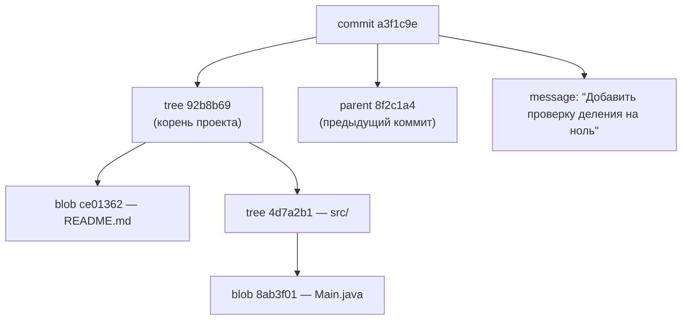
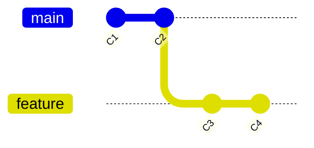
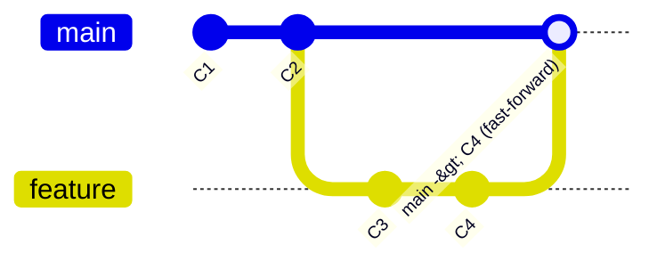
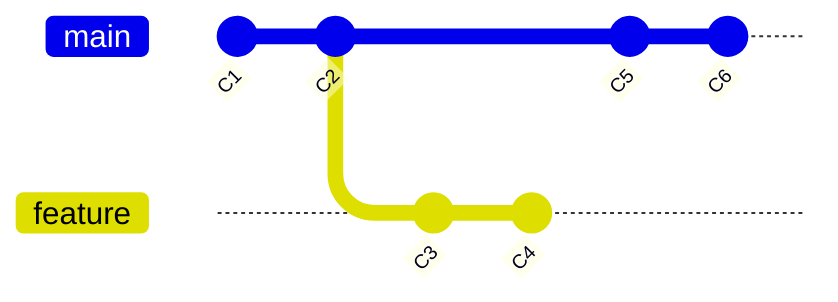
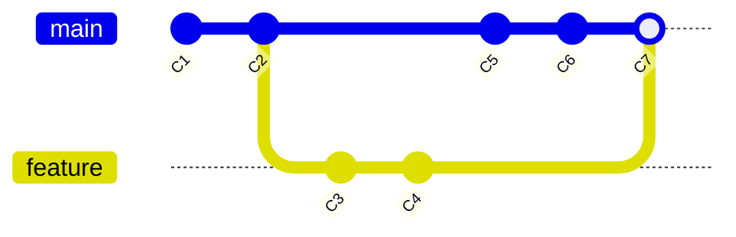
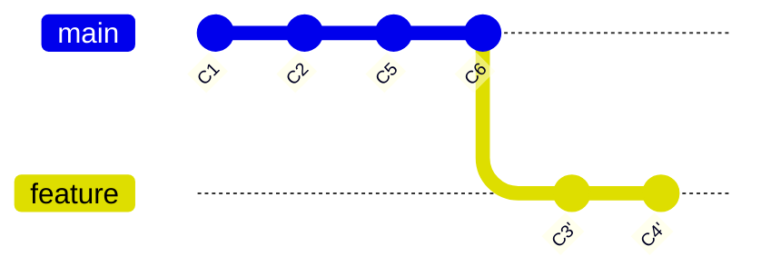
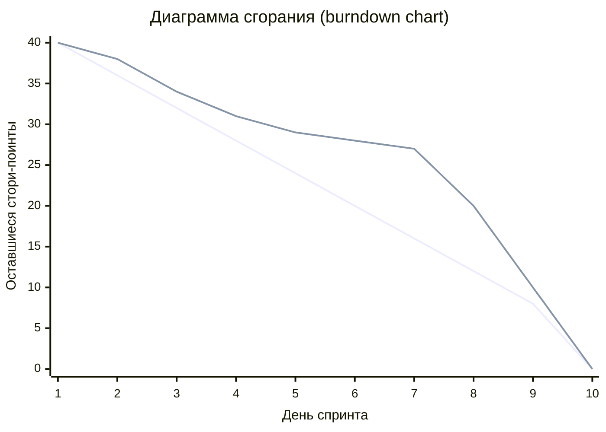

# Лекция 12: Системы контроля версий и процессы разработки

## Введение

Добро пожаловать на двенадцатую лекцию курса «Современные технологии программирования». За предыдущие занятия вы научились писать код: от первых классов и коллекций до Spring Boot-приложений с базой данных, REST API и тестами. Всё это время мы смотрели на программу как на текст, который лежит в папке на вашем компьютере. Сегодня посмотрим иначе — как на продукт, который делает команда, который меняется каждый день и который нужно доводить до пользователя без потерь.

Вспомните, как вы писали курсовую. Сначала появился файл `kursovaya.docx`, потом `kursovaya_v2.docx`, потом `kursovaya_final.docx`, `kursovaya_final_ispravlennaya.docx` и, разумеется, `kursovaya_final_final_TOCHNO_POSLEDNYAYA.docx`. А когда научный руководитель попросил вернуть абзац, удалённый три дня назад, выяснилось, что его больше нет нигде. Теперь представьте, что так работают пять человек над проектом из трёхсот файлов. Именно эту боль снимает система контроля версий.

Сегодня разберём три связанные вещи: **Git** — распределённую систему контроля версий, ставшую стандартом индустрии; **CI/CD** — автоматические конвейеры, которые собирают и проверяют код после каждого изменения; **Agile и Scrum** — правила, по которым команда планирует работу и превращает идеи в готовый продукт. Темы неразделимы: Git даёт технику совместной работы, CI/CD — автоматизацию проверок, Scrum — организацию людей вокруг всего этого.

---

## Часть 1: Зачем нужна система контроля версий

### 1.1 Жизнь без контроля версий

Без специального инструмента разработчик решает задачу «сохранить историю» вручную и всегда одинаково плохо: копии папок с датами в названии, никакой информации о том, что и зачем менялось, обмен архивами через мессенджер, потерянные правки, откат «по памяти».

**Система контроля версий (Version Control System, VCS)** — программа, которая хранит полную историю изменений набора файлов, позволяет вернуться к любому прошлому состоянию, сравнить состояния между собой и объединить работу нескольких людей.

| Возможность | Что это значит на практике |
|-------------|----------------------------|
| История изменений | Видно, кто, когда и зачем изменил каждую строку |
| Откат | Любое прошлое состояние проекта восстанавливается одной командой |
| Ветвление | Новая функция разрабатывается отдельно и не ломает рабочую версию |
| Слияние | Работа нескольких человек объединяется автоматически |
| Основа автоматизации | CI/CD, код-ревью и релизы строятся поверх VCS |
| Резервная копия | Полная копия истории есть у каждого участника и на сервере |

### 1.2 Централизованные и распределённые системы

**Централизованные (CVCS)** — CVS, Subversion (SVN), Perforce. Всю историю хранит единственный сервер, у разработчика на диске только рабочая копия последней версии.

**Распределённые (DVCS)** — Git, Mercurial. У каждого разработчика полная копия репозитория со всей историей. Сервер нужен только для обмена изменениями.

Аналогия: централизованная система — библиотека с единственным экземпляром книги. Чтобы прочитать главу, нужно прийти в библиотеку; сгорела библиотека — книги больше нет. Распределённая система — это когда у каждого читателя дома полная копия всей библиотеки. Читать и делать пометки можно без интернета, а если сервер сгорит, восстановить всё можно с любого рабочего ноутбука.

| Критерий | Централизованная (SVN) | Распределённая (Git) |
|----------|------------------------|----------------------|
| Где хранится история | Только на сервере | Полностью у каждого участника |
| Работа без сети | Почти невозможна | Полноценная, кроме обмена с сервером |
| Скорость операций | Зависит от сети | Локальные операции мгновенные |
| Коммит | Сразу виден всем | Сначала локальный, потом `push` |
| Ветвление | Сама ветка создаётся быстро (`svn copy`), но переключение рабочей копии и слияние идут через сервер | Дешёвая операция, указатель на коммит, и создание, и переключение, и слияние — локально |
| Отказ сервера | Работа останавливается | Работа продолжается локально |

Именно дешёвое ветвление сделало Git стандартом. Дело не в одном лишь создании ветки — в Git мгновенны и переключение между ветками, и слияние, потому что всё это происходит на вашем диске без единого обращения к серверу. Если ветка стоит доли секунды и ничем не мешает соседу, её заводят под каждую задачу — и это меняет весь процесс разработки.

### 1.3 Немного о Git

Git создал Линус Торвальдс в 2005 году для разработки ядра Linux. Требования были жёсткие: скорость, надёжность (история не должна незаметно испортиться) и полная поддержка нелинейной разработки с тысячами параллельных веток. Сегодня на Git построены GitHub, GitLab, Bitbucket и отечественные платформы. Материалы этого курса тоже лежат в Git-репозитории, и примеры кода вы скачиваете именно оттуда.

Первичная настройка выполняется один раз после установки:

```bash
git config --global user.name "Ivan Ivanov"          # попадёт в каждый ваш коммит
git config --global user.email "ivan@example.com"
git config --global init.defaultBranch main          # имя ветки по умолчанию
git config --list                                    # проверить результат
```

Отдельная деталь, о которой часто забывают, — окончания строк. Windows исторически завершает каждую строку файла парой символов CRLF («возврат каретки» плюс «перевод строки»), а Linux и macOS — одним символом LF. Если в команде часть разработчиков работает на Windows, а часть — на Linux, и никто не настроил эту опцию, один и тот же файл после переноса между системами превращается в diff, где «изменённой» помечена буквально каждая строка, хотя по смыслу не поменялось ни одной, — это захламляет `git blame` и превращает обычное слияние в источник ложных конфликтов. Настройка `core.autocrlf` решает проблему автоматической конвертацией при извлечении (checkout) и сохранении (commit) файла: на Windows её ставят в `true` (в репозитории хранится LF, на диске автоматически появляется CRLF и обратно), а на Linux и macOS — в `input` (Git не трогает файл при выгрузке, но убирает случайно попавший CRLF перед коммитом). Более надёжная альтернатива, не зависящая от того, настроил ли каждый участник команды эту опцию у себя, — завести в самом репозитории файл `.gitattributes` со строкой `* text=auto`: тогда правило одинаково действует для всех, кто клонирует проект.

---

## Часть 2: Модель данных Git

Большинство «магических» проблем Git перестают быть магическими, как только вы представляете его модель данных.

### 2.1 Снимки, а не разницы

Старые системы хранят историю как список правок. Git устроен иначе: **каждый коммит — это снимок (snapshot) всего проекта целиком**.

Аналогия: обычная система ведёт дневник ремонта («в понедельник переклеили обои, во вторник поменяли розетку»). Git каждый день фотографирует всю квартиру. Если комната не менялась, Git не хранит её копию заново — он ссылается на предыдущую фотографию этой комнаты, поэтому снимки не раздувают репозиторий.

Практическое следствие: восстановление версии — это не «применить 400 правок подряд», а «взять готовый снимок». Отсюда скорость переключения между ветками.

### 2.2 Четыре типа объектов

| Объект | Что хранит |
|--------|------------|
| **blob** | Содержимое одного файла (без имени и прав доступа) |
| **tree** | Каталог: список имён с указанием, какой blob или tree им соответствует |
| **commit** | Ссылка на корневой tree, ссылки на родительские коммиты, автор, дата, сообщение |
| **tag** | Аннотированная метка: ссылка на объект, автор, сообщение, подпись |



Имя файла хранится не в blob, а в tree. Поэтому два одинаковых по содержимому файла с разными именами — это один blob и две записи в дереве.

Посмотреть на объекты можно напрямую:

```bash
git cat-file -t HEAD              # тип объекта: commit
git cat-file -p HEAD              # содержимое в читаемом виде
git ls-tree HEAD                  # дерево последнего коммита
echo "hello" | git hash-object --stdin
# ce013625030ba8dba906f756967f9e9ca394464a
```

### 2.3 Хеши: SHA-1 и SHA-256

Имя каждого объекта — криптографический хеш его содержимого. Исторически Git использует **SHA-1** (40 шестнадцатеричных символов). Хеш работает как отпечаток пальца: одинаковое содержимое всегда даёт один и тот же хеш, изменение одного байта даёт совершенно другой.

Отсюда два свойства. **Целостность:** хеш коммита считается в том числе от хеша родителя, поэтому изменить старый коммит незаметно нельзя — поменяются хеши всех последующих. **Идентичность:** один и тот же коммит на вашей машине и на сервере имеет один идентификатор, централизованная нумерация не нужна. В командах хеш почти всегда можно сокращать до 7–8 символов: `git show a3f1c9e`.

Из-за накопившихся к SHA-1 криптографических претензий в Git добавлена поддержка **SHA-256** (`git init --object-format=sha256`). На практике такие репозитории пока редки: они несовместимы с SHA-1-репозиториями, и хостинги поддерживают их ограниченно.

### 2.4 Ссылки, ветки и HEAD

Поверх объектов Git держит **ссылки (refs)** — текстовые файлы в `.git/refs` с хешем коммита внутри.

- **Ветка** — ссылка на коммит, которая автоматически сдвигается вперёд при каждом новом коммите. Технически `main` — это файл `.git/refs/heads/main` с сорока символами внутри.
- **HEAD** — специальная ссылка «где я сейчас». Обычно указывает не на коммит, а на ветку: `ref: refs/heads/main`.
- **Отсоединённый HEAD (detached HEAD)** — состояние, когда HEAD указывает прямо на коммит, минуя ветку. Возникает после `git checkout <хеш>`. Коммиты в этом состоянии не принадлежат ни одной ветке и могут потеряться, но восстанавливаются через `reflog` (Часть 7).

Запомните формулу: **коммит — снимок, ветка — подвижный указатель на коммит, HEAD — указатель на текущую ветку**. Почти все операции Git — это перемещение указателей.

---

## Часть 3: Три состояния файла и базовые команды

### 3.1 Рабочий каталог, индекс и репозиторий

Ключевая идея, которую нужно освоить в первую очередь: файл в Git живёт в трёх областях.


Аналогия с супермаркетом. Рабочий каталог — торговый зал: вы берёте товары с полок, кладёте обратно, передумываете. Индекс — лента у кассы: вы выкладываете на неё только то, что действительно собираетесь купить, и можете что-то снять. Коммит — пробитый чек: покупка зафиксирована, чек с датой и списком лёг в историю.

Именно индекс отличает Git от многих других систем. Он позволяет собрать аккуратный коммит из части изменений: вы поправили десять файлов, но в один коммит кладёте три относящихся к исправлению ошибки, а остальные — в следующий.

| Состояние файла | Описание |
|-----------------|----------|
| Неотслеживаемый (untracked) | Git о нём ничего не знает |
| Изменённый (modified) | Изменён в рабочем каталоге, но не добавлен в индекс |
| Подготовленный (staged) | Добавлен в индекс, ждёт коммита |
| Зафиксированный (committed) | Сохранён в базе объектов |

### 3.2 Создание репозитория и первые коммиты

```bash
git init -b main my-project     # новый репозиторий с веткой main
git clone <url>                 # копия существующего репозитория со всей историей

git status                      # что сейчас происходит
git status --short              # компактный вывод: M, A, ??

git add Calculator.java         # подготовить конкретный файл
git add .                       # всё в текущем каталоге и ниже
git add -p                      # интерактивно, по кускам (hunks)

git commit -m "Добавить проверку деления на ноль"
git commit -am "Поправить форматирование"   # add + commit для отслеживаемых файлов
git commit --amend                          # исправить последний коммит
```

`git clone` — это не «скачать файлы»: он скачивает всю базу объектов, создаёт локальную ветку, привязывает её к серверной и выкладывает рабочую копию на диск.

`git add -p` показывает изменения кусками и спрашивает по каждому, включать его в коммит. Это лучший способ не утащить в коммит отладочный `System.out.println`, забытый в соседнем методе.

`git commit --amend` **переписывает** последний коммит: у него меняется хеш. Пока коммит не отправлен на сервер — безопасно и удобно. После отправки — это переписывание опубликованной истории со всеми последствиями (Часть 6).

### 3.3 Как писать сообщения коммитов

Сообщение коммита — письмо в будущее: себе через полгода и коллеге, который будет разбираться, почему строка выглядит именно так.

- Первая строка — до 50–72 символов: `Исправить NPE при пустом списке студентов`.
- Дальше, после пустой строки, — **почему** сделано так (что именно поменялось, видно из диффа).
- Один коммит — одно логическое изменение. «Поправил тесты, переименовал переменные и добавил фичу» — это три коммита.

Распространённое соглашение — **Conventional Commits**, которое легко читается и человеком, и автоматикой (по нему генерируют список изменений релиза и номер версии):

```text
feat: добавить эндпоинт поиска книг по автору
fix: устранить деление на ноль в CalculatorService
docs: описать запуск проекта в README
test: добавить тесты граничных значений
refactor: вынести валидацию в отдельный класс
```

### 3.4 Просмотр истории: log, diff, show

```bash
git log --oneline                          # по одной строке на коммит
git log --oneline --graph --all --decorate # наглядная картинка ветвлений
git log -5 --stat                          # последние 5 коммитов со статистикой
git log --author="Ivan" --since="2026-03-01" --grep="fix"

git diff                    # рабочий каталог против индекса
git diff --staged           # индекс против последнего коммита
git diff main..feature      # разница между ветками
git show a3f1c9e            # содержимое конкретного коммита
git blame Calculator.java   # кто и в каком коммите написал каждую строку
```

Типичный вывод `git log --oneline --graph`:

```text
*   9c4e1a2 (HEAD -> main) Слияние ветки feature/search
|\
| * 71ba9f3 (feature/search) Добавить поиск по автору
| * 5e0c2d8 Добавить индекс по полю author
* | 3d7f4b1 Поправить README
|/
* 8f2c1a4 Начальная версия проекта
```

`git blame` — не про поиск виноватых, а про поиск контекста: он показывает хеш коммита для каждой строки, а по хешу вы читаете сообщение и понимаете, зачем строка появилась.

### 3.5 Файл .gitignore

В репозиторий попадает только исходный код и то, что нельзя сгенерировать. Скомпилированные классы, JAR-файлы, настройки IDE и тем более пароли в репозитории не нужны. Список исключений задаёт файл `.gitignore` в корне проекта:

```text
# Результаты сборки
target/
build/
*.class
*.jar

# Настройки IDE
.idea/
*.iml
.vscode/

# Логи и временные файлы
*.log
.DS_Store

# Локальные настройки и секреты — в репозиторий не попадают никогда
application-local.properties
.env
```

Нюансы: `.gitignore` действует только на **неотслеживаемые** файлы — если файл уже в индексе, правило его не выкинет (`git rm --cached application-local.properties` уберёт из-под контроля версий, оставив на диске). Сам `.gitignore` коммитится: правила общие для команды. Личные исключения кладут в `.git/info/exclude`. Готовые шаблоны для Java, Maven, Gradle и IntelliJ IDEA есть в открытом наборе github/gitignore.

**Пароль, попавший в коммит, считается скомпрометированным навсегда** — даже если удалить его следующим коммитом, он останется в истории. Правильная реакция: сменить пароль или ключ, и только потом чистить историю.

### 3.6 Отмена изменений: restore, reset, revert

Место, где студенты чаще всего теряются.

```bash
git restore --staged Calculator.java     # убрать из индекса, правки сохранить
git restore Calculator.java              # выбросить правки в файле (необратимо!)
git restore --source=8f2c1a4 Calculator.java   # вернуть версию из коммита
```

`git reset` двигает указатель текущей ветки и, в зависимости от режима, трогает индекс и рабочий каталог:

| Команда | Указатель ветки | Индекс | Рабочий каталог | Когда применять |
|---------|-----------------|--------|-----------------|-----------------|
| `git reset --soft HEAD~1` | сдвигается назад | не тронут | не тронут | Переделать последний коммит, изменения остаются подготовленными |
| `git reset --mixed HEAD~1` (по умолчанию) | сдвигается назад | сброшен | не тронут | Разложить последний коммит на несколько |
| `git reset --hard HEAD~1` | сдвигается назад | сброшен | **перезаписан** | Полностью выбросить последний коммит вместе с изменениями |

`git reset --hard` — единственная по-настоящему опасная команда из списка: незакоммиченные правки она уничтожает без вопросов, и `reflog` их не вернёт (он помнит коммиты, а не правки).

`git revert a3f1c9e` решает ту же задачу иначе: он ничего не удаляет, а создаёт **новый** коммит с обратными изменениями. Отсюда правило:

> **Историю, которую видели другие, отменяют через `revert`. `reset` применяют только к своим локальным коммитам, которых ещё нет на сервере.**

---

## Часть 4: Ветвление и слияние

### 4.1 Ветка — это указатель

Ветка в Git — файл с хешем коммита. Создание ветки не копирует ни одного файла проекта, поэтому операция мгновенная независимо от размера репозитория.

Аналогия: ветка — закладка в книге. Закладок можно положить сколько угодно, толщину книги это не увеличит; переключиться на другую закладку — значит открыть книгу на другой странице.

Смысл ветки в процессе разработки — изоляция. Пока вы делаете поиск по автору в ветке `feature/search`, ветка `main` остаётся рабочей и пригодной для выпуска. Если завтра понадобится срочно исправить критическую ошибку, вы сделаете это в отдельной ветке от `main`, не задев незавершённый поиск.

```bash
git branch                     # список локальных веток
git branch -a                  # включая серверные
git switch -c feature/search   # создать и переключиться
git switch main                # переключиться на существующую
git switch -                   # вернуться на предыдущую
git branch -m feature/book-search   # переименовать текущую
git branch -d feature/search        # удалить слитую ветку
git branch -D feature/experiment    # удалить принудительно
```

Исторически для переключения использовалась `git checkout`, которая делает слишком много разного сразу. С версии 2.23 её разделили: `git switch` переключает ветки, `git restore` восстанавливает файлы. `checkout` продолжает работать, и вы встретите её в старых инструкциях, но в новом коде лучше использовать `switch` и `restore`.

Соглашение об именах веток экономит время всей команде: `feature/book-search`, `bugfix/npe-in-search`, `hotfix/login-500`, `release/1.4.0`, `docs/readme-setup`.

### 4.2 Быстрая перемотка (fast-forward)

Простейший случай слияния: вы создали ветку от `main`, сделали два коммита, а `main` за это время не менялась.

До слияния — `feature` ушла вперёд, `main` стоит на месте:



После слияния — Git просто передвинул указатель `main` на `C4`, новый коммит не создан:



Git видит прямой путь вперёд и просто **перемещает указатель** `main` на `C4`, не создавая нового коммита:

```bash
git switch main
git merge feature
# Updating 8f2c1a4..71ba9f3
# Fast-forward
```

Это и есть **быстрая перемотка (fast-forward)**. История остаётся линейной, но сам факт существования отдельной ветки из неё исчезает. Если факт важно сохранить, слияние делают с запретом перемотки — `git merge --no-ff feature`. Многие команды поступают так всегда: каждая задача видна в истории отдельным «пузырём».

### 4.3 Трёхстороннее слияние (three-way merge)

Реальная ситуация: пока вы делали `feature`, в `main` тоже появились коммиты.



Прямого пути вперёд нет, перемотать указатель невозможно. Git выполняет **трёхстороннее слияние**: берёт три снимка — вершину `main` (C6), вершину `feature` (C4) и их **общего предка** (C2, база слияния) — и сравнивает их.

Логика простая: если файл изменился только в одной ветке относительно базы, берётся изменённая версия; если в обеих, но в разных местах — изменения объединяются; если изменились одни и те же строки — возникает конфликт. Результатом становится **коммит слияния (merge commit)** с двумя родителями:



### 4.4 Конфликты слияния

**Конфликт** возникает, когда две ветки изменили одни и те же строки одного файла и Git не может решить за вас, чей вариант правильный. Это не поломка, а нормальная ситуация, требующая участия человека.

Аналогия: два повара независимо дописали рецепт супа. Один в одной и той же строке написал «варить 20 минут», другой — «варить 40 минут». Автоматика не знает, какой суп вы хотите. Решать должен человек, который понимает блюдо.

```bash
$ git merge feature/search
Auto-merging src/main/java/ru/fa/library/BookService.java
CONFLICT (content): Merge conflict in src/main/java/ru/fa/library/BookService.java
Automatic merge failed; fix conflicts and then commit the result.
```

Git оставляет файл с **маркерами конфликта**:

```java
public List<Book> findBooks(String query) {
<<<<<<< HEAD
    // Вариант из ветки main: поиск только по названию
    return repository.findByTitleContainingIgnoreCase(query);
=======
    // Вариант из ветки feature/search: поиск по названию и автору
    return repository.findByTitleOrAuthor(query, query);
>>>>>>> feature/search
}
```

| Маркер | Значение |
|--------|----------|
| `<<<<<<< HEAD` | Начало версии из текущей ветки (в которую сливаем) |
| `=======` | Граница между версиями |
| `>>>>>>> feature/search` | Конец версии из ветки, которую сливаем |

#### Пошаговое разрешение конфликта

**Шаг 1. Понять масштаб.**

```bash
git status                    # список конфликтующих файлов
git diff                      # показать конфликтующие участки
git log --merge --oneline     # коммиты, приведшие к конфликту
```

**Шаг 2. Открыть файл и принять решение.** Вариантов четыре: оставить версию из `HEAD`, оставить версию из сливаемой ветки, объединить обе вручную или написать третий, правильный вариант. Чаще всего нужен именно третий:

```java
public List<Book> findBooks(String query) {
    // Итоговое решение: ищем и по названию, и по автору, без учёта регистра
    return repository.findByTitleOrAuthorIgnoreCase(query, query);
}
```

**Шаг 3. Убрать все маркеры.** В файле не должно остаться ни одного `<<<<<<<`, `=======` или `>>>>>>>`. Забытый маркер — гарантированная ошибка компиляции, и хорошо, если её поймает компилятор, а не пользователь.

**Шаг 4. Проверить, что код работает.** Скомпилировать и прогнать тесты: механически «склеенный» код часто компилируется, но делает не то.

**Шаг 5. Пометить конфликт разрешённым и завершить слияние.**

```bash
git add src/main/java/ru/fa/library/BookService.java
git commit          # Git сам подставит сообщение о слиянии
```

Если всё пошло не так, слияние отменяется целиком: `git merge --abort` возвращает состояние до него.

Полезные команды при конфликтах:

```bash
git checkout --ours   BookService.java   # взять целиком версию текущей ветки
git checkout --theirs BookService.java   # взять целиком версию сливаемой ветки
git config --global merge.conflictstyle diff3   # показывать ещё и версию предка
git mergetool                                   # графический инструмент слияния
```

Почти любая IDE показывает конфликт тремя панелями — «ваша версия», «их версия», «результат». Разрешать конфликты в IDE быстрее и безопаснее, чем в блокноте.

**Как конфликтовать реже:** делайте маленькие задачи и короткоживущие ветки (ветка, живущая месяц, гарантированно принесёт болезненное слияние); регулярно подтягивайте изменения из основной ветки; договоритесь о форматировании кода — половина конфликтов в реальных проектах это войны табов, пробелов и переносов строк; не переформатируйте файл целиком в том же коммите, где меняете логику.

---

## Часть 5: Удалённые репозитории и код-ревью

### 5.1 Что такое remote

**Удалённый репозиторий (remote)** — другая копия того же репозитория, обычно на сервере. Git хранит для неё короткое имя; имя по умолчанию — `origin`.

Аналогия: у каждого разработчика дома полная мастерская, а `origin` — общий склад, куда все свозят готовые детали и откуда забирают чужие. Склад ничем принципиально не отличается от вашей мастерской, он просто общий по договорённости.

```bash
git remote -v                                   # какие remote привязаны
git remote add origin https://github.com/user/project.git
git remote set-url origin git@github.com:user/project.git
```

### 5.2 fetch, pull, push

```bash
git fetch origin          # скачать изменения, НЕ трогая рабочие файлы
git pull origin main      # скачать и сразу слить в текущую ветку

git push origin main                  # отправить коммиты
git push -u origin feature/search     # первая отправка новой ветки со связью
git push origin --delete feature/search
```

Разница между `fetch` и `pull` принципиальна. `fetch` обновляет ваши знания о сервере: появляются ветки вида `origin/main`, вы смотрите, что изменилось, и решаете, что делать. Рабочий каталог не меняется. `pull` — это `fetch` плюс `merge` одной командой: удобно, но слияние произойдёт автоматически и конфликт свалится на вас в неподходящий момент. Безопасный порядок:

```bash
git fetch origin
git log --oneline HEAD..origin/main   # что нового на сервере
git merge origin/main                 # сливаем осознанно
```

**Отслеживаемая ветка (tracking branch)** — локальная ветка, связанная с серверной. Благодаря этой связи `git status` пишет «ваша ветка опережает origin/main на 2 коммита», а `push` и `pull` работают без аргументов. Флаг `-u` (`--set-upstream`) эту связь и устанавливает.

Если `git push` отклонён с `rejected — non-fast-forward`, значит на сервере есть коммиты, которых нет у вас. Правильное решение — забрать их и отправить снова. Неправильное — `git push --force`, затирающий чужие коммиты. Если принудительная отправка действительно нужна (например, после rebase личной ветки), используйте `git push --force-with-lease`: он откажется затирать, если на сервере появилось что-то, чего вы не видели.

### 5.3 Pull request и merge request

Прямая запись в основную ветку в командах почти всегда запрещена. Вместо неё используется механизм предложения изменений: на GitHub это **pull request (PR)**, на GitLab — **merge request (MR)**. Суть одинаковая.

Аналогия: вы не вклеиваете свою главу в общую монографию сами. Вы приносите её редактору, он и другие авторы читают, оставляют замечания на полях, вы правите — и только потом глава попадает в книгу.

Типичный жизненный цикл задачи:

```bash
git switch main && git pull origin main    # 1. обновить основную ветку
git switch -c feature/book-search          # 2. создать ветку под задачу
# 3. работать: писать код, добавлять файлы и делать коммиты
git add .
git commit -m "feat: добавить поиск книг по автору"
git push -u origin feature/book-search     # 4. отправить ветку на сервер
# 5. открыть pull request в веб-интерфейсе: из feature/book-search в main
# 6. дождаться зелёного конвейера CI и одобрения ревьюеров, внести правки
git switch main && git pull origin main    # 7. после слияния обновиться
git branch -d feature/book-search          #    и удалить ветку
```

Хорошее описание pull request содержит: что сделано, зачем, ссылку на задачу в трекере, как проверить результат и — если менялся интерфейс — скриншот. Ревьюеру не должно приходиться догадываться.

### 5.4 Код-ревью как процесс

**Код-ревью (code review)** — обязательный просмотр изменений другим разработчиком до попадания кода в основную ветку. Его цели по убыванию важности: найти ошибки до продуктива; распространить знание о системе; поддержать единый стиль и архитектурные договорённости; научить обе стороны.

Как ревьюер: комментируйте код, а не человека («здесь возможен `NullPointerException`, если список пуст» вместо «ты опять не подумал»); разделяйте обязательное и желательное — пометка «необязательно» экономит часы споров; проверяйте не только «работает ли», но и «понятно ли»: имена, границы ответственности, тесты, обработку ошибок.

Как автор: делайте маленькие pull request — изменение на 200 строк получит осмысленное ревью, изменение на 3000 строк получит комментарий «выглядит нормально»; не воспринимайте замечания как личную оценку; отвечайте на каждый комментарий — исправил, объяснил или вынес в отдельную задачу.

Механические проверки (форматирование, стиль, компиляция, тесты) должны выполняться автоматически в CI, а не человеком: ревьюер — слишком дорогой линтер.

### 5.5 Форк

Если прав на запись в репозиторий нет (типичная ситуация в открытых проектах), используется **форк (fork)** — собственная копия чужого репозитория на сервере:

```bash
# 1. Нажать Fork в веб-интерфейсе, 2. клонировать СВОЮ копию
git clone https://github.com/ваш-логин/project.git
cd project
# 3. Добавить оригинал вторым remote, чтобы забирать обновления
git remote add upstream https://github.com/original-owner/project.git
git fetch upstream
git switch main && git merge upstream/main
# 4. Работать в ветке и открывать pull request в оригинальный репозиторий
```

---

## Часть 6: rebase против merge

### 6.1 Что делает rebase

**Rebase (перебазирование)** переносит коммиты вашей ветки так, будто вы начали работу не от старой точки, а от актуальной вершины основной ветки.

Было:


После `git switch feature && git rebase main` — коммиты `feature` переписаны поверх актуальной вершины `main`:



Обратите внимание на штрихи: `C3'` и `C4'` — это **новые коммиты** с другими хешами. Содержательно изменения те же, но родитель другой, значит и хеш другой. Старые `C3` и `C4` какое-то время остаются в базе объектов, но ни одна ветка на них уже не указывает.

Аналогия: merge — вклеить в тетрадь дополнительный лист с пометкой «здесь сошлись два черновика». Rebase — переписать свои страницы набело сразу после последней страницы соседа, чтобы тетрадь читалась подряд. Аккуратнее, но переписанные страницы уже не те, что были.

```bash
git switch feature/search
git rebase main
# при конфликте: исправить файлы, затем
git add <файлы> && git rebase --continue
git rebase --abort            # отказаться от всей операции
```

### 6.2 Сравнение

Оба инструмента решают одну задачу — соединить историю двух веток, — но платят за это по-разному:

| Критерий | `git merge` | `git rebase` |
|----------|-------------|--------------|
| История | Нелинейная, сохраняет реальный ход событий | Линейная, «как будто всё писалось по порядку» |
| Хеши коммитов | Не меняются | Меняются (создаются новые коммиты) |
| Дополнительный коммит | Создаётся коммит слияния | Не создаётся |
| Читаемость `git log` | Много ветвлений и пузырей | Прямая линия, легко читать |
| Безопасность | Безопасен всегда | Опасен для опубликованных веток |
| Разрешение конфликтов | Один раз, в момент слияния | Возможно, на каждом переносимом коммите |
| Отладка через `bisect` | Сложнее из-за ветвлений | Проще на линейной истории |

### 6.3 Золотое правило rebase

> **Никогда не перебазируйте ветку, которую видели другие.**

Причина: rebase создаёт новые коммиты вместо старых. Если ваша ветка уже на сервере и коллега на неё переключился, после вашего `push --force` его история и ваша разойдутся: он получит конфликты в коммитах, которых не писал.

Практический вывод: **своя личная ветка, которую никто не забирал** — rebase можно и полезно; **общая ветка** (`main`, `develop`, релизная) — только merge; **ветка в открытом pull request, по которой уже идёт ревью** — лучше merge, иначе комментарии ревьюера «повиснут» на исчезнувших коммитах.

### 6.4 Интерактивный rebase

Реальная история личной ветки редко выглядит красиво:

```text
71ba9f3 доделал
5e0c2d8 фикс
3d7f4b1 ещё раз фикс
8f2c1a4 добавил поиск по автору
```

Перед открытием pull request такую историю приводят в порядок: `git rebase -i HEAD~4` открывает редактор со списком коммитов (от старых к новым):

```text
pick   8f2c1a4 добавил поиск по автору
squash 3d7f4b1 ещё раз фикс
squash 5e0c2d8 фикс
reword 71ba9f3 доделал
```

| Команда | Сокращение | Действие |
|---------|------------|----------|
| `pick` | `p` | Оставить коммит как есть |
| `reword` | `r` | Оставить изменения, изменить сообщение |
| `edit` | `e` | Остановиться на коммите, чтобы изменить его содержимое |
| `squash` | `s` | Объединить с предыдущим, сообщения объединить вручную |
| `fixup` | `f` | Объединить с предыдущим, своё сообщение выбросить |
| `drop` | `d` | Удалить коммит целиком |

Изменение порядка строк меняет порядок коммитов. Разберём наш список: две строки `squash` вливаются в стоящий выше `pick` и дают один коммит, а `reword` оставляет последний коммит отдельным и лишь просит новое сообщение для него. Значит, из четырёх коммитов останется два — аккуратная история вместо четырёх «фиксов»:

```text
c30d5e1 feat: показать результаты поиска в LibraryApp
a91c7f2 feat: добавить поиск книг по автору и названию
```

Если бы в последней строке вместо `reword` стоял `squash`, остался бы один коммит. Выбор простой: `squash` и `fixup` — когда правки бессмысленны по отдельности, `reword` — когда коммит самостоятелен, но назван плохо.

Если такая ветка уже была отправлена на сервер, потребуется `git push --force-with-lease` — и это ровно тот случай, когда переписывание допустимо: ветка личная, ревью ещё не начиналось.

### 6.5 pull --rebase

По умолчанию `git pull` делает merge и при каждом расхождении создаёт лишний коммит «Merge branch 'main' of ...», который засоряет историю и ничего не сообщает. Альтернатива — забрать изменения и перебазировать свои локальные коммиты поверх них:

```bash
git pull --rebase
git config --global pull.rebase true   # сделать поведением по умолчанию
```

Это безопасно: перебазируются только ваши локальные коммиты, которых ещё нет на сервере.

---

## Часть 7: Инструменты на каждый день

### 7.1 stash — отложить работу

Ситуация: вы посреди задачи, код не компилируется, и тут просят срочно посмотреть ошибку в другой ветке. Коммитить сломанное не хочется, терять — тем более.

Аналогия: смахнуть недоделанные бумаги со стола в верхний ящик, разобраться со срочным делом и достать бумаги обратно ровно в том виде, в каком они были.

```bash
git stash push -m "недоделанный поиск"   # спрятать правки рабочего каталога
git stash push -u -m "черновик"          # вместе с новыми файлами
git stash list                           # что лежит в ящике
git stash pop                            # достать последнее и удалить из списка
git stash apply stash@{0}                # достать, оставив в списке
git stash drop stash@{0}                 # выбросить
```

### 7.2 tag — метки версий

**Тег (tag)** — неподвижная метка на конкретном коммите, используется для версий релизов.

```bash
git tag v1.0.0                                    # легковесный тег
git tag -a v1.0.0 -m "Первый релиз библиотеки"    # аннотированный — для релизов
git tag -a v0.9.0 8f2c1a4 -m "Бета-версия"        # тег на давний коммит
git show v1.0.0
git push origin v1.0.0        # теги не отправляются автоматически!
git push origin --tags
```

Для релизов всегда используйте аннотированные теги: по ним видно, кто и когда выпустил версию. Имена обычно следуют **семантическому версионированию (SemVer)**: `МАЖОРНАЯ.МИНОРНАЯ.ПАТЧ` — мажорная меняется при несовместимых изменениях, минорная при добавлении совместимой функциональности, патч при исправлениях.

### 7.3 cherry-pick — перенести отдельный коммит

Классический случай: исправление сделали в ветке разработки, а оно срочно нужно в ветке релиза.

```bash
git switch release/1.4
git cherry-pick a3f1c9e            # перенести один коммит
git cherry-pick a3f1c9e..71ba9f3   # диапазон (не включая первый)
git cherry-pick -x a3f1c9e         # добавить в сообщение ссылку на исходный коммит
git cherry-pick --continue         # после разрешения конфликта
git cherry-pick --abort
```

`cherry-pick` создаёт **новый** коммит с новым хешем. Если потом слить ветки целиком, Git обычно разберётся, но дублирующиеся изменения — известный источник путаницы. Не превращайте cherry-pick в основной способ переноса кода.

### 7.4 reflog — восстановление потерянного

Самая успокаивающая команда в Git. **Reflog** — журнал всех перемещений HEAD и веток в вашем локальном репозитории: коммиты, переключения, слияния, reset, rebase. Аналогия: корзина в операционной системе — пока её не очистили, удалённое можно достать.

```bash
git reflog
```

```text
9c4e1a2 (HEAD -> main) HEAD@{0}: reset: moving to HEAD~2
71ba9f3 HEAD@{1}: commit: Добавить поиск по автору
5e0c2d8 HEAD@{2}: commit: Добавить индекс по полю author
3d7f4b1 HEAD@{3}: checkout: moving from main to feature/search
```

```bash
git reset --hard HEAD@{1}                  # вернуть ветку до неудачного reset
git branch feature/restored 71ba9f3        # восстановить удалённую ветку
git reset --hard ORIG_HEAD                 # отменить неудачный rebase
```

Два ограничения: reflog локальный (на другой машине его нет) и записи в нём живут ограниченное время (по умолчанию 90 дней для достижимых коммитов и 30 для недостижимых). Но в первые дни после ошибки reflog спасает почти всегда.

### 7.5 bisect — двоичный поиск ошибки

Ошибка появилась где-то за последние 300 коммитов, и никто не знает, где. Проверять подряд — 300 проверок. **`git bisect`** ищет двоичным поиском: около 8–9 проверок вместо 300. Аналогия: игра «угадай число от 1 до 1000 за 10 вопросов», где каждый вопрос отбрасывает половину вариантов.

```bash
git bisect start
git bisect bad              # текущее состояние — плохое (ошибка есть)
git bisect good v1.0.0      # коммит или тег, где всё точно работало
# Git переключает вас на середину диапазона; проверяете и отвечаете:
git bisect good             # ошибки нет
git bisect bad              # ошибка есть
# ... пока Git не скажет: a3f1c9e is the first bad commit
git bisect reset            # вернуться в исходное состояние
```

Настоящая сила `bisect` — в автоматическом режиме. Если есть тест, падающий при наличии ошибки, поиск выполняется полностью автоматически:

```bash
git bisect start HEAD v1.0.0
git bisect run mvn -q -Dtest=BookSearchTest test
```

Git сам прогонит сборку на каждом шаге и назовёт виновный коммит; критерий — код возврата команды (0 — «хорошо», иначе «плохо»). Особый случай — код 125: он означает «коммит проверить невозможно» (например, проект на нём не собирается), и Git пропускает такой коммит, не объявляя его ни хорошим, ни плохим. Это ещё один аргумент за маленькие коммиты: `bisect` укажет на коммит, и хорошо, если в нём 30 строк, а не 3000.

### 7.6 Git LFS — большие файлы

Git плохо приспособлен к большим бинарным файлам: он хранит каждую версию целиком, сжать их не может, а слить два бинарных файла невозможно в принципе. Репозиторий с историей десятка видеофайлов быстро вырастает до неприличных размеров.

**Git LFS (Large File Storage)** — расширение Git, которое подменяет большие файлы текстовыми указателями. В репозиторий попадает указатель размером в сотню байт, а содержимое хранится на отдельном LFS-сервере и скачивается по требованию.

```bash
git lfs install                  # один раз на машине
git lfs track "*.psd"            # какие файлы хранить через LFS
git lfs track "*.mp4"
git add .gitattributes           # правила пишутся сюда — обязательно коммитим
git add presentation.mp4
git commit -m "chore: добавить видео через LFS"
git lfs ls-files                 # что сейчас под управлением LFS
```

Содержимое файла-указателя выглядит так:

```text
version https://git-lfs.github.com/spec/v1
oid sha256:4d7a2b1c8e3f...
size 15728640
```

Общее правило: в репозиторий не кладут то, что можно собрать (JAR-файлы, классы). LFS нужен для того, что собрать нельзя, — исходники дизайна, тестовые наборы данных, медиафайлы.

---

## Часть 8: Модели ветвления

Команда из десяти человек не может просто «создавать ветки как удобно» — нужна общая договорённость: какие ветки существуют, откуда создаются, куда сливаются и что означают. Аналогия: правила дорожного движения. Каждое отдельное правило можно нарушить и доехать быстрее, но смысл правил в том, что все едут предсказуемо.

### 8.1 Git Flow

Классическая модель Винсента Дриссена (2010): две постоянные ветки и три типа временных.

| Ветка | Назначение |
|-------|------------|
| `main` (`master`) | Только выпущенные версии, каждый коммит помечен тегом |
| `develop` | Интеграционная ветка, текущее состояние разработки |
| `feature/*` | Новая функциональность: от `develop`, обратно в `develop` |
| `release/*` | Подготовка релиза: от `develop`, в `main` и обратно в `develop` |
| `hotfix/*` | Срочные исправления: от `main`, в `main` и в `develop` |

Плюсы: строгий порядок, удобно поддерживать несколько версий одновременно, подходит для продуктов с редкими явными релизами. Минусы: тяжеловесна, много долгоживущих веток и слияний, плохо сочетается с непрерывным развёртыванием. Сам автор позже отмечал, что для веб-сервисов с ежедневными выкладками модель избыточна.

### 8.2 GitHub Flow

Максимально простая модель: ветка `main` всегда работоспособна; под каждую задачу создаётся ветка от `main`; работа оформляется pull request, проходит CI и код-ревью; после одобрения ветка сливается в `main`, и `main` разворачивается на продуктив, часто автоматически.

Плюсы: минимум правил, быстрый цикл, хорошо сочетается с CI/CD. Минусы: не подходит, если нужно одновременно поддерживать несколько выпущенных версий. Это самая подходящая модель для учебных и курсовых проектов и та, которую стоит освоить первой.

### 8.3 Trunk-based development

Развитие идеи «одна главная ветка»: все работают в `main` (trunk), ветки живут часы, изменения вливаются в основную ветку несколько раз в день. Незавершённую функциональность прячут за **флагами функций (feature flags)**: код в основной ветке есть, но выключен настройкой, пока не готов.

Плюсы: конфликты почти исчезают (ветки не успевают разойтись), непрерывная интеграция в чистом виде. Минусы: требует высокой культуры — сильного автоматического тестирования и дисциплины маленьких изменений. Без этого сломанная основная ветка блокирует всю команду.

| Модель | Когда подходит |
|--------|----------------|
| Git Flow | Несколько поддерживаемых версий, редкие релизы, коробочный продукт |
| GitHub Flow | Веб-сервис, одна актуальная версия, учебные и небольшие командные проекты |
| Trunk-based | Зрелая команда, сильное покрытие тестами, выкладки несколько раз в день |

Общий принцип: чем короче живёт ветка, тем меньше боли при слиянии. Любая модель работает, если команда её действительно соблюдает.

---

## Часть 9: CI/CD

### 9.1 Проблема, которую решает CI

Классическая сцена: разработчик отправляет код, всё собирается у него на ноутбуке, а на машине коллеги проект не компилируется, потому что не хватает файла, не попавшего в коммит. Или тесты, которые никто не запускал две недели, падают все разом. Или в пятницу вечером релиз собирают вручную по инструкции из тринадцати шагов, и на девятом кто-то ошибается. Фраза «но у меня на машине работает» — симптом отсутствия непрерывной интеграции.

Аналогия: заводской конвейер с контролем качества. Деталь, попавшая на ленту, автоматически проходит замер, проверку и сборку. Брак отсеивается сразу, а не после того, как из него собрали автомобиль и отдали покупателю.

### 9.2 Три понятия: CI, CD и CD

| Термин | Расшифровка | Что делает |
|--------|-------------|------------|
| **CI** | Continuous Integration, непрерывная интеграция | После каждого изменения автоматически собирает проект и прогоняет тесты в чистом окружении |
| **CD** | Continuous Delivery, непрерывная доставка | Автоматически готовит проверенный артефакт к выпуску; **решение о выкладке принимает человек** |
| **CD** | Continuous Deployment, непрерывное развёртывание | Каждое прошедшее проверки изменение выкладывается на продуктив **без участия человека** |

Разница между доставкой и развёртыванием ровно в одном: есть ли кнопка, которую нажимает человек.

Что даёт CI/CD:

- **Быстрая обратная связь.** Ошибку находят через пять минут после коммита, а не через две недели, когда автор забыл контекст.
- **Одинаковое окружение.** Сборка идёт в чистом контейнере, а не на ноутбуке с уникальным набором переменных среды.
- **Повторяемость.** Релиз собирается одной и той же командой, а не по памяти.
- **Защита основной ветки.** Pull request нельзя слить, пока конвейер красный.
- **Меньше страха перед изменениями.** Есть автоматическая проверка — есть смелость рефакторить.

### 9.3 Из чего состоит конвейер

| Понятие | Что это |
|---------|---------|
| **Pipeline (конвейер)** | Весь процесс, запускаемый на одно событие (push, merge request, тег) |
| **Stage (стадия)** | Группа заданий, выполняемых параллельно: `build`, `test`, `deploy` |
| **Job (задание)** | Конкретный набор команд: «собрать», «прогнать модульные тесты» |
| **Runner (раннер)** | Агент, физически исполняющий задание, обычно в Docker-контейнере |
| **Artifacts (артефакты)** | Файлы, сохраняемые после задания: JAR, отчёты о тестах, логи |
| **Cache (кеш)** | Данные, переиспользуемые между запусками, чтобы не качать зависимости заново |

Стадии выполняются последовательно, задания внутри одной стадии — параллельно. Если задание падает, следующие стадии не запускаются.

### 9.4 Учебный проект для конвейера

Соберём конвейер для маленького Maven-проекта (структуру Maven мы разбирали в Лекции 6). Класс, который будем собирать:

```java
package ru.fa.ci;

/** Простой калькулятор — на нём мы проверим работу конвейера CI. */
public class Calculator {

    /** Складывает два числа. */
    public int add(int a, int b) {
        return a + b;
    }

    /** Делит первое число на второе. Бросает исключение при нулевом делителе. */
    public int divide(int a, int b) {
        if (b == 0) {
            throw new IllegalArgumentException("Деление на ноль запрещено");
        }
        return a / b;
    }
}
```

Тесты пишем на JUnit 5 — ровно так же, как в Лекции 10 «Документирование и тестирование». Здесь важно не то, как устроены сами тесты, а то, что запускает их не человек, а конвейер:

```java
package ru.fa.ci;

import org.junit.jupiter.api.DisplayName;
import org.junit.jupiter.api.Test;

import static org.junit.jupiter.api.Assertions.assertEquals;
import static org.junit.jupiter.api.Assertions.assertThrows;

class CalculatorTest {

    private final Calculator calculator = new Calculator();

    @Test
    @DisplayName("Сложение двух положительных чисел")
    void addsTwoPositiveNumbers() {
        assertEquals(5, calculator.add(2, 3));
    }

    @Test
    @DisplayName("Деление на ноль приводит к исключению")
    void throwsOnDivisionByZero() {
        assertThrows(IllegalArgumentException.class, () -> calculator.divide(4, 0));
    }
}
```

Ключевые части `pom.xml` — версия Java, зависимость JUnit 5 и плагин запуска тестов (эту же связку вы подключали в Практике 10):

```xml
<properties>
    <maven.compiler.release>21</maven.compiler.release>
    <project.build.sourceEncoding>UTF-8</project.build.sourceEncoding>
</properties>

<dependencies>
    <dependency>
        <groupId>org.junit.jupiter</groupId>
        <artifactId>junit-jupiter</artifactId>
        <version>5.11.4</version>
        <scope>test</scope>
    </dependency>
</dependencies>

<build>
    <plugins>
        <plugin>
            <groupId>org.apache.maven.plugins</groupId>
            <artifactId>maven-surefire-plugin</artifactId>
            <version>3.5.2</version>
        </plugin>
    </plugins>
</build>
```

### 9.5 Файл .gitlab-ci.yml

Конвейер GitLab описывается одним файлом `.gitlab-ci.yml` в корне репозитория. Как только файл попадает в репозиторий, GitLab запускает конвейер на каждый push.

```yaml
# Образ по умолчанию для всех заданий: Maven и JDK 21
default:
  image: maven:3.9-eclipse-temurin-21

# Локальный репозиторий Maven кладём внутрь проекта, чтобы его можно было кешировать
variables:
  MAVEN_OPTS: "-Dmaven.repo.local=$CI_PROJECT_DIR/.m2/repository"
  MAVEN_CLI_OPTS: "--batch-mode --errors --show-version"

cache:
  key: maven-repository
  paths:
    - .m2/repository

# Стадии выполняются по порядку: следующая стартует, только если прошла предыдущая
stages:
  - build
  - test
  - package
  - deploy

compile:
  stage: build
  script:
    - mvn $MAVEN_CLI_OPTS compile
  artifacts:
    paths:
      - target/classes
    expire_in: 1 hour

unit-test:
  stage: test
  script:
    - mvn $MAVEN_CLI_OPTS test
  artifacts:
    when: always          # отчёты нужны и при упавших тестах
    reports:
      junit:
        - target/surefire-reports/TEST-*.xml
    expire_in: 1 week

package:
  stage: package
  script:
    - mvn $MAVEN_CLI_OPTS package -DskipTests
  artifacts:
    paths:
      - target/*.jar
    expire_in: 1 week

deploy-staging:
  stage: deploy
  script:
    - echo "Развёртываем $CI_COMMIT_SHORT_SHA на тестовый стенд"
  environment:
    name: staging
    url: https://staging.example.com
  rules:
    - if: $CI_COMMIT_BRANCH == "main"     # разворачиваем только из main

deploy-production:
  stage: deploy
  script:
    - echo "Выкладываем релиз $CI_COMMIT_TAG на продуктив"
  environment:
    name: production
    url: https://library.example.com
  rules:
    # Только по тегу вида v1.0.0 и только по нажатию кнопки человеком
    - if: $CI_COMMIT_TAG =~ /^v\d+\.\d+\.\d+$/
      when: manual
```

### 9.6 Разбор файла

- **`default: image`** задаёт Docker-образ, в котором выполняются задания. `maven:3.9-eclipse-temurin-21` уже содержит Maven и JDK 21, ставить ничего не нужно.
- **`variables`** — переменные окружения. `MAVEN_OPTS` перенаправляет локальный репозиторий Maven внутрь каталога проекта: по умолчанию он лежит в `~/.m2`, который между заданиями не сохраняется и потому не кешируется.
- **`cache`** сохраняет скачанные зависимости между запусками; без него каждый запуск качает десятки мегабайт заново.
- **`artifacts:paths`** сохраняет файлы для скачивания и для следующих заданий, `expire_in` не даёт хранилищу разрастись.
- **`artifacts:reports:junit`** — особый вид артефакта: GitLab разбирает XML-отчёты Surefire и показывает результаты тестов прямо в merge request, включая список упавших.
- **`rules`** управляют тем, когда задание создаётся; `when: manual` превращает задание в кнопку.
- **`environment`** связывает задание с окружением: GitLab ведёт историю развёртываний и умеет откатывать.

Переменные `$CI_COMMIT_BRANCH`, `$CI_COMMIT_SHORT_SHA`, `$CI_COMMIT_TAG`, `$CI_PROJECT_DIR` подставляет сам GitLab. Секреты (пароли, токены, ключи) **никогда не пишут в `.gitlab-ci.yml`** — они задаются в настройках проекта как защищённые переменные CI/CD и попадают в задание как обычные переменные окружения.

Для интеграционных тестов рядом с заданием можно поднять настоящую базу данных — это особенно полезно для Spring Boot-проектов из Лекции 7:

```yaml
integration-test:
  stage: test
  services:
    - name: postgres:16
      alias: db
  variables:
    POSTGRES_DB: library
    POSTGRES_USER: app
    POSTGRES_PASSWORD: secret
    SPRING_DATASOURCE_URL: jdbc:postgresql://db:5432/library
  script:
    - mvn $MAVEN_CLI_OPTS verify
```

### 9.7 GitHub Actions — та же идея, другой синтаксис

Если проект живёт на GitHub, конвейеры описываются в каталоге `.github/workflows/`:

```yaml
name: Сборка и тесты

on:
  push:
    branches: [ main ]
  pull_request:
    branches: [ main ]

jobs:
  build:
    runs-on: ubuntu-latest
    steps:
      - name: Забрать код
        uses: actions/checkout@v4

      - name: Установить JDK 21
        uses: actions/setup-java@v4
        with:
          java-version: '21'
          distribution: 'temurin'
          cache: maven

      - name: Собрать и прогнать тесты
        run: mvn --batch-mode --show-version verify

      - name: Сохранить собранный JAR
        uses: actions/upload-artifact@v4
        with:
          name: application-jar
          path: target/*.jar
```

| Понятие | GitLab CI | GitHub Actions |
|---------|-----------|----------------|
| Файл конфигурации | `.gitlab-ci.yml` в корне | `.github/workflows/*.yml` |
| Событие запуска | `rules`, `only`/`except` | `on:` |
| Группировка | `stages` | `jobs` + `needs` |
| Единица работы | `job` со `script` | `job` с набором `steps` |
| Переиспользование | `include`, шаблоны заданий | `uses:` — готовые действия из маркетплейса |
| Исполнитель | GitLab Runner | GitHub-hosted или self-hosted runner |

Сравнение показывает главное: конкретный синтаксис вторичен. Освоив одну систему, вы переходите на другую за день.

### 9.8 Практические правила

- **Конвейер должен быть быстрым.** Если сборка идёт 40 минут, её перестают ждать и начинают игнорировать. Ориентир для основных проверок — до 10 минут.
- **Красная основная ветка чинится первой**, а не «допишу фичу и посмотрю»: сломанный `main` блокирует всю команду.
- **Тесты в CI не должны зависеть от порядка запуска и внешних сервисов.** «Плавающие» тесты обесценивают конвейер: люди привыкают перезапускать задание вместо чтения ошибки.
- **Собирайте артефакт один раз.** На тестовый стенд и на продуктив едет один и тот же проверенный JAR, а не пересобранный заново.

---

## Часть 10: Agile

### 10.1 Каскадная модель и её проблемы

**Каскадная модель (Waterfall)** предполагает строгую последовательность этапов: сбор требований, проектирование, реализация, тестирование, внедрение, сопровождение. Каждый этап завершается документом и начинается только после предыдущего.

Модель хорошо работает там, где требования известны заранее и не меняются. В разработке программного обеспечения она регулярно давала сбой: требования устаревали за время реализации; заказчик видел результат только в конце и часто говорил «я представлял это иначе»; ошибка в требованиях, найденная на этапе тестирования, стоила дороже всего; тестирование, поставленное в конец, первым попадало под сокращение сроков.

Аналогия: заказать ужин, описав его по телефону в мельчайших подробностях, и увидеть блюдо через три часа, когда менять что-либо поздно. Гибкий подход — готовить вместе, пробовать на каждом этапе и корректировать по ходу.

### 10.2 Манифест гибкой разработки

В 2001 году семнадцать разработчиков сформулировали **Манифест гибкой разработки программного обеспечения (Agile Manifesto)**. В нём четыре ценности:

> **Люди и взаимодействие** важнее процессов и инструментов
> **Работающий продукт** важнее исчерпывающей документации
> **Сотрудничество с заказчиком** важнее согласования условий контракта
> **Готовность к изменениям** важнее следования первоначальному плану

Ключевая фраза манифеста часто теряется при пересказе: «не отрицая важности того, что справа, мы всё-таки больше ценим то, что слева». Agile не отменяет документацию, планы и договоры — он расставляет приоритеты, когда приходится выбирать.

### 10.3 Двенадцать принципов

1. Наивысший приоритет — удовлетворение заказчика за счёт ранней и непрерывной поставки ценного программного обеспечения.
2. Изменение требований приветствуется даже на поздних стадиях: это даёт заказчику конкурентное преимущество.
3. Работающий продукт следует выпускать часто — раз в пару недель или пару месяцев, отдавая предпочтение меньшим срокам.
4. Заказчик и разработчики должны работать вместе ежедневно на протяжении всего проекта.
5. Проекты строят вокруг мотивированных людей: создайте условия, обеспечьте поддержку и доверьтесь им.
6. Самый эффективный способ обмена информацией — личный разговор.
7. Работающий продукт — основной показатель прогресса.
8. Заказчики, разработчики и пользователи должны поддерживать постоянный ритм неограниченно долго.
9. Постоянное внимание к техническому совершенству и качеству проектирования повышает гибкость.
10. Простота — искусство не делать лишней работы — крайне необходима.
11. Лучшие требования, архитектура и проектные решения рождаются у самоорганизующихся команд.
12. Команда регулярно анализирует, как повысить эффективность, и соответственно корректирует работу.

Обратите внимание на принципы 7 и 9. Первый прямо связывает прогресс с работающим кодом — отсюда важность CI/CD из предыдущей части. Второй требует технического качества: Agile не означает «писать быстро и как получится».

### 10.4 Чем Agile не является

| Заблуждение | Как на самом деле |
|-------------|-------------------|
| «Agile — это отсутствие планирования» | Планирование есть, но короткими горизонтами и с регулярным пересмотром |
| «Agile — это отсутствие документации» | Документация есть, но ровно та, которая приносит пользу |
| «Agile — это работать быстрее» | Это работать так, чтобы раньше получать обратную связь и не делать ненужного |
| «Agile — это Scrum» | Scrum — один из фреймворков; есть также Kanban, XP, SAFe и другие |
| «Agile — про отсутствие дисциплины» | Наоборот: короткие циклы требуют более строгой инженерной дисциплины |

Agile — это набор ценностей и принципов, то есть образ мышления. Конкретные правила задаёт фреймворк, и самый распространённый из них — Scrum.

---

## Часть 11: Scrum

### 11.1 Что такое Scrum

**Scrum** — лёгкий фреймворк для решения сложных задач с изменяющимися требованиями. Он не описывает, как писать код; он описывает, как команда организует работу, чтобы регулярно выпускать ценный продукт и постоянно улучшать свои процессы.

Название пришло из регби: scrum — схватка, в которой команда двигает мяч вперёд общим усилием. Аналогия рабочая: в Scrum задача не «делится по людям», а берётся командой, и результат оценивается по общему продвижению.

Основа Scrum — **эмпирический подход**: прозрачность (все видят реальное состояние дел), инспекция (регулярная проверка результата) и адаптация (изменение планов по итогам проверки). Структура укладывается в формулу **3 роли, 3 артефакта, 5 событий**.

### 11.2 Три роли

| Роль | Отвечает за | Не делает |
|------|-------------|-----------|
| **Владелец продукта (Product Owner)** | Ценность продукта, содержание и порядок бэклога продукта, связь с заказчиком | Не раздаёт задачи разработчикам и не решает, как их реализовывать |
| **Скрам-мастер (Scrum Master)** | Работоспособность процесса, устранение препятствий, обучение команды и организации | Не является начальником команды и не распределяет работу |
| **Команда разработчиков (Developers)** | Создание инкремента, оценку задач, техническое качество, самоорганизацию | Не ждёт указаний, что и как делать внутри спринта |

Ключевой момент, который часто понимают неверно: **владелец продукта решает «что», команда решает «как» и «сколько успеем»**. Скрам-мастер не начальник, а скорее тренер и «расчищающий дорогу». Рекомендуемый размер команды — до десяти человек: больше — теряется прямая коммуникация.

### 11.3 Три артефакта

| Артефакт | Что это | Кто отвечает |
|----------|---------|--------------|
| **Бэклог продукта (Product Backlog)** | Упорядоченный по ценности список всего, что может понадобиться продукту; живой документ, никогда не бывает «закончен» | Владелец продукта |
| **Бэклог спринта (Sprint Backlog)** | Задачи, выбранные на текущий спринт, плюс цель спринта и план её достижения | Команда разработчиков |
| **Инкремент (Increment)** | Работоспособный результат спринта, соответствующий определению готовности; сумма всех прошлых инкрементов | Команда разработчиков |

Элементы бэклога продукта записывают в виде **пользовательских историй (user stories)**:

```text
Как читатель библиотеки,
я хочу искать книги по фамилии автора,
чтобы находить нужное издание, не зная точного названия.

Критерии приёмки:
- поиск не учитывает регистр;
- при пустом результате показывается понятное сообщение;
- время ответа не превышает 300 мс на базе в 10 000 книг.
```

Формулировка от лица пользователя удерживает команду от разговора в терминах таблиц и классов и возвращает к вопросу «зачем это нужно человеку».

### 11.4 Пять событий

| Событие | Длительность (спринт в 2 недели) | Суть |
|---------|----------------------------------|------|
| **Спринт (Sprint)** | 1–4 недели, обычно 2 | Контейнер для остальных событий; фиксированный отрезок, за который создаётся инкремент |
| **Планирование спринта (Sprint Planning)** | до 4 часов | Формулируется цель спринта, выбираются элементы бэклога, составляется план |
| **Ежедневный скрам (Daily Scrum)** | 15 минут | Команда синхронизируется и корректирует план на день |
| **Обзор спринта (Sprint Review)** | до 2 часов | Демонстрация инкремента, сбор обратной связи, корректировка бэклога |
| **Ретроспектива (Sprint Retrospective)** | до 1,5 часов | Команда обсуждает процесс: что улучшить, и берёт конкретные действия |

Длительность спринта постоянна, цель спринта не меняется по ходу, а отменить спринт может только владелец продукта и только если цель потеряла смысл. Постоянный ритм — то, ради чего спринт существует.

**Ежедневный скрам** — пятнадцатиминутная планёрка команды для себя, а не отчёт перед руководством. Классические три вопроса («что сделал, что буду делать, что мешает») — один из вариантов, а не обязательный ритуал; главное — увидеть, движется ли команда к цели спринта. Технические обсуждения выносятся за пределы встречи.

**Обзор** и **ретроспективу** часто путают. Обзор — про **продукт** (что получилось и что делать дальше), ретроспектива — про **процесс** (как мы работали и что изменить). Ретроспектива, не заканчивающаяся одним-двумя конкретными действиями с ответственным, — потерянное время.

### 11.5 Определение готовности

**Определение готовности (Definition of Done, DoD)** — общий для команды список условий, при выполнении которых работа считается завершённой. Оно нужно, чтобы слово «готово» означало одно и то же для всех:

```text
Задача считается готовой, если:
- код написан и соответствует принятому стилю;
- основная логика покрыта модульными тестами;
- код прошёл ревью минимум одного разработчика;
- конвейер CI зелёный: сборка, тесты, статический анализ;
- изменения слиты в main, документация и README обновлены;
- функциональность проверена на тестовом стенде.
```

Отдельно существует **определение готовности к работе (Definition of Ready)** — условия, при которых задачу можно брать в спринт: сформулированы критерии приёмки, задача оценена, известны зависимости.

### 11.6 Оценка и метрики

**Стори-поинты (story points)** — безразмерная оценка объёма работы: не «сколько часов», а «насколько эта задача больше или меньше вон той». Обычно используется ряд Фибоначчи: 1, 2, 3, 5, 8, 13. Причина отказа от часов проста: люди систематически ошибаются в абсолютных оценках времени, но неплохо сравнивают задачи между собой.

**Покер планирования (planning poker)** — способ оценки, при котором участники одновременно показывают карты с оценками. Одновременность важна: она не даёт мнению самого авторитетного участника задать якорь для остальных. Расхождение в оценках — сигнал, что задачу понимают по-разному, и это ценнее самой цифры.

**Скорость (velocity)** — среднее количество стори-поинтов, закрываемых командой за спринт. Используется для планирования следующего спринта и только для этого. Сравнивать скорость разных команд бессмысленно: шкалы у них разные, а требовать роста скорости — прямой путь к завышению оценок.

**Диаграмма сгорания (burndown chart)** — график оставшейся работы по дням спринта: по оси X дни, по оси Y оставшиеся стори-поинты.



Если фактическая линия долго идёт горизонтально — работа не завершается, хотя «почти готова». Типичный симптом слишком крупных задач или отсутствия определения готовности.

### 11.7 Типичные ошибки

Scrum легко превратить в карго-культ — соблюдать форму встреч и артефактов, растеряв смысл. Вот самые частые способы это сделать:

| Ошибка | В чём проблема |
|--------|----------------|
| Ежедневный скрам как отчёт руководителю | Убивает самоорганизацию, превращает встречу в контроль |
| Добавление задач в середине спринта | Разрушает предсказуемость и цель спринта |
| Скрам-мастер в роли начальника | Противоречит роли: он помогает процессу, а не управляет людьми |
| Оценка в стори-поинтах как в часах | Теряется весь смысл относительной оценки |
| Ретроспектива «всё было нормально» | Без конкретных действий процесс не улучшается |
| На обзоре показывают слайды вместо работающего инкремента | Нарушается принцип «работающий продукт — мера прогресса» |
| Нет определения готовности | «Готово» у каждого своё, технический долг копится незаметно |

---

## Часть 12: Kanban и инструменты управления

### 12.1 Kanban

**Kanban** — альтернативный подход к организации работы, пришедший из производственной системы Toyota. В отличие от Scrum, здесь нет спринтов, фиксированных ролей и обязательных событий. Есть поток задач и правила управления этим потоком:

1. **Визуализировать работу.** Доска со столбцами по стадиям процесса: «Бэклог», «В работе», «Ревью», «Тестирование», «Готово». Каждая задача — карточка, движущаяся слева направо.
2. **Ограничивать незавершённую работу (WIP-лимит).** У столбца задаётся максимальное число карточек: больше — нельзя брать новую задачу, нужно помочь закрыть текущие.
3. **Управлять потоком.** Измерять время прохождения задачи и искать узкие места.
4. **Делать правила явными.** Что означает переход карточки в следующий столбец — должно быть записано, а не подразумеваться.
5. **Улучшаться постепенно** — эволюционными изменениями вместо революций.

Аналогия для WIP-лимита: кухня с четырьмя конфорками. Можно поставить на них восемь кастрюль по очереди, но еда не приготовится быстрее, зато что-нибудь обязательно подгорит. Ограничение числа одновременно готовящихся блюд ускоряет выдачу заказов, хотя интуитивно кажется наоборот.

| Критерий | Scrum | Kanban |
|----------|-------|--------|
| Ритм | Спринты фиксированной длины | Непрерывный поток |
| Роли | Три обязательные роли | Специальных ролей нет |
| Планирование | В начале каждого спринта | По мере освобождения места на доске |
| Изменения в работе | Не в середине спринта | В любой момент, если есть место |
| Ключевая метрика | Скорость (velocity) | Время прохождения задачи (lead time) |
| Когда подходит | Разработка продукта с планируемыми целями | Поддержка, поток непредсказуемых задач |

На практике команды часто смешивают подходы (Scrumban): спринты и ретроспективы из Scrum, доска с WIP-лимитами из Kanban.

### 12.2 Инструменты управления

| Инструмент | Особенности |
|------------|-------------|
| **Jira** | Промышленный стандарт для крупных команд: гибкие рабочие процессы, отчёты, доски Scrum и Kanban, интеграция с репозиториями |
| **GitLab Issues и Boards** | Задачи, доски, вехи и CI/CD в одной системе с репозиторием — не нужно связывать разные сервисы |
| **GitHub Issues и Projects** | Лёгкий трекер с досками, удобен для небольших и открытых проектов |
| **Trello** | Максимально простые Kanban-доски, минимальный порог входа, подходит для учебных команд |
| **YouTrack** | Трекер от JetBrains: мощный язык запросов, гибкая настройка, интеграция с IntelliJ IDEA |

Отдельно стоит отметить связь трекера с репозиторием. Если в сообщении коммита или в описании merge request указать номер задачи, платформа свяжет их автоматически:

```bash
git commit -m "fix: устранить NPE при пустом результате поиска

Closes #42"
```

На GitHub и GitLab такой коммит после слияния в основную ветку закроет задачу №42. В обратную сторону это тоже работает: открыв задачу через полгода, вы увидите, какими коммитами она была решена. Это самая дешёвая форма проектной документации — она пишется сама.

### 12.3 Как это выглядит целиком

Соберём всё воедино на примере учебного проекта «Онлайн-библиотека»:

1. Владелец продукта поддерживает бэклог: истории про поиск книг, учёт читателей, статистику поступлений.
2. На планировании команда берёт несколько историй в двухнедельный спринт и формулирует цель: «читатель может найти книгу по названию и автору».
3. Разработчик берёт карточку на доске, создаёт ветку `feature/book-search` от `main`, пишет код и тесты, делает осмысленные коммиты.
4. `git push -u origin feature/book-search`, открывается merge request со ссылкой на задачу.
5. Конвейер GitLab CI собирает проект, прогоняет тесты, проверяет стиль. Конвейер зелёный — можно смотреть код.
6. Коллега проводит ревью, разработчик правит, конвейер прогоняется снова.
7. Merge request сливается в `main`, ветка удаляется, задача закрывается автоматически.
8. С `main` собирается инкремент и разворачивается на тестовый стенд.
9. На обзоре спринта команда показывает работающий поиск, а не слайды.
10. На ретроспективе выясняется, что конвейер идёт 15 минут и это мешает; в следующий спринт берётся задача «настроить кеш зависимостей Maven».

Именно так связаны три темы сегодняшней лекции: Git даёт технику, CI/CD — автоматизацию, Scrum — ритм и обратную связь.

---

## Часть 13: Итоги

От устройства Git изнутри до процессов Agile и Scrum — соберём всё пройденное в одной таблице:

| Технология | Ключевые концепции |
|------------|-------------------|
| Системы контроля версий | Централизованные и распределённые, история, откат, совместная работа |
| Модель данных Git | Снимки вместо разниц; объекты blob, tree, commit, tag; SHA-1 и SHA-256 |
| Ссылки | Ветка — указатель на коммит, `HEAD`, отсоединённый HEAD, `refs` |
| Три состояния | Рабочий каталог → индекс (`git add`) → репозиторий (`git commit`) |
| Базовые команды | `init`, `clone`, `status`, `add`, `commit`, `log --oneline --graph`, `diff`, `show`, `blame` |
| .gitignore | Исключение сборки, настроек IDE и секретов; `git rm --cached` |
| Отмена изменений | `restore`, `reset --soft/--mixed/--hard`, `revert` для опубликованной истории |
| Ветвление | `branch`, `switch -c`, `merge`, соглашения об именах веток |
| Слияние | Быстрая перемотка, трёхстороннее слияние, `--no-ff`, коммит слияния |
| Конфликты | Маркеры `<<<<<<<`, `=======`, `>>>>>>>`; `--ours`/`--theirs`, `mergetool`, `merge --abort` |
| Удалённые репозитории | `remote`, `fetch`, `pull`, `push -u`, отслеживаемые ветки, `--force-with-lease` |
| Совместная работа | Pull request / merge request, код-ревью, форк и `upstream` |
| rebase | Линейная история, новые хеши, золотое правило, `rebase -i` (squash, reword, drop) |
| Полезные команды | `stash`, `tag -a`, `cherry-pick`, `reflog`, `bisect run`, Git LFS |
| Модели ветвления | Git Flow, GitHub Flow, trunk-based development, feature flags |
| CI/CD | Непрерывная интеграция, доставка и развёртывание; быстрая обратная связь |
| GitLab CI/CD | `.gitlab-ci.yml`, stages, jobs, runners, artifacts, cache, rules, environment |
| GitHub Actions | `.github/workflows`, `on`, `jobs`, `steps`, `uses`, готовые действия |
| Agile | Манифест, четыре ценности, двенадцать принципов, отличие от каскадной модели |
| Scrum | 3 роли, 3 артефакта, 5 событий; цель спринта, эмпирический подход |
| Готовность и оценка | Definition of Done, пользовательские истории, стори-поинты, velocity, burndown |
| Kanban и инструменты | WIP-лимиты, lead time; Jira, GitLab Boards, Trello, YouTrack, `Closes #42` |
