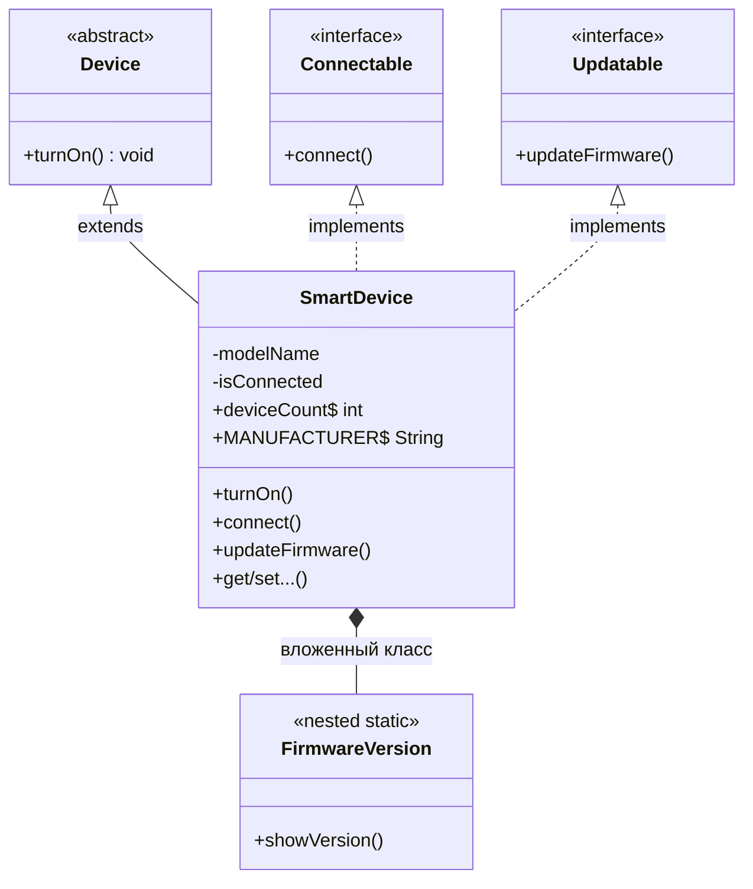
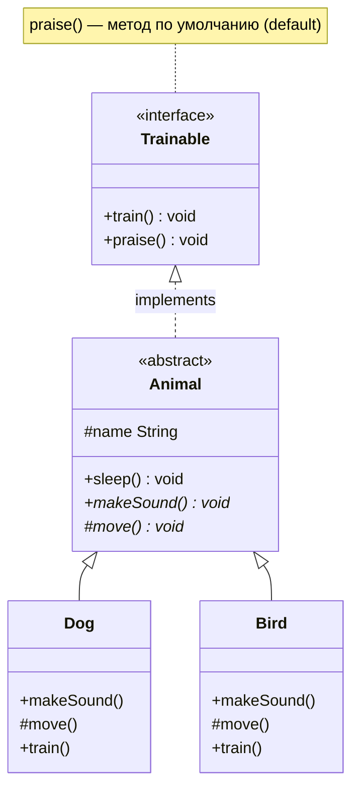
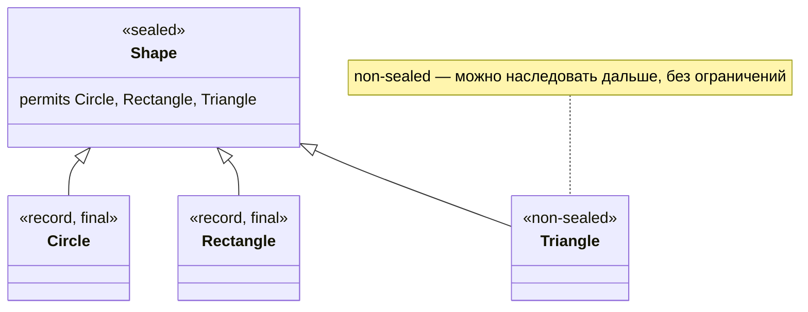
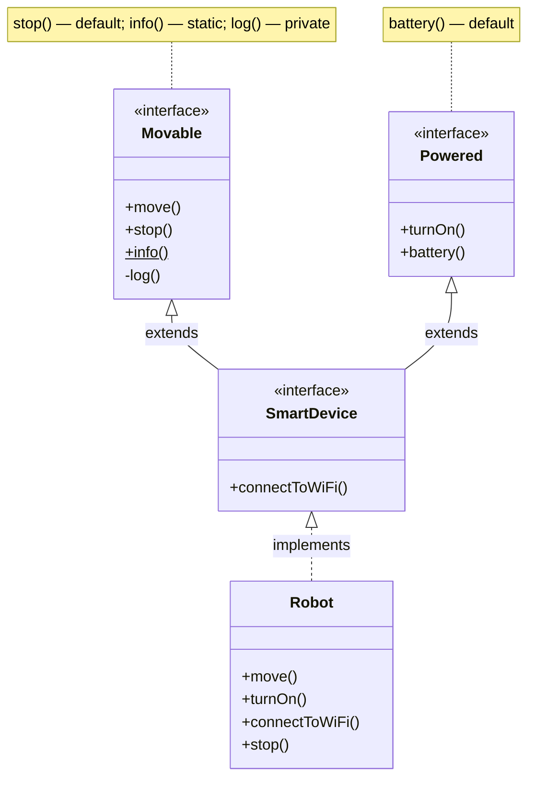
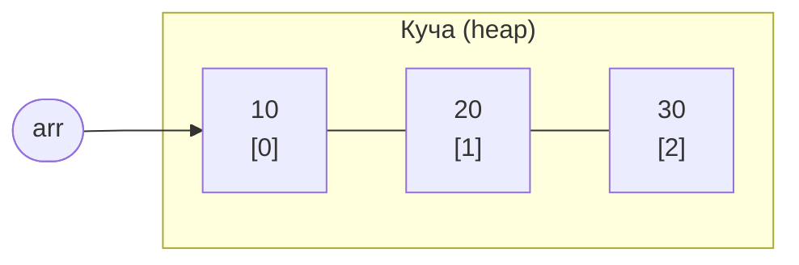
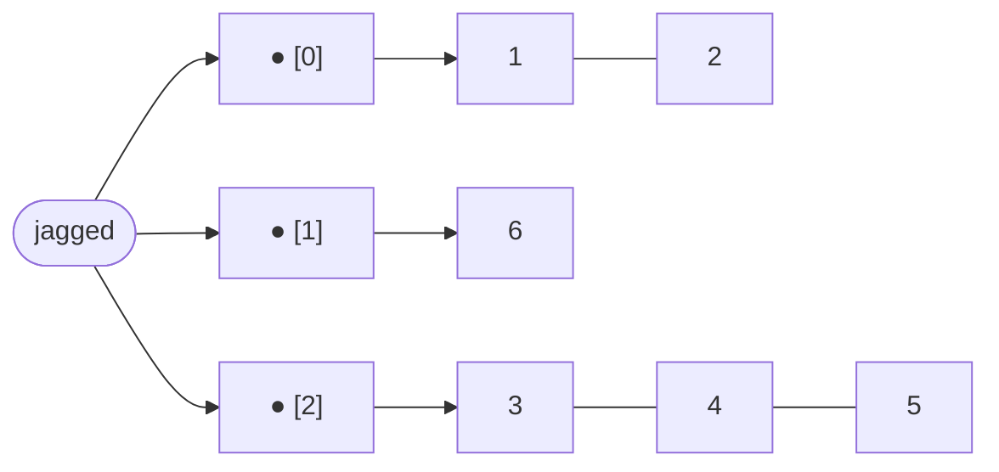
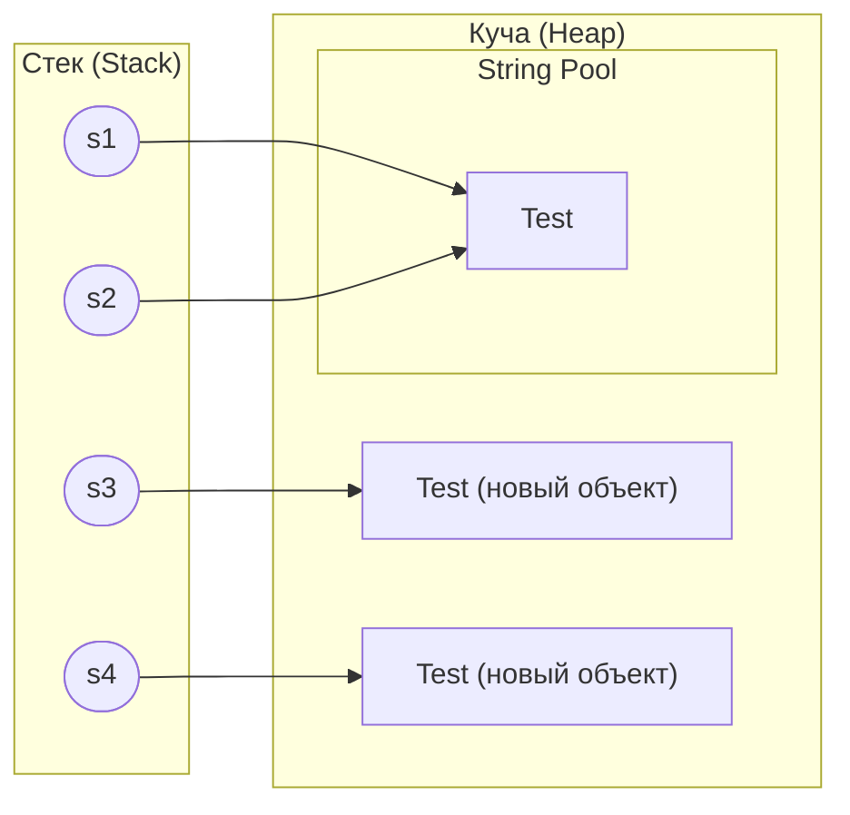

# Лекция 2: Основные конструкции языка Java

## Введение

Добро пожаловать на вторую лекцию курса "Современные технологии программирования". На первой лекции мы познакомились с основами Java — архитектурой JVM, типами данных и операторами. Сегодня мы перейдём к основным конструкциям языка: классам, интерфейсам, массивам, строкам и другим важным элементам, которые составляют фундамент любой Java-программы. А в конце займёмся датами и временем — тем самым java.time, без которого не обходится ни одно приложение, где что-то происходит «вчера», «через три рабочих дня» или «в московском часовом поясе».

---

## Часть 1: Классы

### Что такое класс?

Класс — это шаблон (чертёж), по которому создаются объекты. Если объект — это конкретный дом, то класс — это архитектурный план этого дома. Из одного плана можно построить множество домов.

Класс может содержать:
- **Поля** (переменные экземпляра и класса) — хранят данные объекта
- **Методы** — описывают поведение объекта
- **Конструкторы** — создают и инициализируют объекты
- **Блоки инициализации** (instance block, static block) — выполняют код при создании объекта или загрузке класса
- **Статические элементы** — принадлежат классу, а не конкретному объекту
- **Вложенные классы** — классы, определённые внутри других классов
- **Аннотации** — метаданные для классов, методов и полей
- **Комментарии и документация (JavaDoc)** — описание кода для разработчиков

**Наследование и реализация:**
- Класс может наследоваться от **одного** класса (через `extends`)
- Класс может реализовать **несколько** интерфейсов (через `implements`)

### Пример комплексного класса

**Ссылка на GitHub:** [Classes](https://github.com/AliEbraheem-fun/Modern-Programming-Technologies-Code-Examples/tree/main/lecture2/src/main/java/lecture/two/classes)

```java
package lecture.two.classes;
// Абстрактный базовый класс (можно наследовать только один)
abstract class Device {
    public abstract void turnOn();
}

// Интерфейс 1
interface Connectable {
    void connect();
}

// Интерфейс 2
interface Updatable {
    void updateFirmware();
}

/**
 * Класс SmartDevice — это пример комплексного класса,
 * демонстрирующего все основные возможности Java-класса.
 *
 * Он наследуется от абстрактного класса Device
 * и реализует два интерфейса: Connectable и Updatable.
 */
public class SmartDevice extends Device implements Connectable, Updatable {

    // Поля экземпляра (non-static) — принадлежат каждому объекту отдельно
    private String modelName;
    private boolean isConnected;
    // Статическое поле — общее для всех объектов класса
    public static int deviceCount = 0;

    // Константа (static final)
    public static final String MANUFACTURER = "SmartTech Inc.";

    // Блок инициализации экземпляра — выполняется при каждом создании объекта
    {
        System.out.println("Инициализация экземпляра SmartDevice");
        deviceCount++;
    }

    // Статический блок инициализации — выполняется один раз при загрузке класса
    static {
        System.out.println("Класс SmartDevice загружен в память");
    }

    // Конструктор
    public SmartDevice(String modelName) {
        this.modelName = modelName;
        this.isConnected = false;
    }

    // Метод экземпляра
    public void turnOn() {
        System.out.println(modelName + " включено.");
    }

    // Реализация метода интерфейса Connectable
    @Override
    public void connect() {
        isConnected = true;
        System.out.println(modelName + " подключено.");
    }

    // Реализация метода интерфейса Updatable
    @Override
    public void updateFirmware() {
        System.out.println(modelName + ": обновление прошивки завершено.");
    }

    // Геттер
    public String getModelName() {
        return modelName;
    }

    // Сеттер
    public void setModelName(String modelName) {
        this.modelName = modelName;
    }

    // Статический метод
    public static void showTotalDevices() {
        System.out.println("Общее количество устройств: " + deviceCount);
    }

    // Вложенный (static) класс
    public static class FirmwareVersion {
        private String version;

        public FirmwareVersion(String version) {
            this.version = version;
        }

        public void showVersion() {
            System.out.println("Версия прошивки: " + version);
        }
    }
}
```

### Структура класса SmartDevice



### Разбор ключевых элементов класса

| Элемент | Описание | Пример |
|---------|----------|--------|
| **Поле экземпляра** | Принадлежит каждому объекту отдельно | `private String modelName;` |
| **Статическое поле** | Общее для всех объектов класса | `public static int deviceCount = 0;` |
| **Константа** | Неизменяемое значение | `public static final String MANUFACTURER = "...";` |
| **Блок инициализации** | Выполняется при каждом создании объекта | `{ deviceCount++; }` |
| **Статический блок** | Выполняется один раз при загрузке класса | `static { ... }` |
| **Конструктор** | Создаёт и инициализирует объект | `public SmartDevice(String modelName) { ... }` |
| **Геттер/Сеттер** | Методы доступа к полям | `getModelName()`, `setModelName()` |
| **Вложенный класс** | Класс внутри класса | `static class FirmwareVersion { ... }` |

### Модификаторы доступа

Модификаторы доступа контролируют видимость полей, методов и классов. В примере выше `modelName` объявлен как `private` — он доступен только внутри класса `SmartDevice`, а `deviceCount` — как `public static`, что делает его доступным отовсюду.

| Модификатор | В том же классе | В том же пакете | В подклассе | Везде |
|-------------|:---------------:|:---------------:|:-----------:|:-----:|
| `private` | + | | | |
| *(default)* — без модификатора | + | + | | |
| `protected` | + | + | + | |
| `public` | + | + | + | + |

> **Как запомнить:** Расставьте модификаторы от самого закрытого к самому открытому: `private` → *default* → `protected` → `public`. Каждый следующий уровень добавляет видимость для более широкого круга.

> **Частая ошибка:** Многие новички путают *default* (без модификатора) и `public`. Если вы не указали модификатор, класс или метод виден только **внутри своего пакета**. Это **не** то же самое, что `public`!

### Ключевое слово `var` (Java 10+)

С Java 10 доступно ключевое слово `var` для **локальной типизации с выведением типа**. Компилятор сам определяет тип переменной по правой части выражения:

```java
// Вместо явного указания типа:
SmartDevice device = new SmartDevice("Phone");
String name = device.getModelName();

// Можно использовать var:
var device = new SmartDevice("Phone");  // компилятор выводит SmartDevice
var name = device.getModelName();        // компилятор выводит String
```

**Правила использования `var`:**
- Только для **локальных переменных** (не для полей класса, параметров и возвращаемых типов)
- Переменная **должна быть инициализирована** при объявлении
- `var` — это **не** динамическая типизация! Тип фиксируется при компиляции

> **Когда использовать:** `var` удобен, когда тип очевиден из правой части (`var list = new ArrayList<String>()`). Не используйте `var`, если тип неочевиден и код становится труднее читать.

### Попробуй в jshell!

```
jshell> var greeting = "Привет"
jshell> greeting.getClass().getSimpleName()
jshell> var numbers = new int[] {1, 2, 3}
jshell> numbers.length
jshell> var list = new java.util.ArrayList<String>()
jshell> list.add("Java")
jshell> list.getClass().getSimpleName()
```

---

## Часть 2: Абстрактные классы

### Что такое абстрактный класс?

Абстрактный класс — это класс, который **не может быть создан как объект** и может содержать абстрактные методы. Он объявляется с ключевым словом `abstract` и используется как базовый класс для других классов.

**Ключевые особенности:**
- Может содержать поля, конструкторы и обычные методы с реализацией
- **Абстрактный метод** — это метод без реализации, объявляемый с ключевым словом `abstract`. Он определяет сигнатуру метода, но требует, чтобы подклассы предоставили конкретную реализацию
- Нельзя создать экземпляр абстрактного класса через `new`

### Пример абстрактного класса

**Ссылка на GitHub:** [Abstract Classes](https://github.com/AliEbraheem-fun/Modern-Programming-Technologies-Code-Examples/tree/main/lecture2/src/main/java/lecture/two/abstrclasses)

```java
package lecture.two.abstrclasses;

// Интерфейс с одним абстрактным методом
interface Trainable {
    void train(); // абстрактный метод
    default void praise() {
        System.out.println("Молодец!");
    }
}

// Абстрактный класс — реализует интерфейс, но не реализует train(),
// поэтому остаётся абстрактным
abstract class Animal implements Trainable {

    protected String name;

    public Animal(String name) {
        this.name = name;
    }

    public void sleep() {
        System.out.println(name + " спит.");
    }

    // Абстрактные методы — должны быть реализованы в наследниках
    public abstract void makeSound();
    protected abstract void move();

    // Метод praise() из интерфейса уже реализован как default,
    // поэтому не требуется переопределять
}

// Подкласс — реализует все абстрактные методы, включая метод из интерфейса
class Dog extends Animal {

    public Dog(String name) {
        super(name);
    }

    @Override
    public void makeSound() {
        System.out.println(name + " говорит: Гав-гав!");
    }

    @Override
    protected void move() {
        System.out.println(name + " бегает на четырёх лапах.");
    }

    // Реализация метода из интерфейса
    @Override
    public void train() {
        System.out.println(name + " выполняет команду 'сидеть'.");
    }
}

// Ещё один подкласс
class Bird extends Animal {

    public Bird(String name) {
        super(name);
    }

    @Override
    public void makeSound() {
        System.out.println(name + " поёт: Чирик-чирик!");
    }

    @Override
    protected void move() {
        System.out.println(name + " летает в небе.");
    }

    @Override
    public void train() {
        System.out.println(name + " учится говорить слова.");
    }
}

// Главный класс
public class Main {

    public static void main(String[] args) {

        // Animal animal = new Animal("Животное");
        // Нельзя создать экземпляр абстрактного класса

        Animal dog = new Dog("Шарик");
        Animal bird = new Bird("Кеша");

        dog.sleep();
        dog.makeSound();
        dog.move();
        dog.train();
        dog.praise(); // вызов default-метода интерфейса

        System.out.println();

        bird.sleep();
        bird.makeSound();
        bird.move();
        bird.train();
        bird.praise();
    }
}
```

### Иерархия наследования в примере



**Что показывает этот пример?**

1. Абстрактный класс `Animal` содержит и обычные методы (`sleep()`), и абстрактные (`makeSound()`, `move()`)
2. Каждый подкласс (`Dog`, `Bird`) **обязан** реализовать все абстрактные методы
3. Интерфейс `Trainable` добавляет метод `train()` и default-метод `praise()`
4. Переменная типа `Animal` может хранить объект `Dog` или `Bird` — это **полиморфизм**

### Попробуй в jshell!

```
jshell> abstract class Shape { abstract double area(); }
jshell> class Circle extends Shape {
   ...>     double r;
   ...>     Circle(double r) { this.r = r; }
   ...>     double area() { return Math.PI * r * r; }
   ...> }
jshell> Shape s = new Circle(5)
jshell> s.area()
jshell> Shape s2 = new Shape() { double area() { return 42; } }
jshell> s2.area()
```

---

## Часть 2.5: Sealed-классы (Java 17)

### Что такое sealed-класс?

Sealed-класс (запечатанный класс) — это класс или интерфейс, который **ограничивает** список своих наследников. Вы явно указываете, какие классы могут его расширять, с помощью ключевого слова `sealed` и `permits`.

Sealed-классы находятся между обычными и `final`-классами:
- **Обычный класс** — наследовать может кто угодно
- **`final` класс** — никто не может наследовать
- **`sealed` класс** — только указанные в `permits` классы

### Зачем нужны sealed-классы?

Они позволяют моделировать **закрытые иерархии типов**, где вы точно знаете все возможные варианты. Это особенно полезно для:
- Алгебраических типов данных
- Обработки через `switch` (компилятор проверит, что учтены все варианты)
- Гарантий безопасности — никто не добавит неожиданного наследника

### Пример sealed-класса

```java
// Sealed-интерфейс: только Circle, Rectangle и Triangle могут его реализовать
sealed interface Shape permits Circle, Rectangle, Triangle {
    double area();
}

// Каждый наследник должен быть: final, sealed или non-sealed
record Circle(double radius) implements Shape {
    public double area() { return Math.PI * radius * radius; }
}

record Rectangle(double width, double height) implements Shape {
    public double area() { return width * height; }
}

// non-sealed — снимает ограничение на дальнейшее наследование
non-sealed class Triangle implements Shape {
    double base, height;
    Triangle(double base, double height) {
        this.base = base;
        this.height = height;
    }
    public double area() { return 0.5 * base * height; }
}

// Теперь можно безопасно использовать switch (Java 21+):
class ShapeDemo {
    static String describe(Shape shape) {
        return switch (shape) {
            case Circle c    -> "Круг с радиусом " + c.radius();
            case Rectangle r -> "Прямоугольник " + r.width() + "x" + r.height();
            case Triangle t  -> "Треугольник";
            // Компилятор знает, что других вариантов нет — default не нужен!
        };
    }
}
```

### Правила для наследников sealed-класса

Каждый наследник, указанный в `permits`, обязан быть одним из:

| Модификатор | Значение |
|-------------|----------|
| `final` | Цепочка наследования заканчивается |
| `sealed` | Наследник сам ограничивает своих наследников |
| `non-sealed` | Ограничение снимается, любой класс может наследовать дальше |
| `record` | Записи неявно `final` |



---

## Часть 3: Интерфейсы

### Что такое интерфейс?

Интерфейс (`interface`) в Java — это абстрактный тип данных, который определяет набор методов и констант, но не содержит реализацию (за исключением дефолтных и статических методов). Интерфейсы описывают **"что"** должен делать класс, но не описывают **"как"** он это делает.

### Основные правила интерфейсов

| Правило | Описание |
|---------|----------|
| **Методы** | По умолчанию `public abstract`, требуют реализации в классе |
| **Поля** | Могут быть только константами (`public static final`) |
| **Множественная реализация** | Класс может реализовывать несколько интерфейсов (`implements`) |
| **Default-методы** | С Java 8 — методы с реализацией по умолчанию |
| **Статические методы** | С Java 8 — вызываются на интерфейсе, а не на экземпляре |
| **Private-методы** | С Java 9 — для внутреннего использования в интерфейсе |
| **Наследование** | Интерфейс может наследовать другие интерфейсы через `extends` |
| **Нет состояния** | Интерфейсы не хранят состояние (не имеют нестатических переменных) |

### Маркерные и функциональные интерфейсы

**Маркерные интерфейсы** — это интерфейсы без объявления методов и полей. Они используются для обозначения принадлежности класса к определённой категории. Примеры: `Serializable`, `Cloneable`, `Remote`.

**Функциональные интерфейсы** — это интерфейсы только с одним абстрактным методом. Примеры: `Runnable`, `ActionListener`. Такие интерфейсы можно аннотировать `@FunctionalInterface` (необязательно, но рекомендуется). Функциональные интерфейсы можно реализовать с помощью лямбда-выражений.

### Пример работы с интерфейсами

**Ссылка на GitHub:** [Interfaces](https://github.com/AliEbraheem-fun/Modern-Programming-Technologies-Code-Examples/tree/main/lecture2/src/main/java/lecture/two/interfaces)

```java
package lecture.two.interfaces;

// Основной интерфейс, задающий поведение движущегося объекта
interface Movable {
    // Константа — максимальная скорость (public static final по умолчанию)
    int MAX_SPEED = 120;

    // Абстрактный метод (по умолчанию public abstract)
    void move();

    // Default-метод с реализацией (можно переопределить в классе)
    default void stop() {
        System.out.println("Объект остановлен.");
        log("Вызван метод stop()");
    }

    // Static-метод — вызывается на интерфейсе, а не на экземпляре
    static void info() {
        System.out.println("Интерфейс Movable определяет движение объектов.");
    }

    // Private-метод (доступен только внутри интерфейса, с Java 9)
    private void log(String message) {
        System.out.println("ЛОГ (Movable): " + message);
    }
}

// Второй интерфейс, демонстрирующий множественное наследование
interface Powered {
    void turnOn();

    default void batteryStatus() {
        System.out.println("Батарея заряжена на 80%");
    }
}

// Интерфейс, наследующий два других
interface SmartDevice extends Movable, Powered {
    void connectToWiFi();
}

// Класс, реализующий интерфейс SmartDevice (а значит и все унаследованные)
class Robot implements SmartDevice {

    @Override
    public void move() {
        System.out.println("Робот двигается вперёд.");
    }

    @Override
    public void turnOn() {
        System.out.println("Робот включён.");
    }

    @Override
    public void connectToWiFi() {
        System.out.println("Подключение к Wi-Fi выполнено.");
    }

    // Переопределение default-метода stop()
    @Override
    public void stop() {
        System.out.println("Робот остановлен (переопределённый метод).");
    }
}

// Главный класс с методом main
public class Main {
    public static void main(String[] args) {
        Robot robot = new Robot();

        robot.turnOn();           // Включение устройства
        robot.move();             // Движение
        robot.connectToWiFi();    // Подключение к сети
        robot.stop();             // Остановка (переопределённый default-метод)
        robot.batteryStatus();    // Вызов default-метода из Powered

        // Вызов static-метода интерфейса напрямую
        Movable.info();

        // Вывод значения константы из интерфейса
        System.out.println("Максимальная скорость: " + Movable.MAX_SPEED + " км/ч");
    }
}
```

### Иерархия интерфейсов в примере



### Попробуй в jshell!

Поэкспериментируйте с интерфейсами:
```
jshell> interface Greetable { String greet(String name); }
jshell> Greetable g = name -> "Привет, " + name + "!"
jshell> g.greet("Студент")
```

### Абстрактные классы vs Интерфейсы

Это один из самых частых вопросов на собеседованиях и экзаменах. Давайте чётко разграничим:

| Критерий | Абстрактный класс | Интерфейс |
|----------|-------------------|-----------|
| **Ключевое слово** | `abstract class` | `interface` |
| **Наследование** | Только один (`extends`) | Несколько (`implements`) |
| **Поля** | Любые (в т.ч. изменяемые) | Только константы (`public static final`) |
| **Конструкторы** | Да | Нет |
| **Модификаторы доступа методов** | Любые (`private`, `protected`, `public`) | `public` по умолчанию (+ `private` с Java 9) |
| **Состояние (state)** | Может хранить состояние в полях | Не хранит состояние |
| **Методы с реализацией** | Обычные методы | `default`- и `static`-методы (с Java 8) |
| **Когда использовать** | Общая логика + общее состояние между родственными классами | Контракт поведения для разнородных классов |

**Правило выбора:**
- Используйте **абстрактный класс**, когда классы связаны отношением "является" (Dog **является** Animal) и имеют общий код/состояние
- Используйте **интерфейс**, когда классы связаны отношением "умеет" (Robot **умеет** двигаться, Dog **умеет** тренироваться) и нужно объединить разнородные типы

---

## Часть 4: Массивы

### Что такое массив?

Массив — это структура данных, предназначенная для хранения **фиксированного количества** элементов одного типа. Массивы в Java реализованы как объекты и позволяют эффективно работать с наборами данных.

**Ключевые характеристики:**

| Характеристика | Описание |
|----------------|----------|
| **Однородность** | Все элементы одного типа (`int[]`, `String[]`, `Person[]`) |
| **Фиксированный размер** | Задаётся при создании и не изменяется |
| **Индексация с нуля** | Доступ к элементам по индексам от `0` до `length - 1` |
| **Быстрый доступ** | Прямой доступ к элементам за O(1) благодаря непрерывной памяти |
| **Объектная природа** | Массивы в Java являются объектами с полем `.length` |
| **Многомерность** | Возможны массивы массивов (`int[][]`) |

**Зубчатый массив** — это массив массивов переменной длины. В отличие от прямоугольных таблиц, каждая строка может содержать разное количество элементов.

### Пример работы с массивами

**Ссылка на GitHub:** [Arrays](https://github.com/AliEbraheem-fun/Modern-Programming-Technologies-Code-Examples/tree/main/lecture2/src/main/java/lecture/two/arrays)

```java
package lecture.two.arrays;
public class Main {
    public static void main(String[] args) {

        // === 1. C-подобный стиль объявления ===
        int numbers[] = new int[5];  // массив из 5 элементов типа int
        numbers[0] = 10;             // присваивание значений по индексу
        numbers[1] = 20;

        System.out.println("1. C-подобное объявление массива:");
        for (int i = 0; i < numbers.length; i++) {
            System.out.print(numbers[i] + " ");
        }

        // === 2. Java-стиль объявления ===
        String[] names = new String[] {"Alice", "Bob", "Charlie"};

        System.out.println("\n\n2. Java-стиль (объявление + инициализация):");
        for (String name : names) {
            System.out.print(name + " ");
        }

        // === 3. Упрощённая инициализация без new (только при объявлении) ===
        double[] prices = {19.99, 9.99, 14.50};

        System.out.println("\n\n3. Упрощённая инициализация:");
        for (double price : prices) {
            System.out.print(price + " ");
        }

        // === 4. Массив объектов (например, String) ===
        String[] fruits = new String[3];
        fruits[0] = "Apple";
        fruits[1] = "Banana";
        fruits[2] = "Orange";

        System.out.println("\n\n4. Массив объектов:");
        for (String fruit : fruits) {
            System.out.print(fruit + " ");
        }

        // === 5. Двумерный массив (прямоугольный) ===
        int[][] grid = {
                {1, 2},
                {3, 4}
        };

        System.out.println("\n\n5. Двумерный массив:");
        for (int i = 0; i < grid.length; i++) {
            for (int j = 0; j < grid[i].length; j++) {
                System.out.print(grid[i][j] + " ");
            }
            System.out.println();
        }

        // === 6. Jagged (зубчатый) массив ===
        int[][] jagged = new int[3][];
        jagged[0] = new int[] {1, 2};
        jagged[1] = new int[] {3, 4, 5};
        jagged[2] = new int[] {6};

        System.out.println("\n6. Зубчатый массив:");
        for (int i = 0; i < jagged.length; i++) {
            System.out.print("Строка " + i + ": ");
            for (int j = 0; j < jagged[i].length; j++) {
                System.out.print(jagged[i][j] + " ");
            }
            System.out.println();
        }

        // === 7. Объявление массива без инициализации ===
        char[] letters;             // только объявление
        letters = new char[] {'A', 'B', 'C'};

        System.out.println("\n7. Объявление массива без инициализации:");
        for (char ch : letters) {
            System.out.print(ch + " ");
        }
    }
}
```

### Способы объявления массивов

```java
// C-подобный стиль
int numbers[] = new int[5];

// Java-стиль (рекомендуемый)
String[] names = new String[] {"Alice", "Bob"};

// Упрощённая инициализация
double[] prices = {19.99, 9.99};

// Двумерный массив
int[][] grid = {{1, 2}, {3, 4}};

// Зубчатый массив (строки разной длины)
int[][] jagged = new int[3][];
jagged[0] = new int[] {1, 2};
jagged[1] = new int[] {3, 4, 5};
```

### Массивы в памяти

Одномерный массив `int[] arr = {10, 20, 30}` — непрерывный блок памяти в heap, `length = 3`:



Зубчатый массив `int[][] jagged` — массив ссылок, каждая строка которого хранится отдельно и может быть разной длины:



> **Частые ошибки при работе с массивами:**
>
> **`ArrayIndexOutOfBoundsException`** — обращение к индексу за пределами массива:
> ```java
> int[] arr = new int[3];
> arr[3] = 10;  // Ошибка! Допустимые индексы: 0, 1, 2
> ```
>
> **`NullPointerException`** — массив объектов создан, но элементы не инициализированы:
> ```java
> String[] names = new String[3];  // все элементы = null
> names[0].length();               // NullPointerException!
> ```
>
> **Размер массива нельзя изменить** — если нужен динамический размер, используйте `ArrayList`:
> ```java
> var list = new java.util.ArrayList<Integer>();
> list.add(10);  // можно добавлять сколько угодно элементов
> ```

### Попробуй в jshell!

```
jshell> int[] arr = {10, 20, 30, 40, 50}
jshell> arr.length
jshell> arr[2]
jshell> int[][] matrix = {{1,2},{3,4}}
jshell> matrix[1][0]
jshell> String[] names = new String[3]
jshell> names[0]                          // Что будет?
jshell> arr[10]                           // А здесь?
```

### Класс java.util.Arrays

Массив в Java — это минимальный объект: у него есть только `.length` и доступ по индексу, а всё остальное (сортировка, поиск, сравнение, печать) вынесено в отдельный класс-утилиту `java.util.Arrays`. В нём собраны статические методы, которые работают с массивами так, как коллекции работают сами по себе.

| Метод | Что делает |
|-------|-----------|
| `toString(arr)` | Строковое представление одномерного массива: `[1, 2, 3]` |
| `deepToString(arr)` | То же самое для многомерного (вложенного) массива |
| `sort(arr)` | Сортирует массив по возрастанию «на месте» |
| `sort(arr, comparator)` | Сортирует массив объектов по заданному правилу |
| `binarySearch(arr, key)` | Бинарный поиск элемента; массив обязан быть отсортирован заранее |
| `fill(arr, value)` | Заполняет весь массив одним значением |
| `copyOf(arr, newLength)` | Копия массива нужной длины (обрезает или дополняет нулями/`null`) |
| `copyOfRange(arr, from, to)` | Копия подотрезка массива |
| `equals(a, b)` | Поэлементное сравнение одномерных массивов |
| `deepEquals(a, b)` | Поэлементное сравнение многомерных массивов |
| `asList(arr)` | «Обёртка»-список поверх массива |

**Печать массива.** Массив — это объект, поэтому `System.out.println(arr)` вызывает унаследованный от `Object` метод `toString()`, который просто печатает тип и хэш-код в духе `[I@1b6d3586` (`[I` значит «массив `int`»), а не содержимое. Чтобы увидеть сами элементы, нужен именно `Arrays`:

```java
int[] arr = {3, 1, 2};

System.out.println(arr);                 // [I@1b6d3586 — бесполезно
System.out.println(Arrays.toString(arr)); // [3, 1, 2]

int[][] matrix = {{1, 2}, {3, 4}};
System.out.println(Arrays.deepToString(matrix)); // [[1, 2], [3, 4]]
```

**Сортировка и поиск.** `binarySearch` даёт верный результат, только если массив уже отсортирован — на неотсортированном массиве он может вернуть случайный индекс:

```java
int[] numbers = {5, 3, 1, 4, 2};
Arrays.sort(numbers);                      // numbers = [1, 2, 3, 4, 5]
int index = Arrays.binarySearch(numbers, 4); // 3

String[] names = {"Charlie", "Alice", "Bob"};
Arrays.sort(names, Comparator.reverseOrder()); // [Charlie, Bob, Alice]
```

**Заполнение и копирование.**

```java
int[] zeros = new int[5];
Arrays.fill(zeros, 7);                      // [7, 7, 7, 7, 7]

int[] original = {1, 2, 3};
int[] extended = Arrays.copyOf(original, 5);       // [1, 2, 3, 0, 0]
int[] slice = Arrays.copyOfRange(original, 1, 3);  // [2, 3]
```

**Сравнение.**

```java
int[] a = {1, 2, 3};
int[] b = {1, 2, 3};

System.out.println(a == b);              // false — разные объекты в памяти
System.out.println(Arrays.equals(a, b)); // true — одинаковое содержимое
```

**Ловушка `Arrays.asList()`.** Метод возвращает не обычный `ArrayList`, а список **фиксированного размера**, «завёрнутый» вокруг исходного массива: изменять элементы через `set()` можно, а добавлять или удалять — нельзя.

```java
List<String> list = Arrays.asList("A", "B", "C");
list.set(0, "Z");     // OK: список = [Z, B, C]
list.add("D");        // UnsupportedOperationException!
```

Если нужен полноценный изменяемый список, массив нужно обернуть ещё раз: `new ArrayList<>(Arrays.asList(...))`.

---

## Часть 5: Строки

### Класс String

`String` — это класс, представляющий **неизменяемую** последовательность символов Unicode. После создания строки её содержимое нельзя изменить — любая операция "изменения" создаёт новый объект.

Для частых изменений строки рекомендуется использовать:
- **`StringBuilder`** — для однопоточных приложений (быстрее)
- **`StringBuffer`** — потокобезопасный аналог

### Способы создания строк

**Ссылка на GitHub:** [Strings](https://github.com/AliEbraheem-fun/Modern-Programming-Technologies-Code-Examples/tree/main/lecture2/src/main/java/lecture/two/strings)

```java
// 1. Через строковый литерал (из String Pool)
String str1 = "Hello";

// 2. Через new (создаёт новый объект в heap, не из String Pool)
String str2 = new String("World");

// 3. Из массива символов
char[] charArray = {'J', 'a', 'v', 'a'};
String str3 = new String(charArray);

// 4. Из части массива символов
String str4 = new String(charArray, 1, 2); // "av"

// 5. Из массива байтов
byte[] byteArray = {65, 66, 67}; // A, B, C
String str5 = new String(byteArray);

// 6. Через StringBuilder
String str6 = new StringBuilder("Builder String").toString();

// 7. Многострочная строка (text block) — с Java 15
String str7 = """
              Это многострочная строка.
              Она может содержать переносы строк,
              табуляции и кавычки "внутри текста".
              """;
```

### Основные методы класса String

| Метод | Описание | Пример |
|-------|----------|--------|
| `length()` | Длина строки | `"Java".length()` → `4` |
| `charAt(i)` | Символ по индексу | `"Java".charAt(0)` → `'J'` |
| `toUpperCase()` | В верхний регистр | `"java".toUpperCase()` → `"JAVA"` |
| `toLowerCase()` | В нижний регистр | `"JAVA".toLowerCase()` → `"java"` |
| `trim()` | Удаление пробелов по краям | `"  hi  ".trim()` → `"hi"` |
| `substring(a, b)` | Подстрока | `"Hello".substring(1, 3)` → `"el"` |
| `contains(s)` | Содержит ли подстроку | `"Hello".contains("ell")` → `true` |
| `indexOf(s)` | Первое вхождение | `"Java".indexOf("a")` → `1` |
| `lastIndexOf(s)` | Последнее вхождение | `"Java".lastIndexOf("a")` → `3` |
| `replace(a, b)` | Замена подстроки | `"Java".replace("J", "K")` → `"Kava"` |
| `startsWith(s)` | Начинается ли с | `"Java".startsWith("Ja")` → `true` |
| `endsWith(s)` | Заканчивается ли на | `"Java".endsWith("va")` → `true` |
| `equals(s)` | Сравнение содержимого | `"Java".equals("java")` → `false` |
| `equalsIgnoreCase(s)` | Сравнение без учёта регистра | `"Java".equalsIgnoreCase("java")` → `true` |
| `isEmpty()` | Пуста ли строка | `"".isEmpty()` → `true` |
| `isBlank()` | Пуста или только пробелы (Java 11+) | `"  ".isBlank()` → `true` |
| `repeat(n)` | Повтор строки (Java 11+) | `"Hi ".repeat(2)` → `"Hi Hi "` |
| `join(d, ...)` | Объединение через разделитель | `String.join("-", "A", "B")` → `"A-B"` |

### String Pool и сравнение строк

**Что такое String Pool?**

String Pool (пул строк) — это специальная область памяти внутри кучи (Heap), где JVM хранит **уникальные строковые литералы**. Он существует для экономии памяти: если в программе 100 раз встречается `"Hello"`, в памяти будет создан только **один** объект.

**Как это работает:**

1. Когда вы пишете строковый литерал (`"Test"`), JVM ищет такую строку в Pool
2. Если строка найдена — возвращается ссылка на существующий объект
3. Если не найдена — создаётся новый объект в Pool и возвращается ссылка на него
4. Когда вы используете `new String("Test")` — **всегда** создаётся новый объект в обычной куче, **минуя** Pool



| Сравнение | Результат | Почему |
|-----------|:---------:|--------|
| `s1 == s2` | `true` | одна ссылка в Pool |
| `s1 == s3` | `false` | разные объекты |
| `s3 == s4` | `false` | два разных объекта в куче |
| `s1.equals(s3)` | `true` | одинаковое содержимое |

Разберём пошагово:

```java
String s1 = "Test";              // 1. "Test" не найден в Pool → создан в Pool
String s2 = "Test";              // 2. "Test" найден в Pool → та же ссылка
String s3 = new String("Test");  // 3. new → новый объект в обычной куче
String s4 = new String("Test");  // 4. new → ещё один новый объект в куче

System.out.println(s1 == s2);        // true  — обе переменные указывают на ОДИН объект в Pool
System.out.println(s1 == s3);        // false — s1 в Pool, s3 в обычной куче — разные объекты
System.out.println(s3 == s4);        // false — два разных объекта в обычной куче
System.out.println(s1.equals(s3));   // true  — содержимое одинаковое ("Test")
System.out.println(s3.equals(s4));   // true  — содержимое одинаковое ("Test")
```

**Метод `intern()`**

Метод `intern()` позволяет поместить строку из обычной кучи в String Pool (или получить ссылку на уже существующую в Pool):

```java
String s1 = "Test";
String s3 = new String("Test");
String s5 = s3.intern();  // ищет "Test" в Pool → находит → возвращает ссылку

System.out.println(s1 == s3);   // false — разные объекты
System.out.println(s1 == s5);   // true  — s5 теперь ссылается на тот же объект из Pool, что и s1
```

**Конкатенация и Pool**

Строки, полученные в результате конкатенации переменных, **не попадают** в Pool автоматически:

```java
String s1 = "Hello";
String s2 = "Hel" + "lo";         // компилятор склеит в "Hello" → Pool
String s3 = "Hel";
String s4 = s3 + "lo";            // конкатенация в runtime → обычная куча

System.out.println(s1 == s2);   // true  — компилятор оптимизировал в один литерал
System.out.println(s1 == s4);   // false — s4 создан во время выполнения, не в Pool
```

> **Важно:** Для сравнения содержимого строк **всегда** используйте `.equals()`, а не `==`. Оператор `==` сравнивает **ссылки** (адреса в памяти), а `.equals()` сравнивает **содержимое**.
>
> Единственное исключение — сравнение с `null`: `s == null` (у `null` нельзя вызвать `.equals()`).

### String vs StringBuilder vs StringBuffer

Поскольку `String` неизменяем, каждая операция конкатенации создаёт **новый объект**. В циклах это крайне неэффективно:

```java
// МЕДЛЕННО: создаёт ~10 000 промежуточных объектов String
String result = "";
for (int i = 0; i < 10_000; i++) {
    result += i;  // каждый раз новый объект!
}

// БЫСТРО: один объект, изменяемый внутри
StringBuilder sb = new StringBuilder();
for (int i = 0; i < 10_000; i++) {
    sb.append(i);  // изменяет существующий объект
}
String result2 = sb.toString();
```

| Критерий | `String` | `StringBuilder` | `StringBuffer` |
|----------|----------|-----------------|----------------|
| **Изменяемость** | Неизменяемый (immutable) | Изменяемый (mutable) | Изменяемый (mutable) |
| **Потокобезопасность** | Да (неизменяемый) | Нет | Да (synchronized) |
| **Производительность** | Медленно при конкатенации в цикле | Быстро | Медленнее StringBuilder из-за синхронизации |
| **Когда использовать** | Строки не изменяются | Частые изменения в одном потоке | Частые изменения в многопоточной среде |

> **Частые ошибки при работе со строками:**
>
> **Забытый результат:** Методы `String` **не изменяют** строку, а возвращают новую:
> ```java
> String s = "hello";
> s.toUpperCase();           // результат потерян!
> System.out.println(s);     // "hello" — ничего не изменилось
>
> s = s.toUpperCase();       // правильно — сохраняем результат
> System.out.println(s);     // "HELLO"
> ```
>
> **Сравнение через `==`:** Как показано выше, `==` сравнивает ссылки, а не содержимое.
>
> **`NullPointerException`:** Вызов метода на `null`-строке:
> ```java
> String s = null;
> s.length();                // NullPointerException!
> // Безопасная проверка:
> if (s != null && s.length() > 0) { ... }
> ```

### Попробуй в jshell!

```
jshell> String s = "Hello, Java!"
jshell> s.length()
jshell> s.toUpperCase()
jshell> s                             // изменился ли s?
jshell> s.substring(7)
jshell> s.contains("Java")
jshell> "  пробелы  ".trim()
jshell> "Ha".repeat(3)
jshell> var sb = new StringBuilder("Hello")
jshell> sb.append(" World").append("!")
jshell> sb.toString()
```

---

## Часть 6: Записи (Records)

### Что такое запись?

Запись (`record`) — это специальный класс в Java (с Java 16), предназначенный для хранения **неизменяемых (immutable) данных**. Это во многих случаях гарантирует целостность данных без использования механизмов синхронизации.

**Ключевые особенности:**
- Для объявления `record` достаточно указать только тип и имя полей
- Методы `equals()`, `hashCode()`, `toString()`, а также приватные `final` поля, геттеры и публичный конструктор **автоматически генерируются** компилятором
- Запись **не может** наследоваться от другого класса
- Запись **может** реализовать интерфейсы

### Пример работы с записями

**Ссылка на GitHub:** [Records](https://github.com/AliEbraheem-fun/Modern-Programming-Technologies-Code-Examples/tree/main/lecture2/src/main/java/lecture/two/records)

```java
package lecture.two.records;

// Объявление записи с двумя полями: тип и имя достаточно
public record Person(String name, int age) implements Comparable<Person> {

    // Можно определить дополнительный метод
    public String greet() {
        return "Hello, my name is " + name + " and I am " + age + " years old.";
    }

    // Можно переопределить auto-generated метод, если нужно
    @Override
    public int compareTo(Person other) {
        return Integer.compare(this.age, other.age);
    }

    // Можно добавить статический метод или вложенные типы
    public static Person of(String name) {
        return new Person(name, 0);
    }

    public static void main(String[] args) {
        // Создание объекта записи
        Person p1 = new Person("Alice", 30);
        Person p2 = new Person("Bob", 25);

        // Автоматически доступны методы-геттеры
        System.out.println("Name: " + p1.name());
        System.out.println("Age: " + p1.age());

        // toString() сгенерирован автоматически
        System.out.println("Record as string: " + p1);

        // equals() и hashCode() работают по содержимому
        Person p3 = new Person("Alice", 30);
        System.out.println("p1 equals p3? " + p1.equals(p3)); // true

        // Использование дополнительного метода
        System.out.println(p2.greet());

        // Сортировка с помощью compareTo()
        System.out.println("Compare p1 and p2 by age: " + p1.compareTo(p2));

        // Использование статического фабричного метода
        Person p4 = Person.of("Charlie");
        System.out.println(p4);
    }
}
```

### Компактные конструкторы (Compact Constructors)

Record поддерживает **компактный конструктор** — специальную форму конструктора без параметров, в котором можно добавить валидацию или преобразование данных:

```java
public record Person(String name, int age) {

    // Компактный конструктор — без скобок с параметрами!
    public Person {
        // Валидация: проверяем корректность данных
        if (name == null || name.isBlank()) {
            throw new IllegalArgumentException("Имя не может быть пустым");
        }
        if (age < 0) {
            throw new IllegalArgumentException("Возраст не может быть отрицательным");
        }

        // Нормализация: можно изменить значения до записи в поля
        name = name.trim();  // автоматически запишется в this.name
    }
}
```

**Особенности компактного конструктора:**
- Не нужно писать `this.name = name;` — присваивание полей происходит **автоматически** после завершения тела конструктора
- Можно изменять значения параметров (они запишутся в поля)
- Идеально подходит для валидации входных данных

```java
var p1 = new Person("Alice", 30);     // OK
var p2 = new Person("  Bob  ", 25);   // name будет "Bob" (trim)
var p3 = new Person("", 20);          // IllegalArgumentException!
var p4 = new Person("Charlie", -5);   // IllegalArgumentException!
```

### Сравнение: обычный класс vs record

```java
// Обычный класс — нужно написать ~40 строк
public class PersonClass {
    private final String name;
    private final int age;
    public PersonClass(String name, int age) { ... }
    public String name() { return name; }
    public int age() { return age; }
    @Override public boolean equals(Object o) { ... }
    @Override public int hashCode() { ... }
    @Override public String toString() { ... }
}

// Record — одна строка!
public record Person(String name, int age) {}
```

### Попробуй в jshell!

```
jshell> record Point(int x, int y) {}
jshell> Point p1 = new Point(3, 4)
jshell> p1.x()
jshell> p1.y()
jshell> Point p2 = new Point(3, 4)
jshell> p1.equals(p2)
jshell> p1.toString()
```

---

## Часть 7: Перечисления (Enums)

### Что такое enum?

`enum` — это специальный тип, представляющий **фиксированный набор именованных констант**. Каждая константа — это объект.

**Ключевые особенности:**
- Все элементы `enum` — неявно `public static final`
- `enum` — это `final`-класс, не может наследоваться
- Может содержать поля, методы, абстрактные методы, конструкторы, а также переопределять методы
- `enum` расширяет `java.lang.Enum` и не может наследовать другие классы
- Может реализовывать интерфейсы

### Пример работы с перечислениями

**Ссылка на GitHub:** [Enums](https://github.com/AliEbraheem-fun/Modern-Programming-Technologies-Code-Examples/tree/main/lecture2/src/main/java/lecture/two/enums)

```java
package lecture.two.enums;

// Простой enum без логики — только фиксированный набор направлений
enum Direction {
    NORTH,
    SOUTH,
    EAST,
    WEST
}

// Расширенный enum с полями, методами, конструктором и абстрактным методом
enum Operation {
    ADD("+") {
        @Override
        public double apply(double x, double y) {
            return x + y;
        }
    },
    SUBTRACT("-") {
        @Override
        public double apply(double x, double y) {
            return x - y;
        }
    },
    MULTIPLY("*") {
        @Override
        public double apply(double x, double y) {
            return x * y;
        }
    },
    DIVIDE("/") {
        @Override
        public double apply(double x, double y) {
            if (y == 0) throw new ArithmeticException("Division by zero");
            return x / y;
        }
    };

    private final String symbol;

    Operation(String symbol) {
        this.symbol = symbol;
    }

    public String getSymbol() {
        return symbol;
    }

    public abstract double apply(double x, double y);

    @Override
    public String toString() {
        return name() + " (" + symbol + ")";
    }
}

public class Main {
    public static void main(String[] args) {
        double a = 12;
        double b = 4;

        System.out.println("=== Перебор всех операций (values) ===");
        for (Operation op : Operation.values()) {
            System.out.printf("%s: %.2f %s %.2f = %.2f%n",
                    op.name(), a, op.getSymbol(), b, op.apply(a, b));
        }

        System.out.println("\n=== Получение операции по имени (valueOf) ===");
        Operation selectedOp = Operation.valueOf("ADD");
        System.out.println("Выбрана операция: " + selectedOp);

        System.out.println("\n=== Порядковый номер операции (ordinal) ===");
        System.out.println("SUBTRACT.ordinal() = " + Operation.SUBTRACT.ordinal());

        System.out.println("\n=== Пример switch с Operation ===");
        switch (selectedOp) {
            case ADD -> System.out.println("Это сложение.");
            case SUBTRACT -> System.out.println("Это вычитание.");
            case MULTIPLY -> System.out.println("Это умножение.");
            case DIVIDE -> System.out.println("Это деление.");
        }

        System.out.println("\n=== Перебор направлений (Direction.values) ===");
        for (Direction dir : Direction.values()) {
            System.out.println("Направление: " + dir);
        }
    }
}
```

### Основные методы enum

| Метод | Описание | Пример |
|-------|----------|--------|
| `values()` | Возвращает массив всех констант | `Direction.values()` |
| `valueOf(name)` | Получает константу по имени | `Direction.valueOf("NORTH")` |
| `name()` | Имя константы как строка | `NORTH.name()` → `"NORTH"` |
| `ordinal()` | Порядковый номер (с 0) | `SOUTH.ordinal()` → `1` |

### EnumSet и EnumMap — специализированные коллекции для enum

Java предоставляет высокопроизводительные коллекции, специально оптимизированные для работы с перечислениями:

**`EnumSet`** — множество значений enum. Реализован через битовый вектор, поэтому занимает минимум памяти и работает очень быстро:

```java
import java.util.EnumSet;

enum Permission { READ, WRITE, EXECUTE, DELETE }

// Создание различными способами
EnumSet<Permission> readOnly = EnumSet.of(Permission.READ);
EnumSet<Permission> all = EnumSet.allOf(Permission.class);
EnumSet<Permission> none = EnumSet.noneOf(Permission.class);
EnumSet<Permission> readWrite = EnumSet.of(Permission.READ, Permission.WRITE);

// Операции
readWrite.add(Permission.EXECUTE);
readWrite.contains(Permission.READ);  // true
readWrite.remove(Permission.WRITE);

// Вычисление дополнения (все, кроме указанных)
EnumSet<Permission> complement = EnumSet.complementOf(readOnly);
// complement = {WRITE, EXECUTE, DELETE}
```

**`EnumMap`** — словарь с ключами-enum. Внутри использует массив по ordinal(), что делает его быстрее `HashMap`:

```java
import java.util.EnumMap;

enum Day { MONDAY, TUESDAY, WEDNESDAY, THURSDAY, FRIDAY, SATURDAY, SUNDAY }

EnumMap<Day, String> schedule = new EnumMap<>(Day.class);
schedule.put(Day.MONDAY, "Лекция по Java");
schedule.put(Day.WEDNESDAY, "Практика");
schedule.put(Day.FRIDAY, "Лабораторная работа");

schedule.forEach((day, task) -> System.out.println(day + ": " + task));

// Проверка
schedule.containsKey(Day.MONDAY);    // true
schedule.getOrDefault(Day.SUNDAY, "Выходной");  // "Выходной"
```

**Почему `EnumSet` и `EnumMap` лучше обычных коллекций для enum?**

| Критерий | `EnumSet` vs `HashSet` | `EnumMap` vs `HashMap` |
|----------|------------------------|------------------------|
| **Производительность** | Битовые операции — O(1) | Массив по ordinal — O(1) |
| **Память** | Один `long` (до 64 констант) | Массив фиксированного размера |
| **Порядок** | По объявлению в enum | По объявлению в enum |
| **Null-ключи** | Нет | Нет |

### Попробуй в jshell!

```
jshell> enum Color { RED, GREEN, BLUE }
jshell> Color.values()
jshell> Color.valueOf("RED")
jshell> Color.RED.ordinal()
jshell> Color.RED.name()
jshell> var set = java.util.EnumSet.of(Color.RED, Color.BLUE)
jshell> set.contains(Color.GREEN)
jshell> var map = new java.util.EnumMap<Color, String>(Color.class)
jshell> map.put(Color.RED, "Красный")
jshell> map.get(Color.RED)
```

---

## Часть 8: Аннотации

### Что такое аннотация?

Аннотация — это специальная конструкция, добавляющая **метаданные** к классам, методам, переменным и т.д. Аннотация не влияет на поведение кода напрямую, но используется во время компиляции, запуска или сборки.

**Основные свойства:**
- Аннотации реализуются как интерфейсы с `@interface`
- Могут применяться к: классам, интерфейсам, методам, конструкторам, переменным и параметрам
- Аннотация может иметь параметры (элементы) и значения по умолчанию через `default`

### Мета-аннотации

Аннотация может иметь свои собственные аннотации, называемые **мета-аннотациями**:

| Мета-аннотация | Описание |
|----------------|----------|
| `@Target` | Где можно применять (например, `METHOD`, `FIELD`, `TYPE`) |
| `@Retention` | Как долго сохраняется: `SOURCE` (только в коде), `CLASS` (в .class файле), `RUNTIME` (доступна через Reflection) |
| `@Inherited` | Наследуется ли аннотация подклассами |
| `@Documented` | Включается ли в Javadoc |

### Пример работы с аннотациями

**Ссылка на GitHub:** [Annotations](https://github.com/AliEbraheem-fun/Modern-Programming-Technologies-Code-Examples/tree/main/lecture2/src/main/java/lecture/two/annotations)

```java
package lecture.two.annotations;

import java.lang.annotation.*;

// === Пример 1: Аннотация с RetentionPolicy.SOURCE ===
// Используется только во время компиляции (например, ErrorProne, Checkstyle, Lombok)
@Retention(RetentionPolicy.SOURCE)
@Target(ElementType.FIELD)
@interface Todo {
    String message();
}

class ExampleSource {
    // Эта аннотация может быть обработана инструментами статического анализа
    @Todo(message = "Удалить после рефакторинга")
    private String tempField;
}

// === Пример 2: Аннотация с RetentionPolicy.CLASS ===
// Хранится в .class файле, но не доступна во время выполнения через Reflection
@Retention(RetentionPolicy.CLASS)
@Target(ElementType.TYPE)
@interface Internal {
    String module() default "core";
}

@Internal(module = "billing")
class BillingService {
    // build-инструмент может проверять наличие этой аннотации
}

// === Пример 3: Аннотация с RetentionPolicy.RUNTIME ===
// Можно обрабатывать через Reflection во время выполнения программы
@Retention(RetentionPolicy.RUNTIME)
@Target(ElementType.METHOD)
@interface Info {
    String author();
    String date();
    int version() default 1;
}

class MyService {

    @Info(author = "Alice", date = "2025-07-01", version = 2)
    public void process() {
        System.out.println("Выполняется метод process...");
    }

    @Info(author = "Bob", date = "2025-07-02")
    public void validate() {
        System.out.println("Выполняется метод validate...");
    }
}

// Обработка аннотаций через Reflection API
class AnnotationProcessor {
    public static void main(String[] args) {
        Class<MyService> clazz = MyService.class;

        for (var method : clazz.getDeclaredMethods()) {
            if (method.isAnnotationPresent(Info.class)) {
                Info info = method.getAnnotation(Info.class);
                System.out.println("Метод: " + method.getName());
                System.out.println("  Автор: " + info.author());
                System.out.println("  Дата: " + info.date());
                System.out.println("  Версия: " + info.version());
                System.out.println();
            }
        }
    }
}
```

### Три уровня сохранения аннотаций

| RetentionPolicy | Где существует | Когда используется | Пример |
|-----------------|----------------|-------------------|--------|
| `SOURCE` | Только в исходном коде | Компиляция, статический анализ | `@Todo`, `@SuppressWarnings` |
| `CLASS` | В `.class` файле | Инструменты обработки байт-кода | `@Internal` |
| `RUNTIME` | Доступна во время выполнения | Reflection API, фреймворки | `@Info`, `@Override` |

### Аннотации в реальных проектах

Аннотации широко используются в фреймворках и библиотеках для автоматической генерации кода, настройки и валидации. Вот примеры из популярных технологий:

**Стандартные аннотации Java:**
```java
@Override              // Проверяет, что метод действительно переопределяет родительский
@Deprecated            // Помечает метод/класс как устаревший
@SuppressWarnings("unchecked")  // Подавляет предупреждения компилятора
@FunctionalInterface   // Проверяет, что интерфейс содержит ровно один абстрактный метод
```

**JUnit (тестирование):**
```java
@Test                  // Помечает метод как тест
@BeforeEach            // Выполняется перед каждым тестом
@DisplayName("...")    // Человекочитаемое имя теста
@Disabled              // Пропускает тест
```

**Spring Framework (веб-приложения):**
```java
@Controller            // Помечает класс как контроллер
@Autowired             // Автоматическое внедрение зависимости
@GetMapping("/users")  // Обработка HTTP GET-запроса
@RequestParam          // Извлечение параметра из URL
```

**Jakarta Validation (валидация данных):**
```java
@NotNull               // Поле не может быть null
@Size(min=2, max=30)   // Длина строки от 2 до 30
@Email                 // Проверка формата email
@Min(0) @Max(150)      // Диапазон числового значения
```

> **Зачем это знать?** Понимание механизма аннотаций позволяет эффективно использовать фреймворки и при необходимости создавать свои аннотации для автоматизации повторяющихся задач.

### Попробуй в jshell!

```
jshell> @Deprecated class OldAPI { void doWork() {} }
jshell> var api = new OldAPI()
jshell> api.doWork()                    // Компилятор выдаст предупреждение
jshell> OldAPI.class.isAnnotationPresent(Deprecated.class)
```

---

## Часть 9: Анонимные классы

### Что такое анонимный класс?

Анонимный класс — это локальный класс **без имени**, который создаётся на месте и одновременно с его экземпляром. Он используется для одноразовой реализации интерфейсов или подклассов, особенно когда нужно переопределить один или два метода "на лету".

**Ключевые особенности:**
- Не имеет имени (создаётся внутри выражения `new`)
- Может наследоваться от одного класса или реализовывать один интерфейс
- До Java 16: не мог объявлять статические поля или методы (кроме `static final` констант времени компиляции). Начиная с Java 16 (JEP 395) это ограничение снято
- Объект анонимного класса неявно содержит ссылку на экземпляр внешнего класса
- Имеет доступ ко всем членам внешнего класса, включая приватные
- Может использовать переменные из окружающего метода только если они `final` или **effectively final** (не изменяются после инициализации)
- При конфликте имён можно явно обратиться к внешнему классу через `OuterClassName.this`
- Если определён внутри статического метода — доступ только к статическим членам внешнего класса

### Пример анонимных классов

**Ссылка на GitHub:** [Anonymous Classes](https://github.com/AliEbraheem-fun/Modern-Programming-Technologies-Code-Examples/tree/main/lecture2/src/main/java/lecture/two/anonymous)

```java
package lecture.two.anonymous;

interface Greeter {
    void greet();
}

public class OuterClass {

    private String outerField = "Приватное поле внешнего класса";

    public void demonstrateAnonymousClass() {
        final String localVar = "локальная переменная (final)";

        Runnable r = new Runnable() {
            @Override
            public void run() {
                System.out.println("1. outerField = " + outerField); // доступ к приватному полю
                System.out.println("2. localVar = " + localVar);     // доступ к final переменной

                String outerField = "локальное перекрывающее имя";
                System.out.println("3. Внешнее поле: " + OuterClass.this.outerField);
                System.out.println("4. Локальное поле: " + outerField);
            }
        };
        r.run();
    }

    public static void main(String[] args) {
        // Пример 1: Анонимный класс, реализующий Runnable
        Runnable task = new Runnable() {
            @Override
            public void run() {
                System.out.println("Запущен Runnable из анонимного класса");
            }
        };
        task.run();

        // Пример 2: Анонимный класс, расширяющий Thread
        Thread t = new Thread() {
            @Override
            public void run() {
                System.out.println("Анонимный подкласс Thread работает");
            }
        };
        t.start();

        // Пример 3: Анонимный класс, реализующий пользовательский интерфейс
        Greeter g = new Greeter() {
            @Override
            public void greet() {
                System.out.println("Привет из анонимного класса Greeter");
            }
        };
        g.greet();

        // Пример 4: Анонимный класс внутри нестатического метода
        OuterClass outer = new OuterClass();
        outer.demonstrateAnonymousClass();
    }
}
```

### Попробуй в jshell!

```
jshell> interface Speaker { String speak(); }
jshell> Speaker s = new Speaker() {
   ...>     public String speak() { return "Привет из анонимного класса!"; }
   ...> }
jshell> s.speak()
jshell> s.getClass().getSimpleName()     // Какое имя у класса?
jshell> Runnable r = new Runnable() { public void run() { System.out.println("Работаю!"); } }
jshell> r.run()
```

---

## Часть 10: Локальные классы

### Что такое локальный класс?

Локальный класс — это **именованный** вложенный класс, объявленный внутри метода, конструктора или блока и существующий только в этой области видимости. Он используется, когда требуется вспомогательный класс с повторным использованием логики, но только в пределах одного метода.

**Ключевые особенности:**
- Может наследоваться от одного класса или реализовывать один или несколько интерфейсов
- До Java 16: не мог содержать статические поля или методы (кроме `static final` констант). Начиная с Java 16 (JEP 395) это ограничение снято
- Имеет доступ ко всем членам внешнего класса, включая `private`
- Имеет доступ к `final` и effectively final переменным из окружающего метода
- При конфликте можно обратиться к внешнему классу через `OuterClassName.this`
- В статическом методе — доступ только к статическим членам внешнего класса

### Пример локального класса

**Ссылка на GitHub:** [Local Classes](https://github.com/AliEbraheem-fun/Modern-Programming-Technologies-Code-Examples/tree/main/lecture2/src/main/java/lecture/two/local)

```java
package lecture.two.local;

public class OuterClass {
    private String instanceField = "Приватное поле внешнего класса";
    static String staticField = "Статическое поле внешнего класса";

    public void methodWithLocalClass() {
        final int finalLocalVar = 10;
        int effectivelyFinalVar = 20;

        // Локальный класс внутри нестатического метода
        class LocalHelper {
            // static int x = 5; // Ошибка: нельзя объявлять static
            static final String CONSTANT = "OK"; // static final константа допустима

            void printInfo() {
                // Доступ к private полю внешнего класса
                System.out.println("1. instanceField = " + instanceField);

                // Доступ к final / effectively final переменным
                System.out.println("2. finalLocalVar = " + finalLocalVar);
                System.out.println("3. effectivelyFinalVar = " + effectivelyFinalVar);

                // Конфликт имён и явное обращение к внешнему классу
                String instanceField = "Локальное поле с тем же именем";
                System.out.println("4. Локальное поле: " + instanceField);
                System.out.println("5. Внешнее поле: " + OuterClass.this.instanceField);
            }
        }

        // Используем локальный класс
        LocalHelper helper = new LocalHelper();
        helper.printInfo();
    }

    public static void staticMethodWithLocalClass() {
        final int local = 42;

        // Локальный класс внутри статического метода
        class StaticContextClass {
            void show() {
                System.out.println("6. local = " + local);

                // Доступ только к static полям внешнего класса
                System.out.println("7. staticField = " + staticField);

                // Нельзя обращаться к instanceField
                // System.out.println(instanceField); // Ошибка
            }
        }

        StaticContextClass obj = new StaticContextClass();
        obj.show();
    }

    public static void main(String[] args) {
        OuterClass outer = new OuterClass();
        outer.methodWithLocalClass();

        OuterClass.staticMethodWithLocalClass();
    }
}
```

### Сравнение: Анонимные vs Локальные классы

| Критерий | Анонимный класс | Локальный класс |
|----------|-----------------|-----------------|
| **Имя** | Нет | Есть |
| **Повторное использование** | Нельзя (одноразовый) | Можно создать несколько экземпляров |
| **Наследование** | Один класс или один интерфейс | Один класс и несколько интерфейсов |
| **Когда использовать** | Простая одноразовая реализация | Вспомогательный класс внутри метода |

### Попробуй в jshell!

```
jshell> void demo() {
   ...>     class Greeter {
   ...>         String greet(String name) { return "Привет, " + name; }
   ...>     }
   ...>     var g = new Greeter();
   ...>     System.out.println(g.greet("Студент"));
   ...> }
jshell> demo()
```

---

## Часть 11: Лямбда-выражения

### Что такое лямбда-выражение?

Лямбда-выражение — это анонимная функция (без имени), которая реализует **функциональный интерфейс** (интерфейс с одним абстрактным методом).

**Синтаксис:**
```java
(тип1 арг1, тип2 арг2...) -> { тело }
```

**Особенности:**
- `this` и `super` указывают на внешний объект и его суперкласс (лямбда не создаёт свою область видимости)
- Широко применяется в Stream API, сортировках, обработке событий

### Основные функциональные интерфейсы

| Интерфейс | Аргументы | Возврат | Описание |
|-----------|-----------|---------|----------|
| `Runnable` | — | `void` | Выполнение без аргументов и возврата |
| `Supplier<T>` | — | `T` | Поставщик значения |
| `Consumer<T>` | `T` | `void` | Потребитель значения |
| `BiConsumer<T,U>` | `T`, `U` | `void` | Потребитель двух значений |
| `Predicate<T>` | `T` | `boolean` | Проверка условия |
| `BiPredicate<T,U>` | `T`, `U` | `boolean` | Проверка условия для двух значений |
| `Function<T,R>` | `T` | `R` | Преобразование значения |
| `BiFunction<T,U,R>` | `T`, `U` | `R` | Преобразование двух значений |
| `UnaryOperator<T>` | `T` | `T` | Операция над одним значением (тот же тип) |
| `BinaryOperator<T>` | `T`, `T` | `T` | Операция над двумя значениями (тот же тип) |

### Пример работы с лямбда-выражениями

**Ссылка на GitHub:** [Lambdas](https://github.com/AliEbraheem-fun/Modern-Programming-Technologies-Code-Examples/tree/main/lecture2/src/main/java/lecture/two/lambdas)

```java
package lecture.two.lambdas;

import java.util.*;
import java.util.function.*;
import java.util.stream.Collectors;

public class Main {

    public static void main(String[] args) {

        // Runnable: без аргументов, без возврата
        Runnable runner = () -> System.out.println("Running a thread using lambda");
        new Thread(runner).start();

        // Supplier: без аргументов, возвращает значение
        Supplier<String> stringSupplier = () -> "Supplied value";
        System.out.println("Supplier: " + stringSupplier.get());

        // Consumer: один аргумент, без возврата
        Consumer<String> printer = str -> System.out.println("Consumed: " + str);
        printer.accept("Lambda Expression");

        // BiConsumer: два аргумента, без возврата
        BiConsumer<String, Integer> printKeyValue = (k, v) -> System.out.println(k + " = " + v);
        printKeyValue.accept("Age", 30);

        // Predicate: один аргумент, возвращает boolean
        Predicate<String> isNotEmpty = s -> !s.isEmpty();
        System.out.println("Is 'Java' not empty? " + isNotEmpty.test("Java"));

        // Function: один аргумент, возвращает преобразованное значение
        Function<String, Integer> parseLength = str -> str.length();
        System.out.println("Length: " + parseLength.apply("Lambda"));

        // BinaryOperator: два аргумента одного типа, возвращает тот же тип
        BinaryOperator<Integer> multiply = (x, y) -> x * y;
        System.out.println("3 * 4 = " + multiply.apply(3, 4));

        // Сортировка с Comparator
        List<String> names = Arrays.asList("Zara", "Liam", "Alex", "Mona");
        names.sort((a, b) -> a.compareToIgnoreCase(b));
        System.out.println("Sorted names: " + names);

        // Stream обработка
        List<Integer> nums = Arrays.asList(1, 2, 3, 4, 5);
        List<Integer> squares = nums.stream()
                .map(n -> n * n)
                .collect(Collectors.toList());
        System.out.println("Squares: " + squares);

        // Фильтрация с лямбдами
        List<String> words = Arrays.asList("apple", "banana", "cat", "dog");
        words.stream()
                .filter(w -> w.length() == 3)
                .forEach(System.out::println);

        // Пользовательский функциональный интерфейс
        Greetable greetable = name -> "Hi, " + name;
        System.out.println(greetable.greet("Emma"));

        // Захват локальных переменных (effectively final)
        int factor = 2;
        Function<Integer, Integer> multiplier = x -> x * factor;
        System.out.println("5 * 2 = " + multiplier.apply(5));
    }

    @FunctionalInterface
    interface Greetable {
        String greet(String name);
    }
}
```

### Попробуй в jshell!

```
jshell> Runnable r = () -> System.out.println("Привет из лямбды!")
jshell> r.run()
jshell> java.util.function.Function<String, Integer> len = s -> s.length()
jshell> len.apply("Java")
jshell> java.util.function.Predicate<Integer> isEven = n -> n % 2 == 0
jshell> isEven.test(4)
jshell> isEven.test(7)
```

---

## Часть 12: Ссылки на методы

### Что такое ссылка на метод?

Ссылка на метод — это краткая форма записи лямбда-выражения, которое просто вызывает существующий метод. Она позволяет ссылаться на метод по имени без его вызова.

### Четыре вида ссылок на методы

| Вид | Синтаксис | Эквивалентная лямбда |
|-----|-----------|---------------------|
| **Ссылка на static-метод** | `Math::max` | `(a, b) -> Math.max(a, b)` |
| **Ссылка на метод конкретного объекта** | `System.out::println` | `s -> System.out.println(s)` |
| **Ссылка на метод по типу** | `String::toUpperCase` | `s -> s.toUpperCase()` |
| **Ссылка на конструктор** | `ArrayList::new` | `() -> new ArrayList<>()` |

### Пример работы со ссылками на методы

**Ссылка на GitHub:** [Method References](https://github.com/AliEbraheem-fun/Modern-Programming-Technologies-Code-Examples/tree/main/lecture2/src/main/java/lecture/two/methodreferences)

```java
package lecture.two.methodreferences;

import java.util.*;
import java.util.function.*;
import java.util.stream.*;

public class Main {

    public static void main(String[] args) {

        // 1. Ссылка на static-метод
        BiFunction<Integer, Integer, Integer> maxFunc = Math::max;
        System.out.println("1. Max of 3 and 5: " + maxFunc.apply(3, 5));

        // 2. Ссылка на метод экземпляра конкретного объекта
        Consumer<String> printer = System.out::println;
        printer.accept("2. Hello from method reference!");

        // 3. Ссылка на метод экземпляра по типу
        List<String> names = Arrays.asList("alice", "bob", "carol");
        List<String> upper = names.stream()
                .map(String::toUpperCase)
                .collect(Collectors.toList());
        System.out.println("3. Uppercased names: " + upper);

        // 4. Ссылка на конструктор
        Supplier<List<String>> listSupplier = ArrayList::new;
        List<String> newList = listSupplier.get();
        newList.add("4. Added using constructor reference");
        newList.forEach(System.out::println);

        // Ссылка на нестатический метод с аргументами
        BiFunction<String, String, Integer> comparator = String::compareTo;
        System.out.println("5. Compare \"apple\" to \"banana\": "
                + comparator.apply("apple", "banana"));

        // Ссылка на конструктор с аргументами
        Function<String, Person> personFactory = Person::new;
        Person p = personFactory.apply("Alice");
        p.sayHello();
    }

    static class Person {
        private final String name;

        Person(String name) {
            this.name = name;
        }

        void sayHello() {
            System.out.println("Привет, меня зовут " + name);
        }
    }
}
```

### Когда использовать ссылки на методы?

Используйте ссылки на методы, когда лямбда-выражение **просто вызывает существующий метод** без дополнительной логики:

```java
// Лямбда — просто вызывает метод → замените на ссылку
names.forEach(name -> System.out.println(name));  // лямбда
names.forEach(System.out::println);                // ссылка на метод

// Лямбда содержит логику → оставьте лямбду
names.forEach(name -> System.out.println("Name: " + name));
```

---

## Часть 13: Пакеты

### Что такое пакет?

Пакет (`package`) — это механизм организации классов и интерфейсов в логические группы.

**Назначение пакетов:**
- Обеспечивает управление областью видимости (доступом)
- Предотвращает конфликты имён
- Организует код в логическую структуру

**Основные правила:**
- Пакеты могут быть встроенными (например, `java.util`, `java.io`) или пользовательскими
- Ключевое слово `package` используется в начале Java-файла для указания, к какому пакету принадлежит класс
- Для импорта классов из пакетов используется ключевое слово `import`
- Физически пакет соответствует структуре каталогов на файловой системе

**Синтаксис:**
```java
package имя_пакета;
```

**Пример:**
```java
package lecture.two.classes;  // файл находится в папке lecture/two/classes/

import java.util.ArrayList;  // импорт конкретного класса
import java.util.*;           // импорт всех классов из пакета
```

### Попробуй в jshell!

```
jshell> import java.util.List
jshell> import java.util.*
jshell> List<String> names = List.of("Alice", "Bob")
jshell> names
jshell> import java.time.LocalDate
jshell> LocalDate.now()
```

### Статический импорт

Обычный `import` подтягивает **класс**, и обращаться к его членам всё равно приходится через имя класса: `Math.max(a, b)`. Статический импорт устроен иначе — он подтягивает не класс, а конкретные **статические члены** (поля и методы) этого класса, и дальше их можно писать без префикса, как будто они объявлены прямо в вашем файле.

**Синтаксис:**
```java
import static java.lang.Math.PI;   // один конкретный статический член
import static java.lang.Math.*;    // все статические члены класса
```

**Пример «до и после»:**

```java
// До: обычный import, имя класса на каждом вызове
import java.lang.Math;

double r = Math.max(a, b) + Math.sqrt(2) * Math.PI;
```

```java
// После: статический импорт, имя класса больше не нужно
import static java.lang.Math.*;

double r = max(a, b) + sqrt(2) * PI;
```

Код стал короче, но за это заплачено читаемостью: глядя на `max(a, b)`, уже не сразу понятно, откуда взялся этот метод — из `Math`, из вашего собственного класса или из ещё одного статического импорта. Поэтому массовый статический импорт (`import static ...*;`) для собственного, «бизнесового» кода не рекомендуют — используйте его точечно и там, где это действительно улучшает чтение, а не превращает файл в загадку.

Есть, однако, ситуация, где статический импорт — общепринятая практика, а не вольность: модульные тесты. Именно так пишут `import static org.junit.jupiter.api.Assertions.*;`, чтобы вместо `Assertions.assertEquals(...)` писать просто `assertEquals(...)`. Подробно тестирование на JUnit разбирается в Лекции 10.

---

## Часть 14: Модули

### Java Platform Module System (JPMS)

JPMS — модульная система платформы Java, представленная в **Java 9**. Позволяет разработчикам разбивать приложения на логически обособленные блоки — **модули**.

**Модуль** — это структурная единица, представляющая собой совокупность тесно связанных пакетов и ресурсов, дополненная специальным файлом-дескриптором `module-info.java`.

### Какие проблемы решает JPMS?

| Проблема | Как решает JPMS |
|----------|-----------------|
| **JAR-Hell** | Разные библиотеки с одноимёнными классами вызывали конфликты. JPMS вводит явные зависимости и управление экспортом пакетов |
| **Отсутствие инкапсуляции** | Все `public` классы были доступны через classpath. JPMS позволяет явно управлять доступностью пакетов через `exports` и `opens` |
| **Монолитный JDK** | Вся платформа загружалась полностью. JPMS + `jlink` позволяют собирать минимальные runtime-образы с только необходимыми модулями |
| **Непрозрачные зависимости** | Зависимости определялись неявно через classpath. JPMS вводит `requires` и `exports`, делая архитектуру понятной |
| **Бесконтрольная рефлексия** | Внутренние классы были доступны через Reflection. JPMS требует явного открытия пакетов через `opens` |
| **Снижение производительности** | Загружались все классы, даже неиспользуемые. Модульность позволяет исключать лишние компоненты |

### Структура файла module-info.java

Файл `module-info.java` должен находиться в **корне исходного кода** модуля.

```java
module module.name {
    // директивы
}
```

### Основные директивы

| Директива | Описание |
|-----------|----------|
| `requires` | Указывает зависимость от другого модуля |
| `requires transitive` | Транзитивная зависимость — передаётся зависимым модулям |
| `exports` | Экспортирует пакет, делая его доступным другим модулям |
| `exports ... to` | Экспортирует пакет только для указанных модулей |
| `opens` | Открывает пакет для рефлексии во время выполнения |
| `opens ... to` | Открывает пакет только для определённых модулей |
| `uses` | Указывает, что модуль использует сервис (ServiceLoader) |
| `provides ... with` | Объявляет реализацию сервиса |
| `open module` | Открывает весь модуль для рефлексии |

> **Рефлексия (Reflection)** — это механизм в Java, позволяющий исследовать и изменять структуру и поведение объектов во время выполнения программы.

### Пример module-info.java

```java
module lecture {
    requires java.base;
    requires jsr305;
    requires java.desktop;
    exports lecture.two.abstrclasses;
    exports lecture.two.annotations;
    exports lecture.two.anonymous;
    exports lecture.two.arrays;
    exports lecture.two.classes;
    exports lecture.two.datetime;
    exports lecture.two.enums;
    exports lecture.two.interfaces;
    exports lecture.two.lambdas;
    exports lecture.two.local;
    exports lecture.two.methodreferences;
    exports lecture.two.records;
    exports lecture.two.strings;
    opens lecture.two.annotations;
}
```

### Попробуй в jshell!

Посмотрите информацию о модулях системы:
```
jshell> ModuleLayer.boot().modules().stream().map(Module::getName).sorted().limit(10).forEach(System.out::println)
jshell> String.class.getModule().getName()
jshell> String.class.getModule().getDescriptor().exports()
```

---

## Часть 15: Файл package-info.java

### Что такое package-info.java?

`package-info.java` — это специальный файл, используемый для документирования и аннотирования пакета.

**Основные назначения:**
- Добавление Javadoc-документации ко всему пакету
- Применение аннотаций на уровне пакета (например, `@ParametersAreNonnullByDefault`)
- Улучшение читаемости и безопасности кода
- Упрощение навигации в больших проектах

### Пример package-info.java

```java
@ParametersAreNonnullByDefault
package lecture.two;

import javax.annotation.ParametersAreNonnullByDefault;
```

В этом примере аннотация `@ParametersAreNonnullByDefault` применяется ко **всему пакету** `lecture.two`, что означает: все параметры методов в этом пакете по умолчанию считаются ненулевыми (non-null).

---

## Часть 16: Работа с датами и временем (Java Time API)

Почти в любой программе рано или поздно появляются даты: дата рождения студента, срок сдачи работы, время начала пары, отметка о том, когда запись попала в базу. Java даёт для этого отдельный пакет — `java.time`, который появился в Java 8 и с тех пор считается единственным правильным способом работать со временем.

### Почему старый API оказался плохим

До Java 8 использовали `java.util.Date`, `java.util.Calendar` и `java.text.SimpleDateFormat`. Формально они всё ещё в JDK и компилируются, но в новом коде их применять не нужно. Причины простые.

**Изменяемость (mutability).** Объект `Calendar` можно поменять из любого места: передали дату в чужой метод — и она вернулась другой.

**Небезопасность в многопоточной среде.** `SimpleDateFormat` хранит промежуточное состояние разбора внутри себя. Один общий экземпляр на всё приложение — и при параллельных вызовах вы получаете перепутанные даты или исключение, причём на одном потоке это не воспроизводится.

**Месяцы с нуля.** В `Calendar` январь — это 0, а декабрь — 11. Классическая ошибка на единицу, которая живёт в коде годами.

**Путаница в названиях.** `Date` — это не дата, а момент времени с точностью до миллисекунды, то есть по смыслу тот же `Instant`: внутри лежит только число миллисекунд от 1970 года, никакого часового пояса там нет. Путаницу создаёт его API — `toString()` и устаревшие геттеры `getYear()`, `getMonth()`, `getHours()` печатают этот момент в часовом поясе машины, поэтому `Date` выглядит календарной датой, хотя ею не является, и одно и то же значение показывается по-разному на разных серверах.

```java
package lecture.two.datetime;

import java.text.SimpleDateFormat;
import java.util.Calendar;
import java.util.GregorianCalendar;

// Демонстрация недостатков старого API. В новом коде так писать не нужно
public class OldApiProblems {

    // Один форматтер на всё приложение — SimpleDateFormat не потокобезопасен
    private static final SimpleDateFormat SHARED = new SimpleDateFormat("dd.MM.yyyy");

    public static void main(String[] args) {
        // Месяцы нумеруются с нуля: здесь 2 — это март, а не февраль
        Calendar calendar = new GregorianCalendar(2026, 2, 8);
        System.out.println("Исходная дата: " + SHARED.format(calendar.getTime()));

        // Объект изменяемый — чужой метод спокойно сдвигает вашу дату
        sneakyShift(calendar);
        System.out.println("После вызова метода: " + SHARED.format(calendar.getTime()));
    }

    // Ничто не мешает изменить переданный объект
    private static void sneakyShift(Calendar calendar) {
        calendar.add(Calendar.MONTH, 1);
    }
}
```

Представьте старый API как кухонные весы, у которых чашка приварена к столу: любой, кто проходит мимо, может положить туда свою гирьку, и вы об этом не узнаете. `java.time` — это весы, которые печатают чек: чек нельзя подправить, можно только выбить новый.

### Карта пакета java.time

Ключевая идея: для каждой задачи — свой тип. Не бывает «универсальной даты», бывает дата без времени, время без даты, момент на шкале и так далее.

| Класс | Что хранит | Когда применять |
|-------|-----------|-----------------|
| `LocalDate` | Дата без времени и без часового пояса: `2026-03-08` | Дата рождения, дата выдачи книги, срок сдачи |
| `LocalTime` | Время суток без даты: `10:30:00` | Начало пары, время открытия магазина |
| `LocalDateTime` | Дата и время без часового пояса: `2026-03-08T10:30` | Запись в ежедневнике, локальное расписание |
| `ZonedDateTime` | Дата, время и полноценный часовой пояс: `2026-03-08T10:30+03:00[Europe/Moscow]` | Встреча участников из разных стран, расписание рейсов |
| `OffsetDateTime` | Дата, время и смещение от UTC без правил перехода: `2026-03-08T10:30+03:00` | Обмен данными по REST API, поля в JSON |
| `Instant` | Момент на шкале времени — секунды и наносекунды от 1970-01-01T00:00Z | Отметка «когда это произошло»: логи, поле `created_at` в базе |
| `Duration` | Промежуток времени: 90 минут, 3 часа | Длительность пары, таймаут запроса |
| `Period` | Промежуток в календарных единицах: 2 года 3 месяца 5 дней | Возраст, срок обучения |
| `Year`, `YearMonth`, `MonthDay` | Часть даты | Год выпуска, месяц отчёта, «8 марта» без года |
| `DayOfWeek`, `Month` | Перечисления дней недели и месяцев | Проверки «это выходной?», подписи в интерфейсе |

Аналогия. Представьте набор приборов на стене диспетчерской. `LocalDate` — отрывной календарь: он показывает число, но ничего не знает про время. `LocalTime` — наручные часы без даты. `LocalDateTime` — страница ежедневника: «8 марта, 10:30» — понятно, но непонятно, в каком городе. `ZonedDateTime` — табло вылетов, где рядом с временем всегда указан город. А `Instant` — это счётчик, который щёлкает секунды с 1970 года и вообще не интересуется, где вы находитесь: одно и то же значение для Москвы, Токио и Лондона.

### Создание объектов: now, of, parse

У всех классов пакета один и тот же набор фабричных методов. Обычных конструкторов нет — только статические методы.

```java
import java.time.LocalDate;
import java.time.LocalDateTime;
import java.time.LocalTime;
import java.time.Month;

// now() — «сколько сейчас» по системным часам и системному часовому поясу
LocalDate today = LocalDate.now();
LocalTime currentTime = LocalTime.now();
LocalDateTime currentMoment = LocalDateTime.now();

// of() — собираем из частей. Месяцы нумеруются с 1, а не с 0
LocalDate examDay = LocalDate.of(2026, 6, 15);          // 2026-06-15
LocalDate womensDay = LocalDate.of(2026, Month.MARCH, 8); // 2026-03-08
LocalTime lectureStart = LocalTime.of(10, 30);           // 10:30
LocalDateTime lecture = LocalDateTime.of(examDay, lectureStart); // 2026-06-15T10:30

// parse() — разбор строки в формате ISO-8601, без дополнительных настроек
LocalDate parsedDate = LocalDate.parse("2026-09-01");
LocalDateTime parsedMoment = LocalDateTime.parse("2026-09-01T09:00:00");
```

Если строка не подходит под ожидаемый формат, `parse()` бросает `DateTimeParseException` — это непроверяемое исключение, наследник `RuntimeException`.

### Извлечение частей, DayOfWeek и Month

```java
import java.time.DayOfWeek;
import java.time.LocalDate;
import java.time.Month;

LocalDate date = LocalDate.of(2026, Month.MARCH, 8);

date.getYear();        // 2026
date.getMonthValue();  // 3
date.getMonth();       // MARCH — это enum, а не число
date.getDayOfMonth();  // 8
date.getDayOfWeek();   // SUNDAY
date.getDayOfYear();   // 67
date.lengthOfMonth();  // 31
date.isLeapYear();     // false

// DayOfWeek и Month — обычные enum, значит, работают в switch
DayOfWeek day = date.getDayOfWeek();
String kind = switch (day) {
    case SATURDAY, SUNDAY -> "выходной";
    default -> "рабочий день";
};

// У самих перечислений тоже есть полезные методы
day.plus(3);                // WEDNESDAY
Month.MARCH.length(false);  // 31 (аргумент — «високосный ли год»)
```

### Арифметика и неизменяемость

Все объекты `java.time` **неизменяемы (immutable)**. Метод `plusDays()` не двигает вашу дату — он возвращает новый объект, а старый остаётся прежним. Отсюда два практических следствия: результат обязательно нужно присвоить, и такие объекты безопасно передавать в любые методы и потоки.

```java
import java.time.LocalDate;
import java.time.LocalDateTime;
import java.time.temporal.ChronoUnit;

LocalDate date = LocalDate.of(2026, 3, 8);

// Прибавление и вычитание — всегда новый объект
LocalDate inTenDays = date.plusDays(10);   // 2026-03-18
LocalDate monthAgo = date.minusMonths(1);  // 2026-02-08

// Классическая ошибка: результат выброшен, исходная дата не изменилась
date.plusYears(100);
System.out.println(date);                  // по-прежнему 2026-03-08

// with... — заменить одну составляющую
LocalDate firstDay = date.withDayOfMonth(1);                    // 2026-03-01
LocalDate lastDay = date.withDayOfMonth(date.lengthOfMonth());  // 2026-03-31

// Универсальная форма прибавления через ChronoUnit
LocalDateTime deadline = LocalDateTime.of(2026, 6, 1, 9, 0)
        .plus(36, ChronoUnit.HOURS);       // 2026-06-02T21:00

// Java сама следит за корректностью: «31 февраля» не появится
LocalDate.of(2026, 1, 31).plusMonths(1);   // 2026-02-28
```

### Сравнение дат

```java
LocalDate start = LocalDate.of(2026, 2, 1);
LocalDate end = LocalDate.of(2026, 6, 15);

start.isBefore(end);   // true  — start раньше end
start.isAfter(end);    // false — start не позже end
start.isEqual(end);    // false — это разные календарные даты
start.compareTo(end);  // отрицательное число — годится для сортировки
```

`isEqual()` сравнивает календарную дату, `equals()` — ещё и тип объекта. Для `LocalDate` они совпадают, а вот для `ZonedDateTime` разница есть: два одинаковых момента, записанных в разных поясах, дают `isEqual() == true`, но `equals() == false`. Классы дат и времени — `LocalDate`, `LocalTime`, `LocalDateTime`, `ZonedDateTime`, `Instant`, а из промежутков `Duration` — реализуют `Comparable`, поэтому список дат сортируется обычным `Collections.sort(dates)`. Исключение — `Period`: периоды нельзя сравнить напрямую, потому что «1 месяц» и «30 дней» несопоставимы без конкретной даты.

### Duration, Period и ChronoUnit

Разница между двумя моментами измеряется по-разному, и в Java для этого есть три инструмента.

- **`Duration`** — «машинное» время: часы, минуты, секунды, наносекунды. Работает с `LocalTime`, `LocalDateTime`, `Instant`.
- **`Period`** — «человеческое» время: годы, месяцы, дни. Работает с `LocalDate`.
- **`ChronoUnit`** — перечисление единиц, которое умеет считать разницу одним числом.

```java
import java.time.Duration;
import java.time.LocalDate;
import java.time.LocalTime;
import java.time.Period;
import java.time.temporal.ChronoUnit;

LocalDate birthday = LocalDate.of(2005, 9, 1);
LocalDate today = LocalDate.of(2026, 3, 8);

// Period — раскладка по календарным единицам
Period age = Period.between(birthday, today);
System.out.printf("Возраст: %d лет, %d месяцев, %d дней%n",
        age.getYears(), age.getMonths(), age.getDays()); // 20 лет, 6 месяцев, 7 дней

// ChronoUnit — одно число в выбранных единицах
ChronoUnit.DAYS.between(birthday, today);    // 7493
ChronoUnit.MONTHS.between(birthday, today);  // 246

// Duration — длительность в часах, минутах, секундах
Duration lecture = Duration.between(LocalTime.of(10, 30), LocalTime.of(12, 5));
lecture.toMinutes();      // 95
lecture.toHoursPart();    // 1
lecture.toMinutesPart();  // 35

// Оба класса можно создавать напрямую и прибавлять к датам
today.plus(Period.ofMonths(5));       // 2026-08-08
Duration.ofSeconds(30).toMillis();    // 30000
```

Частая ошибка — считать возраст через `ChronoUnit.YEARS` там, где нужен `Period`, и наоборот. Правило простое: если результат показывают человеку («20 лет 6 месяцев») — `Period`; если результат идёт в вычисления («сколько всего дней прошло») — `ChronoUnit`.

### TemporalAdjusters — «умные» сдвиги дат

Задачи вроде «первый понедельник месяца» или «последний рабочий день квартала» руками решаются циклом. В `java.time` для них есть готовые корректировщики в классе `TemporalAdjusters`.

```java
import java.time.DayOfWeek;
import java.time.LocalDate;
import java.time.temporal.TemporalAdjuster;
import java.time.temporal.TemporalAdjusters;

LocalDate date = LocalDate.of(2026, 3, 8); // воскресенье

date.with(TemporalAdjusters.firstInMonth(DayOfWeek.MONDAY));  // 2026-03-02
date.with(TemporalAdjusters.lastDayOfMonth());                // 2026-03-31
date.with(TemporalAdjusters.firstDayOfNextMonth());           // 2026-04-01
date.with(TemporalAdjusters.next(DayOfWeek.FRIDAY));          // 2026-03-13
date.with(TemporalAdjusters.dayOfWeekInMonth(2, DayOfWeek.TUESDAY)); // 2026-03-10

// TemporalAdjuster — функциональный интерфейс, значит, можно написать свой
TemporalAdjuster nextWorkingDay = temporal -> {
    LocalDate current = LocalDate.from(temporal);
    return switch (current.getDayOfWeek()) {
        case FRIDAY -> current.plusDays(3);   // с пятницы — сразу на понедельник
        case SATURDAY -> current.plusDays(2);
        default -> current.plusDays(1);
    };
};

LocalDate.of(2026, 3, 13).with(nextWorkingDay); // 2026-03-16
```

### Форматирование и разбор: DateTimeFormatter

`toString()` у классов `java.time` всегда выдаёт формат ISO-8601 (`2026-03-08`). Для человека нужен другой вид — за это отвечает `DateTimeFormatter`. В отличие от `SimpleDateFormat` он **неизменяем и потокобезопасен**, поэтому один экземпляр можно спокойно держать в `static final`-поле.

```java
package lecture.two.datetime;

import java.time.LocalDate;
import java.time.LocalDateTime;
import java.time.format.DateTimeFormatter;
import java.time.format.FormatStyle;
import java.util.Locale;

public class Formatting {

    // Неизменяемый и потокобезопасный — можно один на всё приложение
    private static final DateTimeFormatter RU_DATE_TIME =
            DateTimeFormatter.ofPattern("dd.MM.yyyy HH:mm");

    public static void main(String[] args) {
        LocalDateTime moment = LocalDateTime.of(2026, 3, 8, 14, 30);
        LocalDate date = LocalDate.of(2026, 3, 8);
        Locale ru = Locale.forLanguageTag("ru");

        // Форматирование: объект -> строка
        System.out.println(moment.format(RU_DATE_TIME));                    // 08.03.2026 14:30
        // Разбор: строка -> объект, тем же форматтером
        System.out.println(LocalDateTime.parse("08.03.2026 14:30", RU_DATE_TIME));

        // Локаль задаёт названия месяцев и дней недели
        System.out.println(date.format(DateTimeFormatter.ofPattern("d MMMM yyyy", ru)));

        // Готовый локализованный стиль — формат выбирает сама платформа
        System.out.println(date.format(DateTimeFormatter
                .ofLocalizedDate(FormatStyle.LONG).withLocale(ru)));

        // Встроенный ISO-формат — то, что стоит писать в файлы и передавать по сети
        System.out.println(date.format(DateTimeFormatter.ISO_LOCAL_DATE)); // 2026-03-08
    }
}
```

Основные буквы шаблона:

| Буква | Значение | Пример |
|-------|----------|--------|
| `y` | Год | `yyyy` → `2026` |
| `M` | Месяц | `MM` → `03`, `MMMM` → `марта` |
| `d` | День месяца | `dd` → `08` |
| `E` | День недели | `EEEE` → `воскресенье` |
| `H` / `h` | Час 0–23 / час 1–12 | `HH` → `14`, `hh` → `02` |
| `m` / `s` | Минуты / секунды | `mm` → `30`, `ss` → `00` |
| `a` | AM/PM | `a` → `PM` |
| `z` / `Z` | Название пояса / смещение | `z` → `MSK`, `Z` → `+0300` |

Две ловушки, на которых спотыкаются почти все. Первая: `MM` — это месяцы, `mm` — минуты; перепутать легко, а ошибка проявится только в логах. Вторая: `YYYY` (заглавные) — это не обычный год, а «год недели» по стандарту ISO, и в последних числах декабря он отличается от `yyyy` на единицу; для обычной даты всегда пишите `yyyy`. И отдельно про русский язык: `MMMM` в шаблоне даёт форму «марта» (она нужна в связке «8 марта»), а название месяца само по себе получают через `Month.MARCH.getDisplayName(TextStyle.FULL_STANDALONE, ru)` — это «март».

### Часовые пояса: ZoneId, ZonedDateTime и Instant

`LocalDateTime` не знает про часовые пояса. Запись «8 марта, 14:30» одинаково верна для Москвы и Токио, но это разные моменты времени. Чтобы получить конкретный момент, нужен часовой пояс — `ZoneId`.

```java
import java.time.Instant;
import java.time.LocalDateTime;
import java.time.OffsetDateTime;
import java.time.ZoneId;
import java.time.ZonedDateTime;

ZoneId moscow = ZoneId.of("Europe/Moscow");
ZoneId tokyo = ZoneId.of("Asia/Tokyo");

// Локальное время + пояс = конкретный момент
LocalDateTime local = LocalDateTime.of(2026, 3, 8, 14, 0);
ZonedDateTime inMoscow = ZonedDateTime.of(local, moscow);
// 2026-03-08T14:00+03:00[Europe/Moscow]

// Тот же самый момент, показанный по токийским часам
ZonedDateTime inTokyo = inMoscow.withZoneSameInstant(tokyo);
// 2026-03-08T20:00+09:00[Asia/Tokyo]

inMoscow.isEqual(inTokyo);   // true — это один и тот же момент времени

// Instant — момент без «названия города», только точка на шкале
Instant instant = inMoscow.toInstant();   // 2026-03-08T11:00:00Z

// И обратно: момент -> локальное представление в нужном поясе
ZonedDateTime restored = instant.atZone(moscow);

// OffsetDateTime — смещение без правил перехода на летнее время
OffsetDateTime offsetDateTime = inMoscow.toOffsetDateTime(); // 2026-03-08T14:00+03:00
```

Разница между `ZonedDateTime` и `OffsetDateTime` тонкая, но важная. `+03:00` — это просто число, а `Europe/Moscow` — это правило: смещение, история его изменений и переходы на летнее время, если они есть. Для встречи, которая состоится через полгода, нужен `ZoneId`: если страна за это время переведёт стрелки, `ZonedDateTime` посчитает верно, а зафиксированное смещение — нет.

**Почему в базу данных кладут `Instant`.** Пользователи сидят в разных поясах, сервер может переехать в другой дата-центр, а правила перехода на летнее время страны меняют законом. Если хранить «14:30» без пояса, потом уже не восстановить, что это был за момент. `Instant` (или колонка `TIMESTAMP WITH TIME ZONE`) хранит саму точку на шкале времени, а перевод в местное время делается на границе — при показе пользователю. ORM-фреймворки (в том числе Hibernate, с которым мы познакомимся в Лекции 6) отображают поле типа `Instant` на такую колонку без дополнительных настроек — отдельный конвертер писать не нужно.

Аналогия: `Instant` — это как фотография с показаниями секундомера. Она одна для всех. А `ZonedDateTime` — подпись под фотографией на нужном языке: «в Москве было два часа дня, а в Токио — восемь вечера». Хранить надо фотографию, а подписи делать по месту.

### Попробуй в jshell!

```
jshell> import java.time.*
jshell> import java.time.format.*
jshell> import java.time.temporal.*
jshell> var date = LocalDate.of(2026, Month.MARCH, 8)
jshell> date.getDayOfWeek()
jshell> date.plusDays(10)
jshell> date
jshell> date.with(TemporalAdjusters.firstInMonth(DayOfWeek.MONDAY))
jshell> Period.between(LocalDate.of(2005, 9, 1), date)
jshell> ChronoUnit.DAYS.between(LocalDate.of(2005, 9, 1), date)
jshell> Duration.between(LocalTime.of(10, 30), LocalTime.of(12, 5)).toMinutes()
jshell> date.format(DateTimeFormatter.ofPattern("d MMMM yyyy", java.util.Locale.forLanguageTag("ru")))
jshell> var msk = ZonedDateTime.of(date.atTime(14, 0), ZoneId.of("Europe/Moscow"))
jshell> msk.withZoneSameInstant(ZoneId.of("Asia/Tokyo"))
jshell> msk.toInstant()
```

---

## Проверь себя!

**Вопрос 1:** Можно ли создать экземпляр абстрактного класса?
<details>
<summary>Ответ</summary>
<b>Нет.</b> Абстрактный класс не может быть создан как объект через <code>new</code>. Нужно создать подкласс, который реализует все абстрактные методы, и создать экземпляр этого подкласса.
</details>

**Вопрос 2:** Сколько интерфейсов может реализовать один класс?
<details>
<summary>Ответ</summary>
<b>Любое количество.</b> В Java класс может реализовать несколько интерфейсов через <code>implements</code>, разделяя их запятой. Но наследоваться можно только от одного класса.
</details>

**Вопрос 3:** Что выведет код?
```java
String s1 = "Hello";
String s2 = "Hello";
String s3 = new String("Hello");
System.out.println(s1 == s2);
System.out.println(s1 == s3);
```
<details>
<summary>Ответ</summary>
Первая строка выведет <b>true</b> — оба литерала ссылаются на один объект в String Pool.<br>
Вторая строка выведет <b>false</b> — <code>new String()</code> создаёт новый объект в куче, это другая ссылка.
</details>

**Вопрос 4:** В чём разница между `record` и обычным классом?
<details>
<summary>Ответ</summary>
<b>Record</b> автоматически генерирует конструктор, геттеры, <code>equals()</code>, <code>hashCode()</code> и <code>toString()</code>. Поля record неизменяемы (immutable). Record не может наследоваться от других классов. Обычный класс требует ручного написания всех этих методов.
</details>

**Вопрос 5:** Какая разница между лямбда-выражением и ссылкой на метод?
<details>
<summary>Ответ</summary>
Ссылка на метод — это сокращённая форма лямбда-выражения, которое <b>просто вызывает существующий метод</b> без дополнительной логики. Например: <code>s -> s.toUpperCase()</code> можно записать как <code>String::toUpperCase</code>. Если лямбда содержит дополнительную логику, ссылку на метод использовать нельзя.
</details>

**Вопрос 6:** Какие переменные из окружающего метода может использовать анонимный класс?
<details>
<summary>Ответ</summary>
Только <b>final</b> или <b>effectively final</b> переменные — то есть те, которые не изменяются после инициализации. Это необходимо, потому что анонимный класс может существовать дольше, чем метод, в котором он создан, и используется копия значения переменной.
</details>

**Вопрос 7:** Какой модификатор доступа имеет поле, если модификатор не указан?
<details>
<summary>Ответ</summary>
<b>default (package-private)</b> — поле будет доступно только внутри своего пакета. Это <b>не</b> то же самое, что <code>public</code>. Для доступа из других пакетов нужно явно указать <code>public</code> или <code>protected</code> (для подклассов).
</details>

**Вопрос 8:** Что выведет код?
```java
String s = "hello";
s.toUpperCase();
System.out.println(s);
```
<details>
<summary>Ответ</summary>
Выведет <b>"hello"</b> (без изменений). Строки в Java неизменяемы (immutable). Метод <code>toUpperCase()</code> не изменяет строку, а возвращает новую. Нужно сохранить результат: <code>s = s.toUpperCase();</code>
</details>

**Вопрос 9:** Чем `sealed`-класс отличается от `final`-класса?
<details>
<summary>Ответ</summary>
<b>final</b>-класс запрещает наследование полностью — никто не может его расширить.<br>
<b>sealed</b>-класс <b>ограничивает</b> список наследников — только классы, указанные в <code>permits</code>, могут его расширить. Каждый наследник должен быть <code>final</code>, <code>sealed</code> или <code>non-sealed</code>.
</details>

**Вопрос 10:** Почему для конкатенации строк в цикле лучше использовать `StringBuilder`, а не `String`?
<details>
<summary>Ответ</summary>
<code>String</code> неизменяем — каждая операция <code>+=</code> создаёт <b>новый объект</b> в памяти. В цикле на 10 000 итераций будет создано ~10 000 промежуточных объектов.<br>
<code>StringBuilder</code> изменяем — он модифицирует один и тот же внутренний буфер, что значительно быстрее и использует меньше памяти.
</details>

**Вопрос 11:** Какой функциональный интерфейс принимает один аргумент типа `T` и возвращает `boolean`?
<details>
<summary>Ответ</summary>
<b>Predicate&lt;T&gt;</b> — его единственный абстрактный метод <code>test(T t)</code> возвращает <code>boolean</code>. Пример: <code>Predicate&lt;String&gt; isLong = s -> s.length() > 10;</code>
</details>

**Вопрос 12:** Что выведет код?
```java
LocalDate date = LocalDate.of(2026, 3, 8);
date.plusYears(1);
System.out.println(date);
```
<details>
<summary>Ответ</summary>
Выведет <b>2026-03-08</b> (без изменений). Все объекты <code>java.time</code> неизменяемы (immutable): <code>plusYears()</code> не меняет исходную дату, а возвращает новый объект. Результат нужно присвоить: <code>date = date.plusYears(1);</code> Это та же ловушка, что и с методами <code>String</code>.
</details>

**Вопрос 13:** В чём разница между `Period` и `Duration`?
<details>
<summary>Ответ</summary>
<b>Period</b> измеряет промежуток в календарных единицах — годах, месяцах и днях, и работает с <code>LocalDate</code>. Подходит для возраста и стажа.<br>
<b>Duration</b> измеряет промежуток в часах, минутах, секундах и наносекундах, и работает с <code>LocalTime</code>, <code>LocalDateTime</code> и <code>Instant</code>. Подходит для длительности операции и таймаутов.
</details>

**Вопрос 14:** Почему момент времени в базе данных обычно хранят как `Instant`, а не как `LocalDateTime`?
<details>
<summary>Ответ</summary>
<code>LocalDateTime</code> не содержит часового пояса, поэтому по значению «14:30» невозможно восстановить, какой это был момент на самом деле: сервер может переехать в другой пояс, а правила перехода на летнее время меняются законом.<br>
<code>Instant</code> — это точка на шкале времени, одинаковая для всех наблюдателей. Перевод в местное время делают только при показе пользователю через <code>instant.atZone(zoneId)</code>.
</details>

---

## Заключение

На этой лекции мы изучили основные конструкции языка Java:

1. **Классы** — шаблоны для создания объектов с полями, методами, конструкторами и блоками инициализации. Модификаторы доступа (`private`, *default*, `protected`, `public`) управляют видимостью. Ключевое слово `var` (Java 10+) упрощает объявление локальных переменных

2. **Абстрактные классы** — базовые классы с абстрактными методами, которые нельзя инстанцировать

3. **Sealed-классы (Java 17)** — запечатанные классы с ограниченным списком наследников для моделирования закрытых иерархий

4. **Интерфейсы** — контракты, определяющие "что" должен делать класс, с поддержкой default-, static- и private-методов. Ключевое отличие от абстрактных классов — множественная реализация и отсутствие состояния

5. **Массивы** — структуры данных фиксированного размера для хранения элементов одного типа

6. **Строки** — неизменяемые последовательности символов. Для частых изменений — `StringBuilder` (однопоточно) или `StringBuffer` (многопоточно)

7. **Записи (Records)** — компактные неизменяемые классы данных с автоматической генерацией методов и поддержкой компактных конструкторов для валидации

8. **Перечисления (Enums)** — фиксированные наборы именованных констант. `EnumSet` и `EnumMap` — оптимизированные коллекции для работы с enum

9. **Аннотации** — метаданные для классов, методов и полей. Широко используются в фреймворках: JUnit, Spring, Validation

10. **Анонимные и локальные классы** — вспомогательные классы для одноразовой или локальной реализации

11. **Лямбда-выражения и ссылки на методы** — компактный способ реализации функциональных интерфейсов

12. **Пакеты и модули** — механизмы организации и инкапсуляции кода

13. **Работа с датами и временем (`java.time`)** — отдельный неизменяемый тип под каждую задачу: `LocalDate`, `LocalTime`, `LocalDateTime`, `ZonedDateTime`, `Instant`. Результат `plus`/`minus`/`with` обязательно присваивают. Промежутки — `Period` (календарные единицы) и `Duration` (часы, минуты, секунды), разница одним числом — `ChronoUnit`. Форматирование — потокобезопасный `DateTimeFormatter`, хранение моментов — `Instant`

---

## Ссылки на код

Все примеры кода доступны на GitHub:
- [Classes](https://github.com/AliEbraheem-fun/Modern-Programming-Technologies-Code-Examples/tree/main/lecture2/src/main/java/lecture/two/classes)
- [Abstract Classes](https://github.com/AliEbraheem-fun/Modern-Programming-Technologies-Code-Examples/tree/main/lecture2/src/main/java/lecture/two/abstrclasses)
- [Interfaces](https://github.com/AliEbraheem-fun/Modern-Programming-Technologies-Code-Examples/tree/main/lecture2/src/main/java/lecture/two/interfaces)
- [Arrays](https://github.com/AliEbraheem-fun/Modern-Programming-Technologies-Code-Examples/tree/main/lecture2/src/main/java/lecture/two/arrays)
- [Strings](https://github.com/AliEbraheem-fun/Modern-Programming-Technologies-Code-Examples/tree/main/lecture2/src/main/java/lecture/two/strings)
- [Records](https://github.com/AliEbraheem-fun/Modern-Programming-Technologies-Code-Examples/tree/main/lecture2/src/main/java/lecture/two/records)
- [Enums](https://github.com/AliEbraheem-fun/Modern-Programming-Technologies-Code-Examples/tree/main/lecture2/src/main/java/lecture/two/enums)
- [Annotations](https://github.com/AliEbraheem-fun/Modern-Programming-Technologies-Code-Examples/tree/main/lecture2/src/main/java/lecture/two/annotations)
- [Anonymous Classes](https://github.com/AliEbraheem-fun/Modern-Programming-Technologies-Code-Examples/tree/main/lecture2/src/main/java/lecture/two/anonymous)
- [Local Classes](https://github.com/AliEbraheem-fun/Modern-Programming-Technologies-Code-Examples/tree/main/lecture2/src/main/java/lecture/two/local)
- [Lambdas](https://github.com/AliEbraheem-fun/Modern-Programming-Technologies-Code-Examples/tree/main/lecture2/src/main/java/lecture/two/lambdas)
- [Method References](https://github.com/AliEbraheem-fun/Modern-Programming-Technologies-Code-Examples/tree/main/lecture2/src/main/java/lecture/two/methodreferences)
