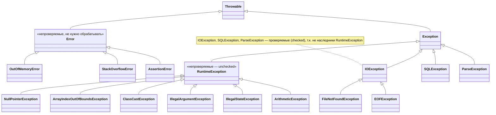

# Лекция 4: Вложенные классы, Обобщения, Исключения и Отладка

## Введение

Добро пожаловать на четвёртую лекцию курса «Современные технологии программирования». На предыдущих занятиях мы освоили основы Java — классы, интерфейсы, массивы и другие фундаментальные конструкции. Сегодня мы углубимся в более продвинутые механизмы языка: разберёмся, как и зачем создавать классы внутри других классов, познакомимся с вложенными интерфейсами, научимся писать универсальный типобезопасный код с помощью обобщений (Generics), а также изучим систему исключений Java — как правильно обрабатывать ошибки и создавать надёжные программы. А в конце возьмём в руки отладчик — инструмент, который останавливает программу в любой точке и показывает, что в ней происходит на самом деле: научимся ставить точки останова, идти по программе шагами и ловить ошибку, которая не падает, а тихо считает неправильно.

---

## Часть 1: Вложенные классы (Nested Classes)

### 1.1 Зачем нужны вложенные классы?

Представьте, что вы проектируете класс `Order` (Заказ). У него есть внутренняя концепция `OrderItem` (Позиция заказа). `OrderItem` не имеет смысла без `Order` — нельзя иметь позицию заказа без самого заказа. В таких случаях логично сделать `OrderItem` вложенным классом внутри `Order`.

**Преимущества вложенных классов:**
- Группировка логически связанных классов
- Повышение инкапсуляции (вложенный класс может иметь доступ к приватным членам внешнего)
- Улучшение читаемости кода

В Java есть несколько видов вложенных классов:

| Вид | Ключевое слово | Доступ к внешнему классу |
|-----|----------------|--------------------------|
| Нестатический внутренний класс | (без `static`) | Да, ко всем членам |
| Статический вложенный класс | `static` | Нет (только к статическим) |

Давайте разберём каждый из этих видов подробнее.

### 1.2 Нестатический внутренний класс (Non-static Inner Class)

Нестатический внутренний класс — это класс, объявленный внутри другого класса **без** ключевого слова `static`. Он **всегда связан с экземпляром** внешнего класса.

**Аналогия:** Представьте строение дома. Комнаты внутри дома — это внутренние классы. Комната не существует без дома (внешнего класса), но у неё есть доступ ко всем ресурсам дома (электричество, водоснабжение — приватные поля). Вы не можете построить комнату, не построив сначала сам дом.

```java
class Outer {
    private String secret = "секрет внешнего класса";

    public class Inner {
        public void showSecret() {
            System.out.println("Доступ из Inner: " + secret);
        }
    }

    public static void runInnerExample() {
        Outer outer = new Outer();
        Outer.Inner inner = outer.new Inner();
        inner.showSecret();
    }
}
```

**Важно:** Чтобы создать экземпляр нестатического внутреннего класса извне, нужен экземпляр внешнего класса (`outer.new Inner()`).

**Историческое ограничение (до Java 16):** Нестатический внутренний класс **не мог содержать статических членов** (статических полей, методов и вложенных классов), за исключением `static final` констант времени компиляции. **Начиная с Java 16** (JEP 395) это ограничение снято — внутренние классы могут объявлять статические поля и методы:
```java
class Outer {
    class Inner {
        static final int CONSTANT = 42;  // OK — константа времени компиляции (всегда работало)
        static int counter = 0;          // OK начиная с Java 16 (JEP 395)
    }
}
```

Обратите внимание на то, как работает разрешение имён, когда переменные с одинаковым именем существуют на разных уровнях — во внешнем классе, во внутреннем классе и в локальной области:

**Ссылка на внешний класс из внутреннего:**
```java
class Outer {
    int x = 10;

    class Inner {
        int x = 20;

        void display() {
            int x = 30;
            System.out.println(x);           // 30 — локальная переменная
            System.out.println(this.x);      // 20 — поле Inner
            System.out.println(Outer.this.x); // 10 — поле Outer
        }
    }
}
```

### 1.3 Статический вложенный класс (Static Nested Class)

Статический вложенный класс объявляется с ключевым словом `static`. Он **не связан** с экземпляром внешнего класса и не имеет доступа к нестатическим членам внешнего класса. В отличие от нестатического внутреннего класса, статический вложенный **может содержать как статические, так и нестатические члены**.

**Аналогия:** Статический вложенный класс — это как отдельный офис внутри здания компании. Он находится в том же здании (внешнем классе), но работает самостоятельно и не зависит от конкретного этажа (экземпляра внешнего класса). Он может пользоваться общими ресурсами здания (статическими полями), но не имеет ключей от чужих кабинетов (нестатических полей).

```java
class Container {
    static int staticValue = 42;

    static class StaticNested {
        void printInfo() {
            System.out.println("Статическое значение: " + staticValue);
        }
    }

    public static void runStaticNestedExample() {
        Container.StaticNested nested = new Container.StaticNested();
        nested.printInfo();
    }
}
```

Один из самых частых случаев использования статических вложенных классов на практике — паттерн Builder. Давайте рассмотрим его.

**Практический пример — Builder pattern:**
```java
public class Person {
    private final String firstName;
    private final String lastName;
    private final int age;

    private Person(Builder builder) {
        this.firstName = builder.firstName;
        this.lastName = builder.lastName;
        this.age = builder.age;
    }

    // Статический вложенный класс Builder
    public static class Builder {
        private String firstName;
        private String lastName;
        private int age;

        public Builder firstName(String firstName) {
            this.firstName = firstName;
            return this;
        }

        public Builder lastName(String lastName) {
            this.lastName = lastName;
            return this;
        }

        public Builder age(int age) {
            this.age = age;
            return this;
        }

        public Person build() {
            return new Person(this);
        }
    }

    @Override
    public String toString() {
        return firstName + " " + lastName + " (" + age + ")";
    }
}

// Использование:
Person person = new Person.Builder()
    .firstName("Иван")
    .lastName("Петров")
    .age(25)
    .build();
System.out.println(person); // Иван Петров (25)
```

**Дополнительно:** Вложенные классы (как статические, так и нестатические) могут наследоваться от других классов, **не связанных** с внешним классом, а также реализовывать любые интерфейсы, включая вложенные.

---

## Часть 2: Вложенные интерфейсы (Nested Interfaces)

Теперь, когда мы разобрались с вложенными классами, давайте поговорим о вложенных интерфейсах. Идея похожа: интерфейс можно объявить внутри класса или внутри другого интерфейса.

**Особенности вложенных интерфейсов:**
- Вложенный интерфейс **всегда является `static`** по умолчанию, даже если это явно не указано
- Вложенный интерфейс внутри класса может быть любой видимости (`public`, `private`, `protected`, package-private)
- Вложенный интерфейс внутри интерфейса **всегда** неявно `public static`
- Вложенный интерфейс может быть реализован как самим внешним классом, так и **любым другим классом**

```java
// Вложенный интерфейс внутри класса
class Machine {
    public interface PowerSwitch {
        void turnOn();
        void turnOff();
    }

    public static class Engine implements PowerSwitch {
        public void turnOn() {
            System.out.println("Двигатель включён");
        }

        public void turnOff() {
            System.out.println("Двигатель выключен");
        }
    }

    public static void runInterfaceInClassExample() {
        PowerSwitch ps = new Engine();
        ps.turnOn();
        ps.turnOff();
    }
}
```

**Вложенный интерфейс внутри интерфейса:**
```java
// Вложенный интерфейс внутри интерфейса (неявно public static)
interface Device {
    void start();

    interface Status {
        int READY = 1;
        int ERROR = -1;
    }
}

class Printer implements Device {
    public void start() {
        System.out.println("Принтер запущен. Статус: " + Status.READY);
    }

    public static void runInterfaceInInterfaceExample() {
        new Printer().start();
    }
}
```

---

## Часть 3: Обобщения (Generics)

Переходим к одной из самых мощных и в то же время непростых тем в Java — обобщениям. Если вложенные классы помогают нам организовать код, то обобщения позволяют сделать его по-настоящему универсальным и типобезопасным.

### 3.1 Зачем нужны обобщения?

До появления обобщений в Java 5 коллекции работали с типом `Object`, что порождало проблемы:

```java
// БЕЗ обобщений (Java до 5):
List list = new ArrayList();
list.add("Строка");
list.add(42);           // Можно добавить что угодно!

String s = (String) list.get(0);  // Нужно приведение типа
Integer i = (Integer) list.get(0); // ClassCastException в рантайме!
```

Вы могли заметить, что такой код компилируется без ошибок, но падает при выполнении. Это самый неприятный вид ошибок — те, которые обнаруживаются только во время работы программы. Обобщения решают именно эту проблему.

**С обобщениями (Java 5+):**
```java
List<String> list = new ArrayList<>();
list.add("Строка");
// list.add(42); // Ошибка КОМПИЛЯЦИИ — безопасно!

String s = list.get(0); // Приведение не нужно
```

**Обобщения обеспечивают:**
1. **Типобезопасность** на этапе компиляции
2. **Устранение приведения типов** (`cast`)
3. **Возможность написания универсального кода**

### 3.2 Параметры типа

Обобщённый класс принимает один или несколько параметров типа:

```java
// Обобщённый класс — хранит значение любого типа
class Box<T> {
    private T value;

    public void set(T value) {
        this.value = value;
    }

    public T get() {
        return value;
    }
}

// Обобщённый интерфейс
interface Transformer<T> {
    T transform(T input);
}

class UpperCaseTransformer implements Transformer<String> {
    public String transform(String input) {
        return input.toUpperCase();
    }
}

// Использование:
Box<String> strBox = new Box<>();
strBox.set("Привет");
System.out.println("Box: " + strBox.get());

Transformer<String> transformer = new UpperCaseTransformer();
System.out.println("Transform: " + transformer.transform("hello"));
```

**Принятые соглашения по именованию параметров типа:**

| Буква | Значение |
|-------|----------|
| `T` | Type (тип общего назначения) |
| `E` | Element (элемент коллекции) |
| `K` | Key (ключ Map) |
| `V` | Value (значение Map) |
| `N` | Number (числовой тип) |
| `R` | Return type (тип возвращаемого значения) |

### 3.3 Ограниченные параметры типа (Bounded Type Parameters)

Иногда нам нужно не просто любое значение типа `T`, а значение с определёнными свойствами. Можно ограничить параметр типа с помощью `extends`:

```java
// T должен быть Number или его наследником
class NumberBox<T extends Number> {
    private T number;

    public NumberBox(T number) {
        this.number = number;
    }

    // Можем вызывать методы Number, так как T extends Number
    public double doubleValue() {
        return number.doubleValue();
    }
}

// Использование:
NumberBox<Integer> nb = new NumberBox<>(123);
System.out.println("Double value: " + nb.doubleValue());

// Ошибка компиляции:
// NumberBox<String> strBox = new NumberBox<>("text");
```

**Множественные ограничения:**
```java
// T должен реализовывать оба интерфейса
public <T extends Comparable<T> & Cloneable> T max(T a, T b) {
    return a.compareTo(b) >= 0 ? a : b;
}
```

### 3.4 Обобщённые методы

Обобщения можно применять не только к классам, но и к отдельным методам:

```java
public class Utils {

    // Обобщённый метод — тип T определяется при вызове
    public static <T> void swap(T[] array, int i, int j) {
        T temp = array[i];
        array[i] = array[j];
        array[j] = temp;
    }

    // Обобщённый метод с ограничением
    public static <T extends Comparable<T>> T findMax(T[] array) {
        if (array == null || array.length == 0) {
            throw new IllegalArgumentException("Массив пуст");
        }
        T max = array[0];
        for (T element : array) {
            if (element.compareTo(max) > 0) {
                max = element;
            }
        }
        return max;
    }
}

// Использование:
Integer[] numbers = {3, 1, 4, 1, 5, 9, 2, 6};
Utils.swap(numbers, 0, 7);  // [6, 1, 4, 1, 5, 9, 2, 3]

String maxStr = Utils.findMax(new String[]{"banana", "apple", "cherry"});
System.out.println(maxStr); // cherry
```

### 3.5 Стирание типов (Type Erasure)

Это важный момент: **параметры типа существуют только во время компиляции**. В байт-коде они заменяются на `Object` (или на верхнюю границу, если указана). Этот механизм называется стиранием типов.

**Почему так?** Для обратной совместимости с кодом, написанным до Java 5.

```java
List<String> strings = new ArrayList<>();
List<Integer> integers = new ArrayList<>();

// В байт-коде оба будут ArrayList
System.out.println(strings.getClass() == integers.getClass()); // true!

// Нельзя:
// if (obj instanceof List<String>) {} // Ошибка компиляции!

// Можно (без параметра типа):
if (obj instanceof List<?>) {} // OK
```

**Следствия стирания типов — что нельзя делать с параметрами типа:**
```java
public class Container<T> {
    // НЕЛЬЗЯ:
    // T obj = new T();           // Нельзя создавать экземпляры T
    // T[] array = new T[10];     // Нельзя создавать массивы T
    // if (obj instanceof T) {}   // Нельзя использовать instanceof с T
    // Class<T> c = T.class;      // Нельзя получить класс T

    // МОЖНО:
    T value;                      // Можно объявлять переменные типа T
    List<T> list = new ArrayList<>(); // Можно создавать коллекции
}
```

**Демонстрация стирания типов во время исполнения:**
```java
class TypeErasureDemo<T> {
    public void check(Object obj) {
        // if (obj instanceof T) {} — Ошибка: нельзя использовать instanceof с параметром типа
        System.out.println("Тип T стёрт до Object на этапе исполнения");
    }
}

// Использование:
TypeErasureDemo<String> ted = new TypeErasureDemo<>();
ted.check("Test");
```

**Подклассы могут расширять обобщённые классы двумя способами:**
```java
// 1. С конкретизацией типа — фиксируем T как String:
class StringBox extends Box<String> {}

// 2. С сохранением параметра типа — T передаётся дальше:
class GenericBox<T> extends Box<T> {}

// Использование:
StringBox sb = new StringBox();
sb.set("Generic Java");
System.out.println("StringBox: " + sb.get());

GenericBox<Double> gb = new GenericBox<>();
gb.set(3.14);
System.out.println("GenericBox<Double>: " + gb.get());
```

### 3.6 Wildcards (Подстановочные знаки)

Wildcard `?` означает "неизвестный тип". Он используется при работе с коллекциями разных типов. Давайте разберём три варианта использования wildcards.

#### Неограниченный Wildcard `?`

Первый и самый простой вариант — вообще без ограничений. Такой метод годится для любого списка, потому что внутри он только читает элементы как `Object` и ничего в список не добавляет.

```java
class WildcardDemo {
    // Метод печатает любой List, независимо от типа элементов
    public static void printList(List<?> list) {
        for (Object obj : list) {
            System.out.println("Элемент: " + obj);
        }
    }
}

// Использование:
List<String> words = Arrays.asList("one", "two", "three");
WildcardDemo.printList(words); // OK для любого List<?>
```

#### Upper Bounded Wildcard `? extends T`

**"Producer Extends"** — когда вы хотите **читать** из коллекции элементы типа T или его подтипов:

```java
class WildcardDemo {
    // Сумма всех чисел в списке (работает с List<Integer>, List<Double> и т.д.)
    public static double sumNumbers(List<? extends Number> list) {
        double sum = 0;
        for (Number n : list) {    // Безопасно читать как Number
            sum += n.doubleValue();
        }
        return sum;
    }
}

List<Integer> nums = Arrays.asList(1, 2, 3);
System.out.println("Сумма: " + WildcardDemo.sumNumbers(nums)); // 6.0

// НЕЛЬЗЯ добавлять в список с ? extends:
// list.add(5);  // Ошибка! Тип неизвестен (может быть List<Integer>, List<Double>...)
```

#### Lower Bounded Wildcard `? super T`

**"Consumer Super"** — когда вы хотите **записывать** в коллекцию элементы типа T:

```java
class WildcardDemo {
    // Добавляет числа в список (работает с List<Number>, List<Object>)
    public static void addIntegers(List<? super Integer> list) {
        list.add(10);  // Безопасно добавлять Integer
        list.add(20);
    }
}

List<Number> numberList = new ArrayList<>();
WildcardDemo.addIntegers(numberList); // OK
System.out.println("После добавления целых чисел: " + numberList);
// addIntegers(new ArrayList<Double>()); // Ошибка! Double не является super Integer
```

#### Мнемоническое правило PECS

Чтобы легко запомнить, когда какой wildcard использовать, воспользуйтесь правилом PECS:

**P**roducer **E**xtends, **C**onsumer **S**uper:
- Если структура **производит** данные (вы из неё читаете) → `? extends T`
- Если структура **потребляет** данные (вы в неё пишете) → `? super T`

```java
// Классический пример: копирование коллекции
public static <T> void copy(List<? super T> dest, List<? extends T> src) {
    for (T item : src) {   // src — producer, читаем из него
        dest.add(item);    // dest — consumer, пишем в него
    }
}
```

---

## Часть 4: Исключения (Exceptions)

Мы научились писать универсальный код с обобщениями, но даже самый хорошо типизированный код может столкнуться с непредвиденными ситуациями: файл не найден, сеть недоступна, пользователь ввёл некорректные данные. Для обработки таких ситуаций в Java существует система исключений.

### 4.1 Иерархия исключений

В Java исключения — это объекты. Все они наследуют от класса `Throwable`:



### 4.2 Checked vs Unchecked исключения

| Критерий | Checked | Unchecked |
|----------|---------|-----------|
| Наследуют от | `Exception` (но не `RuntimeException`) | `RuntimeException` или `Error` |
| Компилятор требует обработки | **Да** | Нет |
| Когда возникают | Предсказуемые ситуации (файл не найден, нет подключения) | Ошибки программиста (null, выход за границы массива) |
| Примеры | `IOException`, `SQLException` | `NPE`, `ArrayIndexOutOfBoundsException` |

**Философия:**
- **Checked** — "ожидаемые" проблемы, которые программа должна уметь обработать. Компилятор *заставляет* вас подумать об этих случаях.
- **Unchecked** — ошибки в коде, которые нужно **исправить**, а не обрабатывать. Например, `NullPointerException` означает ошибку программиста, а не внешнее условие.

### 4.3 Блок try-catch-finally

Давайте посмотрим, как выглядит обработка исключений на практике:

```java
class ExceptionFlowDemo {
    public void riskyMethod() throws IOException {
        throw new IOException("Ошибка ввода-вывода");
    }

    public void showFlow() {
        try {
            riskyMethod();
        } catch (IOException e) {
            System.out.println("Обработка IOException: " + e.getMessage());
        } finally {
            System.out.println("Блок finally выполнен");
        }
    }
}

// Использование:
new ExceptionFlowDemo().showFlow();
```

**Важные правила:**
- `catch` блоки проверяются **по порядку** — первый подходящий будет выполнен
- Более специфичные исключения должны идти **перед** более общими
- `finally` выполняется **всегда**, даже если было исключение, даже если в `catch` тоже возникло исключение

**Multi-catch (Java 7+):**
```java
try {
    // ...
} catch (IOException | SQLException e) {
    // Обработка нескольких типов в одном блоке
    System.out.println("Ошибка ввода/вывода или БД: " + e.getMessage());
}
```

### 4.4 Методы класса Throwable

Каждое исключение — это объект, а значит у него есть методы, которыми можно узнать, что именно произошло: `getMessage()` возвращает текст ошибки, `getClass()` — конкретный тип исключения, а `printStackTrace()` печатает всю цепочку вызовов, которая к нему привела.

```java
try {
    int[] arr = new int[5];
    arr[10] = 1; // ArrayIndexOutOfBoundsException
} catch (ArrayIndexOutOfBoundsException e) {
    System.out.println(e.getMessage());    // Сообщение об ошибке
    System.out.println(e.getClass().getName()); // Полное имя класса
    e.printStackTrace();                   // Полный стек вызовов в stderr
}
```

### 4.5 Оператор throw

`throw` используется для **явного бросания** исключения:

```java
// Unchecked exception — бросается неявно при делении на ноль
class Divider {
    public int divide(int a, int b) {
        return a / b; // может вызвать ArithmeticException
    }
}

// Checked exception — явно бросается через throw
class InvalidAgeException extends Exception {
    public InvalidAgeException(String msg) {
        super(msg);
    }
}

class Voter {
    public void register(int age) throws InvalidAgeException {
        if (age < 18)
            throw new InvalidAgeException("Возраст должен быть 18+");
        System.out.println("Регистрация успешна!");
    }
}

// Использование:
Divider d = new Divider();
try {
    System.out.println("Результат: " + d.divide(10, 0));
} catch (ArithmeticException e) {
    System.out.println("Ошибка: " + e.getMessage());
}

Voter voter = new Voter();
try {
    voter.register(16);
} catch (InvalidAgeException e) {
    System.out.println("Ошибка регистрации: " + e.getMessage());
}
```

### 4.6 Ключевое слово throws

Обратите внимание на разницу между `throw` и `throws` — это одно из мест, где начинающие часто путаются. `throw` бросает исключение, а `throws` в сигнатуре метода **объявляет**, что метод **может бросить** checked исключение:

```java
// Метод объявляет, что может бросить IOException
public String readFile(String path) throws IOException {
    // FileReader бросает FileNotFoundException (наследник IOException)
    FileReader fr = new FileReader(path);
    // ... чтение файла
    return content;
}

// Вызывающий код ОБЯЗАН обработать или пробросить дальше
public void processFile() {
    try {
        String content = readFile("data.txt");
        System.out.println(content);
    } catch (IOException e) {
        System.out.println("Файл не найден: " + e.getMessage());
    }
}

// ИЛИ пробросить дальше:
public void processFile() throws IOException {
    String content = readFile("data.txt"); // Пробрасываем вверх по стеку
}
```

#### Исключения при переопределении методов

Отдельная история — что происходит с `throws`, когда метод переопределяют в наследнике. Правило одно: **переопределяющий метод не может расширять список проверяемых исключений**. Он может объявить те же исключения, может заменить их наследниками, может убрать вовсе — но не может добавить новое, которого не было в базовом методе.

**Аналогия:** наследник — это сотрудник, который выходит вместо коллеги. Он вправе доставить меньше хлопот, чем обещал предшественник, но не больше: тот, кто с ним работает, готовился к старому списку проблем и о новых не предупреждён.

Причина техническая: вызывающий код работает через ссылку базового типа и обрабатывает ровно то, что объявлено в базовом методе. Если бы наследник мог бросить что-то ещё, `catch` на стороне вызывающего оказался бы неполным, а компилятор об этом не узнал бы.

```java
import java.io.FileNotFoundException;
import java.io.IOException;

class Storage {
    // Базовый метод объявляет проверяемое IOException
    public void read() throws IOException {
        System.out.println("Чтение из хранилища");
    }
}

class LocalFileStorage extends Storage {
    // МОЖНО: сужаем объявление до наследника IOException
    @Override
    public void read() throws FileNotFoundException {
        System.out.println("Чтение из локального файла");
    }
}

class MemoryStorage extends Storage {
    // МОЖНО: убрать throws совсем — реализация ничего проверяемого не бросает
    @Override
    public void read() {
        System.out.println("Чтение из памяти");
    }
}

class BrokenStorage extends Storage {
    // МОЖНО: непроверяемые исключения объявлять не нужно вообще
    @Override
    public void read() {
        throw new IllegalStateException("Хранилище повреждено");
    }

    // НЕЛЬЗЯ — не компилируется: Exception шире, чем IOException базового метода
    // @Override
    // public void read() throws Exception {
    //     throw new Exception("так не получится");
    // }
}

// Использование: вызывающий код знает только о базовом типе
class StorageClient {
    public static void useAll() {
        Storage[] storages = { new LocalFileStorage(), new MemoryStorage() };
        for (Storage s : storages) {
            try {
                s.read();               // компилятор видит throws IOException
            } catch (IOException e) {   // и требует обработать именно его
                System.out.println("Ошибка чтения: " + e.getMessage());
            }
        }
    }
}
```

Коротко, что разрешено переопределяющему методу:

| Что делает наследник | Разрешено? |
|----------------------|------------|
| Объявляет то же исключение | Да |
| Объявляет наследника исключения из базового метода | Да |
| Объявляет меньше исключений или ни одного | Да |
| Объявляет новое проверяемое исключение, которого не было в базовом методе | Нет — ошибка компиляции |
| Бросает любое непроверяемое (`RuntimeException`, `Error`) | Да, объявлять не требуется |

То же правило действует и при реализации интерфейсов: метод реализации не может объявить проверяемое исключение, отсутствующее в интерфейсе.

**Собственные исключения и наследование.** Когда вы наследуете своё исключение от `Exception` или `RuntimeException`, конструктор наследника обязан вызвать конструктор предка — иначе сообщение и первопричина потеряются:

```java
class DataLoadException extends Exception {
    public DataLoadException(String message) {
        super(message);                 // сообщение уйдёт в getMessage()
    }

    public DataLoadException(String message, Throwable cause) {
        super(message, cause);          // сохраняем первопричину (см. раздел 4.9)
    }
}
```

Если не передать `cause` дальше через `super(message, cause)`, цепочка `Caused by:` в стек-трейсе оборвётся, и разбираться с ошибкой придётся вслепую.

### 4.7 Создание собственных исключений

Иногда стандартных исключений недостаточно, и нам нужно описать специфичную для нашей предметной области ошибку. В таких случаях создаём собственный класс исключения:

```java
// Checked исключение — наследуем от Exception
class InvalidAgeException extends Exception {
    public InvalidAgeException(String msg) {
        super(msg);
    }
}

class Voter {
    public void register(int age) throws InvalidAgeException {
        if (age < 18)
            throw new InvalidAgeException("Возраст должен быть 18+");
        System.out.println("Регистрация успешна!");
    }
}

// Использование:
Voter voter = new Voter();
try {
    voter.register(16);
} catch (InvalidAgeException e) {
    System.out.println("Ошибка регистрации: " + e.getMessage());
}
```

### 4.8 Try-with-resources (Java 7+)

Ресурсы (файлы, соединения с БД, сетевые сокеты) должны быть закрыты после использования. Без try-with-resources это выглядит громоздко:

```java
// Без try-with-resources — много boilerplate кода:
FileReader fr = null;
try {
    fr = new FileReader("file.txt");
    // чтение...
} catch (IOException e) {
    e.printStackTrace();
} finally {
    if (fr != null) {
        try {
            fr.close(); // close() тоже может бросить IOException!
        } catch (IOException e) {
            e.printStackTrace();
        }
    }
}
```

Согласитесь, выглядит довольно громоздко. К счастью, начиная с Java 7, появилась конструкция try-with-resources, которая делает всё гораздо элегантнее.

**С try-with-resources — элегантно и безопасно:**
```java
// Ресурс автоматически закрывается при выходе из блока try
try (FileReader fr = new FileReader("file.txt");
     BufferedReader br = new BufferedReader(fr)) {

    String line;
    while ((line = br.readLine()) != null) {
        System.out.println(line);
    }
} catch (IOException e) {
    System.out.println("Ошибка чтения: " + e.getMessage());
}
// fr и br автоматически закрыты здесь, даже если было исключение
```

**Требование:** класс ресурса должен реализовывать интерфейс `AutoCloseable` (или `Closeable`):

```java
class ResourceDemo {
    public void readFromFile(String path) {
        try (BufferedReader br = new BufferedReader(new FileReader(path))) {
            System.out.println("Первая строка: " + br.readLine());
        } catch (IOException e) {
            System.out.println("Ошибка чтения: " + e.getMessage());
        }
    }
}

// Использование:
new ResourceDemo().readFromFile("example.txt");
// BufferedReader закрывается автоматически при выходе из блока try
```

### 4.9 Цепочка исключений (Exception Chaining)

Часто полезно сохранить оригинальное исключение при выбрасывании нового. Это позволяет не терять информацию о первопричине ошибки при перемещении между уровнями абстракции:

```java
public void loadUserData(int userId) throws DataLoadException {
    try {
        // Чтение из базы данных
        database.findUser(userId);
    } catch (SQLException e) {
        // Оборачиваем низкоуровневое исключение в высокоуровневое
        throw new DataLoadException("Не удалось загрузить данные пользователя " + userId, e);
    }
}

// Пользовательское исключение с причиной:
public class DataLoadException extends Exception {
    public DataLoadException(String message, Throwable cause) {
        super(message, cause); // Сохраняем исходное исключение
    }
}

// При выводе стека будет видна полная цепочка:
// DataLoadException: Не удалось загрузить данные пользователя 5
//   Caused by: SQLException: Connection refused
```

---

## Часть 5: Практические паттерны использования

Мы рассмотрели много теории. Теперь давайте закрепим всё, что изучили, обратив внимание на типичные решения и рекомендации.

### 5.1 Когда использовать нестатический vs статический вложенный класс?

**Нестатический внутренний класс** — когда:
- Вложенный класс нужен только вместе с внешним
- Нужен доступ к нестатическим членам внешнего класса
- Пример: `Iterator` внутри `LinkedList`

**Статический вложенный класс** — когда:
- Класс логически принадлежит внешнему, но может работать самостоятельно
- Вложенный класс не нужен экземпляр внешнего
- Примеры: `Builder`, `Entry` в `HashMap`, вспомогательные классы

### 5.2 Стратегия обработки исключений

```java
// ПРАВИЛЬНО: ловим конкретное исключение, обрабатываем осмысленно
try {
    int value = Integer.parseInt(input);
    process(value);
} catch (NumberFormatException e) {
    System.out.println("Введите корректное число");
} catch (ProcessingException e) {
    logger.error("Ошибка обработки", e);
    throw new ServiceException("Сервис недоступен", e);
}

// НЕПРАВИЛЬНО: ловим Exception и игнорируем
try {
    process(input);
} catch (Exception e) {
    // Не делайте так! "Swallowing exceptions"
}
```

**Правило:** Никогда не игнорируйте исключения молча. Как минимум — залогируйте их.

---

## Часть 6: Отладка (Debugging)

Мы научились бросать и ловить исключения, писать обобщённый код и прятать вспомогательные классы внутрь внешних. Но рано или поздно случится неизбежное: программа скомпилируется, запустится, не упадёт — и выдаст неправильный ответ. Компилятор здесь уже не помощник, он своё дело сделал. Помогает отладчик (debugger) — инструмент, который умеет остановить программу в любой точке и показать её изнутри.

**Аналогия:** представьте, что вы смотрите фильм и пытаетесь разглядеть номер машины, которая мелькнула в кадре. Можно пересматривать сцену снова и снова и надеяться, что успеете прочитать. А можно взять пульт, нажать паузу ровно на нужном кадре, увеличить изображение и спокойно всё рассмотреть. Отладчик — это тот самый пульт для вашей программы: пауза, покадровое воспроизведение, увеличение.

### 6.1 Почему `println()` — плохой отладчик

Первый инструмент, к которому тянется рука начинающего, — вывод в консоль:

```java
System.out.println("сюда дошли");
System.out.println("value = " + value);
```

Это работает, и иногда этого достаточно. Но у метода есть цена, и она растёт очень быстро:

| Проблема `println()` | Что даёт отладчик |
|----------------------|-------------------|
| Нужно заранее угадать, какую переменную печатать | Видны **все** переменные текущего кадра сразу |
| Каждая новая гипотеза — правка кода и перекомпиляция | Гипотеза проверяется на уже остановленной программе |
| Отладочные строки забываются и уезжают в репозиторий | Точки останова живут в настройках IDE, а не в коде |
| В цикле на 10 000 итераций консоль превращается в кашу | Условная точка останова срабатывает ровно один раз |
| Видно значение, но не видно, кто вызвал метод | Стек вызовов показывает всю цепочку |
| Нельзя «подкрутить» значение и посмотреть, что будет | Значение переменной меняется прямо во время выполнения |

Вывод в консоль остаётся полезным для долгоживущих серверов, где к процессу не подключиться, — там его роль берёт на себя логирование. Но при разработке на своей машине отладчик почти всегда быстрее.

Кстати, слово «баг» (bug — жучок) инженеры употребляли задолго до компьютеров: так называли неполадки в технике ещё во времена Эдисона. А знаменитой стала запись 1947 года — в реле вычислительной машины Mark II нашли залетевшую моль, подклеили её в журнал и подписали «первый реальный случай обнаружения жучка». Шутка как раз в том, что термин к тому моменту был уже привычным.

### 6.2 Запуск программы в режиме отладки

Обычный запуск и запуск в режиме отладки — это два разных режима работы JVM. В режиме отладки виртуальная машина поднимает специальный канал (JDWP — Java Debug Wire Protocol), по которому среда разработки может её останавливать и опрашивать.

#### IntelliJ IDEA

Проще всего: нажать на зелёный треугольник слева от метода `main` и выбрать **Debug**. IDEA сама создаст временную конфигурацию запуска.

Постоянную конфигурацию настраивают через **Run → Edit Configurations… → + → Application**:

| Поле | Что указывать |
|------|---------------|
| Name | Имя конфигурации, например «Отладка AverageCalculator» |
| Main class | Полное имя класса с методом `main`, например `ru.fa.debug.AverageCalculator` |
| Program arguments | Аргументы, попадающие в `String[] args` |
| VM options | Опции JVM: `-ea` (включить assert), `-Xmx512m` и прочие |
| Working directory | Каталог, относительно которого программа ищет файлы |
| Environment variables | Переменные окружения для процесса |

Запуск отладки — **Shift+F9** или кнопка с изображением жучка. Внизу открывается окно **Debug** с вкладками **Threads/Frames**, **Variables** и консолью.

#### VS Code

Нужны расширения Extension Pack for Java. Конфигурации хранятся в файле `.vscode/launch.json`:

```json
{
  "version": "0.2.0",
  "configurations": [
    {
      "type": "java",
      "name": "Отладка AverageCalculator",
      "request": "launch",
      "mainClass": "ru.fa.debug.AverageCalculator",
      "args": "",
      "vmArgs": "-ea",
      "console": "integratedTerminal"
    }
  ]
}
```

Запуск — **F5** или панель **Run and Debug** слева.

#### Подключение к уже запущенному приложению

Иногда программу нельзя запустить из IDE — она работает в контейнере или на тестовом сервере. Тогда JVM запускают с агентом отладки:

```bash
java -agentlib:jdwp=transport=dt_socket,server=y,suspend=n,address=*:5005 -jar app.jar
```

- `server=y` — JVM сама ждёт подключения отладчика;
- `suspend=n` — не замораживать старт (поставьте `y`, если ошибка происходит при инициализации);
- `address=*:5005` — порт, к которому подключается IDE.

В IDEA для этого создают конфигурацию **Remote JVM Debug**, в VS Code — конфигурацию с `"request": "attach"` и тем же портом.

### 6.3 Точки останова (Breakpoints)

Точка останова — это метка «останови программу здесь». В IntelliJ IDEA её ставят щелчком по левому полю редактора напротив строки (или **Ctrl+F8**), в VS Code — тем же щелчком или клавишей **F9**. Полный список всех расставленных точек — **Ctrl+Shift+F8** в IDEA и панель **BREAKPOINTS** в VS Code.

Простая точка останова на строке — только начало. Настоящая сила в её настройках: щелчок правой кнопкой по красному кружку открывает окно свойств.

| Тип точки останова | Когда срабатывает | Зачем нужна |
|--------------------|-------------------|-------------|
| Строчная (Line breakpoint) | Каждый раз перед выполнением строки | Базовый случай |
| Условная (Condition) | Только если заданное выражение истинно | Поймать одну «плохую» итерацию из тысячи |
| По количеству попаданий (Pass count / Hit count) | Начиная с N-го попадания | Ошибка проявляется на 500-м элементе |
| На исключении (Exception breakpoint) | В момент выброса исключения заданного класса | Найти место, где рождается ошибка |
| Логирующая (Evaluate and log) | Срабатывает, но **не останавливает** | Заменяет `println()` без правки кода |
| На методе (Method breakpoint) | На входе в метод и/или выходе из него | Отследить все реализации интерфейса |
| На поле (Field watchpoint) | При чтении или записи поля | Найти, кто портит значение поля |

#### Условная точка останова

Самый полезный тип. В поле **Condition** пишется обычное Java-выражение, доступны все переменные, видимые в этой строке:

```java
// Условия, которые можно вписать в поле Condition:
row.toString().equals("abc")      // остановиться только на конкретном значении
count > 100 && sum == 0           // остановиться на подозрительной комбинации
user.getId() == 42L               // остановиться на конкретной записи
```

Выражение вычисляется в контексте той самой строки, где стоит точка останова, — переменные из других методов в нём не видны. И класс исключения условием не задаётся: для этого есть отдельная точка останова на исключении, где класс указывают прямо в диалоге **Java Exception Breakpoint** (см. раздел 6.7), а поле **Condition** служит там для дополнительной фильтрации — например, `getMessage().contains("For input string")`.

**Аналогия:** обычная точка останова — это консьерж, который звонит вам про каждого входящего в подъезд. Условная — консьерж, которому вы сказали: «звони, только если придёт курьер». Разница в количестве звонков — примерно как между тысячей и одним.

#### Точка останова по количеству попаданий

Если цикл обрабатывает 5000 записей, а ломается на 4783-й, условие писать не по чему — данные внешне одинаковые. Тогда в свойствах точки останова указывают **Pass count = 4783**: первые 4782 попадания будут пропущены молча.

#### Логирующая точка останова

В свойствах точки снимите галочку **Suspend** и включите **Evaluate and log**, вписав выражение (например, `"row=" + row + ", sum=" + sum`). Программа не остановится, но в консоль отладчика на каждом проходе попадёт строка. Это тот же `println()`, только он не живёт в исходниках и выключается одним щелчком. В VS Code такой инструмент называется **Logpoint** и обозначается ромбиком вместо кружка.

#### Отключение и заглушение

Точки останова можно временно отключить (снять галочку) или заглушить все разом — кнопка **Mute Breakpoints** в IDEA. Это удобно, когда вы уже нашли нужное место и хотите быстро досмотреть, чем закончится программа.

### 6.4 Пошаговое выполнение

Программа остановилась. Дальше вы двигаете её вручную — по одной строке.

| Команда | IntelliJ IDEA | VS Code | Что делает |
|---------|---------------|---------|------------|
| Step Over | F8 | F10 | Выполнить строку целиком; вызовы внутри неё выполняются, но не показываются |
| Step Into | F7 | F11 | Войти внутрь вызываемого метода |
| Force Step Into | Alt+Shift+F7 | — | Войти даже в библиотечный или синтетический метод |
| Step Out | Shift+F8 | Shift+F11 | Досчитать текущий метод до конца и вернуться к вызывающему |
| Run to Cursor | Alt+F9 | Ctrl+F10 | Выполнять до строки, где стоит курсор, без точки останова |
| Resume | F9 | F5 | Продолжить до следующей точки останова |
| Stop | Ctrl+F2 | Shift+F5 | Завершить отлаживаемый процесс |

**Когда что применять:**

- **Step Over** — рабочая лошадка. Идёте по своему методу и следите, как меняются переменные. Строку `list.sort(comparator)` тоже проходят Step Over: чужой отсортированный код вам не интересен.
- **Step Into** — когда подозреваете, что ошибка внутри вызываемого метода. Осторожно: на строке `process(getUser(id), getConfig())` шаг внутрь уведёт в первый по порядку вызов, а не обязательно в тот, который вам нужен. В IDEA для этого есть **Smart Step Into** (**Shift+F7**) — она предложит выбрать конкретный вызов из строки.
- **Step Out** — когда вы уже зашли слишком глубоко (например, случайно провалились в недра `ArrayList`) и хотите вернуться туда, откуда пришли.
- **Run to Cursor** — быстрый способ пропустить тело длинного цикла и оказаться сразу после него, не расставляя лишних точек останова.
- **Resume** — когда с текущим местом всё ясно и нужно дождаться следующего срабатывания.

### 6.5 Variables, Watches и Evaluate Expression

#### Окно Variables

Показывает все переменные, видимые в текущей точке: параметры метода, локальные переменные, `this` со всеми полями. Объекты раскрываются по стрелочке — можно провалиться внутрь списка, внутрь его элемента, внутрь поля элемента. Именно здесь вы отвечаете на главный вопрос отладки: «а какие данные тут на самом деле?»

#### Окно Watches

Сюда добавляют выражения, за которыми хочется следить постоянно. Они пересчитываются на каждом шаге:

```java
// Примеры выражений для Watches:
rows.size()
sum / count
user.getOrders().stream().filter(o -> o.isPaid()).count()
```

Watches удобны, когда нужное значение — не переменная, а результат вычисления, и когда за ним надо следить на протяжении многих шагов.

#### Evaluate Expression

Разовое вычисление любого выражения в контексте остановленной программы: **Alt+F8** в IDEA, панель **WATCH** или **Debug Console** в VS Code. Можно не только читать поля, но и вызывать методы:

```java
// Всё это можно выполнить прямо в Evaluate Expression:
sum / (count - 1)
rows.get(2).toString().trim()
new java.util.ArrayList<>(rows).subList(0, 2)
```

**Предупреждение:** вызов метода в Evaluate Expression выполняется по-настоящему. Если вы напишете `list.remove(0)`, элемент действительно удалится, и дальше программа пойдёт по другому пути. Вычислять выражения с побочными эффектами можно, но нужно понимать, что вы меняете состояние живой программы.

#### Изменение значения переменной

В IDEA выберите переменную в окне **Variables** и нажмите **F2** (то же самое делает пункт контекстного меню **Set Value…**). В VS Code дважды щёлкните по значению в панели **VARIABLES**. Введите новое значение — и программа продолжит выполняться уже с ним.

Зачем это нужно:

- **Проверить гипотезу, не перекомпилируя.** «Мне кажется, если бы `count` был 3, ответ был бы верным» — поставили 3, продолжили, посмотрели.
- **Дойти до редкой ветки.** Условие `if (balance < 0)` в жизни срабатывает раз в год. Поставили `balance = -1` и проверили обработчик прямо сейчас.
- **Обойти помеху.** Внешний сервис вернул `null`, а вам нужно отладить код, который идёт дальше, — подставили заглушку.

Ограничения: нельзя менять `final`-переменные, значения, вычисленные и «встроенные» компилятором, и переменные, до которых JVM оптимизировала доступ. И главное — изменение значения в отладчике **не исправляет код**. Это разведка, после которой всё равно надо править исходники.

### 6.6 Стек вызовов (Call Stack)

Каждый вызов метода кладёт на стек кадр (frame): в нём живут параметры и локальные переменные этого вызова. Когда метод завершается, кадр снимается. Окно **Frames** в IDEA (панель **CALL STACK** в VS Code) показывает всю стопку сверху вниз: от метода, в котором вы стоите, до `main`.

**Аналогия:** это стопка тарелок. Каждый новый вызов — тарелка сверху, возврат из метода — снятая тарелка. Достать что-то из середины, не разбирая стопку, нельзя, но посмотреть на любую тарелку — можно.

Щёлкните по любому кадру — и окно Variables покажет переменные **того** вызова. Это ключевой приём, когда метод получил некорректный аргумент: сам метод ни в чём не виноват, виноват тот, кто его вызвал, — поднимаемся на кадр выше и смотрим, откуда взялось плохое значение.

Полезные возможности:

- **Фильтрация библиотечных кадров.** Между вашими методами часто десятки кадров Spring или коллекций; их можно скрыть, чтобы видеть только свой код.
- **Drop Frame / Reset Frame (IDEA).** Откатывает текущий кадр и позволяет выполнить метод заново — удобно, если вы проскочили нужное место. Важно: побочные эффекты (записанные файлы, отправленные запросы, изменённые поля) при этом **не откатываются**.
- **Копирование стека.** Правой кнопкой — **Copy Stack** — чтобы приложить к отчёту об ошибке.

### 6.7 Отладка исключений

Стек-трейс в консоли отвечает на вопрос «где упало», но молчит про «с какими данными». К моменту, когда вы читаете распечатку, кадры уже сняты, и переменных больше нет. Отладчик умеет останавливаться **в момент выброса**, пока всё состояние ещё живо.

В IntelliJ IDEA: **Run → View Breakpoints… (Ctrl+Shift+F8) → + → Java Exception Breakpoints**, вписать класс исключения, например `java.lang.NumberFormatException`. Дальше выбирают режим:

| Настройка | Смысл |
|-----------|-------|
| Caught exception | Останавливаться, даже если исключение будет поймано в `catch` |
| Uncaught exception | Останавливаться только на тех, что никто не ловит |
| Condition | Дополнительное условие, например `getMessage().contains("For input string")` |

В VS Code аналог живёт в панели **BREAKPOINTS**: флажки **Caught Exceptions** и **Uncaught Exceptions**.

Особенно ценна такая точка останова для **проглоченных исключений** — тех, что попадают в пустой `catch` (мы называли это «swallowing exceptions» в разделе 5.2). Программа при этом не падает и ничего не печатает, а просто тихо считает неправильно. Найти такое место чтением логов невозможно, а точка останова на исключении показывает его мгновенно.

### 6.8 Разбор на примере: ищем ошибку отладчиком

Теория закончилась — берём программу с настоящей ошибкой. Она считает среднее по списку строк, пропуская те, что не разбираются в число.

```java
package ru.fa.debug;

import java.util.List;

public class AverageCalculator {

    /**
     * Считает среднее по строковым значениям.
     * Wildcard «? extends» из раздела 3.6: список мы только читаем.
     */
    public static double average(List<? extends CharSequence> rows) {
        double sum = 0;
        int count = 0;
        for (CharSequence row : rows) {
            try {
                sum += Double.parseDouble(row.toString().trim());
            } catch (NumberFormatException e) {
                // Некорректную строку просто пропускаем
            }
            count++;
        }
        return sum / count;
    }

    public static void main(String[] args) {
        List<String> rows = List.of("10", "20", "abc", "30");
        System.out.println("Среднее: " + average(rows));
    }
}
```

Запускаем. Ожидаем `20.0` (среднее от 10, 20 и 30), получаем:

```text
Среднее: 15.0
```

Программа не упала, исключение аккуратно поймано, ответ неверный. Идеальный случай для отладчика.

**Шаг 1. Ставим точку останова там, где виден результат.** Щёлкаем по левому полю напротив строки `return sum / count;` и запускаем в режиме отладки (**Shift+F9**). Программа останавливается, окно Variables показывает:

```text
rows  = {ImmutableCollections$ListN@721} size = 4
sum   = 60.0
count = 4
```

Первый вывод сделан за пять секунд: `sum` правильная (10 + 20 + 30 = 60), а `count` равен 4, хотя чисел было три. Виноват счётчик.

**Шаг 2. Проверяем гипотезу, не трогая код.** Открываем **Evaluate Expression** (**Alt+F8**) и вычисляем:

```java
sum / (count - 1)
```

Результат — `20.0`. Гипотеза «count лишний раз увеличивается» подтверждается. Обратите внимание: мы ничего не перекомпилировали.

**Шаг 3. Ловим момент выброса исключения.** Нужно увидеть, что именно происходит на строке `"abc"`. Ставим **Java Exception Breakpoint** на `java.lang.NumberFormatException` с режимом **Caught exception** и перезапускаем отладку. Программа останавливается не в нашем коде, а внутри JDK — в разборщике чисел, куда её увёл `Double.parseDouble`. Окно Frames показывает цепочку:

```text
readJavaFormatString:2054, FloatingDecimal (jdk.internal.math)
parseDouble:110, FloatingDecimal (jdk.internal.math)
parseDouble:792, Double (java.lang)
average:16, AverageCalculator (ru.fa.debug)
main:27, AverageCalculator (ru.fa.debug)
```

Верхние три кадра — внутренности JDK, и номера строк в них зависят от версии сборки, так что у вас цифры будут другими. Нас интересует первый свой кадр — `average`; ради таких случаев в разделе 6.6 и упоминалась фильтрация библиотечных кадров. Щёлкаем по кадру `average` — Variables показывают состояние нашего метода в этот момент:

```text
row   = "abc"
sum   = 30.0
count = 2
```

**Шаг 4. Идём по шагам и видим ошибку.** Сначала надо вернуться в свой код: щелчок по кадру в окне Frames только показывает его переменные, а выполнение по-прежнему стоит внутри JDK. Нажимаем **Step Out** (**Shift+F8**) несколько раз, пока в редакторе не окажется наш метод `average` — исключение как раз дойдёт до блока `catch`. (Тот же результат даёт **Run to Cursor** (**Alt+F9**), поставленный на строку `count++`.) Дальше идём **Step Over** (**F8**): блок `catch` ничего не делает — и следующей выполняется строка `count++`. В Variables `count` становится равным 3, хотя значение `"abc"` в `sum` не попало. Ошибка найдена: инкремент счётчика стоит **вне** `try`, поэтому считаются все строки, а не только успешно разобранные.

Тот же результат можно было получить условной точкой останова: поставить её на строку `sum += ...` с условием `row.toString().equals("abc")` — и попасть сразу в проблемную итерацию, не проходя первые две. А если бы в списке было 5000 строк и проблема возникала на 4783-й, помогла бы точка останова с **Pass count = 4783**.

**Шаг 5. Подтверждаем изменением переменной.** Не выходя из отладки, доходим до строки `return sum / count;`, выделяем `count` в окне Variables, нажимаем **F2** и вводим `3`. Продолжаем выполнение (**F9**):

```text
Среднее: 20.0
```

Диагноз подтверждён экспериментом на живой программе.

**Шаг 6. Исправляем код.** Теперь правка очевидна — счётчик должен увеличиваться только при успешном разборе:

```java
public static double average(List<? extends CharSequence> rows) {
    double sum = 0;
    int count = 0;
    for (CharSequence row : rows) {
        try {
            sum += Double.parseDouble(row.toString().trim());
            count++;  // считаем только успешно разобранные значения
        } catch (NumberFormatException e) {
            // Молча глотать исключение нельзя — как минимум сообщаем о пропуске
            System.out.println("Пропущена некорректная строка: " + row);
        }
    }
    if (count == 0) {
        throw new IllegalArgumentException("Нет ни одного корректного значения");
    }
    return sum / count;
}
```

Заодно мы закрыли ещё две проблемы, которые отладка вывела на свет. Во-первых, пустой `catch` — то самое «проглатывание» исключения из раздела 5.2; теперь пропуск строки хотя бы виден. Во-вторых, если корректных значений не окажется вовсе, старый код вернул бы `0.0 / 0`, а это для `double` не исключение, а тихое `NaN`, которое дальше отравит все расчёты. Явное `IllegalArgumentException` честнее.

### 6.9 Практические правила отладки

- **Сначала воспроизведите ошибку.** Пока вы не умеете вызывать её по требованию, отлаживать нечего.
- **Формулируйте гипотезу до нажатия F8.** «Проверяю, что count равен 4» — это отладка. «Пощёлкаю и посмотрю» — это трата времени.
- **Ставьте точку останова не там, где падает, а там, где данные ещё правильные.** Ошибка почти всегда рождается раньше, чем проявляется.
- **Не отлаживайте в холостом цикле.** Условие или Pass count дешевле, чем сто нажатий Resume.
- **Убирайте лишние точки останова.** Забытая точка в горячем методе превращает следующий запуск в мучение.
- **Изменение переменной — это разведка, а не исправление.** Найденную причину всё равно нужно устранить в коде и, по-хорошему, закрыть тестом.
- **Отладчик не заменяет логирование.** На своей машине работает отладчик, на сервере в проде — логи; это два инструмента для двух разных ситуаций.

---

## Часть 7: Дополнительные примеры

Вернёмся к обобщениям и исключениям и посмотрим, как они работают вместе в шаблоне, который вы встретите в любом реальном проекте.

### 7.1 Полный пример с обобщённым репозиторием

Паттерн `Repository<T, ID>` встречается почти в каждом проекте с базой данных: один обобщённый интерфейс описывает базовые CRUD-операции, а конкретные реализации подставляют свой тип сущности.

```java
// Интерфейс с обобщениями
public interface Repository<T, ID> {
    void save(T entity);
    Optional<T> findById(ID id);
    List<T> findAll();
    void delete(ID id);
}

// Реализация для конкретного типа
public class UserRepository implements Repository<User, Long> {
    private Map<Long, User> storage = new HashMap<>();
    private long nextId = 1;

    @Override
    public void save(User user) {
        if (user.getId() == null) {
            user.setId(nextId++);
        }
        storage.put(user.getId(), user);
    }

    @Override
    public Optional<User> findById(Long id) {
        return Optional.ofNullable(storage.get(id));
    }

    @Override
    public List<User> findAll() {
        return new ArrayList<>(storage.values());
    }

    @Override
    public void delete(Long id) {
        if (!storage.containsKey(id)) {
            throw new EntityNotFoundException("Пользователь не найден: " + id);
        }
        storage.remove(id);
    }
}
```

---

## Часть 8: Итоги

Соберём ключевые понятия сегодняшней лекции в одной таблице — от вложенных классов до отладки:

| Концепция | Ключевая идея |
|-----------|---------------|
| Нестатический внутренний класс | Связан с экземпляром внешнего, имеет доступ ко всем членам |
| Статический вложенный класс | Независим от экземпляра внешнего, доступ только к статическим членам |
| Вложенный интерфейс | Группирует контракты с внешним классом/интерфейсом |
| Обобщения | Типобезопасность на этапе компиляции |
| Стирание типов | Параметры типа удаляются в байт-коде |
| `? extends T` | Для чтения (Producer) |
| `? super T` | Для записи (Consumer) |
| Checked исключения | Обязательно обрабатывать, наследники Exception |
| Unchecked исключения | Ошибки кода, наследники RuntimeException |
| Исключения при переопределении | Наследник может сузить или убрать `throws`, но не расширить список проверяемых исключений |
| try-with-resources | Автоматическое закрытие ресурсов (AutoCloseable) |
| Точка останова (breakpoint) | Останавливает программу на нужной строке и даёт заглянуть внутрь |
| Условная точка останова | Срабатывает только когда истинно заданное выражение |
| Точка останова на исключении | Останавливает в момент выброса, до входа в `catch` |
| Step Over / Step Into / Step Out | Шаг через вызов, шаг внутрь вызова, выход из метода |
| Evaluate Expression | Вычисление произвольного выражения в контексте остановленной программы |
| Call Stack | Цепочка вызовов; переход по кадрам показывает, кто передал плохие данные |
