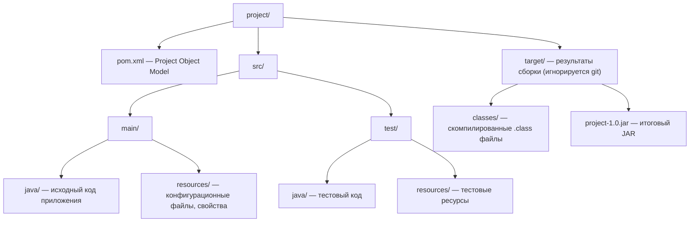
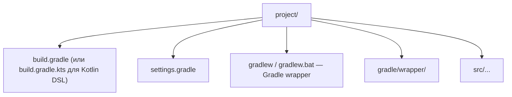
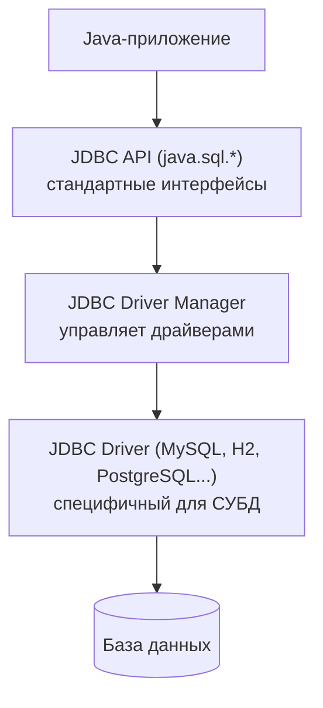
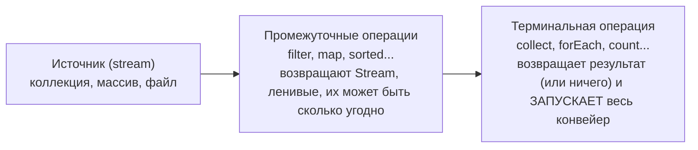

# Лекция 6: Системы сборки, JDBC, Hibernate, Stream API и транзакции

## Введение

Добро пожаловать на шестую лекцию курса «Современные технологии программирования». До сих пор мы писали код, компилировали его вручную и работали с данными прямо в памяти программы. Но реальные проекты устроены сложнее: в них десятки зависимостей, которые нужно подключать, тесты, которые нужно запускать, и данные, которые нужно надёжно хранить в базе данных. Сегодня мы разберём, как системы сборки (Maven и Gradle) автоматизируют рутину разработки, как Java-приложения взаимодействуют с базами данных через JDBC, что такое паттерн DAO и как ORM-фреймворк Hibernate избавляет нас от ручного написания SQL-запросов.

Дальше начинается то, что отличает учебный код от production-кода. Сначала мы посмотрим, что происходит с транзакциями, когда база обслуживает не вас одного, а десятки клиентов сразу: какие аномалии при этом возникают и как от них защищают уровни изоляции. А во второй половине лекции разберём Stream API — декларативный способ обрабатывать данные, которые вы достали из базы или из файла, не написав ни одного цикла.

---

## Часть 1: Системы автоматической сборки

### 1.1 Зачем нужны системы сборки?

Реальный Java-проект содержит:
- Десятки или сотни классов
- Зависимости от сторонних библиотек (библиотека логирования, HTTP-клиент, СУБД-драйвер)
- Тесты
- Ресурсы (конфигурационные файлы, изображения)

Без системы сборки всё это нужно вручную:
- Скачивать JAR-файлы зависимостей
- Прописывать classpath при компиляции
- Вручную запускать тесты
- Упаковывать всё в JAR для деплоя

Представьте, что вы готовите сложное блюдо, и вам приходится каждый раз самому ходить на ферму за яйцами, молоть муку и вручную разводить огонь. Система сборки — это ваша автоматизированная кухня, где все ингредиенты доставляются сами, а духовка включается по расписанию.

**Системы сборки автоматизируют всё это** + управление зависимостями.

### 1.2 Apache Maven

Maven — наиболее распространённая система сборки Java-проектов. Давайте разберём её ключевые концепции.

#### Стандартная структура проекта



#### Файл pom.xml

```xml
<?xml version="1.0" encoding="UTF-8"?>
<project xmlns="http://maven.apache.org/POM/4.0.0"
         xmlns:xsi="http://www.w3.org/2001/XMLSchema-instance"
         xsi:schemaLocation="http://maven.apache.org/POM/4.0.0
         http://maven.apache.org/xsd/maven-4.0.0.xsd">

    <modelVersion>4.0.0</modelVersion>

    <!-- GAV-координаты проекта -->
    <groupId>com.example</groupId>    <!-- Организация/группа -->
    <artifactId>my-app</artifactId>   <!-- Имя артефакта -->
    <version>1.0-SNAPSHOT</version>   <!-- Версия -->
    <packaging>jar</packaging>        <!-- Тип упаковки (jar/war/pom) -->

    <properties>
        <maven.compiler.source>21</maven.compiler.source>
        <maven.compiler.target>21</maven.compiler.target>
        <project.build.sourceEncoding>UTF-8</project.build.sourceEncoding>
    </properties>

    <dependencies>
        <!-- Зависимость от H2 базы данных -->
        <dependency>
            <groupId>com.h2database</groupId>
            <artifactId>h2</artifactId>
            <version>2.2.224</version>
        </dependency>

        <!-- Зависимость от Hibernate -->
        <dependency>
            <groupId>org.hibernate.orm</groupId>
            <artifactId>hibernate-core</artifactId>
            <version>6.4.0.Final</version>
        </dependency>

        <!-- Тестовая зависимость (только для тестов) -->
        <dependency>
            <groupId>org.junit.jupiter</groupId>
            <artifactId>junit-jupiter</artifactId>
            <version>5.10.0</version>
            <scope>test</scope>
        </dependency>
    </dependencies>

    <build>
        <plugins>
            <!-- Плагин для создания исполняемого JAR -->
            <plugin>
                <groupId>org.apache.maven.plugins</groupId>
                <artifactId>maven-jar-plugin</artifactId>
                <configuration>
                    <archive>
                        <manifest>
                            <mainClass>com.example.Main</mainClass>
                        </manifest>
                    </archive>
                </configuration>
            </plugin>
        </plugins>
    </build>
</project>
```

#### Жизненный цикл Maven

Это важный момент: Maven имеет предопределённые фазы. Каждая фаза включает все предыдущие — то есть, если вы запускаете `test`, Maven автоматически выполнит `validate` и `compile` перед этим:

| Фаза | Действие |
|------|----------|
| `validate` | Проверка корректности проекта |
| `compile` | Компиляция исходного кода |
| `test` | Запуск юнит-тестов |
| `package` | Упаковка в JAR/WAR |
| `verify` | Проверка качества пакета |
| `install` | Установка в локальный репозиторий |
| `deploy` | Публикация в удалённый репозиторий |

```bash
# Запуск команд Maven:
mvn compile          # Скомпилировать
mvn test             # Скомпилировать + запустить тесты
mvn package          # compile + test + создать JAR
mvn clean package    # Очистить target/, затем package
mvn install          # package + установить в ~/.m2/repository
mvn dependency:tree  # Показать дерево зависимостей
```

#### Область видимости зависимостей (scope)

```xml
<dependency>
    <scope>compile</scope>   <!-- По умолчанию — везде -->
    <scope>test</scope>      <!-- Только для тестов -->
    <scope>provided</scope>  <!-- Есть в рантайме (сервер), не включать в JAR -->
    <scope>runtime</scope>   <!-- Только в рантайме, не нужна при компиляции -->
</dependency>
```

#### Репозитории Maven

Maven ищет зависимости в порядке:
1. **Локальный репозиторий** (`~/.m2/repository`) — кэш на компьютере
2. **Центральный репозиторий** (Maven Central, `repo.maven.apache.org`)
3. **Дополнительные репозитории** (корпоративные, Spring repo и т.д.)

```xml
<repositories>
    <repository>
        <id>spring-releases</id>
        <url>https://repo.spring.io/release</url>
    </repository>
</repositories>
```

### 1.3 Gradle

Gradle — более современная система сборки, использующая Groovy или Kotlin DSL вместо XML. Если Maven можно сравнить с подробной инструкцией, где каждый шаг расписан в XML, то Gradle — это лаконичный скрипт, в котором вы описываете только то, что действительно важно.

#### Стандартная структура (аналогична Maven)



**Gradle Wrapper (`gradlew` / `gradlew.bat`)** — скрипт, который позволяет запускать сборку **без предварительной установки Gradle** на машине. Wrapper автоматически скачивает нужную версию Gradle, указанную в `gradle/wrapper/gradle-wrapper.properties`. Это гарантирует, что все разработчики в команде используют одинаковую версию Gradle.

#### build.gradle (Groovy DSL)

```groovy
plugins {
    id 'java'
    id 'application'
}

group = 'com.example'
version = '1.0-SNAPSHOT'

java {
    sourceCompatibility = JavaVersion.VERSION_21
    targetCompatibility = JavaVersion.VERSION_21
}

repositories {
    mavenCentral()  // Maven Central репозиторий
}

dependencies {
    implementation 'com.h2database:h2:2.2.224'
    implementation 'org.hibernate.orm:hibernate-core:6.4.0.Final'
    testImplementation 'org.junit.jupiter:junit-jupiter:5.10.0'
}

application {
    mainClass = 'com.example.Main'
}

test {
    useJUnitPlatform()
}
```

#### build.gradle.kts (Kotlin DSL — рекомендуется в новых проектах)

```kotlin
plugins {
    java
    application
}

group = "com.example"
version = "1.0-SNAPSHOT"

java {
    sourceCompatibility = JavaVersion.VERSION_21
    targetCompatibility = JavaVersion.VERSION_21
}

repositories {
    mavenCentral()
}

dependencies {
    implementation("com.h2database:h2:2.2.224")
    implementation("org.hibernate.orm:hibernate-core:6.4.0.Final")
    testImplementation("org.junit.jupiter:junit-jupiter:5.10.0")
}

application {
    mainClass = "com.example.Main"
}

tasks.test {
    useJUnitPlatform()
}
```

#### Жизненный цикл Gradle

```bash
./gradlew tasks         # Список всех задач
./gradlew compileJava   # Компиляция
./gradlew test          # Тесты
./gradlew build         # Полная сборка (compile + test + jar)
./gradlew clean build   # Очистка + сборка
./gradlew run           # Запуск приложения (с плагином application)
./gradlew dependencies  # Показать зависимости
```

Обратите внимание, как отличаются Maven и Gradle на практике:

**Maven vs Gradle:**

| | Maven | Gradle |
|---|---|---|
| Конфигурация | XML (verbose) | Groovy/Kotlin DSL (лаконичный) |
| Производительность | Медленнее | Быстрее (инкрементальная сборка) |
| Гибкость | Конвенционный | Очень гибкий |
| Распространённость | Широко используется | Растёт, Android обязателен |

---

Теперь, когда мы умеем собирать проекты, давайте перейдём к тому, без чего не обходится практически ни одно серьёзное приложение — работе с базами данных.

## Часть 2: Базы данных и JDBC

### 2.1 Что такое JDBC?

**JDBC (Java Database Connectivity)** — стандартный Java API для работы с реляционными базами данных. Он определяет интерфейсы, а конкретная реализация (драйвер) предоставляется производителем СУБД.

Представьте, что JDBC — это универсальная розетка. Стандарт один, а вилки (драйверы) у каждого производителя свои. Вашему приложению не нужно знать, как именно устроена конкретная база данных — достаточно «воткнуть» нужный драйвер.

**Архитектура JDBC:**


**Основные классы и интерфейсы:**

| Класс/Интерфейс | Назначение |
|-----------------|------------|
| `DriverManager` | Управление соединениями |
| `Connection` | Соединение с БД |
| `Statement` | Выполнение SQL-запросов |
| `PreparedStatement` | Предкомпилированный запрос с параметрами |
| `CallableStatement` | Вызов хранимых процедур |
| `ResultSet` | Результат запроса SELECT |

### 2.2 Базовая работа с JDBC

Давайте разберём пошагово, как выглядит типичная работа с базой данных через JDBC — от подключения до CRUD-операций.

```java
import java.sql.*;

// Строка подключения (Connection URL)
// H2 в памяти: jdbc:h2:mem:testdb
// H2 файловый: jdbc:h2:./data/mydb
// PostgreSQL:   jdbc:postgresql://localhost:5432/mydb
// MySQL:        jdbc:mysql://localhost:3306/mydb

String url = "jdbc:h2:mem:myapp;DB_CLOSE_DELAY=-1";

try (Connection conn = DriverManager.getConnection(url, "sa", "")) {
    System.out.println("Подключено к: " + conn.getMetaData().getURL());

    // 1. Создание таблицы
    String createSQL = """
        CREATE TABLE users (
            id      INT AUTO_INCREMENT PRIMARY KEY,
            name    VARCHAR(100) NOT NULL,
            email   VARCHAR(200) UNIQUE,
            age     INT
        )
        """;
    try (Statement stmt = conn.createStatement()) {
        stmt.execute(createSQL);
    }

    // 2. Вставка с PreparedStatement (защита от SQL Injection!)
    String insertSQL = "INSERT INTO users (name, email, age) VALUES (?, ?, ?)";
    try (PreparedStatement pstmt = conn.prepareStatement(insertSQL)) {
        pstmt.setString(1, "Иван Петров");
        pstmt.setString(2, "ivan@example.com");
        pstmt.setInt(3, 25);
        pstmt.executeUpdate();

        pstmt.setString(1, "Мария Сидорова");
        pstmt.setString(2, "maria@example.com");
        pstmt.setInt(3, 30);
        pstmt.executeUpdate();
    }

    // 3. Запрос SELECT
    // Важно: индексация столбцов в ResultSet начинается с 1, а не с 0!
    // Рекомендуется использовать имена столбцов (getString("name")) —
    // это безопаснее и читаемее, чем числовые индексы (getString(2))
    String selectSQL = "SELECT * FROM users WHERE age > ?";
    try (PreparedStatement pstmt = conn.prepareStatement(selectSQL)) {
        pstmt.setInt(1, 20);
        ResultSet rs = pstmt.executeQuery();
        while (rs.next()) {
            int id = rs.getInt("id");       // или rs.getInt(1)
            String name = rs.getString("name"); // или rs.getString(2)
            int age = rs.getInt("age");     // или rs.getInt(4)
            System.out.printf("id=%d, name=%s, age=%d%n", id, name, age);
        }
    }

    // 4. Обновление
    String updateSQL = "UPDATE users SET age = ? WHERE name = ?";
    try (PreparedStatement pstmt = conn.prepareStatement(updateSQL)) {
        pstmt.setInt(1, 26);
        pstmt.setString(2, "Иван Петров");
        int rows = pstmt.executeUpdate();
        System.out.println("Обновлено строк: " + rows);
    }

    // 5. Удаление
    String deleteSQL = "DELETE FROM users WHERE id = ?";
    try (PreparedStatement pstmt = conn.prepareStatement(deleteSQL)) {
        pstmt.setInt(1, 1);
        pstmt.executeUpdate();
    }
}
```

### 2.3 SQL Injection — почему нужен PreparedStatement?

Это важный момент: если вы подставляете пользовательский ввод прямо в SQL-строку, злоумышленник может выполнить произвольный SQL-код в вашей базе данных.

```java
// ОПАСНО — SQL Injection!
String userInput = "'; DROP TABLE users; --";
String badSQL = "SELECT * FROM users WHERE name = '" + userInput + "'";
// Результирующий SQL: SELECT * FROM users WHERE name = ''; DROP TABLE users; --'
// Это уничтожит таблицу!

// БЕЗОПАСНО — PreparedStatement экранирует параметры:
String safeSQL = "SELECT * FROM users WHERE name = ?";
try (PreparedStatement pstmt = conn.prepareStatement(safeSQL)) {
    pstmt.setString(1, userInput); // userInput обрабатывается как данные, не код
    ResultSet rs = pstmt.executeQuery();
    // Запрос выполнится безопасно — вернёт пустой результат
}
```

### 2.4 Транзакции

Транзакции гарантируют, что группа операций выполняется как единое целое: либо все успешно, либо ни одна. Классический пример — перевод денег между счетами.

```java
conn.setAutoCommit(false); // Начало транзакции
try {
    // Перевод денег — должно выполниться всё или ничего
    PreparedStatement debit = conn.prepareStatement(
        "UPDATE accounts SET balance = balance - ? WHERE id = ?"
    );
    debit.setDouble(1, 1000.0);
    debit.setInt(2, fromAccount);
    debit.executeUpdate();

    PreparedStatement credit = conn.prepareStatement(
        "UPDATE accounts SET balance = balance + ? WHERE id = ?"
    );
    credit.setDouble(1, 1000.0);
    credit.setInt(2, toAccount);
    credit.executeUpdate();

    conn.commit(); // Фиксируем транзакцию
    System.out.println("Перевод выполнен");
} catch (SQLException e) {
    conn.rollback(); // Откатываем при ошибке
    System.out.println("Ошибка, откат: " + e.getMessage());
} finally {
    conn.setAutoCommit(true); // Восстанавливаем автокоммит
}
```

### 2.5 DAO-паттерн (Data Access Object)

Вы могли заметить, что в примерах выше SQL-код перемешан с основной логикой программы. В небольшом примере это не проблема, но в реальном приложении такой подход быстро приводит к хаосу. DAO — паттерн проектирования, отделяющий логику доступа к данным от бизнес-логики.

**Преимущества DAO:**
- **Чистое разделение слоёв** — бизнес-логика не знает о SQL и JDBC
- **Тестируемость** — можно подменить реализацию DAO заглушкой (mock) в тестах
- **Заменяемость реализации** — можно переключиться с JDBC на Hibernate без изменения бизнес-логики

```java
// Модель (Entity)
public class Movie {
    private int id;
    private String title;
    private String genre;
    private int year;

    // Конструктор, геттеры, сеттеры...
}

// Интерфейс DAO
public interface MovieDAO {
    void createTable() throws SQLException;
    void insert(Movie movie) throws SQLException;
    Optional<Movie> findById(int id) throws SQLException;
    List<Movie> findAll() throws SQLException;
    List<Movie> findByGenre(String genre) throws SQLException;
    void update(Movie movie) throws SQLException;
    void delete(int id) throws SQLException;
}

// Реализация DAO
public class MovieDAOImpl implements MovieDAO {
    private final Connection connection;

    public MovieDAOImpl(Connection connection) {
        this.connection = connection;
    }

    @Override
    public void createTable() throws SQLException {
        String sql = """
            CREATE TABLE IF NOT EXISTS movies (
                id    INT AUTO_INCREMENT PRIMARY KEY,
                title VARCHAR(200) NOT NULL,
                genre VARCHAR(100),
                year  INT
            )
            """;
        try (Statement stmt = connection.createStatement()) {
            stmt.execute(sql);
        }
    }

    @Override
    public void insert(Movie movie) throws SQLException {
        String sql = "INSERT INTO movies (title, genre, year) VALUES (?, ?, ?)";
        try (PreparedStatement pstmt = connection.prepareStatement(sql,
                Statement.RETURN_GENERATED_KEYS)) {
            pstmt.setString(1, movie.getTitle());
            pstmt.setString(2, movie.getGenre());
            pstmt.setInt(3, movie.getYear());
            pstmt.executeUpdate();

            // Получаем сгенерированный ID
            try (ResultSet keys = pstmt.getGeneratedKeys()) {
                if (keys.next()) {
                    movie.setId(keys.getInt(1));
                }
            }
        }
    }

    @Override
    public Optional<Movie> findById(int id) throws SQLException {
        String sql = "SELECT * FROM movies WHERE id = ?";
        try (PreparedStatement pstmt = connection.prepareStatement(sql)) {
            pstmt.setInt(1, id);
            ResultSet rs = pstmt.executeQuery();
            if (rs.next()) {
                return Optional.of(mapRow(rs));
            }
        }
        return Optional.empty();
    }

    @Override
    public List<Movie> findAll() throws SQLException {
        List<Movie> movies = new ArrayList<>();
        String sql = "SELECT * FROM movies ORDER BY year";
        try (Statement stmt = connection.createStatement();
             ResultSet rs = stmt.executeQuery(sql)) {
            while (rs.next()) {
                movies.add(mapRow(rs));
            }
        }
        return movies;
    }

    @Override
    public List<Movie> findByGenre(String genre) throws SQLException {
        List<Movie> movies = new ArrayList<>();
        String sql = "SELECT * FROM movies WHERE LOWER(genre) = LOWER(?)";
        try (PreparedStatement pstmt = connection.prepareStatement(sql)) {
            pstmt.setString(1, genre);
            ResultSet rs = pstmt.executeQuery();
            while (rs.next()) {
                movies.add(mapRow(rs));
            }
        }
        return movies;
    }

    @Override
    public void update(Movie movie) throws SQLException {
        String sql = "UPDATE movies SET title=?, genre=?, year=? WHERE id=?";
        try (PreparedStatement pstmt = connection.prepareStatement(sql)) {
            pstmt.setString(1, movie.getTitle());
            pstmt.setString(2, movie.getGenre());
            pstmt.setInt(3, movie.getYear());
            pstmt.setInt(4, movie.getId());
            pstmt.executeUpdate();
        }
    }

    @Override
    public void delete(int id) throws SQLException {
        String sql = "DELETE FROM movies WHERE id = ?";
        try (PreparedStatement pstmt = connection.prepareStatement(sql)) {
            pstmt.setInt(1, id);
            pstmt.executeUpdate();
        }
    }

    // Вспомогательный метод маппинга ResultSet -> Movie
    private Movie mapRow(ResultSet rs) throws SQLException {
        Movie movie = new Movie();
        movie.setId(rs.getInt("id"));
        movie.setTitle(rs.getString("title"));
        movie.setGenre(rs.getString("genre"));
        movie.setYear(rs.getInt("year"));
        return movie;
    }
}
```

---

Мы научились работать с базами данных через JDBC, но вы наверняка заметили, сколько повторяющегося кода приходится писать: создание `PreparedStatement`, установка параметров, маппинг `ResultSet` в объекты. Давайте посмотрим, как ORM-фреймворки решают эту проблему.

## Часть 3: ORM и Hibernate

### 3.1 Что такое ORM?

**ORM (Object-Relational Mapping)** — технология отображения между объектами Java и таблицами реляционной БД.

**Проблема без ORM:** Разработчик вручную пишет SQL для каждой операции CRUD, вручную маппит ResultSet в объекты и обратно. Это скучно, трудоёмко и источник ошибок.

**С ORM:** Вы описываете маппинг между классом и таблицей, а ORM-фреймворк генерирует SQL автоматически.

| Java-класс `Movie` | Таблица `movies` |
|---------------------|-------------------|
| поле `id` | столбец `id` (PRIMARY KEY) |
| поле `title` | столбец `title` |
| поле `genre` | столбец `genre` |
| поле `year` | столбец `year` |

### 3.2 Hibernate — главный ORM для Java

Hibernate — самый популярный ORM-фреймворк для Java, реализующий стандарт JPA (Jakarta Persistence API). Давайте разберём, как он устроен.

#### Entity-класс с JPA-аннотациями

```java
import jakarta.persistence.*;

@Entity                         // Этот класс является сущностью JPA
@Table(name = "movies")         // Маппинг на таблицу movies
public class Movie {

    @Id                         // Первичный ключ
    @GeneratedValue(strategy = GenerationType.IDENTITY) // AUTO_INCREMENT
    private Integer id;

    @Column(name = "title", nullable = false, length = 200)
    private String title;

    @Column(name = "genre", length = 100)
    private String genre;

    @Column(name = "year")
    private Integer year;

    // Обязательный конструктор без аргументов для JPA
    public Movie() {}

    public Movie(String title, String genre, int year) {
        this.title = title;
        this.genre = genre;
        this.year = year;
    }

    // Геттеры и сеттеры...

    @Override
    public String toString() {
        return String.format("Movie{id=%d, title='%s', genre='%s', year=%d}",
            id, title, genre, year);
    }
}
```

#### Конфигурация Hibernate (hibernate.cfg.xml)

```xml
<?xml version="1.0" encoding="utf-8"?>
<!DOCTYPE hibernate-configuration PUBLIC
        "-//Hibernate/Hibernate Configuration DTD 3.0//EN"
        "http://www.hibernate.org/dtd/hibernate-configuration-3.0.dtd">
<hibernate-configuration>
    <session-factory>
        <!-- Параметры подключения к H2 -->
        <property name="hibernate.connection.driver_class">org.h2.Driver</property>
        <property name="hibernate.connection.url">jdbc:h2:mem:moviedb;DB_CLOSE_DELAY=-1</property>
        <property name="hibernate.connection.username">sa</property>
        <property name="hibernate.connection.password"></property>

        <!-- Диалект H2 -->
        <property name="hibernate.dialect">org.hibernate.dialect.H2Dialect</property>

        <!-- Автоматическое создание таблиц -->
        <!-- create: удалить и создать заново при каждом запуске -->
        <!-- update: обновить схему если нужно -->
        <!-- validate: только проверить схему -->
        <!-- none: ничего не делать -->
        <property name="hibernate.hbm2ddl.auto">create</property>

        <!-- Вывод SQL в консоль (для разработки) -->
        <property name="hibernate.show_sql">true</property>
        <property name="hibernate.format_sql">true</property>

        <!-- Регистрация сущностей -->
        <mapping class="com.example.Movie"/>
    </session-factory>
</hibernate-configuration>
```

#### Основная работа с Hibernate

Обратите внимание на два ключевых объекта в Hibernate: `SessionFactory` и `Session`. `SessionFactory` — это тяжеловесная «фабрика», которая создаётся один раз при старте приложения. `Session` — это легковесный объект для одной единицы работы, подобно тому, как вы открываете и закрываете отдельные транзакции в банке.

```java
import org.hibernate.*;
import org.hibernate.cfg.Configuration;

public class HibernateDemo {
    public static void main(String[] args) {
        // Создание SessionFactory — дорогая операция, делать ОДИН РАЗ на приложение.
        // SessionFactory — потокобезопасный (thread-safe), тяжеловесный объект.
        SessionFactory sessionFactory = new Configuration()
            .configure("hibernate.cfg.xml")
            .buildSessionFactory();

        // Session — легковесный объект, создаётся для каждой единицы работы.
        // Session НЕ потокобезопасна (not thread-safe) — нельзя разделять между потоками.

        // СОХРАНЕНИЕ (CREATE)
        try (Session session = sessionFactory.openSession()) {
            Transaction tx = session.beginTransaction();

            Movie m1 = new Movie("Матрица", "Фантастика", 1999);
            Movie m2 = new Movie("Начало", "Фантастика", 2010);
            Movie m3 = new Movie("Волк с Уолл-стрит", "Драма", 2013);

            session.persist(m1); // Hibernate создаёт INSERT
            session.persist(m2);
            session.persist(m3);

            tx.commit();
            System.out.println("Фильмы сохранены");
        }

        // ПОИСК ПО ID (READ)
        try (Session session = sessionFactory.openSession()) {
            Movie movie = session.get(Movie.class, 1); // SELECT WHERE id=1
            System.out.println("Найден: " + movie);
        }

        // ОБНОВЛЕНИЕ ЧЕРЕЗ HQL
        try (Session session = sessionFactory.openSession()) {
            Transaction tx = session.beginTransaction();

            int updated = session.createMutationQuery(
                "UPDATE Movie SET year = :year WHERE title = :title"
            )
            .setParameter("year", 1998)
            .setParameter("title", "Матрица")
            .executeUpdate();

            tx.commit();
            System.out.println("Обновлено: " + updated);
        }

        // ПОИСК ЧЕРЕЗ HQL (Hibernate Query Language)
        try (Session session = sessionFactory.openSession()) {
            List<Movie> scifiMovies = session.createQuery(
                "FROM Movie WHERE genre = :genre ORDER BY year",
                Movie.class
            )
            .setParameter("genre", "Фантастика")
            .list();

            System.out.println("Фантастика:");
            scifiMovies.forEach(System.out::println);
        }

        // CRITERIA API (типобезопасный, без строк)
        try (Session session = sessionFactory.openSession()) {
            CriteriaBuilder cb = session.getCriteriaBuilder();
            CriteriaQuery<Movie> cq = cb.createQuery(Movie.class);
            Root<Movie> root = cq.from(Movie.class);

            // WHERE year > 2000 AND genre = 'Фантастика'
            cq.select(root).where(
                cb.and(
                    cb.greaterThan(root.get("year"), 2000),
                    cb.equal(root.get("genre"), "Фантастика")
                )
            ).orderBy(cb.asc(root.get("year")));

            List<Movie> result = session.createQuery(cq).list();
            System.out.println("Новая фантастика: " + result);
        }

        // УДАЛЕНИЕ
        try (Session session = sessionFactory.openSession()) {
            Transaction tx = session.beginTransaction();
            Movie toDelete = session.get(Movie.class, 3);
            if (toDelete != null) {
                session.remove(toDelete);
                System.out.println("Удалён: " + toDelete);
            }
            tx.commit();
        }

        sessionFactory.close();
    }
}
```

### 3.3 HQL vs JPQL vs Criteria API

У Hibernate есть два основных способа строить запросы. Давайте сравним их.

| | HQL/JPQL | Criteria API |
|---|---|---|
| Синтаксис | Строки (как SQL, но с именами классов) | Java-код (типобезопасный) |
| Ошибки | В рантайме | На этапе компиляции |
| Читаемость | Выше для простых запросов | Сложнее для сложных |
| Динамические запросы | Сложно | Легко |

```java
// HQL — строки, опечатки обнаружатся в рантайме
session.createQuery("FROM Moive WHERE genre = :genre", Movie.class) // Опечатка!

// Criteria API — типобезопасно, опечатки найдёт компилятор
cq.from(Movie.class) // Movie — имя класса, не строка
root.get("gendre")   // Ошибка обнаружится в рантайме при первом запросе
```

### 3.4 Связи между сущностями

В реляционных базах данных таблицы связаны друг с другом через внешние ключи. Hibernate позволяет описывать эти связи прямо в Java-классах с помощью аннотаций.

```java
// Один ко многим: Режиссёр -> Фильмы
@Entity
public class Director {
    @Id @GeneratedValue(strategy = GenerationType.IDENTITY)
    private Integer id;
    private String name;

    @OneToMany(mappedBy = "director", cascade = CascadeType.ALL)
    private List<Movie> movies = new ArrayList<>();
}

@Entity
public class Movie {
    // ... поля ...

    @ManyToOne(fetch = FetchType.LAZY)
    @JoinColumn(name = "director_id")
    private Director director;
}
```

Связь «один к одному» описывается аннотацией `@OneToOne`. Внешний ключ при этом лежит в таблице той стороны, где стоит `@JoinColumn`, — она и называется владеющей.

```java
// Один к одному: Фильм -> Подробное описание
@Entity
public class Movie {
    // ... остальные поля ...

    @OneToOne(cascade = CascadeType.ALL)
    @JoinColumn(name = "details_id")     // столбец details_id появится в таблице movies
    private MovieDetails details;
}

@Entity
public class MovieDetails {
    @Id @GeneratedValue(strategy = GenerationType.IDENTITY)
    private Integer id;

    @Column(length = 2000)
    private String description;

    private Long budget;

    @OneToOne(mappedBy = "details")      // обратная сторона: своего внешнего ключа не имеет
    private Movie movie;
}
```

«Многие ко многим» — единственная связь, которой в базе нужна отдельная таблица-связка: у фильма много актёров, у актёра много фильмов, и уместить такой список в один столбец негде. Таблицу-связку описывает аннотация `@JoinTable`.

```java
// Многие ко многим: Фильмы <-> Актёры
@Entity
public class Movie {
    // ... остальные поля ...

    @ManyToMany
    @JoinTable(
        name = "movie_actor",                                // таблица-связка
        joinColumns = @JoinColumn(name = "movie_id"),        // ключ на эту сущность
        inverseJoinColumns = @JoinColumn(name = "actor_id")  // ключ на противоположную
    )
    private List<Actor> actors = new ArrayList<>();
}

@Entity
public class Actor {
    @Id @GeneratedValue(strategy = GenerationType.IDENTITY)
    private Integer id;

    private String name;

    @ManyToMany(mappedBy = "actors")     // владелец связи — Movie
    private List<Movie> movies = new ArrayList<>();
}
```

Сводка по четырём видам связей:

| Аннотация | Пример | Где хранится внешний ключ |
|-----------|--------|---------------------------|
| `@OneToOne` | Фильм — описание | В таблице владеющей стороны (там, где `@JoinColumn`) |
| `@ManyToOne` | Фильм — режиссёр | В таблице «многих»: `movies.director_id` |
| `@OneToMany` | Режиссёр — фильмы | Там же; это обратная сторона `@ManyToOne` |
| `@ManyToMany` | Фильмы — актёры | В отдельной таблице-связке `movie_actor` |

Запомните правило `mappedBy`: его ставят на стороне, которая НЕ владеет связью, и указывают в нём имя поля с противоположной стороны. Забудете — Hibernate решит, что перед ним две независимые связи, и создаст лишний внешний ключ или лишнюю таблицу-связку.

### 3.5 JPA и Hibernate: спецификация и реализация

Вы наверняка заметили странность: аннотации мы импортируем из `jakarta.persistence.*`, а классы `Session` и `Configuration` — из `org.hibernate.*`. Пора объяснить, почему пакетов два.

**JPA (Jakarta Persistence API)** — это спецификация: набор интерфейсов, аннотаций и правил, описывающих, как объекты отображаются на таблицы. Сама она ничего не делает, в ней нет кода, который ходит в базу. **Hibernate** — реализация этой спецификации: библиотека, которая действительно генерирует SQL, открывает соединения и следит за изменениями объектов.

Разница такая же, как между строительными нормами и бригадой, которая по ним строит: нормы описывают, каким должен получиться дом, а стены кладут люди. Пока вы пользуетесь только стандартными аннотациями и интерфейсами, бригаду можно сменить — заменить Hibernate на другую реализацию, например EclipseLink, не переделывая проект. Как только вы вызвали что-то из `org.hibernate.*` — вы привязались к конкретному исполнителю.

У каждого понятия JPA есть двойник в родном API Hibernate:

| JPA (стандарт) | Hibernate (родной API) | Назначение |
|----------------|------------------------|------------|
| `EntityManagerFactory` | `SessionFactory` | Тяжёлая фабрика, одна на приложение |
| `EntityManager` | `Session` | Одна единица работы |
| `EntityTransaction` | `Transaction` | Границы транзакции |
| `Persistence.createEntityManagerFactory("имя")` | `new Configuration().configure()` | Запуск (бутстрап) |
| JPQL | HQL | Язык запросов; HQL — надмножество JPQL |
| `META-INF/persistence.xml` | `hibernate.cfg.xml` | Файл конфигурации |

В Hibernate 6 это даже не разные объекты: интерфейс `Session` наследует `EntityManager`, а `SessionFactory` — `EntityManagerFactory`. Вот тот же код, но написанный на стандартном API:

```java
import jakarta.persistence.*;

// Имя "moviePU" — это <persistence-unit name="moviePU"> из META-INF/persistence.xml
EntityManagerFactory emf = Persistence.createEntityManagerFactory("moviePU");
EntityManager em = emf.createEntityManager();
EntityTransaction tx = em.getTransaction();
try {
    tx.begin();

    Movie movie = new Movie("Начало", "Фантастика", 2010);
    em.persist(movie);                       // аналог session.persist()

    Movie found = em.find(Movie.class, 1);   // аналог session.get()
    System.out.println(found);

    tx.commit();
} catch (RuntimeException e) {
    if (tx.isActive()) {
        tx.rollback();
    }
    throw e;
} finally {
    em.close();
}
emf.close();
```

#### Персистентный контекст и четыре состояния сущности

`EntityManager` (он же `Session`) — не просто «трубка» к базе. Внутри него живёт **персистентный контекст (persistence context)** — набор объектов, за которыми он следит. Это кэш первого уровня: если в одной сессии дважды запросить сущность с одним и тем же идентификатором, второго запроса к базе не будет, вы получите тот же самый объект в памяти.

Аналогия — черновик на вашем столе. Пока вы правите черновик, в архив ничего не уходит. В архив (в базу) правки уезжают одной пачкой, когда работа закончена — при сбросе изменений (`flush`), который обычно случается на коммите.

Отсюда четыре состояния, в которых может находиться объект-сущность:

| Состояние | Что это значит |
|-----------|----------------|
| **transient** (новый) | Обычный объект, созданный через `new`. Контекст о нём не знает, в базе его нет |
| **persistent** (управляемый) | Объект в персистентном контексте. Любое изменение его полей Hibernate сам превратит в `UPDATE` |
| **detached** (отсоединённый) | Был управляемым, но сессия закрылась. Строка в базе есть, а за изменениями полей больше никто не следит |
| **removed** (удалённый) | Помечен к удалению: `DELETE` уйдёт в базу при ближайшем `flush` |

Переходы между состояниями выполняют методы `EntityManager`:

| Метод | Переход |
|-------|---------|
| `persist(o)` | transient → persistent, `INSERT` при `flush` |
| `find(Movie.class, id)` | загружает строку и сразу делает объект persistent |
| `remove(o)` | persistent → removed, `DELETE` при `flush` |
| `detach(o)`, `clear()`, `close()` | persistent → detached |
| `merge(o)` | detached → persistent; возвращает НОВЫЙ управляемый объект, а исходный так и остаётся detached |

Понимание состояний сразу объясняет классическую ошибку новичка — правку объекта после закрытия сессии:

```java
Movie movie = em.find(Movie.class, 1);   // persistent
movie.setYear(1998);                     // UPDATE Hibernate сгенерирует сам, вызывать ничего не нужно
tx.commit();
em.close();

movie.setYear(2000);                     // ОШИБКА: объект уже detached, изменение никуда не уедет

// Чтобы вернуть его под управление, нужна новая сессия и merge:
EntityManager em2 = emf.createEntityManager();
em2.getTransaction().begin();
Movie managed = em2.merge(movie);        // ВНИМАНИЕ: следить будут за managed, а не за movie
managed.setYear(2000);
em2.getTransaction().commit();
em2.close();
```

### 3.6 Lombok: избавляемся от шаблонного кода

Вернёмся к самому первому примеру этой части — классу `Movie`. Там, где мы написали комментарий «Геттеры и сеттеры...», на самом деле должно быть штук восемь методов: геттер и сеттер на каждое поле, конструктор без аргументов для JPA, конструктор со всеми полями, да ещё `toString()`. Ни один из них не содержит ни капли логики — это чистый шаблон, который IDE с радостью сгенерирует автоматически, но который потом придётся читать, скроллить и держать синхронным с полями класса при каждой правке.

**Аналогия:** представьте нотариуса, который на каждой странице стопки документов должен поставить одну и ту же подпись. Можно расписываться вручную сто раз подряд — почерк не подведёт, но и удовольствия мало, а на сто первой странице рука дрогнет и подпись будет чуть другой. А можно один раз вырезать личную печать и просто прикладывать её — результат гарантированно одинаковый, и вместо ста подписей — одно движение. **Lombok** — это такая печать для Java-класса: вы описываете поля один раз, а стандартные методы вокруг них Lombok «прикладывает» сам во время компиляции.

Технически Lombok — это библиотека аннотаций, которая работает как процессор аннотаций (annotation processor): она встраивается в компиляцию и дописывает байт-код класса — методы физически появляются в `.class`-файле, просто вы их не видите в `.java`-файле. Из-за этого IDE должна знать про Lombok заранее: в IntelliJ IDEA нужен плагин Lombok (обычно уже встроен) и включённая опция *Enable annotation processing* в настройках, иначе IDE будет подчёркивать красным вызовы «несуществующих» геттеров.

Подключается зависимостью в `pom.xml`:

```xml
<dependency>
    <groupId>org.projectlombok</groupId>
    <artifactId>lombok</artifactId>
    <version>1.18.34</version>
    <scope>provided</scope>  <!-- нужен только при компиляции, в готовый JAR не попадает -->
</dependency>
```

Основные аннотации Lombok и их ручной эквивалент:

| Аннотация | Что генерирует |
|-----------|-----------------|
| `@Getter` / `@Setter` | Геттеры / сеттеры для всех полей класса (или для одного поля, если поставить над ним) |
| `@NoArgsConstructor` | Конструктор без аргументов — тот самый, обязательный для JPA-сущностей |
| `@AllArgsConstructor` | Конструктор со всеми полями в порядке объявления |
| `@RequiredArgsConstructor` | Конструктор только для `final`-полей и полей с `@NonNull` |
| `@ToString` | Метод `toString()`, перечисляющий поля |
| `@EqualsAndHashCode` | Пара `equals()`/`hashCode()` по полям класса |
| `@Data` | Всё сразу: `@Getter` + `@Setter` + `@ToString` + `@EqualsAndHashCode` + `@RequiredArgsConstructor` |

Вот тот же `Movie`, но с Lombok — сравните с версией в начале раздела 3.2:

```java
import jakarta.persistence.*;
import lombok.Getter;
import lombok.Setter;
import lombok.NoArgsConstructor;
import lombok.AllArgsConstructor;
import lombok.ToString;

@Entity
@Table(name = "movies")
@Getter
@Setter
@NoArgsConstructor              // обязателен для JPA — Lombok сгенерирует пустой конструктор
@AllArgsConstructor
@ToString
public class Movie {

    @Id
    @GeneratedValue(strategy = GenerationType.IDENTITY)
    private Integer id;

    @Column(name = "title", nullable = false, length = 200)
    private String title;

    @Column(name = "genre", length = 100)
    private String genre;

    @Column(name = "year")
    private Integer year;
}
```

Класс сжался с полусотни строк до пятнадцати, а поведение — то же самое: `movie.getTitle()`, `movie.setYear(2010)` и `System.out.println(movie)` работают в точности как при ручных методах.

**Важная оговорка про `@Data` и JPA-сущности.** `@Data` — самая заметная аннотация Lombok, но на entity-классах её лучше не вешать бездумно. Сгенерированный `equals()`/`hashCode()` по умолчанию использует ВСЕ поля, включая ленивые связи (`@OneToMany`, `@ManyToMany`) — обращение к такому полю вне открытой сессии закончится тем же `LazyInitializationException`, который мы уже разбирали. Плюс `toString()` со всеми полями рискует утянуть за собой ленивую коллекцию и превратиться в десяток лишних SQL-запросов. Практический компромисс: на сущностях явно перечислять `@Getter`, `@Setter`, `@NoArgsConstructor`, `@AllArgsConstructor` по отдельности (как в примере выше) и писать `equals()`/`hashCode()` вручную по одному только `id`, а `@Data` оставлять для простых DTO без связей.

Lombok не входит в программу экзамена — это инструмент реального мира, а не тема РПД, — но в подавляющем большинстве Spring Boot-проектов, которые вы увидите за пределами учебных примеров, он уже стоит по умолчанию. Дальше в лекции 7 мы вернёмся к нему ещё раз — там он избавляет от шаблонного конструктора для внедрения зависимостей.

---

## Часть 4: Транзакции и уровни изоляции

В разделе 2.4 мы уже написали перевод денег между счетами через `setAutoCommit(false)`, `commit()` и `rollback()` — и на этом остановились. Пока приложение работает в одиночку, этого достаточно. Но реальная база данных обслуживает десятки клиентов одновременно, и здесь возникает вопрос, который отделяет учебный код от production-кода: что видит ваша транзакция, пока рядом работают чужие?

### 4.1 Транзакция и свойства ACID

**Транзакция** — группа операций с базой данных, которая выполняется как единое неделимое целое: либо применяются все изменения, либо ни одного.

Представьте, что вы покупаете два билета в кино на соседние места. Либо вам достаются оба, либо ни одного — вариант «первое место ваше, а на второе кто-то успел раньше, идите в разные концы зала» никого не устроит. Транзакция — это ровно такое обещание системы: «либо весь ваш заказ целиком, либо считайте, что вы вообще не приходили».

Классические требования к транзакциям описываются аббревиатурой **ACID**:

| Свойство | Расшифровка | Что означает на практике |
|----------|-------------|--------------------------|
| **A** — Atomicity | Атомарность | Всё или ничего. Если на середине что-то упало, БД откатывает уже сделанные изменения |
| **C** — Consistency | Согласованность | БД переходит из одного корректного состояния в другое. Ограничения (`NOT NULL`, `UNIQUE`, внешние ключи, проверки) не нарушаются ни до, ни после |
| **I** — Isolation | Изолированность | Параллельные транзакции не мешают друг другу. Насколько сильно не мешают — регулируется уровнем изоляции |
| **D** — Durability | Долговечность | После `commit` данные переживут отключение питания: они уже записаны на диск (обычно — в журнал транзакций) |

Три буквы из четырёх работают сами. А вот буква **I** — это регулятор, который вы поворачиваете сами, выбирая между строгостью и скоростью. Ей и посвящена оставшаяся часть.

### 4.2 Точки сохранения (Savepoint) в JDBC

Базовый цикл `setAutoCommit(false)` → `commit()` / `rollback()` вы уже видели. Иногда откатывать хочется не всю транзакцию, а только её последний кусок. Для этого существует `Savepoint` — как точка сохранения в компьютерной игре: если следующая комната оказалась ловушкой, вы загружаетесь не с начала игры, а с последнего сохранения.

```java
import java.sql.*;

/**
 * Оформление заказа: основная часть обязательна,
 * начисление бонусных баллов — необязательное дополнение.
 */
public void createOrder(Connection conn, int customerId, int productId, int bonusPoints)
        throws SQLException {

    conn.setAutoCommit(false);
    try {
        // Обязательная часть заказа
        try (PreparedStatement order = conn.prepareStatement(
                "INSERT INTO orders (customer_id, product_id) VALUES (?, ?)")) {
            order.setInt(1, customerId);
            order.setInt(2, productId);
            order.executeUpdate();
        }

        // Ставим точку сохранения: до сюда заказ уже корректен
        Savepoint afterOrder = conn.setSavepoint("after_order");

        try {
            // Необязательная часть: начисление бонусов
            try (PreparedStatement bonus = conn.prepareStatement(
                    "UPDATE loyalty SET points = points + ? WHERE customer_id = ?")) {
                bonus.setInt(1, bonusPoints);
                bonus.setInt(2, customerId);
                bonus.executeUpdate();
            }
        } catch (SQLException bonusError) {
            // Бонусы не начислились — не беда. Откатываемся к точке сохранения,
            // сам заказ при этом остаётся в транзакции
            conn.rollback(afterOrder);
            System.out.println("Бонусы не начислены: " + bonusError.getMessage());
        }

        conn.commit();                       // Фиксируем всё, что уцелело
    } catch (SQLException e) {
        conn.rollback();                     // Полный откат всей транзакции
        throw e;
    } finally {
        conn.setAutoCommit(true);
    }
}
```

Обратите внимание на `finally`: восстанавливать `autoCommit` обязательно. Соединение почти всегда приходит из пула и будет отдано следующему клиенту — оставить его в режиме открытой транзакции значит подложить коллеге мину.

### 4.3 Аномалии параллельного выполнения

Пока транзакции идут по очереди, всё безупречно. Проблемы начинаются, когда они пересекаются во времени. Разберём четыре классические аномалии — на конкретных сценариях с двумя транзакциями T1 и T2, работающими с таблицей `accounts` (счёт №1, баланс 1000).

#### Грязное чтение (Dirty Read)

Транзакция читает данные, которые другая транзакция изменила, но ещё не зафиксировала. Если та откатится — вы прочитали то, чего никогда не существовало.

| Время | T1 | T2 |
|-------|----|----|
| 1 | `UPDATE accounts SET balance = 5000 WHERE id = 1` | |
| 2 | (не сделала ни commit, ни rollback) | `SELECT balance FROM accounts WHERE id = 1` → **5000** |
| 3 | `ROLLBACK` (баланс снова 1000) | |
| 4 | | Приняла решение на основе несуществующих 5000 |

#### Неповторяющееся чтение (Non-repeatable Read)

Транзакция дважды читает одну и ту же строку и получает разные значения, потому что между чтениями кто-то её изменил и зафиксировал.

| Время | T1 | T2 |
|-------|----|----|
| 1 | `SELECT balance FROM accounts WHERE id = 1` → **1000** | |
| 2 | | `UPDATE accounts SET balance = 800 WHERE id = 1` |
| 3 | | `COMMIT` |
| 4 | `SELECT balance FROM accounts WHERE id = 1` → **800** | |

Внутри одной транзакции один и тот же запрос дал два разных ответа. Если T1 строит отчёт, цифры в начале и в конце отчёта не сойдутся.

#### Фантомное чтение (Phantom Read)

То же самое, но не с одной строкой, а с набором строк: между двумя одинаковыми запросами кто-то добавил или удалил строки, попадающие под условие.

| Время | T1 | T2 |
|-------|----|----|
| 1 | `SELECT COUNT(*) FROM accounts WHERE balance > 500` → **3** | |
| 2 | | `INSERT INTO accounts (id, balance) VALUES (99, 700)` |
| 3 | | `COMMIT` |
| 4 | `SELECT COUNT(*) FROM accounts WHERE balance > 500` → **4** | |

Строка №99 появилась «из ниоткуда» — отсюда и название «фантом». Разница с неповторяющимся чтением тонкая, но важная: там менялось содержимое известной строки, здесь меняется сам состав выборки.

#### Потерянное обновление (Lost Update)

Две транзакции читают одно значение, каждая считает от него своё новое и записывает. Тот, кто записал вторым, затирает работу первого.

| Время | T1 | T2 |
|-------|----|----|
| 1 | `SELECT balance` → 1000 | |
| 2 | | `SELECT balance` → 1000 |
| 3 | `UPDATE accounts SET balance = 1000 + 500` | |
| 4 | `COMMIT` (баланс 1500) | |
| 5 | | `UPDATE accounts SET balance = 1000 + 300` |
| 6 | | `COMMIT` (баланс 1300) |

Пополнение на 500 бесследно исчезло. Обратите внимание: это единственная из четырёх аномалий, которую можно устранить без повышения уровня изоляции — достаточно писать `UPDATE accounts SET balance = balance + 500` вместо чтения и обратной записи, либо использовать блокировки (раздел 4.6).

### 4.4 Четыре уровня изоляции

Стандарт SQL определяет четыре уровня. Каждый следующий запрещает больше аномалий, но стоит дороже: чем строже изоляция, тем больше блокировок и тем чаще транзакции ждут друг друга.

Аналогия: вы читаете документ, над которым работает коллега. Можно заглядывать ему через плечо и видеть каждую букву прямо во время набора (READ UNCOMMITTED) — быстро, но вы читаете чушь, которую он через секунду сотрёт. Можно смотреть только сохранённые версии (READ COMMITTED) — уже разумно, но версия может смениться посреди вашего чтения. Можно взять копию и читать только её (REPEATABLE READ). А можно просто запретить коллеге трогать документ, пока вы не закончили (SERIALIZABLE) — надёжнее всего, но коллега простаивает.

| Уровень | Грязное чтение | Неповторяющееся чтение | Фантомное чтение |
|---------|:--------------:|:----------------------:|:----------------:|
| READ UNCOMMITTED | возможно | возможно | возможно |
| READ COMMITTED | нет | возможно | возможно |
| REPEATABLE READ | нет | нет | возможно |
| SERIALIZABLE | нет | нет | нет |

Обратите внимание: аномалий мы разобрали четыре, а в таблице их три. Так и есть: стандарт SQL описывает уровни изоляции именно через грязное, неповторяющееся и фантомное чтение. Потерянное обновление в этот список не попало, потому что с ним борются не уровнем изоляции, а атомарным `UPDATE accounts SET balance = balance + ?` или блокировками из раздела 4.6.

Короткая характеристика каждого:

- **READ UNCOMMITTED** — видны чужие незафиксированные изменения. На практике почти не используется: выигрыш в скорости мизерный, а данные ненадёжны.
- **READ COMMITTED** — видны только зафиксированные данные. Рабочая лошадка: этот уровень стоит по умолчанию в большинстве СУБД и покрывает подавляющее большинство приложений.
- **REPEATABLE READ** — все строки, прочитанные в транзакции, до её конца остаются такими же, какими были прочитаны. Нужен для отчётов и сверок, где данные должны быть согласованы на один момент времени.
- **SERIALIZABLE** — результат такой, как если бы транзакции выполнялись строго по очереди. Максимальная надёжность, максимальная цена: транзакции блокируют друг друга, а некоторые СУБД просто отменяют одну из конфликтующих транзакций, и приложение обязано уметь её повторить.

### 4.5 Уровни изоляции в JDBC

Уровень задаётся на соединении — до начала транзакции, а не посреди неё.

```java
try (Connection conn = DriverManager.getConnection(url, "sa", "")) {

    // Смотрим текущий уровень
    System.out.println("Было: " + conn.getTransactionIsolation());

    // Устанавливаем нужный — ДО setAutoCommit(false) и до первого запроса
    conn.setTransactionIsolation(Connection.TRANSACTION_REPEATABLE_READ);

    conn.setAutoCommit(false);
    try {
        // Оба запроса внутри одной транзакции гарантированно увидят одно и то же
        // ... запросы ...
        conn.commit();
    } catch (SQLException e) {
        conn.rollback();
        throw e;
    } finally {
        conn.setAutoCommit(true);
    }
}
```

Константы находятся в интерфейсе `Connection`:

| Константа | Уровень |
|-----------|---------|
| `Connection.TRANSACTION_NONE` | Транзакции не поддерживаются |
| `Connection.TRANSACTION_READ_UNCOMMITTED` | READ UNCOMMITTED |
| `Connection.TRANSACTION_READ_COMMITTED` | READ COMMITTED |
| `Connection.TRANSACTION_REPEATABLE_READ` | REPEATABLE READ |
| `Connection.TRANSACTION_SERIALIZABLE` | SERIALIZABLE |

Важная деталь: JDBC описывает интерфейс, а поддерживает его конкретная СУБД. Ведут себя драйверы при неподдерживаемом уровне по-разному: PostgreSQL молча выполнит READ UNCOMMITTED как READ COMMITTED, а Oracle на REPEATABLE READ бросит `SQLException`. Поэтому не угадывайте — спрашивайте у метаданных:

```java
DatabaseMetaData meta = conn.getMetaData();
System.out.println("Уровень по умолчанию: " + meta.getDefaultTransactionIsolation());
System.out.println("SERIALIZABLE поддерживается: " +
        meta.supportsTransactionIsolationLevel(Connection.TRANSACTION_SERIALIZABLE));
```

Уровни по умолчанию в популярных СУБД:

| СУБД | По умолчанию | Особенности |
|------|--------------|-------------|
| PostgreSQL | READ COMMITTED | READ UNCOMMITTED не реализован — запрос принимается, но работает как READ COMMITTED |
| MySQL / InnoDB | REPEATABLE READ | Благодаря MVCC и gap-блокировкам фантомы на этом уровне практически не возникают |
| H2 | READ COMMITTED | Поддерживает все четыре уровня — удобен для учебных экспериментов с аномалиями |
| Oracle | READ COMMITTED | Из четырёх уровней реализованы только READ COMMITTED и SERIALIZABLE |
| SQL Server | READ COMMITTED | Отдельно включается режим снимков (snapshot isolation) |

Отсюда практический вывод: не полагайтесь на «уровень по умолчанию» — при переезде с MySQL на PostgreSQL поведение приложения изменится молча. Если вашей логике нужен конкретный уровень, задайте его явно.

### 4.6 Транзакции в Hibernate

Hibernate не отменяет транзакции — он их оборачивает. Под `Transaction` по-прежнему лежит то же самое JDBC-соединение с теми же `commit` и `rollback`.

```java
try (Session session = sessionFactory.openSession()) {
    Transaction tx = session.beginTransaction();
    try {
        Account from = session.get(Account.class, 1);
        Account to   = session.get(Account.class, 2);

        from.setBalance(from.getBalance() - 1000);
        to.setBalance(to.getBalance() + 1000);

        // Явных UPDATE нет: объекты находятся в управляемом (persistent) состоянии,
        // и Hibernate сам сбросит изменения в БД (flush) при коммите
        tx.commit();
    } catch (RuntimeException e) {
        if (tx.isActive()) {
            tx.rollback();
        }
        throw e;
    }
}
```

Уровень изоляции для всех соединений Hibernate задаётся в конфигурации — числом, совпадающим со значением константы `Connection`:

```xml
<!-- 1 = READ UNCOMMITTED, 2 = READ COMMITTED, 4 = REPEATABLE READ, 8 = SERIALIZABLE -->
<property name="hibernate.connection.isolation">2</property>
```

#### Оптимистичная блокировка через @Version

Поднимать уровень изоляции ради защиты от потерянного обновления дорого. Гораздо дешевле оптимистичная блокировка: «будем считать, что конфликтов почти не бывает, но если он всё-таки произошёл — заметим и не дадим затереть чужую работу».

Достаточно добавить в сущность поле с аннотацией `@Version`:

```java
import jakarta.persistence.*;

@Entity
@Table(name = "accounts")
public class Account {

    @Id
    @GeneratedValue(strategy = GenerationType.IDENTITY)
    private Integer id;

    @Column(nullable = false)
    private String owner;

    @Column(nullable = false)
    private long balance;

    @Version                    // Служебное поле: им управляет Hibernate, руками не трогаем
    private int version;

    public Account() {}

    public Integer getId() { return id; }
    public long getBalance() { return balance; }
    public void setBalance(long balance) { this.balance = balance; }
    public String getOwner() { return owner; }
    public void setOwner(String owner) { this.owner = owner; }
}
```

Дальше Hibernate работает сам. При обновлении он подставляет версию в условие:

```sql
UPDATE accounts SET balance = ?, version = 6 WHERE id = ? AND version = 5
```

Если параллельная транзакция уже успела зафиксировать свои изменения, версия в базе стала 6, условие `version = 5` не выполнится, обновится 0 строк — и коммит завершится исключением. Каким именно, зависит от того, как вы запускали Hibernate: при работе через родной `Session` (как во всех примерах этой лекции) вы получите `org.hibernate.StaleObjectStateException` — наследника `StaleStateException`, а стандартное `jakarta.persistence.OptimisticLockException` — когда работаете через JPA (`EntityManager`) или Spring Data JPA. Чтобы код пережил оба варианта, ловите оба класса:

```java
import jakarta.persistence.OptimisticLockException;
import org.hibernate.StaleStateException;

try {
    tx.commit();
} catch (StaleStateException | OptimisticLockException e) {
    System.out.println("Данные изменил кто-то другой. Перечитайте и повторите операцию.");
    // Здесь — повторная попытка с новыми данными
}
```

Это как бронирование места в поезде: вы спокойно выбираете вагон и полку, никто вас не ограничивает, и только в момент оплаты система проверяет, свободно ли ещё выбранное место. Если нет — вас вежливо просят выбрать заново.

#### Пессимистичная блокировка через LockMode

Если конфликты не редкость, а норма (склад с остатками товара, продажа последних билетов), выгоднее заблокировать строку сразу и не давать другим её трогать.

```java
try (Session session = sessionFactory.openSession()) {
    Transaction tx = session.beginTransaction();

    // Hibernate выполнит SELECT ... FOR UPDATE:
    // строка заблокирована до конца транзакции, остальные ждут
    Account acc = session.get(Account.class, 1, LockMode.PESSIMISTIC_WRITE);

    acc.setBalance(acc.getBalance() - 1000);

    tx.commit();                            // Блокировка снимается здесь
}
```

Основные режимы:

| Режим | Что делает |
|-------|------------|
| `LockMode.OPTIMISTIC` | Проверяет версию при коммите, блокировок не ставит |
| `LockMode.OPTIMISTIC_FORCE_INCREMENT` | То же плюс принудительно увеличивает версию |
| `LockMode.PESSIMISTIC_READ` | Разделяемая блокировка: другие могут читать, но не менять |
| `LockMode.PESSIMISTIC_WRITE` | Исключительная блокировка (`SELECT ... FOR UPDATE`) |

Пессимистичные блокировки надёжны, но заставляют другие транзакции ждать, а при неаккуратном порядке захвата легко приводят к взаимной блокировке (deadlock). Правило простое: держите такую транзакцию максимально короткой и всегда захватывайте строки в одном и том же порядке.

Сравнение двух подходов:

| | Оптимистичная | Пессимистичная |
|---|---|---|
| Когда проверяется конфликт | При коммите | При чтении |
| Блокировки в БД | Нет | Есть |
| Цена при отсутствии конфликтов | Почти нулевая | Другие транзакции простаивают |
| Цена при конфликте | Исключение и повтор операции | Ожидание, риск deadlock |
| Когда применять | Конфликты редки (типичное веб-приложение) | Конфликты часты, повтор операции недопустим |

### 4.7 Что дальше: транзакции в Spring

Всё, что мы написали в этой части руками — `beginTransaction`, `commit`, `rollback`, `try/catch`, восстановление `autoCommit` — в Spring сводится к одной аннотации над методом сервиса:

```java
@Transactional(isolation = Isolation.REPEATABLE_READ)
public void transfer(Long fromId, Long toId, long amount) {
    // Открытие транзакции, commit при успехе и rollback при непроверяемом
    // (unchecked) исключении Spring берёт на себя; для проверяемых
    // исключений нужен rollbackFor — см. Лекцию 7, раздел 12.4
}
```

Аннотация `@Transactional`, её параметры (`isolation`, `propagation`, `readOnly`, `rollbackFor`) и типичные ошибки при её использовании подробно разобраны в **Лекции 7, раздел «12.4 Транзакции: @Transactional»**. Но понимать, что происходит под этой аннотацией, вы теперь обязаны: Spring не изобретает новых механизмов — он лишь избавляет вас от `try/catch/finally` вокруг того же самого JDBC-соединения.

---

## Часть 5: Практические советы по сборке и работе с БД

Прежде чем перейти к Stream API, соберём короткие практические выводы по первым трём частям.

### Выбор между Maven и Gradle

- **Maven**: Предпочтительно для энтерпрайз-проектов, богатая экосистема, конвенции
- **Gradle**: Предпочтительно для Android, быстрая сборка, гибкость

### Выбор между JDBC и Hibernate

- **Чистый JDBC**: Когда нужен полный контроль над SQL, высокая производительность
- **Hibernate/JPA**: Когда важна скорость разработки, объектная модель, переносимость между СУБД

### Connection Pool

В производственном коде не создавайте `Connection` напрямую — используйте пул соединений. Пул соединений работает как библиотека: вместо того чтобы каждый раз покупать новую книгу (открывать соединение), вы берёте её на время и возвращаете обратно.

```xml
<!-- HikariCP — самый быстрый пул соединений для Java -->
<dependency>
    <groupId>com.zaxxer</groupId>
    <artifactId>HikariCP</artifactId>
    <version>5.0.1</version>
</dependency>
```

```java
HikariConfig config = new HikariConfig();
config.setJdbcUrl("jdbc:h2:mem:test");
config.setMaximumPoolSize(10);
HikariDataSource dataSource = new HikariDataSource(config);

// Получение соединения из пула (автоматически возвращается при close)
try (Connection conn = dataSource.getConnection()) {
    // ...
}
```

---

## Часть 6: Функциональное программирование — Stream API

Мы уже встречались с этим в Лекции 5 — в разделе «1.7 Stream API», где отфильтровали чётные числа и возвели их в квадрат буквально в три строки, и в примере со студентами из части «Дополнительные примеры», где мельком прошли группировку, статистику и параллельный поток. Там это было показано как готовый рецепт; сейчас разберёмся, почему он работает именно так. Stream API — это не «синтаксический сахар для циклов», а отдельный способ думать об обработке данных.

Осторожно с термином. В Лекции 5 словом «поток» мы называли две разные вещи: поток выполнения (Thread) и поток ввода-вывода (InputStream/Reader) — канал байтов или символов. Stream из `java.util.stream` — третья, независимая сущность: описание конвейера обработки элементов, а не канал и не нить исполнения. Общее у них только английское слово stream; ни одного общего класса или интерфейса у `java.io` и `java.util.stream` нет.

### 6.1 Поток данных против коллекции

Коллекция — это ящик с яблоками у вас в кладовке. Она отвечает на вопрос «что у меня есть» и «сколько». Поток (Stream) — это конвейерная лента на сортировочной линии: сами яблоки на ней не живут, они по ней едут. На ленте стоят рабочие: один выбрасывает подгнившие, второй наклеивает стикеры, третий раскладывает по ящикам. Лента ничего не хранит — она описывает, что делать с каждым яблоком, которое по ней проедет.

Отсюда все различия:

| | Коллекция | Поток (Stream) |
|---|---|---|
| Назначение | Хранить элементы | Описать обработку элементов |
| Хранит ли данные | Да, в памяти | Нет — это «труба» поверх источника |
| Изменение элементов | Можно добавлять и удалять | Нельзя, источник остаётся нетронутым |
| Момент вычисления | Немедленно | Лениво — до терминальной операции ничего не считается |
| Сколько раз обходится | Сколько угодно | Ровно один раз |
| Стиль кода | Императивный: *как* делать | Декларативный: *что* нужно получить |

Сравните два способа решить одну задачу — найти имена совершеннолетних пользователей, отсортировать их и собрать в список:

```java
// Императивный стиль: вы пошагово командуете компьютеру
List<String> namesImperative = new ArrayList<>();
for (User user : users) {
    if (user.age() >= 18) {
        namesImperative.add(user.name());
    }
}
Collections.sort(namesImperative);

// Декларативный стиль: вы описываете результат
List<String> namesDeclarative = users.stream()
        .filter(user -> user.age() >= 18)
        .map(User::name)
        .sorted()
        .toList();
```

Второй вариант короче, но главное не это. В нём нет переменной-накопителя, которую можно случайно испортить, нет индексов, в которых можно ошибиться, и каждая строка читается как фраза на английском. А ещё его можно распараллелить одним словом — об этом в разделе 6.9.

Любой конвейер устроен одинаково и состоит ровно из трёх частей:



### 6.2 Создание потоков

Источником может быть почти что угодно.

```java
import java.io.IOException;
import java.nio.file.Files;
import java.nio.file.Path;
import java.util.*;
import java.util.function.Supplier;
import java.util.regex.Pattern;
import java.util.stream.*;

// 1. Из коллекции — самый частый случай
List<String> cities = List.of("Москва", "Казань", "Самара", "Сочи");
Stream<String> fromCollection = cities.stream();

// 2. Из перечисленных значений
Stream<String> fromValues = Stream.of("а", "б", "в");

// 3. Из массива (целиком или из диапазона)
String[] array = {"один", "два", "три", "четыре"};
Stream<String> fromArray = Arrays.stream(array);
Stream<String> fromRange = Arrays.stream(array, 1, 3);   // элементы с индексами 1 и 2

// 4. Пустой поток — удобно возвращать вместо null
Stream<String> empty = Stream.empty();

// 5. Бесконечный поток по правилу: каждый следующий = предыдущий * 2
List<Integer> powers = Stream.iterate(1, n -> n * 2)
        .limit(10)                       // без limit конвейер никогда не закончится!
        .toList();                       // [1, 2, 4, 8, 16, 32, 64, 128, 256, 512]

// 6. То же самое, но с условием остановки (форма с тремя аргументами, Java 9+)
List<Integer> powersUnder100 = Stream.iterate(1, n -> n < 100, n -> n * 2)
        .toList();                       // [1, 2, 4, 8, 16, 32, 64]

// 7. Бесконечный поток из генератора — элементы не связаны друг с другом
List<Double> randoms = Stream.generate(Math::random)
        .limit(5)
        .toList();

// 8. Потоки чисел без упаковки в Integer
IntStream.range(0, 5).forEach(System.out::println);        // 0, 1, 2, 3, 4 — правая граница НЕ входит
IntStream.rangeClosed(1, 5).forEach(System.out::println);  // 1, 2, 3, 4, 5 — правая граница входит

// 9. Из строки
IntStream chars = "Java".chars();                          // коды символов
Stream<String> words = Pattern.compile("\\s+").splitAsStream("Java это интересно");
```

Отдельно — чтение файла. `Files.lines` возвращает поток строк (`Stream<String>`, а не `Reader`), который читает файл лениво, по одной строке, а не загружает его целиком в память. Именно поэтому такой поток нужно закрывать: за ним стоит открытый файловый дескриптор.

```java
// Подсчитаем, сколько строк в файле содержат слово "ERROR"
try (Stream<String> lines = Files.lines(Path.of("app.log"))) {
    long errors = lines.filter(line -> line.contains("ERROR"))
                       .count();
    System.out.println("Строк с ошибками: " + errors);
} catch (IOException e) {
    System.err.println("Не удалось прочитать файл: " + e.getMessage());
}
```

### 6.3 Промежуточные операции

Промежуточная операция возвращает новый `Stream`, поэтому их можно выстраивать в цепочку любой длины. Каждая из них — это очередной рабочий на конвейерной ленте.

| Операция | Что делает |
|----------|------------|
| `filter(predicate)` | Пропускает дальше только те элементы, для которых предикат истинен |
| `map(function)` | Преобразует каждый элемент в другой (возможно, другого типа) |
| `flatMap(function)` | Превращает каждый элемент в поток и «расплющивает» их в один общий поток |
| `distinct()` | Убирает дубликаты (по `equals`) |
| `sorted()` / `sorted(comparator)` | Сортирует — по естественному порядку или по компаратору |
| `peek(consumer)` | Подсматривает за элементами, не изменяя их. Инструмент отладки |
| `limit(n)` | Оставляет первые n элементов и обрывает конвейер |
| `skip(n)` | Пропускает первые n элементов |
| `takeWhile(predicate)` | Берёт элементы, пока предикат истинен, и останавливается на первом ложном |
| `dropWhile(predicate)` | Отбрасывает элементы, пока предикат истинен, дальше берёт всё |

```java
record User(String name, int age, String city) {}

List<User> users = List.of(
        new User("Анна", 28, "Москва"),
        new User("Борис", 17, "Казань"),
        new User("Вера", 34, "Москва"),
        new User("Геннадий", 45, "Самара"),
        new User("Дина", 22, "Казань"),
        new User("Анна", 28, "Москва")          // полный дубликат
);

// filter + map + distinct + sorted
List<String> names = users.stream()
        .filter(u -> u.age() >= 18)             // только совершеннолетние
        .distinct()                             // record сам реализует equals — дубликат уйдёт
        .sorted(Comparator.comparingInt(User::age).reversed())   // от старших к младшим
        .map(User::name)
        .toList();
System.out.println(names);                      // [Геннадий, Вера, Анна, Дина]

// limit и skip — постраничный вывод: вторая страница по 2 элемента
List<User> secondPage = users.stream()
        .skip(2)
        .limit(2)
        .toList();

// takeWhile останавливается на первом несовпадении, filter проверяет весь поток
List<Integer> numbers = List.of(1, 3, 5, 8, 7, 9);
System.out.println(numbers.stream().takeWhile(n -> n % 2 != 0).toList()); // [1, 3, 5]
System.out.println(numbers.stream().filter(n -> n % 2 != 0).toList());    // [1, 3, 5, 7, 9]
```

Отдельного разговора заслуживает `flatMap`. Он нужен, когда каждый элемент сам является набором, а вам нужен один плоский список.

```java
// Было: список списков. Стало: один список
List<List<String>> teams = List.of(
        List.of("Анна", "Борис"),
        List.of("Вера"),
        List.of("Геннадий", "Дина")
);
List<String> everyone = teams.stream()
        .flatMap(List::stream)                  // каждый вложенный список превращаем в поток
        .toList();                              // [Анна, Борис, Вера, Геннадий, Дина]

// Классика: разбить предложения на слова
List<String> words = Stream.of("сегодня хорошая погода", "завтра будет дождь")
        .flatMap(sentence -> Arrays.stream(sentence.split(" ")))
        .toList();                              // [сегодня, хорошая, погода, завтра, будет, дождь]
```

Запомните разницу: `map` — «один элемент на входе, один на выходе», `flatMap` — «один элемент на входе, ноль или больше на выходе».

### 6.4 Ленивость — главное свойство потоков

Это то, что чаще всего спрашивают на экзамене, и то, что чаще всего понимают неправильно.

**Промежуточные операции не выполняются в момент вызова.** Вызов `filter` не фильтрует. Вызов `map` не преобразует. Они только достраивают описание конвейера и возвращают его вам. Работа начинается лишь тогда, когда вы вызываете терминальную операцию — она «включает мотор» и тянет элементы через всю цепочку.

Аналогия простая: когда вы диктуете официанту заказ, повар на кухне не начинает жарить после каждого вашего слова. Он ждёт, пока заказ будет оформлен целиком, и только потом идёт к плите. Промежуточные операции — это ваши слова, терминальная — момент, когда официант уносит заказ на кухню.

Убедимся в этом с помощью `peek` — операции, которая существует ровно для того, чтобы подсмотреть, что происходит внутри конвейера:

```java
List<String> cities = List.of("Москва", "Казань", "Самара", "Сочи");

// Строим конвейер, но НЕ запускаем его
Stream<String> pipeline = cities.stream()
        .peek(c -> System.out.println("  проходит peek: " + c))
        .filter(c -> c.length() > 4)
        .map(String::toUpperCase);

System.out.println("Конвейер построен. Обратите внимание: выше не напечаталось ни строчки.");

// А вот теперь — терминальная операция
List<String> result = pipeline.toList();
System.out.println("Результат: " + result);
```

Вывод программы:

```
Конвейер построен. Обратите внимание: выше не напечаталось ни строчки.
  проходит peek: Москва
  проходит peek: Казань
  проходит peek: Самара
  проходит peek: Сочи
Результат: [МОСКВА, КАЗАНЬ, САМАРА]
```

Из ленивости следуют два практических вывода.

**Вывод первый: элементы обрабатываются «по вертикали», а не «по горизонтали».** Поток не прогоняет всю коллекцию через `filter`, потом всю — через `map`. Он берёт первый элемент и проводит его через всю цепочку до конца, затем берётся за второй. Проверим на примере с `findFirst`:

```java
List<String> names = List.of("Анна", "Борис", "Вера", "Геннадий");

Optional<String> firstLong = names.stream()
        .peek(n -> System.out.println("  проверяю: " + n))
        .filter(n -> n.length() > 4)
        .findFirst();

System.out.println("Нашли: " + firstLong.orElse("никого"));
```

Вывод:

```
  проверяю: Анна
  проверяю: Борис
Нашли: Борис
```

«Вера» и «Геннадий» вообще не были прочитаны — конвейер остановился, как только результат стал известен. Операции `findFirst`, `findAny`, `anyMatch`, `allMatch`, `noneMatch` и `limit` называются **короткозамыкающими (short-circuiting)** именно за это.

**Вывод второй: без терминальной операции ваш код не делает ничего.** Классическая ошибка новичка:

```java
// ОШИБКА: этот код не изменит ни одного элемента и ничего не напечатает
users.stream().map(u -> u.name().toUpperCase());

// Правильно: конвейер обязан заканчиваться терминальной операцией
users.stream().map(u -> u.name().toUpperCase()).forEach(System.out::println);
```

И маленькое предостережение про `peek`: используйте его только для отладки. Спецификация не гарантирует, что он будет вызван для каждого элемента — если оптимизатор поймёт, что результат можно получить, не трогая элементы, он их не тронет. Побочные эффекты внутри `peek` — источник трудноуловимых багов.

### 6.5 Терминальные операции

Терминальная операция завершает конвейер: она возвращает не `Stream`, а конкретный результат — или не возвращает ничего. После неё поток закрыт.

| Операция | Возвращает | Назначение |
|----------|-----------|------------|
| `forEach(consumer)` | `void` | Выполнить действие для каждого элемента |
| `forEachOrdered(consumer)` | `void` | То же, но строго в порядке источника (важно для параллельных потоков) |
| `collect(collector)` | Что угодно | Собрать элементы в коллекцию или другую структуру |
| `toList()` | `List<T>` | Короткая запись для неизменяемого списка (Java 16+) |
| `toArray()` | `Object[]` / `T[]` | Собрать в массив |
| `reduce(...)` | `T` или `Optional<T>` | Свернуть поток в одно значение |
| `count()` | `long` | Количество элементов |
| `min(comparator)` / `max(comparator)` | `Optional<T>` | Минимум и максимум |
| `anyMatch` / `allMatch` / `noneMatch` | `boolean` | Проверки: хоть один / все / ни один |
| `findFirst()` / `findAny()` | `Optional<T>` | Первый элемент / любой элемент |

```java
List<Integer> numbers = List.of(4, 8, 15, 16, 23, 42);

// reduce в трёх формах
Optional<Integer> sum1 = numbers.stream().reduce(Integer::sum);          // без начального значения
int sum2 = numbers.stream().reduce(0, Integer::sum);                     // с начальным значением
int maxValue = numbers.stream().reduce(Integer.MIN_VALUE, Integer::max);

// Свой аккумулятор: собираем строку из имён
String joined = users.stream()
        .map(User::name)
        .reduce("", (acc, name) -> acc.isEmpty() ? name : acc + ", " + name);

// count, min, max
long adults = users.stream().filter(u -> u.age() >= 18).count();
Optional<User> oldest = users.stream().max(Comparator.comparingInt(User::age));
oldest.ifPresent(u -> System.out.println("Самый старший: " + u.name()));

// Проверки
boolean hasMinors = users.stream().anyMatch(u -> u.age() < 18);          // true
boolean allNamed = users.stream().allMatch(u -> !u.name().isBlank());    // true
boolean noEmpty = users.stream().noneMatch(u -> u.name().isEmpty());     // true
```

Одна ловушка, о которой стоит знать заранее: `allMatch` и `noneMatch` на **пустом** потоке возвращают `true`, а `anyMatch` — `false`. Это не баг, а математическая логика: утверждение «все элементы пустого множества обладают свойством X» истинно, потому что опровергнуть его нечем. На практике это значит, что проверку `allMatch` почти всегда нужно сопровождать проверкой, что данные вообще есть.

### 6.6 Collectors — сборка результата

`collect` — самая мощная терминальная операция. В неё передаётся *сборщик* (`Collector`), который описывает, как накапливать результат. Готовые сборщики живут в утилитном классе `Collectors`.

```java
record Employee(String name, String department, int salary, int age) {}

List<Employee> staff = List.of(
        new Employee("Анна",     "Разработка",   180_000, 28),
        new Employee("Борис",    "Разработка",   210_000, 35),
        new Employee("Вера",     "Тестирование", 140_000, 26),
        new Employee("Геннадий", "Аналитика",    160_000, 41),
        new Employee("Дина",     "Тестирование", 155_000, 31)
);

// --- Простая сборка в коллекции ---
List<String> namesList = staff.stream().map(Employee::name)
        .collect(Collectors.toList());          // на практике ArrayList, но спецификация не гарантирует
                                                // ни тип, ни изменяемость — в отличие от Stream.toList(),
                                                // который всегда возвращает неизменяемый список
List<String> mutableNames = staff.stream().map(Employee::name)
        .collect(Collectors.toCollection(ArrayList::new));  // а здесь ArrayList гарантирован
Set<String> departments = staff.stream().map(Employee::department)
        .collect(Collectors.toSet());           // без дубликатов

// toMap: ключ и значение задаются двумя функциями
Map<String, Integer> salaryByName = staff.stream()
        .collect(Collectors.toMap(Employee::name, Employee::salary));

// ВНИМАНИЕ: если ключ повторится, toMap бросит IllegalStateException.
// Третий аргумент — функция слияния — решает конфликт:
Map<String, Integer> payrollByDept = staff.stream()
        .collect(Collectors.toMap(Employee::department, Employee::salary, Integer::sum));
// Разработка=390000, Тестирование=295000, Аналитика=160000

// --- Строки и агрегаты ---
String allNames = staff.stream().map(Employee::name)
        .collect(Collectors.joining(", ", "[", "]"));   // разделитель, префикс, суффикс

long headcount   = staff.stream().collect(Collectors.counting());
int  totalSalary = staff.stream().collect(Collectors.summingInt(Employee::salary));
double avgAge    = staff.stream().collect(Collectors.averagingDouble(Employee::age));
```

Сразу договоримся о том, как читать комментарии с результатами ниже. `toMap` и `groupingBy` без дополнительных аргументов собирают результат в `HashMap`, а она порядок ключей не хранит: при печати вы почти наверняка увидите пары в другом порядке, чем они выписаны в комментарии. Это не ошибка и не повод искать её у себя — важны сами пары «ключ — значение». Если порядок нужен, задайте тип карты третьим аргументом: `TreeMap::new` отсортирует ключи (пример `sortedCount` ниже), `LinkedHashMap::new` сохранит порядок появления.

Самое интересное начинается на группировке. `groupingBy` раскладывает элементы по «корзинам» — как почтальон раскладывает письма по ячейкам подъезда. Ключ определяет ячейку, а второй аргумент — **нижестоящий сборщик (downstream collector)** — говорит, что сделать с письмами внутри каждой ячейки.

```java
// Без нижестоящего сборщика: в каждой корзине — список сотрудников
Map<String, List<Employee>> byDept = staff.stream()
        .collect(Collectors.groupingBy(Employee::department));

// counting(): сколько человек в каждом отделе
Map<String, Long> countByDept = staff.stream()
        .collect(Collectors.groupingBy(Employee::department, Collectors.counting()));
// Разработка=2, Тестирование=2, Аналитика=1

// averagingInt(): средняя зарплата по отделам
Map<String, Double> avgSalaryByDept = staff.stream()
        .collect(Collectors.groupingBy(Employee::department,
                 Collectors.averagingInt(Employee::salary)));
// Разработка=195000.0, Тестирование=147500.0, Аналитика=160000.0

// mapping(): в корзины кладём не сотрудников, а только их имена
Map<String, List<String>> namesByDept = staff.stream()
        .collect(Collectors.groupingBy(Employee::department,
                 Collectors.mapping(Employee::name, Collectors.toList())));
// Разработка=[Анна, Борис], Тестирование=[Вера, Дина], Аналитика=[Геннадий]

// maxBy(): самый высокооплачиваемый в каждом отделе
Map<String, Optional<Employee>> topByDept = staff.stream()
        .collect(Collectors.groupingBy(Employee::department,
                 Collectors.maxBy(Comparator.comparingInt(Employee::salary))));

// Форма с тремя аргументами: можно задать тип итоговой Map (здесь — отсортированная)
Map<String, Long> sortedCount = staff.stream()
        .collect(Collectors.groupingBy(Employee::department, TreeMap::new, Collectors.counting()));

// Группировка по вычисляемому ключу — не обязательно по существующему полю
Map<String, List<Employee>> byAgeGroup = staff.stream()
        .collect(Collectors.groupingBy(e -> e.age() < 30 ? "до 30" : "30 и старше"));
```

`partitioningBy` — частный случай группировки ровно на две корзины по предикату. Он всегда возвращает `Map` с двумя ключами: `true` и `false` — даже если одна из корзин пуста. Это его преимущество перед `groupingBy` с булевым ключом.

```java
Map<Boolean, List<Employee>> byHighSalary = staff.stream()
        .collect(Collectors.partitioningBy(e -> e.salary() >= 160_000));

System.out.println("Много получают: " + byHighSalary.get(true).size());   // 3
System.out.println("Меньше порога: " + byHighSalary.get(false).size());   // 2

// partitioningBy тоже принимает нижестоящий сборщик
Map<Boolean, Long> counts = staff.stream()
        .collect(Collectors.partitioningBy(e -> e.age() < 30, Collectors.counting()));
```

### 6.7 Примитивные потоки

`Stream<Integer>` хранит объекты, а значит, на каждое число тратится упаковка (boxing) в объект `Integer` и разыменование при каждом обращении. Для миллиона чисел это ощутимо. Поэтому в Java есть три специализированных потока: `IntStream`, `LongStream` и `DoubleStream`, которые работают с примитивами напрямую.

```java
// Переход из объектного потока в примитивный
IntStream salaries = staff.stream().mapToInt(Employee::salary);
DoubleStream ages  = staff.stream().mapToDouble(Employee::age);

// Обратный переход: примитивный поток → объектный
List<Integer> boxed = IntStream.rangeClosed(1, 5)
        .boxed()                                 // IntStream → Stream<Integer>
        .toList();                               // toList() есть только у объектного потока

// У примитивных потоков есть свои удобные терминальные операции
int total = staff.stream().mapToInt(Employee::salary).sum();
OptionalDouble average = staff.stream().mapToInt(Employee::salary).average();
OptionalInt maxSalary = staff.stream().mapToInt(Employee::salary).max();
```

Особенно полезен `summaryStatistics()` — он за один проход считает сразу пять величин:

```java
IntSummaryStatistics stats = staff.stream()
        .mapToInt(Employee::salary)
        .summaryStatistics();

System.out.printf("Сотрудников: %d%n", stats.getCount());
System.out.printf("Фонд оплаты: %d%n", stats.getSum());
System.out.printf("Минимум: %d, максимум: %d%n", stats.getMin(), stats.getMax());
System.out.printf("Средняя зарплата: %.2f%n", stats.getAverage());
```

Обратите внимание: `average()` и `max()` возвращают `OptionalDouble` и `OptionalInt`, а не число. Причина проста: у пустого потока нет ни среднего, ни максимума, и язык заставляет вас обработать этот случай явно.

### 6.8 Optional и его связь со Stream API

`Optional<T>` — контейнер, который либо содержит значение, либо пуст. Это способ сказать «результата может не быть» на уровне типа, а не на уровне `null` и последующего `NullPointerException`. Stream API возвращает `Optional` везде, где результат не гарантирован: `findFirst`, `findAny`, `min`, `max`, `reduce` без начального значения.

```java
Optional<Employee> found = staff.stream()
        .filter(e -> e.department().equals("Аналитика"))
        .findFirst();

// Способы достать значение — от худшего к лучшему
String name1 = found.get().name();                      // ПЛОХО: NoSuchElementException, если пусто
String name2 = found.map(Employee::name).orElse("не найден");        // значение по умолчанию
String name3 = found.map(Employee::name)
                    .orElseGet(() -> "сотрудник №" + staff.size());  // ленивое значение по умолчанию
Employee e4   = found.orElseThrow(() -> new IllegalStateException("Аналитик не найден"));

// Действие, только если значение есть
found.ifPresent(e -> System.out.println("Нашли: " + e.name()));
found.ifPresentOrElse(
        e -> System.out.println("Нашли: " + e.name()),
        () -> System.out.println("Никого не нашли")
);

// Optional умеет то же, что и Stream: filter и map
Optional<String> richAnalyst = found
        .filter(e -> e.salary() > 150_000)
        .map(Employee::name);
```

Связь работает и в обратную сторону. У `Optional` есть метод `stream()`, который превращает его в поток из нуля или одного элемента. Вместе с `flatMap` это даёт красивый способ отбросить пустые результаты:

```java
List<String> departmentsToFind = List.of("Разработка", "Логистика", "Аналитика");

// Для каждого отдела ищем сотрудника; отделы, где никого нет, просто исчезнут из результата
List<String> foundNames = departmentsToFind.stream()
        .map(dept -> staff.stream().filter(e -> e.department().equals(dept)).findFirst())
        .flatMap(Optional::stream)              // пустой Optional даёт пустой поток
        .map(Employee::name)
        .toList();                              // [Анна, Геннадий]
```

### 6.9 Параллельные потоки

Одна из причин, по которой Stream API вообще появился, — возможность распараллелить обработку, не написав ни строчки кода про потоки выполнения. Достаточно заменить `stream()` на `parallelStream()` или добавить `.parallel()` в середину конвейера.

```java
// Сумма 50 миллионов чисел, кратных трём — здесь параллельность реально помогает
long sum = LongStream.rangeClosed(1, 50_000_000L)
        .parallel()
        .filter(n -> n % 3 == 0)
        .sum();

long adults = users.parallelStream()
        .filter(u -> u.age() >= 18)
        .count();
```

Под капотом поток разбивается на части, части считаются в общем пуле `ForkJoinPool.commonPool`, а результаты сливаются обратно. Звучит как бесплатное ускорение, но бесплатным оно не бывает.

**Когда параллельность помогает:**
- Данных действительно много — десятки и сотни тысяч элементов, а лучше миллионы.
- Источник легко делится на части: массив, `ArrayList`, `IntStream.range`. Их можно разрезать пополам за константное время.
- Операции над элементами тяжёлые и не зависят друг от друга.
- Операция сворачивания ассоциативна: сумма, максимум, конкатенация. Порядок слияния частей не должен влиять на результат.

**Когда параллельность вредит:**
- Коллекция маленькая. На сотне элементов накладные расходы на разбиение и слияние съедят весь выигрыш и добавят сверху.
- Источник плохо делится: `LinkedList`, `Stream.iterate`, поток из файла. Чтобы разрезать связный список пополам, его надо сначала пройти.
- Внутри операций происходит ввод-вывод или блокировки. Пул `commonPool` рассчитан на вычисления; заблокированный в нём поток выполнения тормозит вообще всё приложение, включая чужой код.
- Порядок важен. `findFirst` в параллельном потоке дороже, чем `findAny`, потому что требует синхронизации; `forEach` вообще не гарантирует порядок — для порядка нужен `forEachOrdered`, который снова всё сериализует.

И главный запрет: **никакого разделяемого изменяемого состояния**. Вот код, который выглядит логично и ломается:

```java
// ОШИБКА: ArrayList не потокобезопасен.
// Результат — потерянные элементы, а иногда и ArrayIndexOutOfBoundsException
List<Integer> unsafe = new ArrayList<>();
IntStream.range(0, 100_000).parallel().forEach(unsafe::add);

// ПРАВИЛЬНО: пусть поток сам соберёт результат — collect умеет это делать параллельно
List<Integer> safe = IntStream.range(0, 100_000).parallel().boxed().toList();
```

Практический совет: никогда не ставьте `parallel()` «на всякий случай». Сначала напишите последовательную версию, потом измерьте время, и только если оно вас не устраивает — попробуйте параллельную и измерьте снова.

### 6.10 Поток одноразовый

Последнее важное правило. Поток — это билет на турникет: один раз прошли — билет погашен. После терминальной операции поток закрыт, и любая попытка использовать его снова заканчивается исключением.

```java
Stream<String> stream = cities.stream();

stream.forEach(System.out::println);         // первый проход — всё хорошо
stream.forEach(System.out::println);         // IllegalStateException:
                                             // stream has already been operated upon or closed
```

Та же ошибка ждёт вас, если сохранить конвейер в переменную и «переиспользовать» его:

```java
// ОШИБКА: конвейер уже израсходован первым вызовом toList()
Stream<String> longCities = cities.stream().filter(c -> c.length() > 4);
List<String> first  = longCities.toList();
List<String> second = longCities.toList();   // IllegalStateException

// ПРАВИЛЬНО: переиспользуйте источник, а не поток
List<String> firstAgain  = cities.stream().filter(c -> c.length() > 4).toList();
List<String> secondAgain = cities.stream().filter(c -> c.length() > 4).toList();

// Или сохраните «рецепт» создания потока, а не сам поток
Supplier<Stream<String>> recipe = () -> cities.stream().filter(c -> c.length() > 4);
List<String> a = recipe.get().toList();
List<String> b = recipe.get().toList();
```

Причина в природе потока: он ничего не хранит, он только тянет элементы из источника. Пройти по нему второй раз — всё равно что попросить конвейерную ленту прокрутить назад уже уехавшие яблоки.

---

## Часть 7: Итоги

Давайте подведём итог всему, что мы рассмотрели на этой лекции:

| Технология | Ключевые концепции |
|------------|-------------------|
| Maven | pom.xml, GAV-координаты, жизненный цикл, репозитории |
| Gradle | build.gradle, DSL, tasks, buildscript |
| JDBC | Connection, PreparedStatement, ResultSet, транзакции |
| SQL Injection | PreparedStatement как защита |
| DAO | Паттерн разделения логики доступа к данным |
| Hibernate | @Entity, SessionFactory и Session, HQL, Criteria API, связи `@OneToOne`, `@OneToMany`, `@ManyToMany` |
| JPA | Спецификация: `EntityManager`, персистентный контекст, состояния transient / persistent / detached / removed |
| ORM | Маппинг Java-объектов на таблицы БД |
| Транзакции | ACID, `setAutoCommit`/`commit`/`rollback`, `Savepoint`, оптимистичная и пессимистичная блокировка |
| Уровни изоляции | READ UNCOMMITTED, READ COMMITTED, REPEATABLE READ, SERIALIZABLE и допускаемые ими аномалии |
| Stream API | Ленивый конвейер: источник → промежуточные операции → терминальная операция, `Collectors` |
