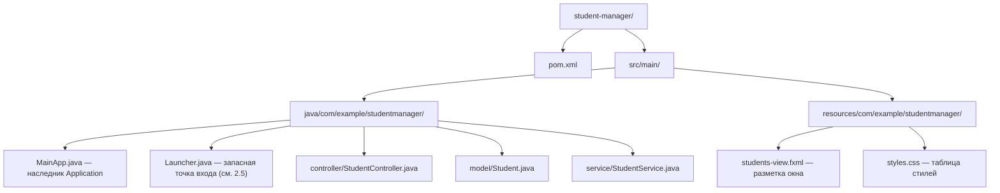
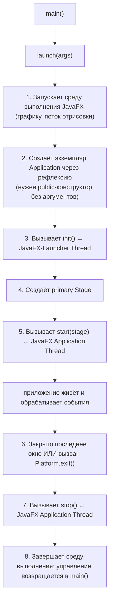
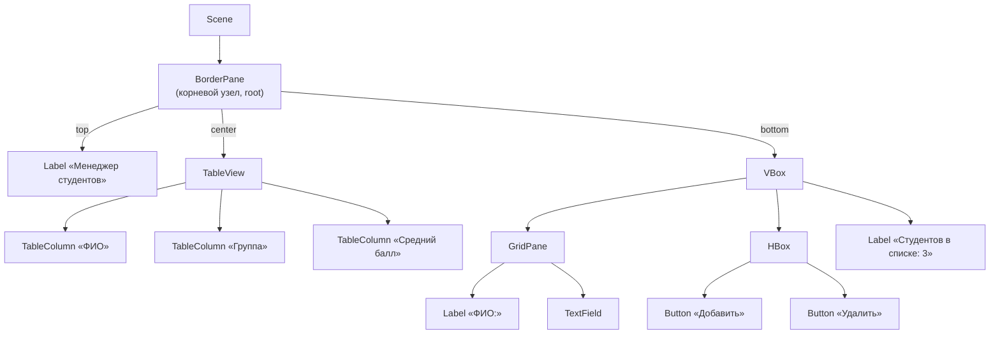
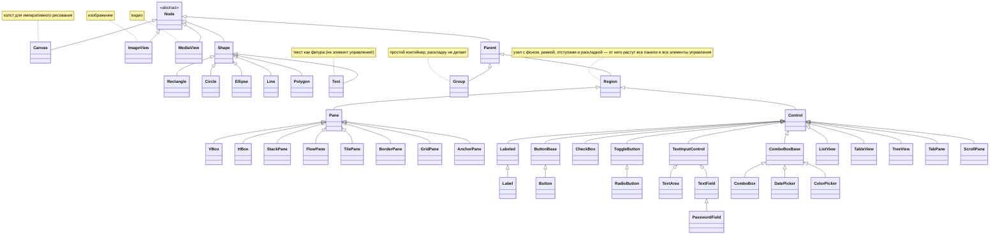
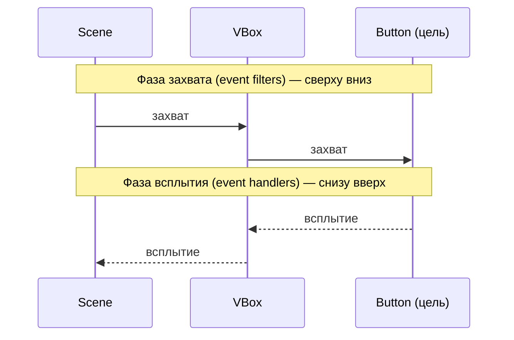
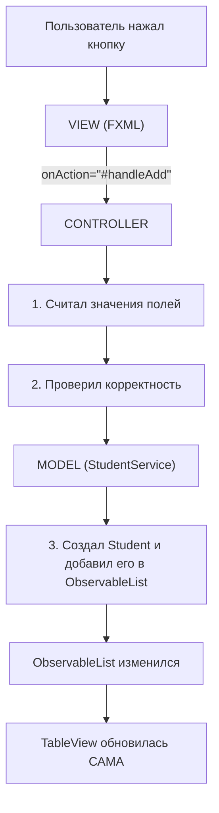

# Лекция 9: Реализация графических интерфейсов: JavaFX

## Введение

Добро пожаловать на 9-ю лекцию курса «Современные технологии программирования». До сих пор всё, что мы писали, общалось с пользователем либо через консоль, либо через браузер: в Лекции 6 мы научились хранить данные в базе, в Лекции 7 подняли приложение на Spring Boot, а в Лекции 8 разобрали, что происходит под капотом: HTTP, сервлеты, REST. Но есть огромный класс программ, которым браузер не нужен и даже вреден: терминал банковского операциониста, редактор схем, программа складского учёта, торговый клиент. Такие приложения запускаются локально, работают быстро, имеют прямой доступ к файлам и оборудованию. Их называют настольными (desktop), и в Java их пишут на **JavaFX**.

Сегодня мы разберём JavaFX с нуля: как подключить его к проекту (это отдельная история — с Java 11 JavaFX не входит в JDK), как устроен жизненный цикл приложения, что такое сцена и граф сцены, как раскладывать элементы по окну, обрабатывать нажатия, связывать данные с интерфейсом, выносить разметку в FXML, рисовать её мышью в Scene Builder и оформлять через CSS. Закончим сквозным примером — «Менеджером студентов», который запускается одной командой.

Если проводить аналогию, до сих пор мы строили инженерные коммуникации: трубы, проводку, фундамент. Сегодня займёмся тем, что видит и трогает жилец, — дверными ручками, выключателями и обоями. Работа не менее ответственная: именно по ней пользователь судит обо всей системе.

---

## Часть 1: Что такое JavaFX

### 1.1 Три поколения графических библиотек Java

**AWT (Abstract Window Toolkit, 1995)** — первая библиотека. Её кнопки и поля не рисовались самой Java: AWT просил операционную систему создать «настоящий» системный элемент и работал с ним через тонкую прослойку (такие компоненты называют *тяжеловесными*, heavyweight). Приложение на Windows выглядело как windows-программа, на macOS — как mac-программа. Звучит хорошо, но набор элементов пришлось урезать до общего знаменателя всех платформ.

Представьте, что вы открыли сеть кофеен и заказываете стулья у местного столяра в каждом городе. В Москве вам сделают один стул, в Токио — другой. Вроде бы «в местном стиле», но одинакового интерьера у сети не будет никогда; а если вам нужен стул с подлокотником, а токийский столяр такого не умеет, придётся отказаться от подлокотников во всей сети. Это AWT.

**Swing (1998)** — библиотека, которая рисует все элементы сама средствами Java 2D на одном системном окне (*легковесные*, lightweight компоненты). Стулья теперь делает собственная фабрика: они одинаковы везде и могут быть какими угодно. Swing огромен, стабилен и до сих пор работает в промышленных системах, но его архитектура родом из девяностых: разметка задаётся только кодом, стилизация болезненна, анимации почти нет.

**JavaFX (2008, современный вид — с 2011 года)** — третье поколение и официальная рекомендация для новых настольных приложений. Здесь взяли лучшее от Swing и добавили то, что к тому времени стало нормой в вебе: описание интерфейса отдельным файлом разметки (FXML), оформление через CSS, аппаратное ускорение, анимации, привязку данных.

### 1.2 Сравнение AWT, Swing и JavaFX

| Характеристика | AWT | Swing | JavaFX |
|----------------|-----|-------|--------|
| Год появления | 1995 | 1998 | 2008 |
| Тип компонентов | Тяжеловесные (системные) | Легковесные (рисует Java) | Легковесные, аппаратно ускоренные |
| Внешний вид | Как в системе | Единый, настраиваемый (Look-and-Feel) | Единый, настраиваемый через CSS |
| Разметка интерфейса | Только код | Только код | Код **или** FXML |
| Стилизация | Практически нет | Через код и L&F | CSS |
| Привязка данных | Нет | Нет | Свойства (Property) и binding |
| Анимация и эффекты | Нет | Вручную | Встроенные |
| Ускорение графики | Нет | Ограниченно | Да (конвейер Prism) |
| Входит в JDK | Да | Да | **Нет, начиная с JDK 11** |
| Статус | Устарел | Поддерживается | Активно развивается (OpenJFX) |

AWT и Swing никуда не делись: часть классов AWT (`java.awt.Color`, работа с изображениями, системный трей) используется до сих пор. Но новый настольный проект на Java сегодня начинают с JavaFX.

### 1.3 Особенности платформы JavaFX

- **Граф сцены (Scene Graph).** Интерфейс — дерево объектов, а не набор команд рисования. Вы описываете, *что* находится на экране, а не *как* это нарисовать.
- **Разделение разметки и логики.** Интерфейс описывается в XML-файле (FXML), поведение — в отдельном классе-контроллере. Тот же принцип, что «HTML отдельно, JavaScript отдельно».
- **CSS-оформление.** Цвета, шрифты, отступы, тени меняются без перекомпиляции.
- **Свойства и привязки (Properties & Bindings).** Значение поля ввода можно «привязать» к тексту метки, и она обновится сама. Встроенная реактивность.
- **Аппаратное ускорение.** Конвейер **Prism** рисует через Direct3D (Windows) или OpenGL (Linux, macOS) с откатом на программный режим.
- **Богатый набор компонентов**: от `Button` и `TextField` до `TableView`, диаграмм (`BarChart`, `PieChart`), `WebView` (браузер на движке WebKit) и медиапроигрывателя.
- **Анимация и эффекты**: `Timeline`, `FadeTransition`, тени, размытие — из коробки.
- **`Canvas`** для императивного рисования: графики, игры, визуализация алгоритмов.
- **Единый поток отрисовки** — JavaFX Application Thread (Часть 3).

Упрощённая архитектура платформы:

```
   Ваше приложение (Application, граф сцены, FXML, CSS)
   ------------------------------------------------------
   Quantum Toolkit  — связывает граф сцены с отрисовкой
   Prism            — графический конвейер (D3D / OpenGL / software)
   Glass            — окна, мышь, клавиатура средствами ОС
   Media Engine     — звук и видео
   WebKit           — движок WebView
   ------------------------------------------------------
                 Операционная система
```

### 1.4 Почему JavaFX больше не входит в JDK

До Java 10 включительно JavaFX поставлялся вместе с Oracle JDK. Начиная с **JDK 11 (2018)** его вынесли в отдельный проект с открытым исходным кодом — **OpenJFX** ([openjfx.io](https://openjfx.io)). Причины: JavaFX развивается быстрее самой Java и привязка к релизам JDK его тормозила; серверному приложению графика не нужна и только раздувает дистрибутив; отдельный модуль легче версионировать.

Практическое следствие: **если просто установить JDK 21 и написать `import javafx.application.Application;`, проект не скомпилируется**. JavaFX подключается как обычная библиотека — через Maven или Gradle. Этим и займёмся; пропускать следующую часть нельзя, без неё не запустится ни один пример.

---

## Часть 2: Подключение JavaFX через Maven

### 2.1 Модули JavaFX

Раньше набор отвёрток лежал в общем ящике, который выдавали каждому новому сотруднику. Теперь ящик легче, а отвёртки заказывают отдельной коробкой и указывают, где она лежит. Неудобно ровно один раз — при настройке проекта.

| Модуль (artifactId) | За что отвечает |
|---------------------|-----------------|
| `javafx-base` | Свойства, привязки, коллекции. Подтягивается автоматически |
| `javafx-graphics` | Граф сцены, `Stage`, `Scene`, геометрия, анимация |
| `javafx-controls` | Элементы управления: `Button`, `Label`, `TableView` |
| `javafx-fxml` | Загрузка интерфейса из FXML |
| `javafx-web` | Компонент `WebView` |
| `javafx-media` | Аудио и видео |
| `javafx-swing` | Мост между JavaFX и Swing |

Для подавляющего большинства задач достаточно двух: `javafx-controls` (он сам подтянет `javafx-graphics` и `javafx-base`) и `javafx-fxml`.

### 2.2 Полный pom.xml

```xml
<?xml version="1.0" encoding="UTF-8"?>
<project xmlns="http://maven.apache.org/POM/4.0.0"
         xmlns:xsi="http://www.w3.org/2001/XMLSchema-instance"
         xsi:schemaLocation="http://maven.apache.org/POM/4.0.0
         http://maven.apache.org/xsd/maven-4.0.0.xsd">

    <modelVersion>4.0.0</modelVersion>

    <groupId>com.example</groupId>
    <artifactId>student-manager</artifactId>
    <version>1.0-SNAPSHOT</version>

    <properties>
        <maven.compiler.release>21</maven.compiler.release>
        <project.build.sourceEncoding>UTF-8</project.build.sourceEncoding>
        <!-- Версия JavaFX в одном месте: меняется одной строкой -->
        <javafx.version>21.0.2</javafx.version>
    </properties>

    <dependencies>
        <!-- Элементы управления. Тянет за собой javafx-graphics и javafx-base -->
        <dependency>
            <groupId>org.openjfx</groupId>
            <artifactId>javafx-controls</artifactId>
            <version>${javafx.version}</version>
        </dependency>

        <!-- Загрузка интерфейса из FXML-файлов -->
        <dependency>
            <groupId>org.openjfx</groupId>
            <artifactId>javafx-fxml</artifactId>
            <version>${javafx.version}</version>
        </dependency>
    </dependencies>

    <build>
        <plugins>
            <plugin>
                <groupId>org.apache.maven.plugins</groupId>
                <artifactId>maven-compiler-plugin</artifactId>
                <version>3.13.0</version>
            </plugin>

            <!-- Плагин запускает приложение с правильным module-path -->
            <plugin>
                <groupId>org.openjfx</groupId>
                <artifactId>javafx-maven-plugin</artifactId>
                <version>0.0.8</version>
                <configuration>
                    <mainClass>com.example.studentmanager.MainApp</mainClass>
                </configuration>
            </plugin>
        </plugins>
    </build>
</project>
```

Важная деталь: у зависимостей `org.openjfx` **не указан classifier** (`win`, `mac`, `linux`). Их POM сам определяет вашу операционную систему и подставляет нужную сборку, поэтому один и тот же `pom.xml` работает и на Windows, и на Linux.

### 2.3 Структура проекта



Соглашение: **FXML и CSS кладут в `src/main/resources`, повторяя структуру пакетов**. Тогда файл, лежащий рядом с классом, находится вызовом `MainApp.class.getResource("students-view.fxml")` — без абсолютных путей.

### 2.4 Запуск

```bash
mvn clean compile     # скачать зависимости и скомпилировать
mvn javafx:run        # запустить приложение
```

Команды одинаковы для Windows, Linux и macOS. В IntelliJ IDEA то же самое доступно в панели **Maven → Plugins → javafx → javafx:run**.

Полезно уметь запускать и вручную — тогда видно, что делает плагин. Понадобится SDK, скачанный с [openjfx.io](https://openjfx.io):

```bash
# Linux / macOS
java --module-path /opt/javafx-sdk-21.0.2/lib \
     --add-modules javafx.controls,javafx.fxml \
     -cp target/classes com.example.studentmanager.MainApp
```

```powershell
# Windows (PowerShell)
java --module-path "C:\javafx-sdk-21.0.2\lib" `
     --add-modules javafx.controls,javafx.fxml `
     -cp target\classes com.example.studentmanager.MainApp
```

`--module-path` указывает, где лежат модули JavaFX, `--add-modules` — какие подключить. Плагин `javafx-maven-plugin` делает ровно это, только сам вычисляет пути.

### 2.5 Три типичные ошибки при запуске

**`Error: JavaFX runtime components are missing, and are required to run this application`**

Самая частая. Возникает, когда класс с `main()` наследует `Application`, а JavaFX попал в classpath, а не в module-path (типично при запуске из IDE кнопкой Run). Надёжное решение — отдельный класс-«запускалка», который `Application` не наследует:

```java
package com.example.studentmanager;

/**
 * Точка входа-обёртка. Не наследует Application, поэтому проверка
 * JavaFX не срабатывает и приложение стартует даже из IDE.
 */
public class Launcher {
    public static void main(String[] args) {
        MainApp.main(args);
    }
}
```

Приём известный и абсолютно легальный: запускайте `Launcher`, а не `MainApp`.

**`Location is required` из `FXMLLoader`** — значит, `getResource()` вернул `null`. Причины: FXML лежит в `src/main/java` вместо `src/main/resources`; перепутан путь (`"view.fxml"` ищется рядом с классом, `"/view.fxml"` — от корня classpath); проект не пересобран после добавления файла.

**`Graphics Device initialization failed for: d3d, sw`** — не удалось инициализировать графику. Встречается на виртуальных машинах и при работе по SSH; иногда помогает ключ `-Dprism.order=sw` (программная отрисовка).

Тем, кому надоело настраивать, существуют сборки JDK со встроенным JavaFX: **BellSoft Liberica JDK Full** и **Azul Zulu JDK FX**. Но зависимости в проекте всё равно лучше объявить явно, чтобы сборка не зависела от того, какой JDK стоит у коллеги.

---

## Часть 3: Класс Application и жизненный цикл приложения

### 3.1 Точка входа

Любое JavaFX-приложение начинается с класса, наследующего абстрактный класс `javafx.application.Application`. Минимальная рабочая программа:

```java
package com.example.demo;

import javafx.application.Application;
import javafx.scene.Scene;
import javafx.scene.control.Label;
import javafx.scene.layout.StackPane;
import javafx.stage.Stage;

public class HelloApp extends Application {

    // Единственный абстрактный метод Application
    @Override
    public void start(Stage primaryStage) {
        Label label = new Label("Здравствуй, JavaFX!");
        StackPane root = new StackPane(label);    // корневой узел графа сцены
        Scene scene = new Scene(root, 400, 200);  // сцена 400 на 200 пикселей

        primaryStage.setTitle("Моё первое окно");
        primaryStage.setScene(scene);
        primaryStage.show();                      // без этого окно не появится
    }

    public static void main(String[] args) {
        launch(args);   // запускает среду выполнения JavaFX
    }
}
```

### 3.2 Жизненный цикл: launch → init → start → stop

Метод `launch()` не просто «вызывает `start()`» — он запускает целую машину:



| Метод | Когда вызывается | В каком потоке | Что можно делать |
|-------|------------------|----------------|------------------|
| `init()` | Один раз, до создания окна | JavaFX-Launcher Thread | Читать конфигурацию, подключаться к БД. **Нельзя** создавать `Stage` и `Scene` |
| `start(Stage)` | Один раз, после `init()` | JavaFX Application Thread | Строить граф сцены, показывать окно. Обязателен к реализации |
| `stop()` | При завершении приложения | JavaFX Application Thread | Сохранять настройки, закрывать соединения |

Аналогия: `init()` — подготовка на кухне до открытия кафе (продукты заказали, печь включили, зал ещё закрыт). `start()` — открыли двери и обслуживаем гостей. `stop()` — закрылись, убрали столы, выключили свет. Готовить салаты в зале при гостях (создавать `Stage` в `init()`) нельзя — зал ещё физически не готов.

```java
package com.example.demo;

import javafx.application.Application;
import javafx.application.Platform;
import javafx.scene.Scene;
import javafx.scene.control.Button;
import javafx.scene.control.Label;
import javafx.scene.layout.VBox;
import javafx.stage.Stage;

public class LifecycleApp extends Application {

    private String configValue;

    @Override
    public void init() {   // до появления окна: настройки, соединение с БД
        System.out.println("init() — поток: " + Thread.currentThread().getName());
        configValue = "загружено из конфигурации";
        System.out.println("Аргументы: " + getParameters().getRaw());
    }

    @Override
    public void start(Stage primaryStage) {
        System.out.println("start() — поток: " + Thread.currentThread().getName());

        Button exitButton = new Button("Выйти");
        exitButton.setOnAction(event -> Platform.exit());   // завершает и вызывает stop()

        primaryStage.setScene(new Scene(new VBox(10, new Label(configValue), exitButton),
                320, 160));
        primaryStage.show();
    }

    @Override
    public void stop() {
        System.out.println("stop() — приложение завершается");
    }

    public static void main(String[] args) {
        launch(args);
    }
}
```

Запустив программу, вы увидите в консоли, что `init()` выполняется в потоке `JavaFX-Launcher`, а `start()` — в `JavaFX Application Thread`. Это фундаментальное свойство платформы.

### 3.3 JavaFX Application Thread

**Весь граф сцены живёт в одном потоке — JavaFX Application Thread.** Любое изменение интерфейса (поменять текст метки, добавить строку в таблицу) должно происходить в нём. Попытка сделать это из другого потока даёт исключение:

```
java.lang.IllegalStateException: Not on FX application thread; currentThread = Thread-3
```

Тот же принцип однопоточной модели интерфейса действует в Swing (там поток называется Event Dispatch Thread) и в браузере. Причина проста: иначе пришлось бы синхронизировать каждое поле каждого узла, и интерфейс стал бы невыносимо медленным.

Обратная сторона: **длинную работу нельзя выполнять в этом потоке**, иначе окно «зависнет» — оно просто не сможет перерисоваться. Как мы разбирали в Лекции 5, тяжёлые операции выносят в отдельные потоки, а результат возвращают через `Platform.runLater()`:

```java
// Отдельный поток — интерфейс продолжает отвечать
Thread worker = new Thread(() -> {
    String result = downloadFromServer();   // долгая операция

    // Возврат в поток интерфейса: только здесь можно трогать Label
    Platform.runLater(() -> statusLabel.setText("Загружено: " + result));
});
worker.setDaemon(true);   // не мешает приложению завершиться
worker.start();
```

В JavaFX есть и специальные классы — `javafx.concurrent.Task` и `javafx.concurrent.Service`: они умеют сообщать о прогрессе и сами переключаются в нужный поток. Для учебных задач достаточно `Platform.runLater()`.

Ещё три полезных метода:

```java
Platform.exit();                    // корректное завершение с вызовом stop()
Platform.setImplicitExit(false);    // не завершаться при закрытии последнего окна
Platform.isFxApplicationThread();   // проверка: мы в потоке интерфейса?
```

Отличие, о котором забывают: `System.exit(0)` убивает JVM немедленно и **не вызывает `stop()`**. Если в `stop()` вы сохраняете настройки — они потеряются.

---

## Часть 4: Классы Stage и Scene

### 4.1 Театральная метафора

Терминология JavaFX взята из театра, и она объясняет структуру приложения лучше любой документации:

- **`Stage` (сцена театра)** — окно операционной системы: рама, заголовок, кнопки свернуть и закрыть. Театральная сцена — здание, оно одно и то же весь вечер.
- **`Scene` (сценическая картина, «явление»)** — содержимое окна. Между актами декорации меняют целиком: та же сцена театра, но другой мир. В JavaFX это `stage.setScene(otherScene)` — одна строка, и окно показывает совсем другой экран.
- **`Node` (актёры и реквизит)** — всё, что стоит на сцене: кнопки, надписи, таблицы.

`Stage` — рама, `Scene` — то, что в раму вставлено, узлы — то, из чего картина состоит.

### 4.2 Класс Stage

`javafx.stage.Stage` — окно верхнего уровня. Первое (primary) окно платформа передаёт вам в `start()`; остальные вы создаёте сами через `new`.

```java
Scene scene = new Scene(new StackPane(new Label("Содержимое")), 500, 300);

stage.setTitle("Учёт студентов");   // заголовок окна
stage.setScene(scene);              // какую сцену показывать
stage.setMinWidth(400);             // меньше пользователь не сожмёт
stage.setMinHeight(300);
stage.setResizable(true);           // можно ли менять размер
stage.centerOnScreen();

// Реакция на попытку закрыть окно
stage.setOnCloseRequest(event -> {
    System.out.println("Пользователь закрывает окно");
    // event.consume(); — так можно отменить закрытие
});

stage.show();                       // показать окно, выполнение продолжается
```

| Метод | Назначение |
|-------|-----------|
| `setTitle(String)` | Заголовок окна |
| `setScene(Scene)` | Установить сцену; можно менять на лету |
| `show()` | Показать окно, не блокируя выполнение |
| `showAndWait()` | Показать и **ждать** закрытия — для диалогов |
| `close()` / `hide()` | Закрыть окно |
| `setResizable(boolean)` | Разрешить изменение размера |
| `setMinWidth` / `setMaxWidth` | Ограничения размеров |
| `initModality(Modality)` | Модальность окна |
| `initOwner(Window)` | Родительское окно |
| `initStyle(StageStyle)` | Оформление рамы |
| `getIcons()` | Список иконок окна |
| `setAlwaysOnTop(boolean)` | Поверх всех окон |

**Модальность** — насколько окно блокирует остальные: `Modality.NONE` (не блокирует, по умолчанию), `WINDOW_MODAL` (блокирует только окно-владельца из `initOwner`), `APPLICATION_MODAL` (блокирует все окна приложения).

**Стиль рамы** — `StageStyle`: `DECORATED` (обычное окно, по умолчанию), `UNDECORATED` (без рамы и заголовка), `TRANSPARENT` (без рамы, с прозрачным фоном), `UTILITY` (тонкая рама служебного окна), `UNIFIED`.

Собственное модальное окно с подтверждением:

```java
Stage dialog = new Stage();
dialog.initOwner(ownerStage);                     // родитель
dialog.initModality(Modality.APPLICATION_MODAL);  // блокирует всё приложение
dialog.setTitle("Подтверждение");
dialog.setResizable(false);

Button yes = new Button("Да");
Button no = new Button("Нет");
no.setOnAction(e -> dialog.close());

VBox root = new VBox(15, new Label("Удалить запись?"), new HBox(10, yes, no));
root.setAlignment(Pos.CENTER);
root.setPadding(new Insets(20));

dialog.setScene(new Scene(root, 320, 140));
dialog.showAndWait();   // выполнение остановится, пока окно не закроют
```

Для типовых сообщений собственное окно писать не нужно — есть готовый класс `Alert` (раздел 7.7).

### 4.3 Класс Scene

`javafx.scene.Scene` — контейнер для всего содержимого окна. У сцены обязательно есть **корневой узел** (root), и он должен быть типа `Parent` — то есть узлом, способным иметь потомков.

```java
BorderPane root = new BorderPane();

Scene scene1 = new Scene(root);                          // размер по содержимому
Scene scene2 = new Scene(root, 800, 600);                // явные размеры
Scene scene3 = new Scene(root, 800, 600, Color.WHITE);   // ещё и цвет фона

// Подключение таблицы стилей
scene3.getStylesheets().add(getClass().getResource("styles.css").toExternalForm());

// Обработка клавиш на уровне всей сцены
scene3.setOnKeyPressed(event -> System.out.println("Нажата: " + event.getCode()));
```

| Метод | Назначение |
|-------|-----------|
| `getRoot()` / `setRoot(Parent)` | Корневой узел; его замена = смена всего содержимого |
| `getStylesheets()` | Список CSS-файлов сцены |
| `setFill(Paint)` | Цвет фона сцены |
| `getWidth()` / `widthProperty()` | Размеры и свойство размера для привязки |
| `lookup(String)` | Найти узел по CSS-селектору, например `lookup("#saveButton")` |
| `setOnKeyPressed` / `setOnMouseMoved` | Обработчики событий уровня сцены |
| `getWindow()` | Окно, в котором показана сцена |

Важно: **одна и та же сцена не может быть установлена сразу в два окна**. Зато у одного окна сцену можно менять сколько угодно — это самый простой способ сделать переход между экранами:

```java
// Переход с экрана входа на главный: окно то же, содержимое новое
primaryStage.setScene(mainScene);
```

---

## Часть 5: Граф сцены (Scene Graph)

### 5.1 Что это такое

**Граф сцены (Scene Graph)** — иерархическая структура (дерево) всех визуальных объектов приложения. У дерева один корень — тот самый root, который вы передали в `Scene`. Каждый элемент дерева называется **узлом (Node)**.

Аналогия — содержимое шкафа: шкаф (корневая панель) содержит полки (вложенные панели), полки — коробки, коробки — вещи. Чтобы найти носок, вы спускаетесь по иерархии. Чтобы вынести всю верхнюю полку, достаточно вынести один объект вместе со всем содержимым — именно так работает удаление узла в JavaFX.

Граф сцены окна с шапкой, таблицей и панелью ввода:



Ровно эту структуру мы соберём в Части 14.

### 5.2 Иерархия классов узлов

Всё, что можно поместить на сцену, наследует абстрактный класс `javafx.scene.Node`:



Разделение принципиальное:

- **`Node`** — базовый класс любого визуального объекта. Узел, который не является `Parent` (кнопка, картинка, круг), — лист дерева: потомков у него нет.
- **`Parent`** — ветвь. Имеет список `getChildren()`. Именно `Parent` передаётся в конструктор `Scene`.
- **`Region`** — `Parent` с прямоугольной областью, фоном, рамкой и отступами. Отсюда растут все панели компоновки и все элементы управления.
- **`Control`** — `Region` со сменной «шкурой» (skin) и поддержкой CSS по умолчанию.

Ловушка: `javafx.scene.text.Text` — это фигура (`Shape`), а `javafx.scene.control.Label` — элемент управления. Для подписи в интерфейсе нужен `Label`; `Text` пригодится при рисовании графики.

### 5.3 Работа с деревом узлов

```java
VBox container = new VBox(10);
Label title = new Label("Заголовок");
Button action = new Button("Действие");

container.getChildren().add(title);                     // добавление потомка
container.getChildren().addAll(action, new Label("Подпись"));
container.getChildren().add(0, new Label("Первая строка"));   // вставка в позицию
container.getChildren().remove(action);                 // удаление вместе с потомками

Node parent = title.getParent();               // навигация вверх по дереву
boolean onScene = title.getScene() != null;    // узел уже на сцене?

title.setId("mainTitle");
Node found = container.lookup("#mainTitle");   // поиск по CSS-селектору
```

**Три правила, которые нарушают чаще всего:**

1. **У узла может быть только один родитель.** Добавили кнопку в `VBox`, потом её же в `HBox` — она молча исчезнет из `VBox`. Нужны две одинаковые кнопки — создайте два объекта.
2. **Менять граф сцены можно только из JavaFX Application Thread** (Часть 3).
3. **Порядок в `getChildren()` определяет порядок отрисовки** — об этом ниже.

### 5.4 Z-порядок и слои

В JavaFX нет свойства `z-index`, как в вебе. Порядок наложения определяется **позицией в списке потомков: чем позже добавлен узел, тем он выше**. Это как стопка прозрачных плёнок у мультипликатора: положили новую сверху — она перекрыла всё, что лежит ниже.

```java
Rectangle background = new Rectangle(200, 200, Color.LIGHTBLUE);
Circle circle = new Circle(60, Color.ORANGE);
Label caption = new Label("Поверх всего");

// Порядок добавления = порядок слоёв снизу вверх
StackPane stack = new StackPane(background, circle, caption);

circle.toFront();          // поднять на самый верх
circle.toBack();           // опустить в самый низ
circle.setOpacity(0.7);    // полупрозрачность

caption.setVisible(false); // невидим, но место в раскладке занимает
caption.setManaged(false); // и место больше не занимает
```

Пара `setVisible` / `setManaged` заслуживает внимания. `setVisible(false)` прячет узел, но панель компоновки продолжает резервировать под него место — получается «дырка». Чтобы узел исчез совсем, нужен ещё `setManaged(false)`. Удобный приём — связать одно с другим:

```java
errorLabel.managedProperty().bind(errorLabel.visibleProperty());
```

### 5.5 Позиционирование и трансформации

У каждого узла своя система координат; начало отсчёта сцены — левый верхний угол, ось Y направлена вниз.

| Свойство | Что делает |
|----------|-----------|
| `layoutX` / `layoutY` | Позиция, которую вычисляет панель компоновки |
| `translateX` / `translateY` | Дополнительное смещение поверх layout — основа анимаций |
| `setRotate(double)` | Поворот в градусах |
| `setScaleX` / `setScaleY` | Масштабирование |
| `setOpacity(double)` | Прозрачность от 0.0 до 1.0 |
| `setEffect(Effect)` | Тень, размытие, свечение |
| `setDisable(boolean)` | Отключить узел вместе со всеми потомками |
| `getStyleClass()` / `setId(String)` | CSS-класс и идентификатор узла |

Именно потому, что смещение и поворот — свойства узла, а не результат перерисовки, анимация в JavaFX почти ничего не стоит: платформа меняет число, а конвейер Prism перерисовывает кадр на видеокарте.

---

## Часть 6: Панели компоновки

### 6.1 Зачем они нужны

Расставить элементы по абсолютным координатам можно, но окно, которое разваливается при изменении размера или при другом системном шрифте, — плохое окно. **Панели компоновки (layout panes)** сами вычисляют положение и размер потомков по заданному правилу.

Аналогия с переездом: у вас есть коробки разных типов. В одну вещи складывают строго в столбик, в другую — в ряд, третья разделена на ячейки-сетку, четвёртая держит крупные предметы по краям, а лёгкие в центре. Вы не измеряете каждую вещь линейкой — вы выбираете подходящую коробку.

| Панель | Правило раскладки | Типичное применение |
|--------|-------------------|---------------------|
| `VBox` | Потомки в столбик, сверху вниз | Форма, боковое меню |
| `HBox` | Потомки в строку, слева направо | Панель кнопок, тулбар |
| `BorderPane` | Пять зон: top, bottom, left, right, center | Каркас главного окна |
| `GridPane` | Сетка из строк и столбцов | Формы «подпись — поле» |
| `StackPane` | Все потомки друг на друге, по центру | Наложение, заглушка «Загрузка...» |
| `FlowPane` | В строку с переносом по ширине | Плитка тегов, галерея |
| `TilePane` | Сетка одинаковых ячеек | Календарь, панель иконок |
| `AnchorPane` | Привязка к краям контейнера | Точная подгонка, вывод Scene Builder |

### 6.2 VBox и HBox

```java
TextField searchField = new TextField();
searchField.setPromptText("Введите запрос");

// Строка: поле растягивается, кнопка сохраняет свой размер
HBox searchBar = new HBox(8, searchField, new Button("Найти"));
HBox.setHgrow(searchField, Priority.ALWAYS);   // кто забирает свободное место
searchBar.setAlignment(Pos.CENTER_LEFT);

// Столбец
VBox root = new VBox(12);              // 12 пикселей между потомками
root.setPadding(new Insets(16));       // отступ от краёв панели
root.setAlignment(Pos.TOP_CENTER);
root.getChildren().addAll(new Label("Поиск по базе"), searchBar);

VBox.setMargin(searchBar, new Insets(0, 0, 10, 0));   // отступ конкретного потомка
```

Два понятия, которые регулярно путают:

- **`padding`** — внутренний отступ панели от её краёв до потомков: `pane.setPadding(new Insets(16))`.
- **`margin`** — внешний отступ конкретного потомка, задаётся статическим методом панели: `VBox.setMargin(child, new Insets(10))`.

Класс `Insets` принимает либо одно число (одинаково со всех сторон), либо четыре — в порядке top, right, bottom, left.

### 6.3 BorderPane

`BorderPane` делит окно на пять зон и работает как газетная полоса: шапка сверху, подвал снизу, колонки по бокам, главный материал в центре. Центр забирает всё оставшееся место — то, что нужно для таблицы или редактора.

```java
BorderPane root = new BorderPane();
root.setTop(new Label("Панель меню"));      // шапка
root.setLeft(new ListView<String>());       // навигация слева
root.setCenter(new TableView<String>());    // основное содержимое
root.setBottom(new Label("Готово"));        // строка состояния

BorderPane.setMargin(root.getCenter(), new Insets(10));
```

Незанятые зоны места не занимают: если `left` не задан, центр начнётся от левого края окна.

### 6.4 GridPane

Идеальная панель для форм: подписи в первом столбце, поля во втором.

```java
GridPane grid = new GridPane();
grid.setHgap(10);                  // расстояние между столбцами
grid.setVgap(10);                  // расстояние между строками
grid.setPadding(new Insets(20));

// add(узел, номерСтолбца, номерСтроки) — нумерация с нуля
grid.add(new Label("Логин:"), 0, 0);
grid.add(new TextField(), 1, 0);
grid.add(new Label("Пароль:"), 0, 1);
grid.add(new PasswordField(), 1, 1);

// add(узел, столбец, строка, ширинаВСтолбцах, высотаВСтроках)
grid.add(new Button("Войти"), 0, 2, 2, 1);

// Первый столбец фиксированный, второй растягивается
ColumnConstraints labels = new ColumnConstraints(90);
ColumnConstraints fields = new ColumnConstraints();
fields.setHgrow(Priority.ALWAYS);
grid.getColumnConstraints().addAll(labels, fields);
```

Совет из практики: при отладке раскладки включите `grid.setGridLinesVisible(true)` — JavaFX нарисует сетку, и сразу станет видно, где узел «уехал». Перед сдачей работы эту строку убирают.

### 6.5 StackPane, FlowPane и AnchorPane

```java
// StackPane: узлы друг на друге. Классика — индикатор загрузки поверх содержимого
ProgressIndicator spinner = new ProgressIndicator();
StackPane stack = new StackPane(contentNode, spinner);
StackPane.setAlignment(spinner, Pos.CENTER);

// FlowPane: элементы идут в строку и переносятся, когда кончается ширина
FlowPane flow = new FlowPane(Orientation.HORIZONTAL, 8, 8);
flow.setPadding(new Insets(10));
for (String tag : new String[]{"Java", "JavaFX", "Maven", "FXML"}) {
    flow.getChildren().add(new Button(tag));
}

// AnchorPane: узел «прибит» к краям контейнера на заданном расстоянии
AnchorPane pane = new AnchorPane(corner, stretched);
AnchorPane.setTopAnchor(corner, 10.0);
AnchorPane.setLeftAnchor(corner, 10.0);
AnchorPane.setBottomAnchor(stretched, 10.0);
AnchorPane.setLeftAnchor(stretched, 10.0);
AnchorPane.setRightAnchor(stretched, 10.0);   // привязка к обоим краям = растяжение
```

Панели свободно вкладываются друг в друга — почти любой реальный интерфейс строится как `BorderPane`, внутри которого `VBox`, внутри которого `GridPane` и `HBox`. Не пытайтесь описать сложное окно одной панелью.

---

## Часть 7: Элементы управления

### 7.1 Обзор

Элементы управления (`Control`) — панель приборов вашего приложения: спидометр показывает (`Label`), руль принимает ввод (`TextField`), кнопка стартера запускает действие (`Button`). Водителю не нужно знать, как устроен датчик, — ему нужно, чтобы стрелка была на понятном месте.

| Компонент | Назначение |
|-----------|-----------|
| `Label` | Нередактируемая подпись |
| `TextField` / `PasswordField` / `TextArea` | Ввод текста: однострочный, скрытый, многострочный |
| `Button` | Кнопка действия |
| `CheckBox` | Независимый флажок |
| `RadioButton` + `ToggleGroup` | Выбор одного из нескольких |
| `ComboBox` / `ListView` | Выпадающий список, список с прокруткой |
| `TableView` | Таблица данных |
| `DatePicker`, `Slider`, `ProgressBar` | Дата, число в диапазоне, индикатор |
| `Alert` | Готовое диалоговое окно |

### 7.2 Label — вывод текста

`Label` показывает текст (и при желании картинку), не принимает ввод и по умолчанию не получает фокус.

```java
Label label = new Label("Фамилия студента:");

label.setFont(Font.font("Segoe UI", FontWeight.BOLD, 14));
label.setTextFill(Color.web("#1f2d3d"));
label.setWrapText(true);          // переносить длинный текст по словам
label.setMaxWidth(250);
label.setLabelFor(lastNameField); // щелчок по подписи переводит фокус в поле
label.setText("Фамилия (обязательно):");   // текст меняется в любой момент
```

Ключевые свойства: `text`, `font`, `textFill`, `wrapText`, `alignment`, `graphic` (картинка рядом с текстом), `contentDisplay`, `labelFor`, `tooltip`.

Самое сильное применение `Label` — вывод результата. Его текст можно **привязать** к чему угодно, и тогда обновлять вручную не придётся (Часть 9):

```java
resultLabel.textProperty().bind(inputField.textProperty());
```

### 7.3 TextField, PasswordField и TextArea

```java
TextField field = new TextField();
field.setPromptText("Иванов");     // серая подсказка, пока поле пустое
field.setText("Петров");           // программная установка значения
field.setPrefColumnCount(20);      // примерная ширина в символах

// Реакция на Enter внутри поля
field.setOnAction(event -> System.out.println("Введено: " + field.getText()));

// Реакция на каждое изменение текста
field.textProperty().addListener((observable, oldValue, newValue) ->
        System.out.println(oldValue + " -> " + newValue));

// Поле, в которое можно ввести только цифры
TextField digits = new TextField();
digits.setTextFormatter(new TextFormatter<>(change ->
        change.getControlNewText().matches("\\d*") ? change : null));

// PasswordField наследует TextField: getText() возвращает настоящий текст,
// скрыты только символы на экране
PasswordField password = new PasswordField();
password.setPromptText("Пароль");

TextArea area = new TextArea();
area.setPrefRowCount(5);           // высота в строках
area.setWrapText(true);
```

| Свойство | `TextField` | `PasswordField` | `TextArea` |
|----------|-------------|-----------------|------------|
| Число строк | 1 | 1 | много |
| Отображение символов | Как есть | Точки | Как есть |
| Событие по Enter | `setOnAction` | `setOnAction` | Enter — перенос строки |
| Перенос текста | Нет | Нет | `setWrapText(true)` |
| Базовый класс | `TextInputControl` | наследник `TextField` | `TextInputControl` |

Все три наследуют `TextInputControl`, поэтому у них общие методы: `getText()`, `setText()`, `clear()`, `selectAll()`, `copy()`, `paste()`, `undo()`, `textProperty()`.

### 7.4 Button

`Button` — основной способ запустить действие. Наследует `ButtonBase` → `Labeled` → `Control`, поэтому умеет всё, что умеет `Label` (текст, шрифт, картинка), и вдобавок реагирует на нажатие.

```java
Button save = new Button("Сохранить");

save.setOnAction(event -> System.out.println("Сохраняем..."));   // главное
save.setDefaultButton(true);        // срабатывает по Enter в любом месте окна
save.setPrefWidth(140);
save.setTooltip(new Tooltip("Сохранить изменения в базе"));
save.setStyle("-fx-background-color: #2d7ff9; -fx-text-fill: white;");
save.setDisable(false);             // отключённая кнопка сереет и не реагирует

Button cancel = new Button("Отмена");
cancel.setCancelButton(true);       // срабатывает по Escape

// Кнопка с иконкой (файл icon.png лежит в src/main/resources)
ImageView icon = new ImageView(new Image(getClass().getResourceAsStream("/icon.png")));
icon.setFitWidth(16);
icon.setFitHeight(16);
Button export = new Button("Экспорт", icon);
```

| Метод `Button` | Что делает |
|----------------|-----------|
| `setOnAction(EventHandler)` | Обработчик нажатия |
| `setDefaultButton(true)` | Срабатывает по Enter |
| `setCancelButton(true)` | Срабатывает по Escape |
| `setDisable(true)` | Отключить кнопку |
| `setGraphic(Node)` | Картинка на кнопке |
| `setTooltip(Tooltip)` | Всплывающая подсказка |
| `fire()` | Программно «нажать» кнопку |
| `disableProperty()` | Свойство для привязки, например к пустому полю |

Родственники кнопки: `ToggleButton` (остаётся нажатой), `CheckBox` (флажок), `RadioButton` (выбор одного варианта), `MenuButton` (кнопка с меню), `Hyperlink` (кнопка в виде ссылки).

### 7.5 CheckBox, RadioButton и ComboBox

Разница между ними — в том, сколько вариантов можно выбрать одновременно: флажок независим от остальных, переключатели в одной `ToggleGroup` взаимоисключающие, а выпадающий список просто экономит место на экране.

```java
// Флажок — независимый выбор «да / нет»
CheckBox scholarship = new CheckBox("Получает стипендию");
scholarship.setSelected(true);
scholarship.selectedProperty().addListener((obs, was, now) ->
        System.out.println("Стипендия: " + now));

// Переключатели — выбор ровно одного варианта из группы
ToggleGroup formGroup = new ToggleGroup();
RadioButton fullTime = new RadioButton("Очная");
RadioButton partTime = new RadioButton("Очно-заочная");
fullTime.setToggleGroup(formGroup);
partTime.setToggleGroup(formGroup);
fullTime.setSelected(true);
// now может быть null, если снять выделение программно, — проверка обязательна
formGroup.selectedToggleProperty().addListener((obs, was, now) -> {
    if (now != null) System.out.println("Форма: " + ((RadioButton) now).getText());
});

// Выпадающий список
ComboBox<String> groupBox = new ComboBox<>(
        FXCollections.observableArrayList("ПИ24-1", "ПИ24-2", "ТРПО24-1"));
groupBox.setPromptText("Выберите группу");
groupBox.setValue("ПИ24-1");

// Список с прокруткой и множественным выделением
ListView<String> subjects = new ListView<>(
        FXCollections.observableArrayList("Java", "Базы данных", "Сети"));
subjects.getSelectionModel().setSelectionMode(SelectionMode.MULTIPLE);
```

### 7.6 TableView — таблица данных

`TableView` — самый мощный и самый востребованный компонент JavaFX. Он состоит из трёх частей:

1. **`TableView<T>`** — сама таблица, типизированная классом строки.
2. **`TableColumn<T, V>`** — столбец: `T` — тип строки, `V` — тип значения в ячейке.
3. **`ObservableList<T>`** — источник данных. Добавили элемент в список — строка появилась в таблице сама.

Ключевой вопрос: откуда столбец берёт значение? За это отвечает **cellValueFactory**, и задать его можно двумя способами.

```java
TableView<Book> table = new TableView<>();

// Способ 1: PropertyValueFactory — по имени свойства, через рефлексию.
// Ищет метод titleProperty(), а если его нет — getTitle()
TableColumn<Book, String> titleColumn = new TableColumn<>("Название");
titleColumn.setCellValueFactory(new PropertyValueFactory<>("title"));
titleColumn.setPrefWidth(220);

// Способ 2: лямбда — типобезопасно, ошибку поймает компилятор
TableColumn<Book, String> authorColumn = new TableColumn<>("Автор");
authorColumn.setCellValueFactory(data -> data.getValue().authorProperty());

table.getColumns().addAll(titleColumn, authorColumn);

ObservableList<Book> books = FXCollections.observableArrayList(
        new Book("Философия Java", "Брюс Эккель"),
        new Book("Эффективная Java", "Джошуа Блох"));
table.setItems(books);
table.setPlaceholder(new Label("Книг пока нет"));   // что показать, когда пусто

// Реакция на выбор строки
table.getSelectionModel().selectedItemProperty().addListener((obs, was, now) -> {
    if (now != null) {
        System.out.println("Выбрана книга: " + now.getTitle());
    }
});

books.add(new Book("Java. Библиотека профессионала", "Кей Хорстманн"));
// Таблица обновится сама — вручную ничего перерисовывать не нужно
```

Модельный класс при этом должен хранить данные в свойствах JavaFX и предоставлять три метода на каждое поле: `getTitle()`, `setTitle()` и `titleProperty()`. Полный пример такого класса — в разделе 14.1.

Про `PropertyValueFactory` нужно знать две вещи:

- Он работает **через рефлексию** и ищет метод по соглашению об именах. Опечатка в строке `"title"` не вызовет ошибку компиляции — столбец просто останется пустым. Это его главный недостаток.
- В модульном проекте (с `module-info.java`) пакет модели нужно открыть: `opens com.example.model to javafx.base;`, иначе рефлексия не сработает.

Поэтому в новом коде предпочтительнее лямбда. Знать оба способа обязательно: `PropertyValueFactory` встречается повсеместно в существующих проектах и в заготовках Scene Builder.

Если `cellValueFactory` отвечает на вопрос «откуда взять значение», то **cellFactory** — на вопрос «как его показать». Забегая вперёд, покажем это на столбце из Части 14, где строка таблицы описывается классом `Student`:

```java
// cellValueFactory — ОТКУДА берётся значение
TableColumn<Student, Double> gradeColumn = new TableColumn<>("Средний балл");
gradeColumn.setCellValueFactory(data -> data.getValue().averageGradeProperty().asObject());

// cellFactory — КАК оно выглядит: округляем до двух знаков
gradeColumn.setCellFactory(column -> new TableCell<Student, Double>() {
    @Override
    protected void updateItem(Double value, boolean empty) {
        super.updateItem(value, empty);
        setText(empty || value == null ? null : String.format("%.2f", value));
    }
});
```

### 7.7 Диалоги и Alert

Класс `Alert` избавляет от написания собственных окон для типовых сообщений.

```java
Alert info = new Alert(Alert.AlertType.INFORMATION);
info.setTitle("Информация");
info.setHeaderText(null);            // без крупного заголовка
info.setContentText("Запись сохранена");
info.showAndWait();                  // ждём, пока пользователь закроет

// Подтверждение: возвращает Optional<ButtonType>
Alert confirm = new Alert(Alert.AlertType.CONFIRMATION);
confirm.setHeaderText(null);
confirm.setContentText("Удалить выбранную запись?");
boolean agreed = confirm.showAndWait()
        .filter(button -> button == ButtonType.OK)
        .isPresent();

// Диалог с полем ввода
TextInputDialog dialog = new TextInputDialog("Иванов");
dialog.setHeaderText(null);
dialog.setContentText("Фамилия:");
Optional<String> name = dialog.showAndWait();
```

Типы `Alert.AlertType`: `INFORMATION`, `WARNING`, `ERROR`, `CONFIRMATION`, `NONE`. Каждый рисуется со своей иконкой и своим набором кнопок.

### 7.8 Диаграммы

Диаграмма — это тот же спидометр, только считающий не одно число, а сразу целый набор: сколько студентов в каждой группе, как менялась выручка по месяцам. За это в JavaFX отвечает пакет `javafx.scene.chart`. Самый частый случай на практике — гистограмма (`BarChart`): один столбец на каждую категорию, высота столбца — значение.

`BarChart<X, Y>` строится по тем же правилам, что и `TableView`: пара осей и `ObservableList` с данными. Ось X обычно `CategoryAxis` — она рисует подписи-категории, а не числовую шкалу, ось Y — привычная `NumberAxis`. Данные подаются в диаграмму не напрямую, а через `XYChart.Series` — один ряд столбцов; несколько рядов на одной диаграмме образуют группы столбцов рядом друг с другом.

```java
CategoryAxis xAxis = new CategoryAxis();
xAxis.setLabel("Группа");

NumberAxis yAxis = new NumberAxis();
yAxis.setLabel("Количество студентов");
yAxis.setTickUnit(1);                      // подписи по 1, а не по 0.5

BarChart<String, Number> chart = new BarChart<>(xAxis, yAxis);
chart.setTitle("Студенты по группам");
chart.setLegendVisible(false);             // один ряд — легенда не нужна

// Тот же класс Student, что и в столбце gradeColumn из 7.6 (целиком — в Части 14)
ObservableList<Student> students = FXCollections.observableArrayList(
        new Student("Петров Иван", "ПИ24-1", 4.6),
        new Student("Смирнова Анна", "ПИ24-1", 4.9),
        new Student("Кузнецов Дмитрий", "ТРПО24-1", 3.8),
        new Student("Новиков Пётр", "ПИ24-2", 4.2));

Map<String, Long> byGroup = students.stream()
        .collect(Collectors.groupingBy(Student::getGroup, Collectors.counting()));

XYChart.Series<String, Number> series = new XYChart.Series<>();
byGroup.forEach((group, count) -> series.getData().add(new XYChart.Data<>(group, count)));
chart.getData().add(series);
```

Этот же `students` вполне может быть тем самым списком, что вы уже отдали в `table.setItems(...)`, — таблица и диаграмма просто читают из одного источника, ничего не дублируя. Но разница есть: `TableView` подписан на список напрямую и перерисовывается сам при любом изменении, а `BarChart` — нет. `byGroup` посчитан один раз; если студенты потом добавляются или удаляются, пересчитайте `byGroup` и переустановите данные заново, например в том же слушателе, что обновляет `FilteredList` (Часть 9). А вот сам ряд, `series.getData()`, — обычный `ObservableList<XYChart.Data<X,Y>>`: добавили в него точку — столбец появился на экране немедленно, без вызовов вроде `chart.layout()`.

`PieChart` устроен ещё проще — ему вообще не нужны оси, только список `PieChart.Data("подпись", число)`: каждый элемент становится сектором круга, а его долю JavaFX вычисляет сама. `LineChart<X, Y>` использует ровно те же оси и тот же `XYChart.Series`, что и `BarChart`, — отличается только конструктор диаграммы; удобно, когда те же данные нужно показать не столбцами, а точками, соединёнными линией, например средний балл группы по месяцам семестра.

---

## Часть 8: Обработка событий

### 8.1 Модель событий

Событие — объект, описывающий «что произошло». Все они наследуют `javafx.event.Event`, у которого есть: **источник** (`getSource()`), **цель** (`getTarget()`), **тип** (`getEventType()`) и метод **`consume()`** — «событие обработано, дальше не передавать».

| Класс события | Когда возникает |
|---------------|-----------------|
| `ActionEvent` | Нажата кнопка, выбран пункт меню, нажат Enter в `TextField` |
| `MouseEvent` | Движение, нажатие, отпускание, щелчок мышью |
| `KeyEvent` | Нажата или отпущена клавиша |
| `WindowEvent` | Окно показано, закрывается, скрыто |
| `ScrollEvent` | Прокрутка колёсиком |
| `DragEvent` | Перетаскивание объектов |

### 8.2 Интерфейс EventHandler и лямбды

Обработчик события — реализация функционального интерфейса `EventHandler<T extends Event>` с единственным методом `void handle(T event)`. Раз интерфейс функциональный, его реализуют лямбдой (лямбды мы разбирали в Лекции 2).

```java
// Способ 1: анонимный класс — многословно, но наглядно
button.setOnAction(new EventHandler<ActionEvent>() {
    @Override
    public void handle(ActionEvent event) {
        label.setText("Обработано анонимным классом");
    }
});

// Способ 2: лямбда — так пишут в реальном коде
button.setOnAction(event -> label.setText("Обработано лямбдой"));

// Способ 3: ссылка на метод, если логика вынесена отдельно
button.setOnAction(this::handleClick);

private void handleClick(ActionEvent event) {
    Button source = (Button) event.getSource();   // источник события — сама кнопка
    System.out.println("Нажата кнопка: " + source.getText());
}
```

`setOnAction()` — удобная обёртка над свойством `onAction`. Оно есть у всех компонентов с «основным действием»: `Button`, `MenuItem`, `TextField`, `ComboBox`, `CheckBox`.

### 8.3 Мышь и клавиатура

Помимо `onAction` у узлов есть более низкоуровневые обработчики, которые дают доступ к деталям события — координатам клика, нажатой кнопке мыши, конкретной клавише на клавиатуре. Ими пользуются, когда `onAction` недостаточно.

```java
pane.setOnMouseClicked(event -> {
    System.out.println("Клик в точке (" + event.getX() + ", " + event.getY() + ")");
    if (event.getButton() == MouseButton.SECONDARY) System.out.println("Правая кнопка");
    if (event.getClickCount() == 2) System.out.println("Двойной щелчок");
});
pane.setOnMouseEntered(event -> pane.setStyle("-fx-background-color: #eef3ff;"));
pane.setOnMouseExited(event -> pane.setStyle(""));

field.setOnKeyPressed(event -> {
    if (event.getCode() == KeyCode.ESCAPE) {
        field.clear();
    }
    if (event.isControlDown() && event.getCode() == KeyCode.S) {   // Ctrl+S
        System.out.println("Сохранение");
        event.consume();
    }
});
```

### 8.4 Распространение событий: захват и всплытие

Когда пользователь щёлкает по кнопке внутри панели внутри окна, событие не появляется «прямо на кнопке». Оно проходит **путь по дереву графа сцены**, и проходит его дважды.

Аналогия: клиент подал жалобу на конкретного сотрудника. Сначала бумага спускается сверху вниз — от директора через начальника отдела к сотруднику (**фаза захвата**, capturing). Затем, если вопрос не решён на месте, поднимается обратно — от сотрудника к начальнику отдела и к директору (**фаза всплытия**, bubbling). Любой на этом пути может написать «вопрос закрыт» и остановить движение бумаги — это и есть `consume()`.



- **Фильтры** (`addEventFilter`) срабатывают в фазе захвата — сверху вниз.
- **Обработчики** (`addEventHandler` и `setOnXxx`) — в фазе всплытия, снизу вверх.

```java
Button button = new Button("Нажми меня");
VBox container = new VBox(button);

// 1. Фильтр на контейнере — фаза захвата, срабатывает ПЕРВЫМ
container.addEventFilter(ActionEvent.ACTION, event ->
        System.out.println("1. Фильтр на VBox (захват)"));

// 2. Обработчик на самой кнопке — цель события
button.setOnAction(event ->
        System.out.println("2. Обработчик на Button (цель)"));

// 3. Обработчик на контейнере — фаза всплытия, срабатывает ПОСЛЕДНИМ
container.addEventHandler(ActionEvent.ACTION, event ->
        System.out.println("3. Обработчик на VBox (всплытие)"));
```

Вывод при нажатии на кнопку:

```
1. Фильтр на VBox (захват)
2. Обработчик на Button (цель)
3. Обработчик на VBox (всплытие)
```

Если в фильтре вызвать `event.consume()`, кнопка своё событие **не получит вовсе** — движение остановится на первом шаге. Так централизованно блокируют ввод, например на время загрузки данных.

Важное отличие `setOnAction` от `addEventHandler`: `setOnAction` у узла **один** (новый вызов затирает предыдущий), а `addEventHandler` можно вызывать сколько угодно раз — выполнятся все обработчики.

```java
button.addEventHandler(ActionEvent.ACTION, e -> System.out.println("Логирование"));
button.addEventHandler(ActionEvent.ACTION, e -> System.out.println("Бизнес-логика"));
// Сработают оба
```

---

## Часть 9: Свойства и привязка данных

### 9.1 Что такое Property

Обычное поле `String name` умеет только хранить значение. **Свойство (Property)** умеет хранить значение **и сообщать всем заинтересованным, что оно изменилось**.

Аналогия: обычное поле — листок с записанным курсом валюты. Свойство — табло в обменнике: как только курс поменялся, все, кто на него смотрит, узнают об этом мгновенно, и переспрашивать кассира не нужно.

| Интерфейс | Реализация | Тип значения |
|-----------|-----------|--------------|
| `StringProperty` | `SimpleStringProperty` | `String` |
| `IntegerProperty` | `SimpleIntegerProperty` | `int` |
| `LongProperty` / `DoubleProperty` | `SimpleLongProperty` / `SimpleDoubleProperty` | `long` / `double` |
| `BooleanProperty` | `SimpleBooleanProperty` | `boolean` |
| `ObjectProperty<T>` | `SimpleObjectProperty<T>` | любой объект |
| `ListProperty<T>` | `SimpleListProperty<T>` | `ObservableList<T>` |

```java
// Конструктор: (владелец, имя свойства, начальное значение)
StringProperty name = new SimpleStringProperty(this, "name", "Иван");
IntegerProperty age = new SimpleIntegerProperty(this, "age", 20);

System.out.println(name.get());   // Иван
name.set("Пётр");

name.addListener((observable, oldValue, newValue) ->
        System.out.println("Имя изменилось: " + oldValue + " -> " + newValue));

name.set("Сергей");   // напечатает: Имя изменилось: Пётр -> Сергей

int years = age.get();          // get() у IntegerProperty возвращает примитив int
Integer boxed = age.getValue(); // getValue() — обёртку Integer
```

### 9.2 Привязка bind()

`bind()` создаёт **одностороннюю** связь: значение приёмника всегда повторяет значение источника. Приёмник становится «только для чтения» — вызов `set()` у него бросит `RuntimeException`.

```java
// Метка всегда показывает то же, что набрано в поле.
// Ни одного обработчика событий писать не нужно
label.textProperty().bind(field.textProperty());

// Привязка к вычисляемому выражению
counter.textProperty().bind(
        Bindings.concat("Введено символов: ", field.textProperty().length()));

// Кнопка «Отправить» неактивна, пока поле пустое
submit.disableProperty().bind(field.textProperty().isEmpty());

// Аналог тернарного оператора в мире привязок
status.textProperty().bind(
        Bindings.when(field.textProperty().isEmpty())
                .then("Заполните поле")
                .otherwise("Готово к отправке"));

label.textProperty().unbind();   // разорвать связь
```

### 9.3 Двусторонняя привязка bindBidirectional()

`bindBidirectional()` связывает два свойства как **сообщающиеся сосуды**: изменили одно — изменилось второе, и наоборот. Оба остаются доступны для записи.

```java
// Два поля всегда содержат одно и то же
first.textProperty().bindBidirectional(second.textProperty());

// Классический сценарий: поле формы связано с полем модели.
// Пользователь печатает — модель обновляется. Модель изменили из кода —
// поле на экране обновилось
StringProperty modelName = new SimpleStringProperty("Иванов");
nameField.textProperty().bindBidirectional(modelName);
modelName.set("Петров");   // в поле на экране появится «Петров»
```

| | `bind()` | `bindBidirectional()` |
|---|---|---|
| Направление | Одно | Оба |
| `set()` у приёмника | Нет, `RuntimeException` | Да |
| Типы свойств | Могут различаться (через выражения) | Должны совпадать |
| Разрыв связи | `unbind()` | `unbindBidirectional(other)` |

### 9.4 ObservableList

`ObservableList<T>` — список, который сообщает о добавлении и удалении элементов. На нём построены `TableView`, `ListView` и `ComboBox`: связали список с таблицей один раз — и дальше работаете со списком как с обычной коллекцией, а интерфейс обновляется сам.

```java
ObservableList<String> groups = FXCollections.observableArrayList("ПИ24-1", "ПИ24-2");

groups.addListener((ListChangeListener<String>) change -> {
    while (change.next()) {
        if (change.wasAdded()) {
            System.out.println("Добавлено: " + change.getAddedSubList());
        }
        if (change.wasRemoved()) {
            System.out.println("Удалено: " + change.getRemoved());
        }
    }
});

ListView<String> listView = new ListView<>(groups);

groups.add("ПИ24-3");      // изменения немедленно видны в ListView
groups.remove("ПИ24-1");
```

Полезные производные коллекции: `FilteredList` (показывает только подходящие элементы — основа поиска в таблице) и `SortedList` (сортированное представление). Обе не копируют данные, а являются «окном» в исходный список: изменился источник — тут же меняется и то, что видно через окно.

### 9.5 Производные коллекции на практике

`FilteredList` оборачивает исходный `ObservableList`, а `setPredicate()` задаёт условие показа. Типичный пример — живой поиск по тексту, набранному в `TextField`:

```java
ObservableList<String> groups = FXCollections.observableArrayList(
        "ПИ24-1", "ПИ24-2", "ТРПО24-1");

FilteredList<String> filteredGroups = new FilteredList<>(groups, group -> true);

searchField.textProperty().addListener((observable, oldValue, newValue) -> {
    String query = newValue.trim().toLowerCase();
    filteredGroups.setPredicate(group -> group.toLowerCase().contains(query));
});
```

Если отфильтрованный список нужно показать в `TableView` с сортировкой по клику на заголовок столбца, `FilteredList` оборачивают ещё раз — в `SortedList`, и обязательно привязывают его компаратор к компаратору таблицы:

```java
SortedList<String> sortedGroups = new SortedList<>(filteredGroups);
sortedGroups.comparatorProperty().bind(groupTable.comparatorProperty());
groupTable.setItems(sortedGroups);
```

Без этой привязки клик по заголовку переключает компаратор **самой таблицы**, а `SortedList` о нём ничего не знает и продолжает отдавать элементы в прежнем порядке — сортировка на экране просто не сработает.

---

## Часть 10: FXML — разметка отдельно от кода

### 10.1 Зачем нужен FXML

Всё, что мы писали до сих пор, строило интерфейс кодом. Для окна из пяти элементов это нормально. Для окна из пятидесяти метод `start()` превращается в километровую простыню, в которой невозможно найти нужную кнопку.

Аналогия: строительство дома по чертежу против строительства «на словах». Прораб может объяснять бригаде каждый кирпич устно, но проще один раз начертить план — тогда чертёж отдельно (его правит архитектор), а работа отдельно (её делает бригада).

**FXML** — XML-формат описания графа сцены. Он даёт: разделение ответственности (дизайнер правит FXML, программист — контроллер, как HTML и JavaScript в вебе); читаемость (иерархия панелей в XML видна с первого взгляда); возможность рисовать интерфейс мышью в Scene Builder; правку разметки без перекомпиляции.

### 10.2 Синтаксис FXML

```xml
<?xml version="1.0" encoding="UTF-8"?>

<!-- Импорты: те же классы, что в Java, но в виде инструкций обработки -->
<?import javafx.geometry.Insets?>
<?import javafx.scene.control.Button?>
<?import javafx.scene.control.Label?>
<?import javafx.scene.control.TextField?>
<?import javafx.scene.layout.GridPane?>
<?import javafx.scene.layout.VBox?>

<!-- Корневой элемент. fx:controller указывает класс-контроллер -->
<VBox xmlns="http://javafx.com/javafx/21"
      xmlns:fx="http://javafx.com/fxml/1"
      fx:controller="com.example.demo.LoginController"
      spacing="12" prefWidth="360" prefHeight="220"
      styleClass="login-box">

    <!-- Сложные свойства задаются вложенными элементами -->
    <padding>
        <Insets top="20" right="20" bottom="20" left="20"/>
    </padding>

    <Label text="Вход в систему" styleClass="title"/>

    <GridPane hgap="10" vgap="10">
        <!-- Статические свойства панели пишутся как GridPane.rowIndex -->
        <Label text="Логин:" GridPane.rowIndex="0" GridPane.columnIndex="0"/>
        <TextField fx:id="loginField" promptText="ivanov"
                   GridPane.rowIndex="0" GridPane.columnIndex="1"/>

        <Label text="Пароль:" GridPane.rowIndex="1" GridPane.columnIndex="0"/>
        <TextField fx:id="passwordField"
                   GridPane.rowIndex="1" GridPane.columnIndex="1"/>
    </GridPane>

    <!-- onAction ссылается на метод контроллера; знак # обязателен -->
    <Button fx:id="loginButton" text="Войти" onAction="#handleLogin"
            defaultButton="true"/>

    <Label fx:id="statusLabel" text=""/>
</VBox>
```

Соответствие FXML и Java:

| В FXML | В Java |
|--------|--------|
| `<Button text="ОК"/>` | `Button b = new Button(); b.setText("ОК");` |
| `<VBox spacing="12">` | `vbox.setSpacing(12);` |
| `GridPane.rowIndex="1"` | `GridPane.setRowIndex(node, 1);` |
| `fx:id="loginField"` | Имя поля `@FXML private TextField loginField;` |
| `onAction="#handleLogin"` | `button.setOnAction(event -> handleLogin());` |
| `styleClass="title"` | `node.getStyleClass().add("title");` |

Атрибуты пространства имён `fx`:

- **`fx:controller`** — полное имя класса-контроллера. Указывается **только на корневом элементе** и только один раз на файл.
- **`fx:id`** — идентификатор узла. По нему `FXMLLoader` находит одноимённое поле контроллера и подставляет туда созданный объект.
- **`fx:include`** — вставка другого FXML-файла (разбиение большого окна на части).
- **`fx:define`** — объявление объекта, который не является узлом (например, `ToggleGroup`).

### 10.3 Контроллер и аннотация @FXML

```java
package com.example.demo;

import javafx.fxml.FXML;
import javafx.scene.control.Button;
import javafx.scene.control.Label;
import javafx.scene.control.TextField;

public class LoginController {

    // Имя поля должно СОВПАДАТЬ с fx:id в разметке.
    // @FXML разрешает FXMLLoader записать значение в приватное поле
    @FXML private TextField loginField;
    @FXML private TextField passwordField;
    @FXML private Button loginButton;
    @FXML private Label statusLabel;

    /**
     * Вызывается автоматически ПОСЛЕ того, как все поля @FXML заполнены.
     * Конструктор для настройки не подходит: там поля ещё равны null.
     */
    @FXML
    private void initialize() {
        statusLabel.setText("Введите логин и пароль");

        // Кнопка неактивна, пока не заполнены оба поля
        loginButton.disableProperty().bind(
                loginField.textProperty().isEmpty()
                        .or(passwordField.textProperty().isEmpty()));
    }

    /**
     * Обработчик, на который ссылается onAction="#handleLogin".
     * Параметр ActionEvent можно объявить, а можно опустить —
     * FXMLLoader поддерживает оба варианта.
     */
    @FXML
    private void handleLogin() {
        String login = loginField.getText().trim();
        String password = passwordField.getText();

        if ("admin".equals(login) && "admin".equals(password)) {
            statusLabel.setText("Добро пожаловать, " + login + "!");
        } else {
            statusLabel.setText("Неверный логин или пароль");
        }
    }
}
```

Порядок работы `FXMLLoader` полезно знать целиком:

1. Читает XML и создаёт объекты узлов (`new VBox()`, `new Button()`).
2. Создаёт экземпляр контроллера из `fx:controller` (нужен конструктор без аргументов).
3. Записывает в поля с `@FXML` узлы с соответствующими `fx:id`.
4. Привязывает обработчики `onAction="#метод"` к методам контроллера.
5. Вызывает `initialize()`, если такой метод есть.
6. Возвращает корневой узел из `load()`.

Отсюда важнейшее следствие: **в конструкторе контроллера поля `@FXML` ещё равны `null`**. Вся настройка идёт в `initialize()`.

Вместо метода `initialize()` можно реализовать интерфейс `javafx.fxml.Initializable`:

```java
public class LocalizedController implements Initializable {
    @Override
    public void initialize(URL location, ResourceBundle resources) {
        // location  — путь к загруженному FXML
        // resources — файл переводов, если он был передан загрузчику
    }
}
```

Оба варианта равноценны; короткий с `@FXML private void initialize()` встречается чаще.

### 10.4 Загрузка FXML через FXMLLoader

```java
// Путь без слеша — файл ищется рядом с классом FxmlApp,
// то есть в src/main/resources/com/example/demo/
FXMLLoader loader = new FXMLLoader(
        Objects.requireNonNull(FxmlApp.class.getResource("login-view.fxml"),
                "Не найден login-view.fxml"));

Parent root = loader.load();                          // разбор XML и создание графа
LoginController controller = loader.getController();  // доступ к контроллеру

stage.setScene(new Scene(root, 360, 220));
stage.show();
```

Короткая форма, когда контроллер не нужен:

```java
Parent root = FXMLLoader.load(
        Objects.requireNonNull(getClass().getResource("login-view.fxml")));
```

Осторожно: статический `FXMLLoader.load()` возвращает только корневой узел, получить контроллер у него нельзя. А контроллер нужен почти всегда, как только вы начинаете передавать данные между окнами, — поэтому по умолчанию используйте форму с созданием объекта `FXMLLoader`.

---

## Часть 11: Scene Builder

### 11.1 Что это такое

**JavaFX Scene Builder** — визуальный редактор интерфейсов. Вы перетаскиваете компоненты мышью, а он сохраняет результат в FXML-файл. Обратное тоже верно: любой корректный FXML открывается в Scene Builder и показывается как готовое окно.

Ключевая мысль: **Scene Builder не генерирует Java-код и не является средой разработки**. Он редактирует ровно один тип файлов — FXML. Это как редактор презентаций, который сохраняет обычный XML: результат можно открыть и руками, и мышкой, файл при этом один и тот же.

Изначально Scene Builder выпускала Oracle; сейчас его развивает компания Gluon и распространяет бесплатно — [gluonhq.com/products/scene-builder](https://gluonhq.com/products/scene-builder/). Установщики есть для Windows, macOS и Linux.

### 11.2 Интерфейс программы

| Область | Что содержит |
|---------|--------------|
| **Library** (слева сверху) | Каталог компонентов: Containers, Controls, Menu, Shapes, Charts |
| **Document / Hierarchy** (слева снизу) | Дерево графа сцены текущего документа |
| **Content** (центр) | Визуальный холст с предварительным просмотром |
| **Inspector** (справа) | Три вкладки: **Properties**, **Layout**, **Code** |

Вкладка **Inspector → Code** — самая важная для программиста. Именно в ней задаются **fx:id** (идентификатор, по которому узел попадёт в поле контроллера) и **On Action** (имя метода-обработчика; символ `#` Scene Builder подставит сам). Класс-контроллер указывается в дереве Document → **Controller** → поле **Controller class**.

### 11.3 Типовой рабочий процесс

1. В IDE создать пустой FXML-файл в `src/main/resources/<пакет>/`.
2. Открыть его в Scene Builder (в IntelliJ IDEA: правый щелчок по файлу → **Open in SceneBuilder**; путь к программе задаётся в **Settings → Languages & Frameworks → JavaFX**).
3. Перетащить из Library корневой контейнер (обычно `BorderPane` или `VBox`), затем вложенные панели и компоненты.
4. Настроить размеры и отступы во вкладке **Layout**, тексты и подсказки — во вкладке **Properties**.
5. Каждому узлу, к которому нужен доступ из кода, задать **fx:id** во вкладке **Code**, кнопкам — **On Action**.
6. Указать **Controller class** — полное имя класса контроллера.
7. Сохранить файл и вернуться в IDE.
8. Написать в контроллере поля `@FXML` с теми же именами, что и `fx:id`, и методы-обработчики с именами из On Action.
9. Запустить `mvn javafx:run`.

Две команды экономят массу времени: **Preview → Show Preview in Window** (посмотреть окно «вживую», не запуская приложение) и **View → Show Sample Controller Skeleton** (сгенерировать заготовку класса-контроллера со всеми полями и методами — её остаётся скопировать в IDE, и опечатки в именах `fx:id` исключены).

### 11.4 Когда Scene Builder помогает, а когда мешает

**Помогает**, когда интерфейс большой и статичный; нужно быстро прикинуть раскладку; в команде есть человек, отвечающий за внешний вид; вы только учитесь и хотите сразу увидеть результат.

**Мешает**, когда набор элементов формируется динамически (кнопки создаются по числу записей в базе); нужен точный контроль над раскладкой (Scene Builder любит `AnchorPane` с абсолютными привязками, из-за чего окно плохо тянется); файл правят несколько человек — визуальный редактор переставляет атрибуты, и слияние в Git превращается в мучение.

Компромисс, принятый в индустрии: **статический каркас окна — в FXML (можно через Scene Builder), динамические части — кодом в контроллере**.

---

## Часть 12: CSS в JavaFX

### 12.1 Три способа применить стиль

Задавать цвет каждой кнопке через `setStyle()` — то же самое, что пришивать пуговицы к каждой рубашке отдельно, вместо того чтобы один раз описать фасон. CSS даёт единое место, где хранится весь внешний вид: поменяли одну строку — изменилось всё приложение.

JavaFX по умолчанию использует встроенную тему **Modena** (файл `modena.css` внутри `javafx.controls`). Ваша таблица стилей не заменяет её, а накладывается сверху.

```java
// Способ 1: инлайн-стиль. Быстро, но не переиспользуется
button.setStyle("-fx-background-color: #2d7ff9; -fx-text-fill: white;");

// Способ 2: класс стиля + внешняя таблица. Основной рабочий способ
button.getStyleClass().add("primary-button");   // селектор .primary-button

// Способ 3: идентификатор — для уникального элемента
button.setId("submitButton");                   // селектор #submitButton

// Подключение таблицы стилей ко всей сцене
scene.getStylesheets().add(getClass().getResource("styles.css").toExternalForm());

// Или только к части графа сцены
pane.getStylesheets().add(getClass().getResource("form.css").toExternalForm());
```

Метод `toExternalForm()` обязателен: `getStylesheets()` принимает строку-URL, а `getResource()` возвращает объект `URL`.

Подключить таблицу стилей можно и прямо из FXML: `<VBox stylesheets="@styles.css">`, где `@` означает «путь относительно этого FXML-файла».

### 12.2 Селекторы

```css
/* Селектор по типу компонента: применяется ко ВСЕМ кнопкам приложения.
   Имя выводится из имени класса: Button -> .button, TextField -> .text-field */
.button {
    -fx-background-radius: 6;
    -fx-cursor: hand;
}

/* Селектор по классу стиля: getStyleClass().add("primary-button") */
.primary-button {
    -fx-background-color: #2d7ff9;
    -fx-text-fill: white;
    -fx-font-weight: bold;
    -fx-padding: 8 18 8 18;
}

/* Селектор по идентификатору: setId("submitButton") */
#submitButton { -fx-font-size: 15px; }

/* Вложенный селектор: метки внутри контейнера с классом form-container */
.form-container .label { -fx-text-fill: #55606d; }

/* Псевдоклассы состояний */
.primary-button:hover    { -fx-background-color: #1a6ae0; }
.primary-button:pressed  { -fx-background-color: #1355b3; }
.primary-button:disabled { -fx-opacity: 0.45; }
.text-field:focused      { -fx-border-color: #2d7ff9; -fx-border-width: 2; }

/* Корневой узел сцены всегда имеет класс .root */
.root {
    -fx-font-family: "Segoe UI", "Arial", sans-serif;
    -fx-font-size: 13px;
    -fx-background-color: #f4f6f8;
}
```

Основные псевдоклассы: `:hover` (курсор над узлом), `:pressed`, `:focused`, `:disabled`, `:selected` (для `CheckBox`, `RadioButton`, строк таблицы), `:empty`, `:odd` и `:even` (чётные и нечётные строки списков).

### 12.3 Отличия от веб-CSS

Синтаксис почти одинаковый, но набор свойств свой. Главное отличие: **все свойства JavaFX начинаются с префикса `-fx-`**. Это сделано намеренно, чтобы не путать их с настоящими свойствами W3C, потому что поведение отличается.

| Веб-CSS | JavaFX CSS | Комментарий |
|---------|-----------|-------------|
| `color` | `-fx-text-fill` | Цвет текста |
| `background-color` | `-fx-background-color` | Поддерживает несколько слоёв через запятую |
| `font-size`, `font-weight` | `-fx-font-size`, `-fx-font-weight` | |
| `border-radius` | `-fx-background-radius` и `-fx-border-radius` | Фон и рамка скругляются отдельно |
| `box-shadow` | `-fx-effect: dropshadow(...)` | Тень — это эффект, а не свойство рамки |
| `padding` | `-fx-padding` | Порядок значений: top right bottom left |
| `margin` | **отсутствует** | Внешний отступ задаёт панель: `VBox.setMargin(...)` |
| `display`, `float` | **отсутствуют** | Раскладка — задача панелей компоновки |
| `flex`, `grid` | **отсутствуют** | См. `HBox`, `VBox`, `GridPane` |
| `opacity`, `cursor` | `-fx-opacity`, `-fx-cursor` | |
| `:hover` | `:hover` | Работает так же |

Другие важные отличия:

- **Каскад не такой, как в вебе.** Наследуются только некоторые свойства, в первую очередь параметры шрифта; остальное задаётся явно.
- **Есть функции работы с цветом**: `derive(#2d7ff9, 20%)` осветляет цвет, `ladder(...)` выбирает цвет в зависимости от яркости фона.
- **Числа без единиц измерения** допустимы и означают пиксели: `-fx-padding: 8 18 8 18;`.
- **Приоритет**: инлайн-стиль (`setStyle`) перебивает таблицу стилей приложения, а та — встроенную тему Modena. Значения, заданные из кода (`setTextFill`), тоже могут быть перекрыты таблицей стилей, поэтому не смешивайте два подхода для одного свойства — выберите один.

### 12.4 Пример таблицы стилей

Соберём всё сказанное выше в один реальный файл, применённый к менеджеру студентов из нашего сквозного примера:

```css
/* styles.css — оформление менеджера студентов */

.root {
    -fx-font-family: "Segoe UI", "Arial", sans-serif;
    -fx-font-size: 13px;
    -fx-background-color: #f4f6f8;
}

.title-label  { -fx-font-size: 22px; -fx-font-weight: bold; -fx-text-fill: #1f2d3d; }
.field-label  { -fx-text-fill: #55606d; }
.status-label { -fx-text-fill: #6b7684; -fx-font-size: 12px; }

.text-field {
    -fx-background-radius: 5;
    -fx-border-radius: 5;
    -fx-border-color: #d3dae3;
    -fx-padding: 6 10 6 10;
}
.text-field:focused { -fx-border-color: #2d7ff9; -fx-border-width: 1.5; }

.button { -fx-background-radius: 5; -fx-padding: 7 16 7 16; -fx-cursor: hand; }

.primary-button { -fx-background-color: #2d7ff9; -fx-text-fill: white; -fx-font-weight: bold; }
.primary-button:hover    { -fx-background-color: derive(#2d7ff9, -12%); }
.primary-button:disabled { -fx-opacity: 0.45; }

.danger-button { -fx-background-color: #e5484d; -fx-text-fill: white; }
.danger-button:hover { -fx-background-color: derive(#e5484d, -12%); }

.table-view { -fx-background-radius: 6; -fx-border-radius: 6; -fx-border-color: #d3dae3; }
.table-view .column-header { -fx-background-color: #eaeef3; }
.table-view .table-row-cell:selected { -fx-background-color: #cfe1ff; -fx-text-fill: #1f2d3d; }
```

---

## Часть 13: Шаблон MVC в JavaFX

### 13.1 Три роли

**MVC (Model-View-Controller)** — архитектурный шаблон, разделяющий приложение на три части с чётко разными обязанностями.

Аналогия — ресторан. **Кухня** знает, из чего готовятся блюда, и понятия не имеет, как выглядит зал: это **Model**. **Зал** — столы, скатерти, меню — это **View**, он ничего не готовит. **Официант** ходит между залом и кухней: принял заказ, передал на кухню, принёс готовое блюдо — это **Controller**. Поменяли интерьер зала — кухню переделывать не нужно. Сменили рецепт — официант работает по-прежнему.

| Компонент | Что это в JavaFX | Обязанности | Чего НЕ должен знать |
|-----------|------------------|-------------|----------------------|
| **Model** | Классы со свойствами, `ObservableList`, сервисы, репозитории | Данные и бизнес-логика: валидация, вычисления, работа с БД | Ничего о `Button`, `TextField`, FXML |
| **View** | FXML-файл и CSS (или код, строящий граф сцены) | Как выглядит интерфейс и где что расположено | Ничего о бизнес-правилах |
| **Controller** | Класс с полями `@FXML` и обработчиками | Реагирует на действия пользователя, вызывает модель, обновляет вид | Как именно модель хранит данные |

### 13.2 Поток управления



Последний шаг — самая красивая часть. Контроллеру не нужно перерисовывать таблицу вручную: он изменил модель, а привязка данных из Части 9 сделала остальное.

### 13.3 Практические правила

1. **Модель не импортирует `javafx.scene`.** Появился `import javafx.scene.control.Label` в классе `Student` — архитектура сломана. Импорт `javafx.beans.property` при этом допустим: свойства относятся к модулю `javafx.base` и с интерфейсом не связаны.
2. **Контроллер тонкий.** Он читает поля, вызывает сервис и показывает результат. Вычисление среднего балла, проверка бизнес-правил, обращение к базе — в сервисе.
3. **Одно окно — один контроллер.** Разросся до 500 строк — пора разбивать окно на части через `fx:include`.
4. **Данные между окнами передаются через контроллер**, полученный из `loader.getController()`, а не через статические поля.

Вариант MVC, где представление и модель связаны привязками напрямую, а контроллер лишь настраивает эти связи, называют **MVVM**. JavaFX со своими свойствами подталкивает именно к такому стилю, и это нормально: строгое разделение слоёв важнее названия шаблона.

---

## Часть 14: Сквозной пример — «Менеджер студентов»

Соберём всё изученное в одно работающее приложение: таблица студентов, форма добавления, удаление выбранной записи, счётчик и собственная таблица стилей. Детали мы разложили — осталось соединить их в нужном порядке, как при сборке мебели по инструкции.

### 14.1 Модель: model/Student.java

```java
package com.example.studentmanager.model;

import javafx.beans.property.DoubleProperty;
import javafx.beans.property.SimpleDoubleProperty;
import javafx.beans.property.SimpleStringProperty;
import javafx.beans.property.StringProperty;

/**
 * Модель студента. Все поля — свойства JavaFX,
 * поэтому TableView автоматически отслеживает их изменения.
 */
public class Student {

    private final StringProperty fullName = new SimpleStringProperty(this, "fullName", "");
    private final StringProperty group = new SimpleStringProperty(this, "group", "");
    private final DoubleProperty averageGrade =
            new SimpleDoubleProperty(this, "averageGrade", 0.0);

    public Student(String fullName, String group, double averageGrade) {
        this.fullName.set(fullName);
        this.group.set(group);
        this.averageGrade.set(averageGrade);
    }

    public String getFullName() { return fullName.get(); }
    public void setFullName(String value) { fullName.set(value); }
    public StringProperty fullNameProperty() { return fullName; }

    public String getGroup() { return group.get(); }
    public void setGroup(String value) { group.set(value); }
    public StringProperty groupProperty() { return group; }

    public double getAverageGrade() { return averageGrade.get(); }
    public void setAverageGrade(double value) { averageGrade.set(value); }
    public DoubleProperty averageGradeProperty() { return averageGrade; }

    @Override
    public String toString() {
        return fullName.get() + " (" + group.get() + ")";
    }
}
```

Обратите внимание на устойчивый шаблон: на каждое поле три метода — `getXxx()`, `setXxx()` и `xxxProperty()`. `PropertyValueFactory` сначала ищет `xxxProperty()` и только при его отсутствии берёт `getXxx()`; `setXxx()` нужен для редактирования записи, а `xxxProperty()` — ещё и для привязок.

### 14.2 Модель: service/StudentService.java

Модель в этом примере — не сам класс `Student` (он уже описан в 14.1), а сервис вокруг него: он хранит единственный `ObservableList<Student>` и предоставляет операции над ним, чтобы ни контроллер, ни FXML не работали со списком напрямую.

```java
package com.example.studentmanager.service;

import com.example.studentmanager.model.Student;
import javafx.collections.FXCollections;
import javafx.collections.ObservableList;

/**
 * Хранилище студентов и бизнес-логика.
 * Об интерфейсе не знает ничего: здесь нет ни одного импорта javafx.scene.
 */
public class StudentService {

    private final ObservableList<Student> students = FXCollections.observableArrayList();

    public StudentService() {
        // Демонстрационные данные
        students.addAll(
                new Student("Петров Иван Сергеевич", "ПИ24-1", 4.6),
                new Student("Смирнова Анна Игоревна", "ПИ24-1", 4.9),
                new Student("Кузнецов Дмитрий Олегович", "ТРПО24-1", 3.8));
    }

    /** Список для привязки к таблице. */
    public ObservableList<Student> getStudents() {
        return students;
    }

    public void add(Student student) {
        students.add(student);
    }

    public void remove(Student student) {
        students.remove(student);
    }

    /** Средний балл по всем студентам; 0, если список пуст. */
    public double averageOfAll() {
        return students.stream()
                .mapToDouble(Student::getAverageGrade)
                .average()
                .orElse(0.0);
    }

    /** Проверка корректности оценки. */
    public static boolean isValidGrade(double grade) {
        return grade >= 2.0 && grade <= 5.0;
    }
}
```

### 14.3 Представление: students-view.fxml

Файл кладём в `src/main/resources/com/example/studentmanager/students-view.fxml`.

```xml
<?xml version="1.0" encoding="UTF-8"?>

<?import javafx.geometry.Insets?>
<?import javafx.scene.control.Button?>
<?import javafx.scene.control.Label?>
<?import javafx.scene.control.TableColumn?>
<?import javafx.scene.control.TableView?>
<?import javafx.scene.control.TextField?>
<?import javafx.scene.layout.BorderPane?>
<?import javafx.scene.layout.GridPane?>
<?import javafx.scene.layout.HBox?>
<?import javafx.scene.layout.VBox?>

<BorderPane xmlns="http://javafx.com/javafx/21"
            xmlns:fx="http://javafx.com/fxml/1"
            fx:controller="com.example.studentmanager.controller.StudentController"
            prefWidth="760" prefHeight="520">

    <top>   <!-- ШАПКА -->
        <Label text="Менеджер студентов" styleClass="title-label">
            <BorderPane.margin><Insets top="18" right="18" bottom="10" left="18"/></BorderPane.margin>
        </Label>
    </top>

    <center>   <!-- ТАБЛИЦА -->
        <TableView fx:id="studentTable">
            <columns>
                <TableColumn fx:id="fullNameColumn" text="ФИО" prefWidth="320"/>
                <TableColumn fx:id="groupColumn" text="Группа" prefWidth="150"/>
                <TableColumn fx:id="gradeColumn" text="Средний балл" prefWidth="150"/>
            </columns>
            <BorderPane.margin><Insets left="18" right="18"/></BorderPane.margin>
        </TableView>
    </center>

    <bottom>   <!-- ФОРМА ВВОДА И КНОПКИ -->
        <VBox spacing="12">
            <padding><Insets top="14" right="18" bottom="18" left="18"/></padding>

            <GridPane hgap="10" vgap="10">
                <Label text="ФИО:" styleClass="field-label"
                       GridPane.columnIndex="0" GridPane.rowIndex="0"/>
                <TextField fx:id="fullNameField" promptText="Иванов Иван Иванович"
                           prefColumnCount="24"
                           GridPane.columnIndex="1" GridPane.rowIndex="0"/>
                <Label text="Группа:" styleClass="field-label"
                       GridPane.columnIndex="0" GridPane.rowIndex="1"/>
                <TextField fx:id="groupField" promptText="ПИ24-1"
                           GridPane.columnIndex="1" GridPane.rowIndex="1"/>
                <Label text="Средний балл:" styleClass="field-label"
                       GridPane.columnIndex="0" GridPane.rowIndex="2"/>
                <TextField fx:id="gradeField" promptText="4.5"
                           GridPane.columnIndex="1" GridPane.rowIndex="2"/>
            </GridPane>

            <HBox spacing="10">
                <Button fx:id="addButton" text="Добавить"
                        onAction="#handleAdd" styleClass="primary-button"/>
                <Button fx:id="deleteButton" text="Удалить выбранного"
                        onAction="#handleDelete" styleClass="danger-button"/>
                <Button fx:id="clearButton" text="Очистить форму" onAction="#handleClear"/>
            </HBox>

            <Label fx:id="statusLabel" styleClass="status-label"/>
        </VBox>
    </bottom>
</BorderPane>
```

### 14.4 Контроллер: controller/StudentController.java

Последний недостающий кусок — класс, на который ссылается `fx:controller` в FXML из 14.3. Он получает элементы разметки через `@FXML`-поля, в `initialize()` связывает их с `StudentService`, а в обработчиках кнопок вызывает его методы.

```java
package com.example.studentmanager.controller;

import com.example.studentmanager.model.Student;
import com.example.studentmanager.service.StudentService;
import javafx.beans.binding.Bindings;
import javafx.fxml.FXML;
import javafx.scene.control.Alert;
import javafx.scene.control.Button;
import javafx.scene.control.ButtonType;
import javafx.scene.control.Label;
import javafx.scene.control.TableCell;
import javafx.scene.control.TableColumn;
import javafx.scene.control.TableView;
import javafx.scene.control.TextField;
import javafx.scene.control.cell.PropertyValueFactory;

public class StudentController {

    // Имена полей совпадают с fx:id в разметке
    @FXML private TableView<Student> studentTable;
    @FXML private TableColumn<Student, String> fullNameColumn;
    @FXML private TableColumn<Student, String> groupColumn;
    @FXML private TableColumn<Student, Double> gradeColumn;

    @FXML private TextField fullNameField;
    @FXML private TextField groupField;
    @FXML private TextField gradeField;

    @FXML private Button addButton;
    @FXML private Button deleteButton;
    @FXML private Label statusLabel;

    private final StudentService service = new StudentService();

    /** Вызывается после того, как все поля @FXML заполнены. */
    @FXML
    private void initialize() {
        // 1. Откуда столбцы берут значения. Для текстовых — PropertyValueFactory
        //    (по имени свойства), для числового — лямбда: она типобезопасна
        fullNameColumn.setCellValueFactory(new PropertyValueFactory<>("fullName"));
        groupColumn.setCellValueFactory(new PropertyValueFactory<>("group"));
        gradeColumn.setCellValueFactory(
                data -> data.getValue().averageGradeProperty().asObject());

        // 2. Оценка выводится с двумя знаками после запятой
        gradeColumn.setCellFactory(column -> new TableCell<Student, Double>() {
            @Override
            protected void updateItem(Double value, boolean empty) {
                super.updateItem(value, empty);
                setText(empty || value == null ? null : String.format("%.2f", value));
            }
        });

        // 3. Связываем таблицу со списком модели: дальше любое изменение
        //    списка отражается в таблице само
        studentTable.setItems(service.getStudents());
        studentTable.setPlaceholder(new Label("Список пуст — добавьте студента"));

        // 4. Привязки: кнопки включаются и выключаются сами
        deleteButton.disableProperty().bind(
                studentTable.getSelectionModel().selectedItemProperty().isNull());

        addButton.disableProperty().bind(
                fullNameField.textProperty().isEmpty()
                        .or(groupField.textProperty().isEmpty())
                        .or(gradeField.textProperty().isEmpty()));

        // 5. Строка состояния сама показывает количество записей
        statusLabel.textProperty().bind(
                Bindings.concat("Студентов в списке: ",
                        Bindings.size(service.getStudents())));
    }

    @FXML
    private void handleAdd() {
        String fullName = fullNameField.getText().trim();
        String group = groupField.getText().trim();

        // Принимаем и «4.5», и «4,5»
        double grade;
        try {
            grade = Double.parseDouble(gradeField.getText().trim().replace(',', '.'));
        } catch (NumberFormatException e) {
            showError("Средний балл должен быть числом, например 4.5");
            return;
        }

        if (!StudentService.isValidGrade(grade)) {
            showError("Средний балл должен быть в диапазоне от 2.0 до 5.0");
            return;
        }

        service.add(new Student(fullName, group, grade));
        handleClear();
    }

    @FXML
    private void handleDelete() {
        Student selected = studentTable.getSelectionModel().getSelectedItem();
        if (selected == null) {
            return;   // кнопка и так отключена, но защита не помешает
        }

        Alert confirm = new Alert(Alert.AlertType.CONFIRMATION);
        confirm.setTitle("Удаление");
        confirm.setHeaderText(null);
        confirm.setContentText("Удалить запись: " + selected + "?");

        confirm.showAndWait()
                .filter(button -> button == ButtonType.OK)
                .ifPresent(button -> service.remove(selected));
    }

    @FXML
    private void handleClear() {
        fullNameField.clear();
        groupField.clear();
        gradeField.clear();
        fullNameField.requestFocus();
    }

    private void showError(String message) {
        Alert alert = new Alert(Alert.AlertType.ERROR);
        alert.setTitle("Ошибка ввода");
        alert.setHeaderText(null);
        alert.setContentText(message);
        alert.showAndWait();
    }
}
```

### 14.5 Запуск: MainApp.java

```java
package com.example.studentmanager;

import javafx.application.Application;
import javafx.fxml.FXMLLoader;
import javafx.scene.Parent;
import javafx.scene.Scene;
import javafx.stage.Stage;

import java.io.IOException;
import java.util.Objects;

public class MainApp extends Application {

    @Override
    public void start(Stage stage) throws IOException {
        // FXML лежит рядом с этим классом в src/main/resources
        FXMLLoader loader = new FXMLLoader(
                Objects.requireNonNull(MainApp.class.getResource("students-view.fxml"),
                        "Не найден файл students-view.fxml"));

        Parent root = loader.load();

        Scene scene = new Scene(root, 760, 520);
        scene.getStylesheets().add(
                Objects.requireNonNull(MainApp.class.getResource("styles.css"),
                        "Не найден файл styles.css").toExternalForm());

        stage.setTitle("Менеджер студентов");
        stage.setScene(scene);
        stage.setMinWidth(680);
        stage.setMinHeight(460);
        stage.show();
    }

    @Override
    public void stop() {
        System.out.println("Приложение завершено");
    }

    public static void main(String[] args) {
        launch(args);
    }
}
```

Файл `styles.css` берём из раздела 12.4 и кладём рядом с FXML. Запуск:

```bash
mvn clean javafx:run
```

Если IDE выдаёт «JavaFX runtime components are missing», запускайте класс `Launcher` из раздела 2.5.

### 14.6 Куда развивать пример

- **Поиск и фильтрация.** Добавить `TextField` и обернуть список в `FilteredList` — таблица начнёт фильтроваться по мере набора текста.
- **Редактирование в таблице.** `studentTable.setEditable(true)` и `column.setCellFactory(TextFieldTableCell.forTableColumn())`.
- **Сохранение в файл.** Экспорт в CSV через `FileChooser` и классы ввода-вывода из Лекции 5.
- **Сохранение в базу.** Подключить JDBC или Hibernate из Лекции 6 — модель при этом почти не изменится, и в этом главная выгода разделения слоёв.
- **Диаграмма.** Добавить вкладку с `BarChart`, показывающим распределение среднего балла по группам.

---

## Часть 15: Итоги

Мы прошли путь от первого окна до готового приложения — освежим в памяти главное:

| Технология | Ключевые концепции |
|------------|-------------------|
| Платформа JavaFX | Третье поколение GUI после AWT и Swing; граф сцены, FXML, CSS, привязки, аппаратное ускорение (Prism, Glass, Quantum) |
| OpenJFX и Maven | С JDK 11 JavaFX вне JDK; зависимости `javafx-controls` и `javafx-fxml`, плагин `javafx-maven-plugin`, запуск `mvn javafx:run`, класс `Launcher` как обход ошибки runtime components |
| `Application` | `launch()` → `init()` → `start(Stage)` → `stop()`; `Platform.exit()`, `Platform.runLater()`, JavaFX Application Thread |
| `Stage` | Окно ОС: `setTitle`, `setScene`, `show`, `showAndWait`, `initModality`, `initStyle`, `setOnCloseRequest` |
| `Scene` | Содержимое окна: корневой узел типа `Parent`, `getStylesheets()`, смена сцены как переход между экранами |
| Граф сцены | Дерево узлов; `Node` → `Parent` → `Region` → `Pane` / `Control`; `getChildren()`, один родитель, Z-порядок по порядку добавления, `toFront()` и `toBack()` |
| Компоновки | `VBox`, `HBox`, `BorderPane`, `GridPane`, `StackPane`, `FlowPane`, `TilePane`, `AnchorPane`; `Insets`, `padding` против `margin`, `Priority.ALWAYS` |
| `Label` | Нередактируемая подпись: `text`, `font`, `textFill`, `wrapText`, `graphic`, `labelFor`; привязка `textProperty()` |
| `TextField` | Однострочный ввод: `getText`, `promptText`, `setOnAction` (Enter), `textProperty`, `TextFormatter`; родственники `PasswordField` и `TextArea` |
| `Button` | Действие: `setOnAction`, `setDefaultButton`, `setCancelButton`, `setDisable`, `setGraphic`, `fire()` |
| `TableView` | `TableColumn`, `PropertyValueFactory` (рефлексия) против лямбды, `cellFactory` для форматирования, `setItems(ObservableList)`, `getSelectionModel()` |
| События | `Event`, `EventHandler`, `ActionEvent`, `MouseEvent`, `KeyEvent`; фаза захвата (`addEventFilter`) и всплытия (`addEventHandler`), `consume()` |
| Свойства и привязки | `StringProperty`, `IntegerProperty`, `DoubleProperty`, `BooleanProperty`; `bind()`, `bindBidirectional()`, `Bindings.concat/size/when`, `ObservableList`, `FXCollections` |
| FXML | Разметка отдельно от кода: `fx:controller`, `fx:id`, `@FXML`, `initialize()`, `onAction="#метод"`, `FXMLLoader.load()`, `getController()` |
| Scene Builder | Визуальный редактор FXML от Gluon; панели Library, Hierarchy, Inspector (Properties / Layout / Code); Show Sample Controller Skeleton |
| CSS в JavaFX | Префикс `-fx-`, тема Modena; `setStyle`, `getStyleClass`, `setId`, `getStylesheets().add(...toExternalForm())`; псевдоклассы `:hover`, `:focused`, `:disabled` |
| MVC | Model (данные и логика, без импортов `javafx.scene`), View (FXML и CSS), Controller (поля `@FXML` и обработчики); переход к MVVM через привязки |
